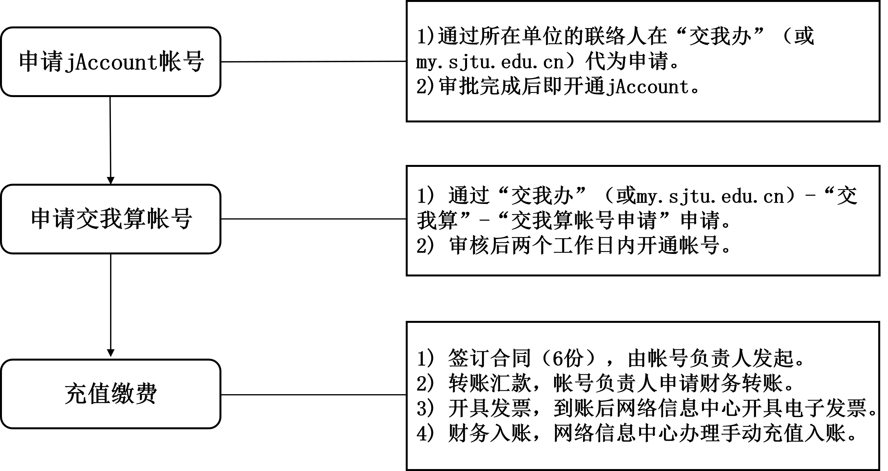
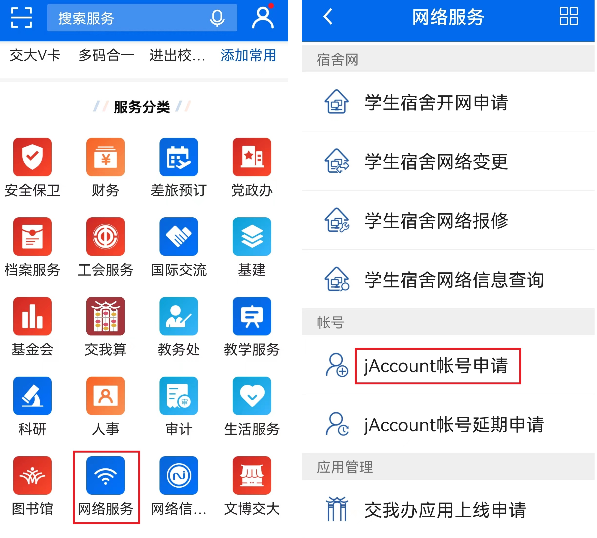
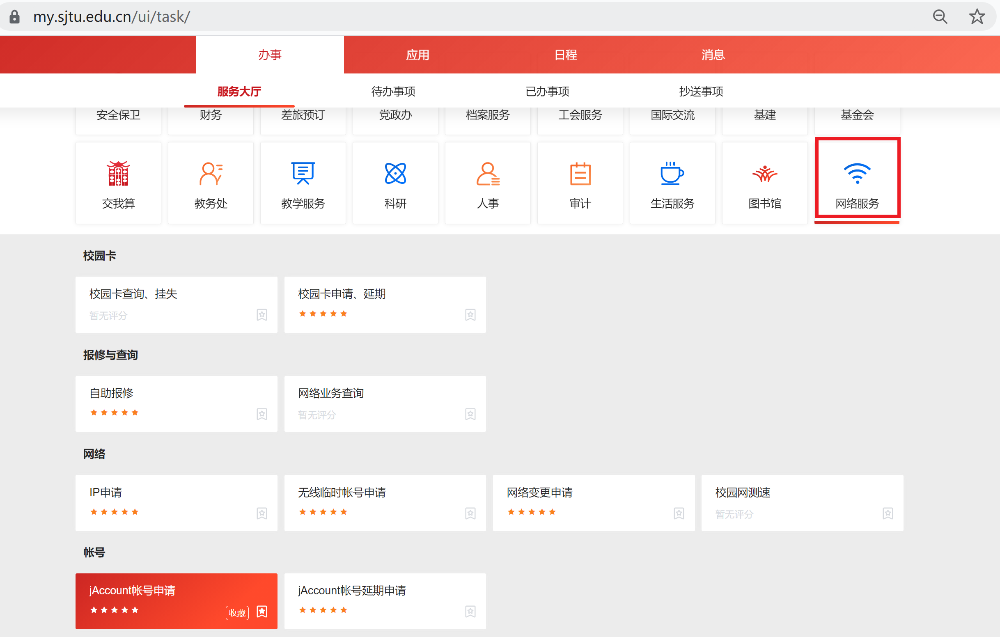
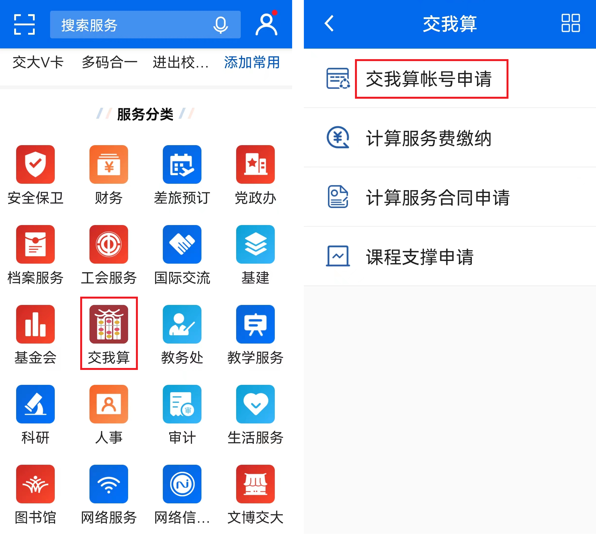
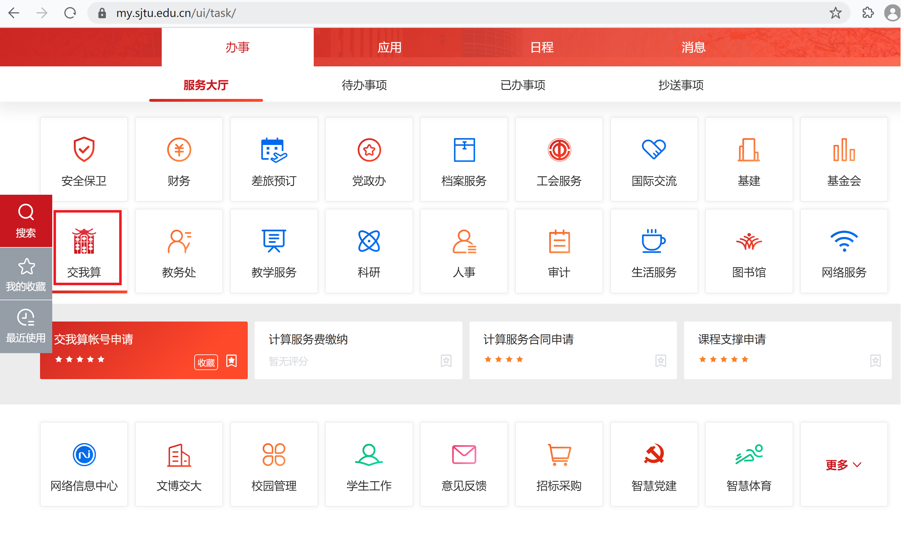

**********************************
附属医院账号申请及充值流程
**********************************

“交我算”账号与交大统一身份认证jAccount绑定，附属医院教职工可以使用jAccount，通过交大“一门式服务”APP“交我办”（或网页版my.sjtu.edu.cn）提交“交我算”账号申请。如您尚未开通jAccount，可以通过所在单位的联络人在“交我办”上发起jAccount账号代申请，通过后您便可自行申请“交我算”账号。

以下是附属医院教职工“交我算”账号申请及充值流程图：

第一步：申请jAccount账号
==============================

通过所在单位联络人在“交我办”APP（或网页版my.sjtu.edu.cn）上代为申请jAccount。经所在单位人事干事或领导审批完成后即开通jAccount，且自动开通与jAccount同命名的交大邮箱。

jAccount申请入口（二选一，“交我办”APP或网页版my.sjtu.edu.cn）图示：

1. “交我办”APP-“网络服务”-“jAccount账号申请”

2. 网页版（或my.sjtu.edu.cn）-“网络服务”-“jAccount账号申请”

第二步：申请交我算账号
==============================

通过jAccount登录“交我办”APP（或网页版my.sjtu.edu.cn）进行交我算账号申请。审核通过后，我们将在两个工作日内开通账号。

交我算账号申请入口（二选一，“交我办”APP或网页版my.sjtu.edu.cn）图示：

1. “交我办”APP-“交我算”-“交我算账号申请”

2. 网页版（或my.sjtu.edu.cn）-“交我算”-“交我算账号申请”

第三步：充值缴费
================================

1. 签订合同及合同盖章

* 由账号负责人发起，将合同内相关内容填好并盖单位公章，然后将6份合同原件寄给网络信息中心瞿文凤老师（上海市闵行区东川路800号上海交通大学网络信息中心101室，18015916892）

* 合同下载：`计算平台技术服务合同 <https://hpc.sjtu.edu.cn/Item/docs/computing_service_contract_sjtu_version1.docx>`_

* 6份合同盖好交大公章后，其中3份合同原件将回寄给账号负责人。

2. 转账汇款

* 账号负责人于所在医院申请财务报销和转账，并将费用转入：

  账户名称：上海交通大学

  银行账号：439059226890

  开户银行：中国银行上海市上海交通大学支行

  联行号：104290050144

* 附属医院财务报销如需提供测试报告，请账号负责人发邮件至hpc@sjtu.edu.cn申请。

3. 开具发票 

* 汇款到账后，请账号负责人联系网络信息中心瞿老师 quwenfeng@sjtu.edu.cn，并提供汇款信息备注及开票信息。

* 网络信息中心确认汇款到账后，将开具电子发票并邮件发送至账号负责人。

4. 财务入账

* 账号负责人确认"交我算"账号用户名及jAccount后，由网络信息中心办理手动充值入账。

* 账号负责人确认计费系统到账。

充值过程中有任何问题，请联系网络信息中心瞿老师 quwenfeng@sjtu.edu.cn。
