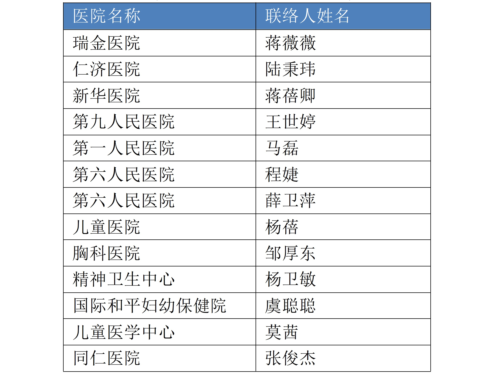

****
帐号
****

上海交通大学交我算平台是校级计算平台，面向全校师生提供科研与教学支持。

帐号申请
==========

准备工作
--------

为了使用交我算HPC+AI平台集群，您需要：

1. 交我算帐号，用于远程访问集群的计算资源；
2. jAccount 帐号，用于交我算帐号的缴费充值。

帐号说明
--------

在交我算的帐号体系中，帐号会被分为主帐号和子帐号。

主帐号是收缴费主体，由课题组负责人申请。

主帐号与子帐号均为独立帐号，仅在计费关系上存在关联。

每个主帐号能免费申请子帐号，个数不限，请按需申请。

主帐号和子帐号申请
--------------------
由帐号负责人或帐号使用人在“交我办”（或 `我的数字交大 my.sjtu.edu.cn <https://my.sjtu.edu.cn>`_ ）中的“交我算”里申请。我们将会在两个工作日内开通帐号。

密码
======

密码与帐号保护
------------------

当完成帐号创建之后，我们会发送一封邮件给您，邮件中包含了您帐号的密码。请您务必保管好帐号密码不外泄。另外，我们强烈建议您收到帐号密码后立即\ **重置密码**\ 。

集群安全策略要求用户密码满足如下全部三项要求：

1. 大于等于8位；
2. 包含大写字母、小写字母、数字、符号中至少两种类型字符；
3. 密码中不能包含用户名子字符串 (>=3字符)。

建议使用 openssl rand -base64 6 命令或者在线密码生成器（如 `Strong Random Password Generator <https://passwordsgenerator.net/>`_ ）获得足够强度的随机密码， 并使用 SSH 公钥登录和密码管理器(如 `KeePass <https://keepass.info/>`_) 降低记忆难度。

密码自助更改
--------------

如果您知道您的密码，并且需要更改密码，需要：

1. 连接到集群的登录节点
2. 使用 \ ``passwd``\ 指令
3. 终端会提示您输入一次旧密码，并输入新密码

.. tip: 在输入密码过程中，终端信息不会更新，但您的输入是有效的。

至此，您已经更新了您的密码，请妥善保存新的密码。

忘记密码
--------

如果您因为种种原因忘记了密码，请发送邮件至 `HPC邮箱 <mailto:hpc@sjtu.eud.cn>`_ ，在邮件中注明您要重置密码的帐号。如果您不是帐号申请人，为了确认您的身份，请务必抄送帐号申请人的邮箱。我们会在确保本次重置并非恶意重置之后完成密码重置工作，并发送邮件通知您新的密码。

密码规范
--------

如果您要自行更改密码，我们建议您遵循如下规则制定新的密码：

1. 不要使用固定的常用密码
2. 不要使用有意义的字符串
3. 密码长度至少8位
4. 密码中至少包含字母和数字

附属医院教职工帐号申请及充值流程
=================================

“交我算”帐号与交大统一身份认证jAccount绑定，附属医院教职工可以使用jAccount，通过交大“一门式服务”APP“交我办”（或网页版my.sjtu.edu.cn）提交“交我算”帐号申请。如您尚未开通jAccount，可以通过所在单位的联络人在“交我办”上发起jAccount帐号代申请，通过后您便可自行申请“交我算”帐号。

以下是附属医院教职工“交我算”帐号申请及充值流程图：

.. image:: ../img/hospital_account_flowchart.png

第一步：申请jAccount帐号
---------------------------

通过所在单位联络人在“交我办”APP（或网页版my.sjtu.edu.cn）上代为申请jAccount。经所在单位人事干事或领导审批完成后即开通jAccount，且自动开通与jAccount同命名的交大邮箱。

各医院联络人名单如下：

jAccount申请入口（二选一，“交我办”APP或网页版my.sjtu.edu.cn）图示：

1. “交我办”APP-“网络服务”-“jAccount帐号申请”

.. image:: ../img/hospital_jaccount_1.jpg

2. 网页版（或my.sjtu.edu.cn）-“网络服务”-“jAccount帐号申请”

.. image:: ../img/hospital_jaccount_2.png

第二步：申请交我算帐号
---------------------------

通过jAccount登录“交我办”APP（或网页版my.sjtu.edu.cn）进行交我算帐号申请。审核通过后，我们将在两个工作日内开通帐号。

交我算帐号申请入口（二选一，“交我办”APP或网页版my.sjtu.edu.cn）图示：

1. “交我办”APP-“交我算”-“交我算帐号申请”

.. image:: ../img/hospital_hpc_account_1.png

2. 网页版（或my.sjtu.edu.cn）-“交我算”-“交我算帐号申请”

.. image:: ../img/hospital_hpc_account_2.png

第三步：充值缴费
---------------------------

1. 签订合同及合同盖章

* 由帐号负责人发起，将合同内相关内容填好并盖单位公章，然后将6份合同原件寄给网络信息中心王思婷老师 （上海市闵行区东川路800号上海交通大学网络信息中心101室，34206060-8011）

* 合同下载：`计算平台技术服务合同 <https://hpc.sjtu.edu.cn/Item/docs/computing_service_contract_sjtu_version.docx>`_

* 6份合同盖好交大公章后，其中3份合同原件将回寄给帐号负责人。

2. 转账汇款

* 帐号负责人于所在医院申请财务报销和转账，并将费用转入：

  账户名称：上海交通大学

  银行账号：439059226890

  开户银行：中国银行上海市上海交通大学支行

  联行号：104290050144

* 附属医院财务报销如需提供测试报告，请帐号负责人发邮件至hpc@sjtu.edu.cn申请。

3. 开具发票 

* 汇款到账后，请帐号负责人联系网络信息中心王老师 stwangecho@sjtu.edu.cn，并提供汇款信息备注及开票信息。

* 网络信息中心确认汇款到账后，将开具电子发票并邮件发送至帐号负责人。

4. 财务入账

* 帐号负责人确认"交我算"帐号用户名及jAccount后，由网络信息中心办理手动充值入账。

* 帐号负责人确认计费系统到账。

充值过程中有任何问题，请联系网络信息中心王老师 stwangecho@sjtu.edu.cn，电话 34206060-8011。

