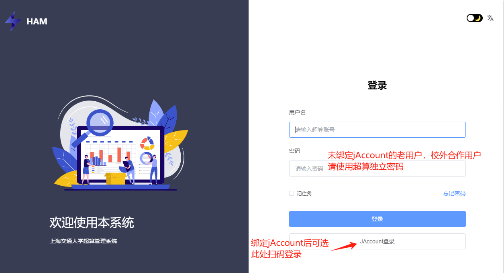
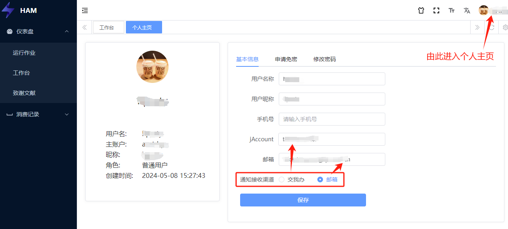
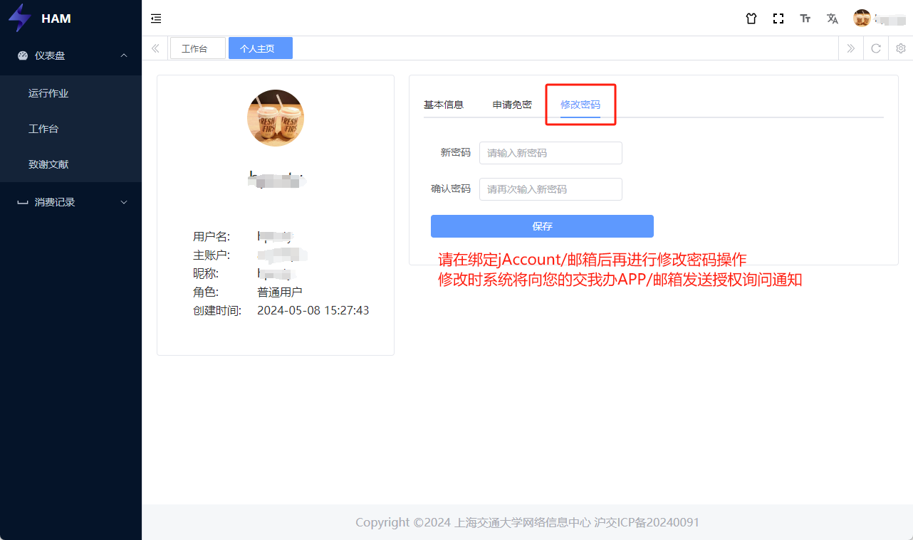
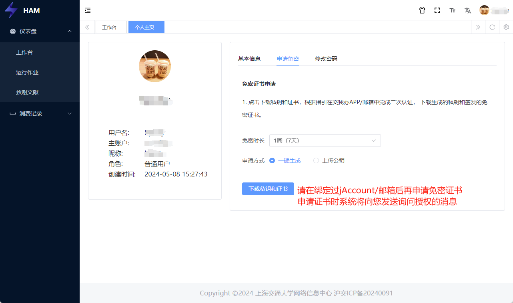

************************
账号安全信息管理
************************

+----------------------------+---------------------------------------------------+-------------------------------------------------------------------------+
|用户类型                    |账号关联                                           |账号独立密码                                                             |
+=========+==================+===================================================+=========================================================================+
|交大用户 |新用户            |自动关联jAccount                                   |仅用于登录 https://account.hpc.sjtu.edu.cn ，未来将统一使用jAccount密码。|
|         +------------------+---------------------------------------------------+如需修改，请参考 :ref:`此章节<account_password>`                         |
|         |2024/09/23前老用户|请参考 :ref:`此章节<account_binding>` 关联jAccount |                                                                         |
+---------+------------------+---------------------------------------------------+-------------------------------------------------------------------------+
|合作用户                    |请参考 :ref:`此章节<account_binding>` 关联邮箱     |唯一账号密码，不做变动，如需修改，请参考 :ref:`此章节<account_password>` |
+----------------------------+---------------------------------------------------+-------------------------------------------------------------------------+

.. _account_binding:

关联jAccount和邮箱
====================

超算平台于2024年9月23日开始对接交大jAccount账号，超算账号关联jAccount后您可以用jAccount密码登录超算平台，并且可以选择jAccount作为通知渠道，这种情况下您将在 ``交我办APP`` 上接收到实时的安全通知，例如账号登录提醒，免密授权确认等。

对于没有jAccount的合作用户，平台也支持关联邮箱，您可以通过邮箱接收上述的安全通知。

如果您是交大校内用户，在2024年9月之后申请的超算账号将自动关联您的jAccount，但如果您的超算账号是在此时间点之前开设的，您可能会在SSH登录时看到如下提醒：

.. code:: bash

    > ssh exampleuser@pilogin.hpc.sjtu.edu.cn
    If you are SJTU user, authenticate with jaccount password; otherwise use HPC password:

    Please link your jaccount through https://mfa.hpc.sjtu.edu.cn as soon as possible!

这说明您的账号缺少身份信息，尚未关联jAccount，请按照提示前往 `超算账号管理平台 <https://mfa.hpc.sjtu.edu.cn>`_ 补充关联信息。

如下图所示，缺少身份信息的旧账号首次登录 `超算账号管理平台 <https://mfa.hpc.sjtu.edu.cn>`_ 请使用您的超算账号密码，已经关联jAccount的账号可以选择 **交我办APP** 扫码登录。

登录后点击右上角用户名，进入 ``个人主页`` ，在基本信息标签页上维护您的jAccount/邮箱信息，以及首选的安全通知接收渠道。

缺少身份信息的旧账号首次关联jAccount/邮箱时不需要进行二次认证，请仔细填写您的关联信息。 **关联过jAccount/邮箱之后，若需要再次修改，系统将向您原本的jAccount/邮箱发送询问授权的通知，只有确认授权后才能更新jAccount/邮箱的关联。**

.. _account_password:

超算账号独立密码
==================

对于合作用户，超算平台依然保留独立账号密码。

对于校内用户，超算平台将逐步取消独立密码，统一使用jAccount密码。但现阶段您依然需要在登录 https://account.hpc.sjtu.edu.cn/ 时使用超算账号的独立密码。

新用户完成账号创建之后，我们会发送一封邮件给您，邮件中包含了您账号的独立密码。请您务必保管好账号密码不外泄。另外，我们强烈建议您收到账号密码后立即 **重置独立密码** 。建议使用 openssl rand -base64 6 命令或者在线密码生成器（如 `Strong Random Password Generator <https://passwordsgenerator.net/>`_ ）获得足够强度的随机密码， 并使用 SSH 公钥登录和密码管理器(如 `KeePass <https://keepass.info/>`_) 降低记忆难度。

您可以在 `超算账号管理平台 <https://mfa.hpc.sjtu.edu.cn>`_ 的 ``个人主页`` 维护超算账号独立密码，如下图所示。 **修改密码要求您的账号已经关联过jAccount/邮箱，修改时系统将向您原本的jAccount/邮箱发送询问授权的通知，只有确认授权后才能完成密码更新。**

密码重置
--------------

如果您需要重置的是jAccount密码，请在 ``交我办`` 发起对应的申请流程。

如果您需要重置的是超算账号独立密码，建议按照上一节的说明在 `超算账号管理平台 <https://mfa.hpc.sjtu.edu.cn>`_ 中进行操作。或者也可以发送邮件至 `HPC邮箱 <mailto:hpc@sjtu.eud.cn>`_ 申请人工协助。

密码规范
-------------

如果您要自行更改密码，我们建议您遵循如下规则制定新的密码：

1. 不要使用固定的常用密码
2. 不要使用有意义的字符串
3. 密码长度至少8位
4. 密码中至少包含字母和数字

申请免密证书
==================

如果您不希望在SSH登录时手动输入密码，您可以在 `超算账号管理平台 <https://mfa.hpc.sjtu.edu.cn>`_ 申请免密证书。

免密证书是基于个人公钥签发的，如果您没有SSH公私钥或者不了解相关内容，请选择一键生成方式，如下图所示，平台将为您自动生成新的公私钥文件：

如果您希望使用原有的个人公私钥对，请上传公钥文件或将公钥文本粘贴到网页的文本框中，系统将基于此公钥签发免密证书。

下载证书时不建议修改文件名，如果您要自行修改保存的文件名，请确认证书文件名与私钥文件名相匹配。下表列举了一些文件命名示例，以演示证书和公私钥文件名之间的对应关系。

===================   =============  =============== ==================== 
示例                    私钥           公钥            证书
===================   =============  =============== ==================== 
rsa加密默认名称        id_rsa         id_rsa.pub      id_rsa-cert.pub
ed25519加密默认名称    id_ed25519     id_ed25519.pub  id_ed25519-cert.pub
自定义名称              mykey	      mykey.pub       mykey-cert.pub
===================   =============  =============== ==================== 

关于免密证书的使用方法，请参阅 `通过 SSH 登录集群 <https://docs.hpc.sjtu.edu.cn/login/sshlogin.html>`_ 的相关章节。