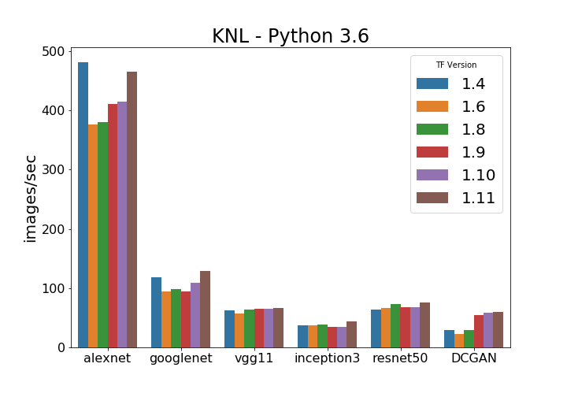
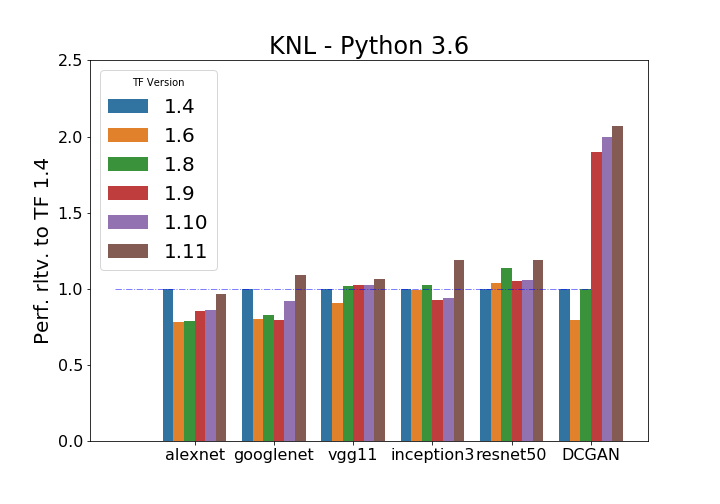
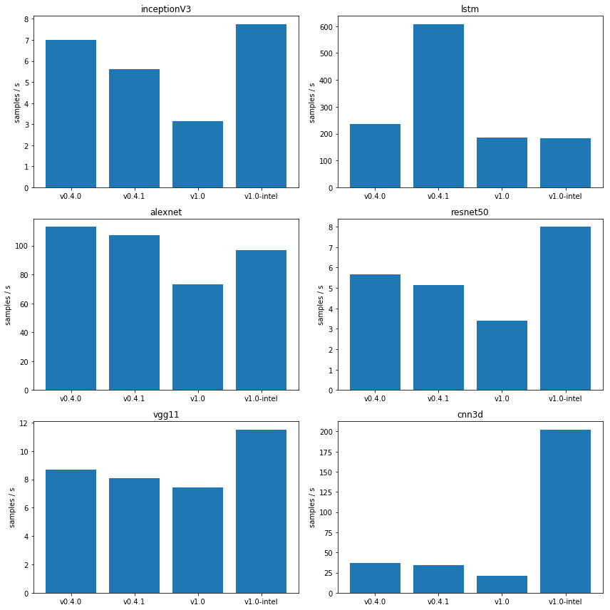
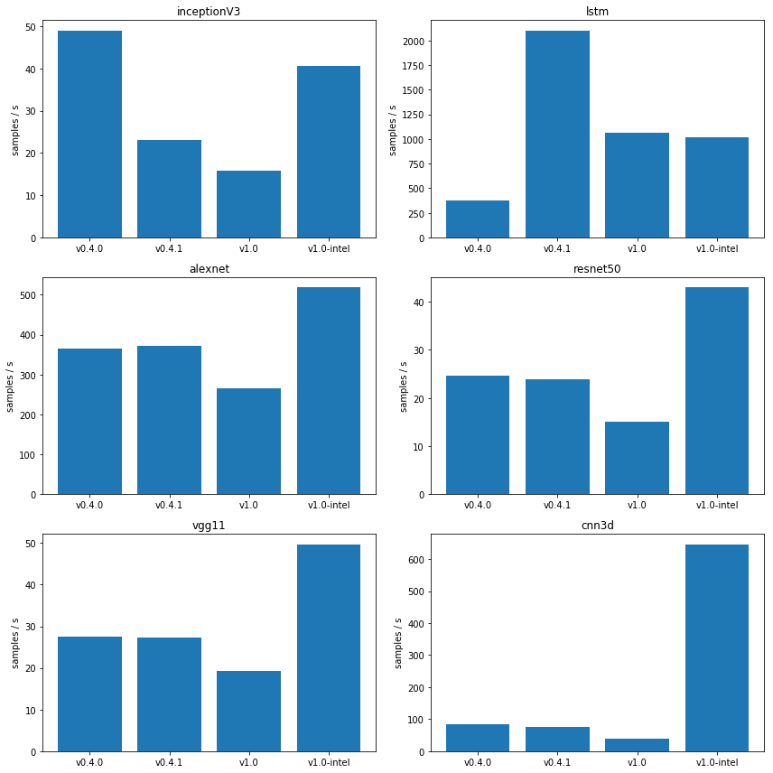

# Machine Learning benchmarking at NERSC

NERSC uses both standard framework-oriented benchmarks as well as scientific
benchmarks from research projects in order to characterize our systems
for scientific Deep Learning.

## Framework benchmarks

### TensorFlow

We run a version of the tf_cnn_benchmarks repository as well as a DCGAN
model on Cori.

**Training results**

### PyTorch

We have a repository of benchmarks with standard computer vision models,
LSTM, and 3D convolutional models here:
https://github.com/sparticlesteve/pytorch-benchmarks

**Training results**

**Inference results**

## Scientific Deep Learning Benchmarks

### HEP-CNN

The HEP-CNN benchmark trains a simple Convolutional Neural Network to
classify LHC collision detector images as signal or background.

* Framework: TensorFlow
* Multi-node library: Horovod or Cray PE ML Plugin
* Papers: https://arxiv.org/abs/1711.03573, https://arxiv.org/abs/1708.05256
* Code: https://github.com/sparticlesteve/hep_cnn_benchmark/tree/benchmark-dev

### CosmoFlow

The CosmoFlow benchmark trains a 3D Convolutional Neural Network to predict
cosmological parameters from simulated universe volumes.

* Framework: TensorFlow
* Multi-node library: Cray PE ML Plugin
* Paper: https://arxiv.org/abs/1808.04728
* Code: https://github.com/NERSC/CosmoFlow

### CosmoGAN

* Framework: TensorFlow
* Paper: https://arxiv.org/abs/1706.02390
* Code: https://github.com/MustafaMustafa/cosmoGAN

### Deep Learning Climate Analytics

* Framework: TensorFlow
* Multi-node library: Horovod
* Paper: https://arxiv.org/abs/1810.01993
* Code: to be added
* **NOTE**: Doesn't currently run on Cori
