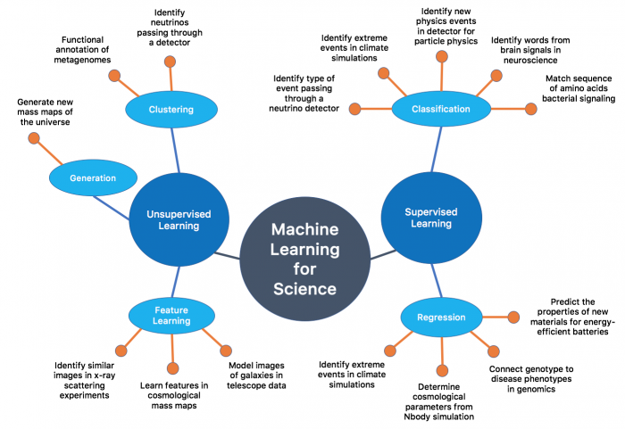

# Science Use-Cases 

Machine Learning and Deep Learning are increasingly used to analyze scientific data, in fields as diverse as neuroscience, climate science and particle physics. In this page you will find links to examples of scientific use cases using deep learning at NERSC.

## Science Use-Cases

We have assembled some examples of machine learning projects being carried out at NERSC, in most cases including links to the codebase. These cover a variety of science areas, and in many cases showcase the use of Tensorflow optimized for the KNL architecture.

* [Using deep networks for HEP physics analyses](https://www.nersc.gov/users/data-analytics/data-analytics-2/deep-learning/deep-networks-for-hep/)
* [Using deep networks for neutrino telescopes](https://www.nersc.gov/users/data-analytics/data-analytics-2/deep-learning/deep-networks-for-neutrino/)
* [CosmoGAN: Deep networks for generating cosmology mass maps](https://www.nersc.gov/users/data-analytics/data-analytics-2/deep-learning/deep-networks-cosmogan/)
* A use of SciKitLearn by Juliette Ugirumurera can be found in [this iPython notebook](https://github.com/NERSC/data-day-examples/blob/master/SLURM_challenge.ipynb). The code uses SciKitLearn to construct, train and evaluate the network, and was the winning code for the SLURM log data challenge in the [2017 Data Day Competition](https://www.nersc.gov/users/NUG/annual-meetings/nersc-data-day-and-nug2017/data-competition/).
* The winning code for the Astronomy challenge in the [2017 Data Day Competition](https://www.nersc.gov/users/NUG/annual-meetings/nersc-data-day-and-nug2017/data-competition/) by Yisha Sun uses TensorFlow to set up and train the network. The code can be found in [this github repository](https://github.com/miaoshasha/Astronomical_Classification).
* Many other projects from LBNL can be found at https://ml4sci.lbl.gov
