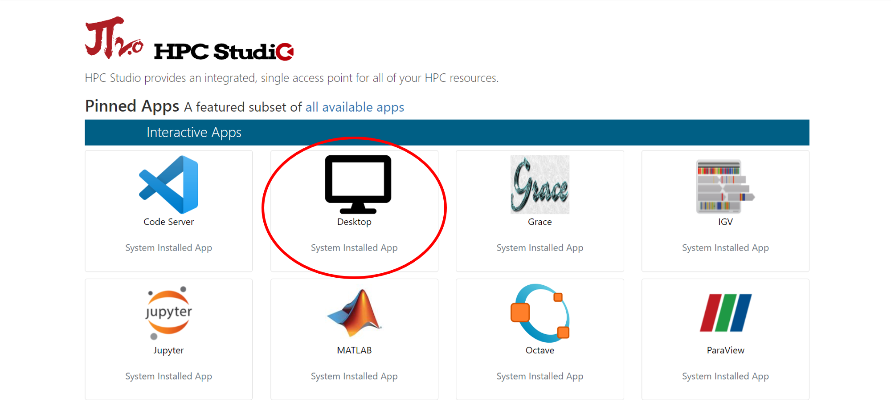
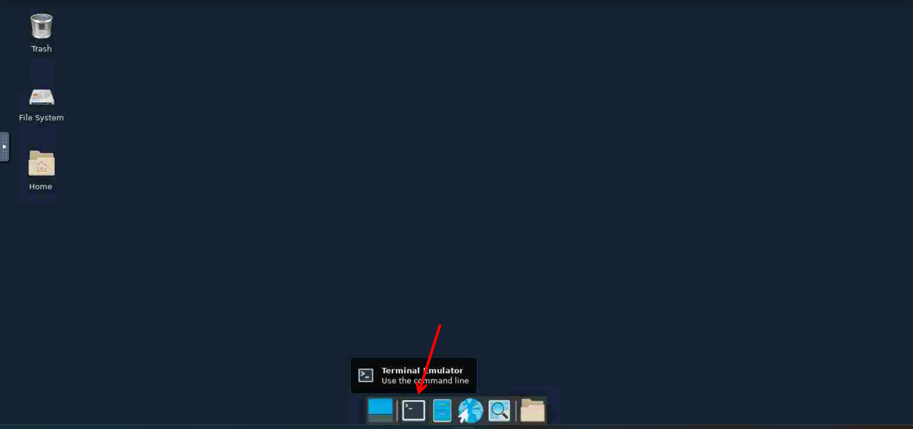
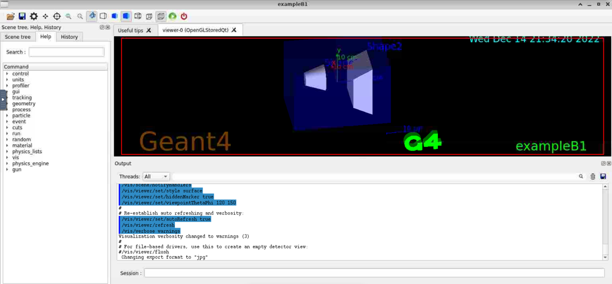
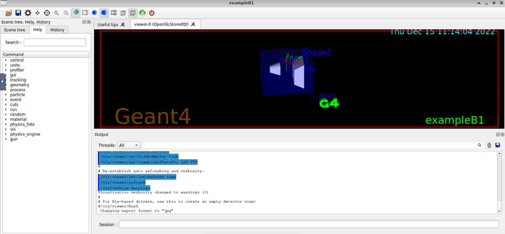

.. _Geant4:

GEANT4
=======

简介
----
Geant4(GEometry ANd Tracking，几何和跟踪)是由CERN(欧洲核子研究组织)基于C++面向对象技术开发的蒙特卡罗应用软件包，用于模拟粒子在物质中输运的物理过程。相对于MCNP、EGS等商业软件来说,它的主要优点是源代码完全开放,用户可以根据实际需要更改、扩充Geant4程序。详情请查阅 `Geant4官网 <https://geant4.web.cern.ch>`_

思源一号预编译Geant4
--------------------------

思源一号平台上已预编译好基于qt可视化界面的geant4模块，用户可通过加在相干模块制作Geant4可执行程序，以编译geant4自带的B1 example为例

- 使用HPC Studio启动可视化界面。在浏览器中打开可视化平台 `HPC Studio <https://https://studio.hpc.sjtu.edu.cn>`_，选择Desktop，并设置合适的核数、时间等参数

|image1|

- 启动终端

|image2|

- 调用模块。在终端中输入命令，调用模块

.. code:: bash

    module load gcc/11.2.0 qt/5.15.5-gcc-11.2.0 geant4/11.0.3-gcc-11.2.0

- 制作Geant4可执行程序。本文档以geant4自带的B1 example为例，其中示例的源文件位于Geant4编译路径下，需先通过env命令查询geant4的安装路径(诸如/dssg/opt/icelake/linux-centos8-icelake/gcc-11.2.0/geant4-11.0.3-4lmd7rsrbnlougezulj7hyhrch67ld4r，此处假设为/path_to_geant4)

.. code:: bash

    mkdir B1_example_build
    cd B1_example_build
    cmake /path_to_geant4/share/Geant4-11.0.3/examples/basic/B1
    make -j32

- 执行应用程序exampleB1。经过上一步编译后将得到名称为exampleB1的可执行文件，执行该文件并得到可视化窗口

.. code:: bash

    ./exampleB1

|image3|

思源一号自编译Geant4
--------------------------

本文档将基于思源一号平台上已预编译好qt可视化驱动，进行Geant4手动编译，并制作可执行文件

- 使用HPC Studio启动可视化界面。如上所示

- 启动终端。如上所示

- 下载源码并解压。假定源文件压缩包下载路径为(/path_to_source_code)，软件需要安装到路径(/path_to_your_installation)

.. code:: bash

    wget https://gitlab.cern.ch/geant4/geant4/-/archive/v11.0.0/geant4-v11.0.0.tar.gz
    tar xvf geant4-v11.0.0.tar.gz

- 编译。进入安装目录(/path_to_your_installation)进行编译

.. code:: bash

    cd /path_to_your_installation
    cmake -DCMAKE_INSTALL_PREFIX=./ -DGEANT4_USE_FREETYPE=ON    \
        -DGEANT4_USE_GDML=ON    \
        -DGEANT4_USE_QT=ON      \
        -DGEANT4_USE_OPENGL=ON \
        -DGEANT4_USE_OPENGL_X11=ON \
        -DGEANT4_USE_RAYTRACER_X11=ON \
        /path_to_source_code ## 指定源文件目录
    make -j32 && make install

- 激活Geant4数据集。在安装目录(/path_to_your_installation)进行数据集编译

.. code:: bash

    cmake -DGEANT4_INSTALL_DATA=ON .
    make -j32 && make install

- 激活环境变量

.. code:: bash

    source /(path_to_your_installation)/bin/geant4.sh

- 制作Geant4可执行程序。制作B1示例中的可执行程序

.. code:: bash

    mkdir B1_example_build
    cd B1_example_build
    cmake /(path_to_your_installation)/share/Geant4-11.0.3/examples/basic/B1
    make -j32
    ./exampleB1

- 得到可视化窗口

|image4|

