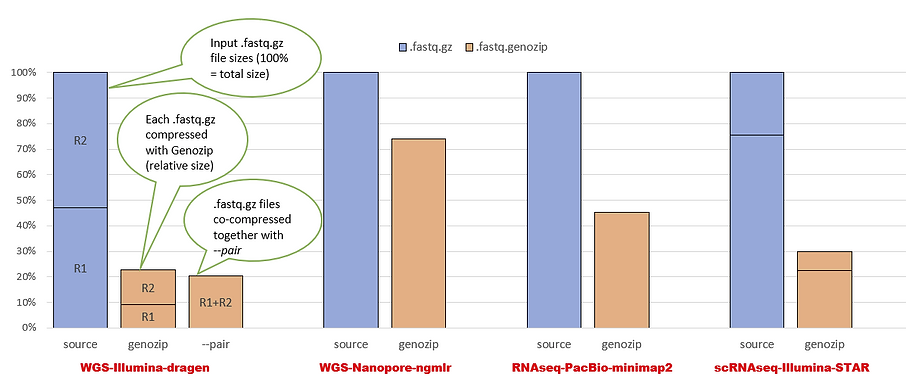

.. _genozip:

GENOZIP
===================================

简介
-------------------------
Genozip是用于基因组数据的通用且功能齐全的压缩软件。Genozip通过提供五项核心功能——通用性（对所有常见基因组文件格式的支持）、高压缩率、速度、功能丰富性和可扩展性，被设计为基因组压缩的通用软件和开发框架。Genozip为基因组学研究中广泛使用的基因组数据格式（即FASTQ，SAM / BAM / CRAM，VCF，GVF，FASTA，PHYLIP和23andMe格式）提供高性能压缩。

使用方法与范例
-------------------------
软件调用
""""""""""
.. code:: bash 

    module load genozip/15.0.56

License
""""""""""

拷贝license至家目录,拷贝一次即可
 
.. code:: bash 

    cp $LIC ~

简单的压缩和解压缩
""""""""""""""""""""""""""""""""""""""""

注意:默认会使用当前节点全部的CPU核心,可通过--threads N来调控线程数量,如果需要多线程压缩解压缩,请申请计算节点使用

.. code:: bash 

    genozip test.fq.gz

    genounzip test.fq.genozip

指定20线程压缩
""""""""""""""""""""
.. code:: bash 

    genozip --threads 20 test.fq.gz

使用参考压缩
""""""""""""""""""""

为了对 FASTQ 和 BAM 文件实现良好的压缩，强烈建议使用参考进行压缩
 
.. code:: bash 

    genozip --reference hs37d5.fa.gz mydata.fq.gz
    
    genounzip mydata.fq.genozip

共同压缩一对 FASTQ 文件
""""""""""""""""""""""""""""""

当将它们压缩在一起时，Genozip 可以利用一对 FASTQ 文件中相应读取之间的冗余来提高压缩率，使用--pair：

.. code:: bash 

   genozip --reference hs37d5.fa.gz --pair mysample-R1.fastq.gz mysample-R2.fastq.gz 

注意事项
-------------------------
- genozip为收费开源软件,对学术用户开放学术授权,免费使用,如果需要商用请至genozip官网购买license

参考
-------------------------
- genozip compression quick guide: https://www.genozip.com/compression
