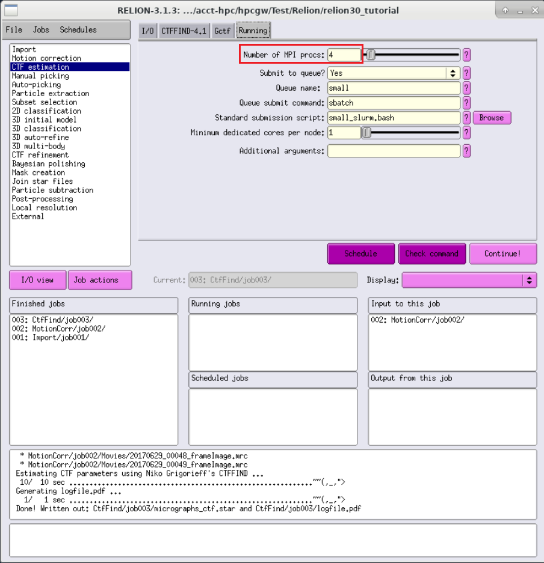

.. _relion:

RELION
========

简介
----

RELION 是由 MRC 的 Scheres 在 2012 年发布的针对单颗粒冷冻电镜图片进行处理的框架。

可用的版本
----------

+-----------+---------+----------+------------------------------------------------+
| 版本      | 平台    | 构建方式 | 模块名                                         |
+===========+=========+==========+================================================+
| 4.0.0     | |gpu|   | 容器     | relion/4.0.0 思源一号                          |
+-----------+---------+----------+------------------------------------------------+
| 3.1.3     | |gpu|   | Spack    | relion/3.1.3-gcc-11.2.0-cuda-openmpi 思源一号  |
+-----------+---------+----------+------------------------------------------------+
| 4.0.0     | |gpu|   | 容器     | relion/4.0.0                                   |
+-----------+---------+----------+------------------------------------------------+
| 3.0.8     | |gpu|   | 容器     | relion/3.0.8                                   |
+-----------+---------+----------+------------------------------------------------+
| 3.1.3     | |gpu|   | Spack    | relion/3.1.3-gcc-8.3.0-openmpi                 |
+-----------+---------+----------+------------------------------------------------+
| 3.0.8     | |gpu|   | Spack    | relion/3.0.8-gcc-8.3.0-openmpi                 |
+-----------+---------+----------+------------------------------------------------+

算例下载
--------

.. code-block:: bash

   wget ftp://ftp.mrc-lmb.cam.ac.uk/pub/scheres/relion30_tutorial_data.tar
   tar -xf relion30_tutorial_data.tar
   # 目录结构
   relion30_tutorial
    └── Movies
        ├── 20170629_000XX_frameImage.tiff
        ├── gain.mrc
        └── NOTES

运行示例
--------

以下主要介绍RELION可视化的运行方式。用超算的账号及密码登录 `HPC Studio <https://studio.hpc.sjtu.edu.cn/>`_ ，申请GPU远程桌面或直接打开RELION。

.. tip::

   \*-pi 为 π 集群的资源，\*-sy为思源一号的资源。

思源一号集群 RELION
^^^^^^^^^^^^^^^^^^^^

加载运行RELION
""""""""""""""""""
   
进入远程桌面，打开终端 `Terminal`。

.. code-block:: bash

   cd relion30_tutorial
   module load relion/4.0.0
   relion &

预处理
"""""""

建立项目
***********

1. 用 ``Import`` 将数据导入流水线，``Movies/mics`` 功能区参数如下：

   .. image:: ../../img/Relion/Import.png
     :width: 900px

#. 确保 ``Others`` 功能区是如下设置：

   **Import other node types?** | ``No``

#. 点击 ``Run!`` 运行。

   此时会创建 ``Import/job001/`` 目录，及 ``STAR`` 文件，可以在终端通过 ``less Import/job001/movies.star`` 查看。

运动校正 (`Beam-induced motion correction`)
********************************************

由于电子光束穿过薄样品，会对样品产生损耗并使其产生轻微位移，需要对每张图像进行运动校正，使图像的拍摄中心一致。

1. 用 ``Motion correction`` 进行运动校正，``I/O`` 及 ``Motion`` 设置如下：

   .. image:: ../../img/Relion/Motion-1.png
     :width: 900px
   .. image:: ../../img/Relion/Motion-2.png
     :width: 900px

#. 设置 ``Running`` ，点击 ``Run!`` 运行。

   **Number of MPI procs:** | ``1``

   **Number of threads:** | ``12``

   **Submit to queue?** | ``No``

衬度转换函数估计 (`CTF estimation`)
*************************************

由于电镜本身的成像过程，会存在球差、离焦量等问题，需要对其进行分析，找出CFT，对图像进行校正。

1. 用 ``CTF estimation`` 进行运动校正，``I/O`` 及 ``CTFFIND-4.1`` 设置如下：

   .. image:: ../../img/Relion/CTF-1.png
     :width: 900px
   .. image:: ../../img/Relion/CTF-2.png
     :width: 900px

#. 设置 ``Running`` ，点击 ``Run!`` 运行。

   **Number of MPI procs:** | ``4``

颗粒挑选
""""""""""

初始图像集合 (`Subset of the micrographs`)
*******************************************

1. 用 ``Subset selection`` 创建自动挑选的模板，设置如下：

   .. image:: ../../img/Relion/Subset-1.png
     :width: 900px
   .. image:: ../../img/Relion/Subset-2.png
     :width: 900px

#. 点击 ``Run!`` 运行。

基于拉普拉斯-高斯算子的颗粒自动挑选 (`LoG-based auto-picking`)
***************************************************************

1. 用 ``Auto-picking`` 自动挑选颗粒，设置如下：

   .. image:: ../../img/Relion/Auto-1.png
     :width: 900px
   .. image:: ../../img/Relion/Auto-2.png
     :width: 900px

#. 点击 ``Run!`` 运行；

#. 选中运行完的job，``Display`` 设置为 ``autopick.star`` ，查看颗粒挑选结果。

   .. image:: ../../img/Relion/Auto-3.png
     :width: 900px

颗粒提取 (`particle extraction`)
*********************************

1. 用 ``Particle extraction`` 提取颗粒，设置如下：

   .. image:: ../../img/Relion/Extra-1.png
     :width: 900px
   .. image:: ../../img/Relion/Extra-2.png
     :width: 900px

#. 点击 ``Run!`` 运行；

#. 选中运行完的job，``Display`` 设置为 ``particles.star`` ，查看颗粒提取结果。

   .. image:: ../../img/Relion/Extra-3.png
     :width: 900px

制作自动挑选的模板 (2D class averaging)
*****************************************

1. 用 ``2D classification`` 为接下来对所有图像进行自动挑选计算出一个模板，设置如下：

   .. image:: ../../img/Relion/2D-1.png
     :width: 900px
   .. image:: ../../img/Relion/2D-2.png
     :width: 900px
   .. image:: ../../img/Relion/2D-3.png
     :width: 900px
   .. image:: ../../img/Relion/2D-4.png
     :width: 900px

#. 设置 ``Running`` ，点击 ``Run!`` 运行；

   **Number of MPI procs:** | ``3``

   **Number of threads:** | ``4``

   **Submit to queue?** | ``No``

#. 选中运行完的job，``Display`` 设置为 ``run_it025_optimiser.star`` ，查看颗粒的模板。

   .. image:: ../../img/Relion/2D-5.png
     :width: 900px

π 集群 Relion
^^^^^^^^^^^^^^^

命令行运行方式
"""""""""""""""

以下简单介绍非GUI的运行方式。

.. code-block:: bash

   module av relion   # 查看 π 集群上已编译的Relion
   # 调用Relion及相关依赖
   module load relion/3.1.3-gcc-8.3.0-openmpi
   module load ghostscript/9.54.0-gcc-8.3.0   # 用于输出pdf
   module load openmpi/4.1.1-gcc-9.3.0
   module load cuda/10.2.89-intel-19.0.4   # 用于支持GPU

GPU队列作业提交
""""""""""""""""

在 dgx2 队列上使用 1 块 GPU，并配比 6 CPU 核心。

.. code-block:: bash

   #!/bin/bash
   #SBATCH -J test
   #SBATCH -p dgx2
   #SBATCH -o %j.out
   #SBATCH -e %j.err
   #SBATCH -N 1
   #SBATCH --ntasks-per-node=6
   #SBATCH --cpus-per-task=1
   #SBATCH --gres=gpu:1

   module load relion/3.1.3-gcc-8.3.0-openmpi
   srun --mpi=pmi2 relion_refine_mpi (+params)

使用以下命令提交作业。

.. code-block:: bash

   sbatch test.slurm

其它：作业模板设置
^^^^^^^^^^^^^^^^^^^^^

cpu队列 small_slurm.bash
""""""""""""""""""""""""""""""

.. code-block:: bash

   #!/bin/bash
   #SBATCH --partition=small
   # set the job name
   #SBATCH --job-name=relion_job
   # send output to
   #SBATCH --output=XXXoutfileXXX
   #SBATCH --error=XXXerrfileXXX
   # this job requests x nodes
   #SBATCH --nodes=1
   # this job requests x tasks per node
   #SBATCH --ntasks-per-node=XXXmpinodesXXX
   #SBATCH --export=ALL
   #paste the "print command" from relion here
   mpirun -n XXXmpinodesXXX --mca mpi_cuda_support 0 XXXcommandXXX

gpu队列 xGPU_slurm.bash
""""""""""""""""""""""""""""""""

.. code-block:: bash

   #!/bin/bash
   #SBATCH --partition=dgx2
   # set the job name
   #SBATCH --job-name=relion_job
   # send output to
   #SBATCH --output=XXXoutfileXXX
   #SBATCH --error=XXXerrfileXXX
   # this job requests x nodes
   #SBATCH --nodes=1
   # this job requests x tasks per node
   #SBATCH --ntasks-per-node=XXXmpinodesXXX
   #SBATCH --cpus-per-task=6
   #SBATCH --time=48:00:00
   #SBATCH --gres=gpu:4
   #SBATCH --export=ALL
   #paste the "print command" from relion here
   mpirun -n XXXmpinodesXXX XXXcommandXXX

|relion|

参考资料
---------

- `RELION 官网 <http://www2.mrc-lmb.cam.ac.uk/relion>`__
- `RELION 4.0 <https://relion.readthedocs.io/en/release-4.0/index.html>`__
- `RELION on Biowulf <https://hpc.nih.gov/apps/RELION/index.html>`__
- `RELION Tutorial <http://jgwu.top/blogs/RELION3-0-Tutorial/>`__

