.. _intel_vtune:

Intel-Vtune
========================

英特尔VTune性能分析器可通过图形用户界面轻松定位应用运行的性能瓶颈。

可用版本
---------------------

+----------+--------------------------------------------------+
| 版本     | 加载方式                                         |
+==========+==================================================+        
| 2021.7.1 | module load intel-oneapi-vtune/2021.7.1 思源一号 |
+----------+--------------------------------------------------+

本文使用的算例
---------------

.. code:: bash

   lammps的in.lj数据:
   可以在如下链接中得到文件in.lj的内容。
   https://docs.hpc.sjtu.edu.cn/app/engineeringscience/lammps.html
   
集群上的VTUNE
-----------------------

- `思源一号上的VTUNE`_

.. _思源一号上的VTUNE:

思源一号上的VTUNE
---------------------

登录 `hpc studio <https://studio.hpc.sjtu.edu.cn/>`__

调出VTUNE图形化界面
~~~~~~~~~~~~~~~~~~~~~~~~

.. image:: ../../img/VTUNE_1.png

.. image:: ../../img/VTUNE_2.png

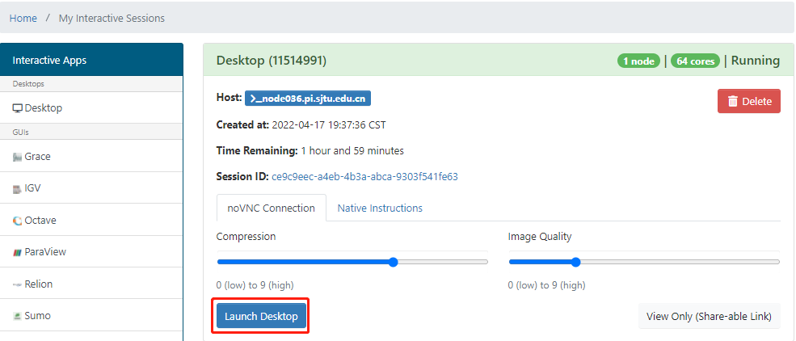

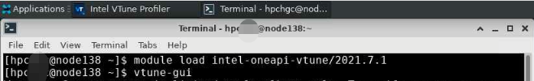

导入应用程序的流程
~~~~~~~~~~~~~~~~~~~~~

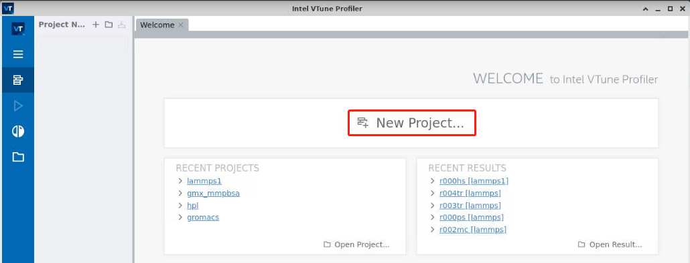

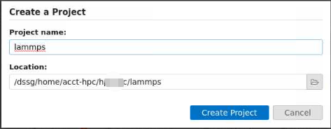

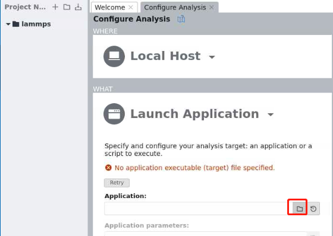

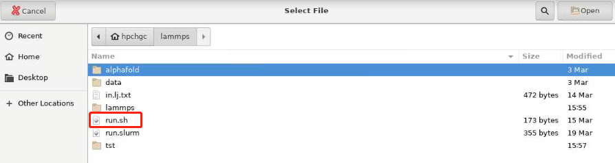

查找运行程序的热点
~~~~~~~~~~~~~~~~~~~~

执行程序的目录与脚本内容
>>>>>>>>>>>>>>>>>>>>>>>>>>

.. code:: bash

   [hpc@node243 test]$ tree lammps/
   lammps/
   ├── in.lj
   └── run.sh
   
run.sh

.. code:: bash

   #!/bin/bash
   module load oneapi
   module load lammps/20210310-intel-2021.4.0
   
   ulimit -s unlimited
   ulimit -l unlimited
   export OMP_NUM_THREADS=1
   mpirun -np 32  lmp -i in.lj.txt

打开分析热点
>>>>>>>>>>>>>>

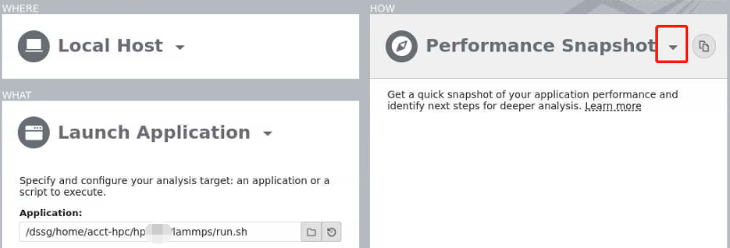

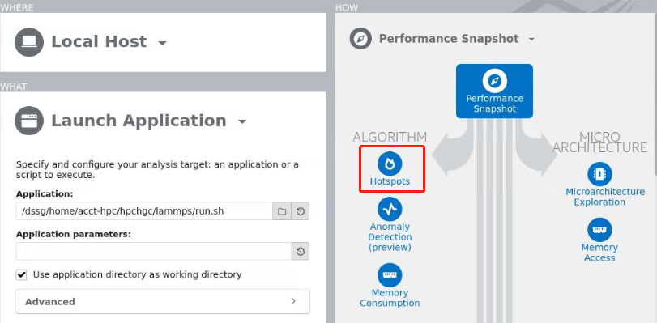

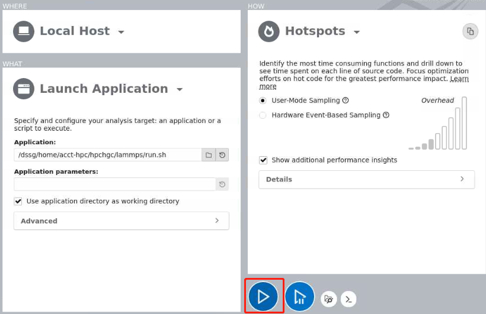

运行结果
----------

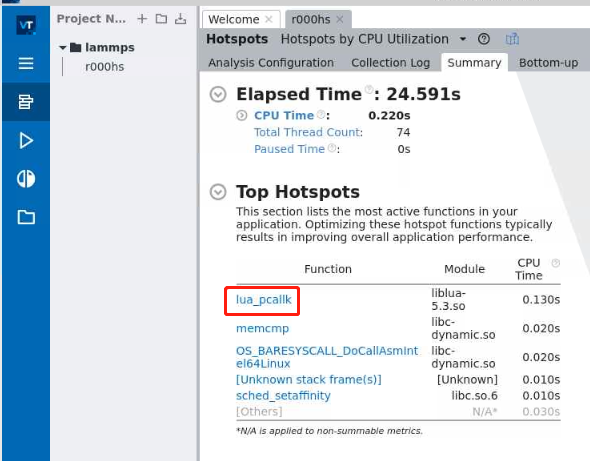

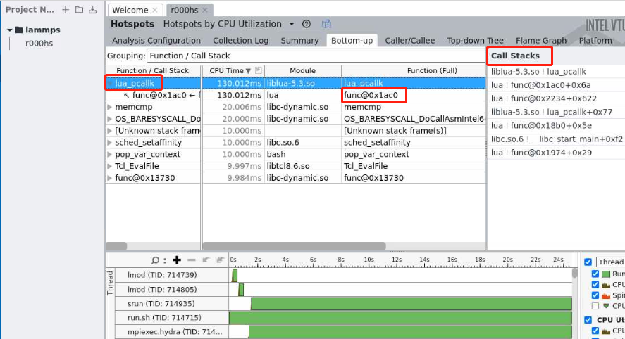

参考资料
----------

-  `intel-parallel-studio <https://www.intel.com/content/www/us/en/develop/documentation/vtune-help/top.html/>`__
