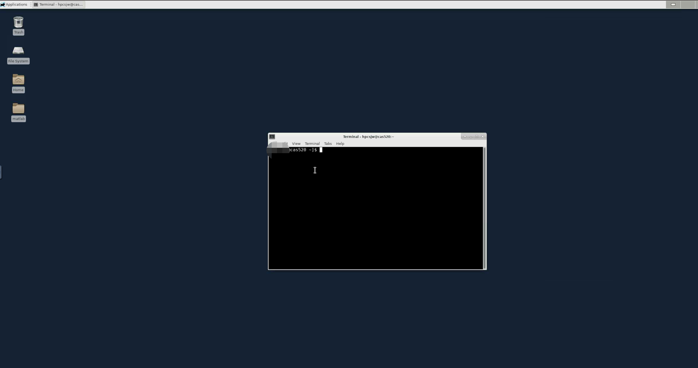
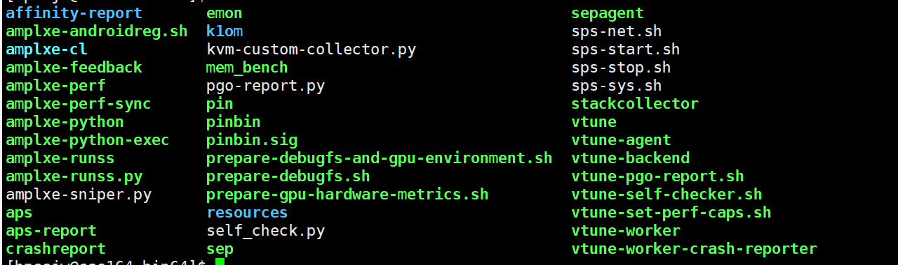
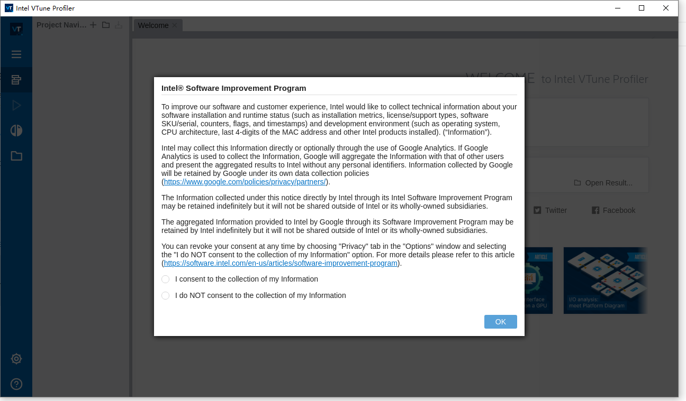
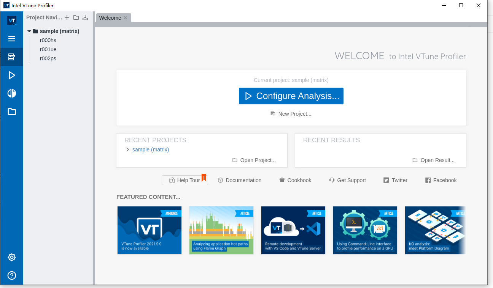
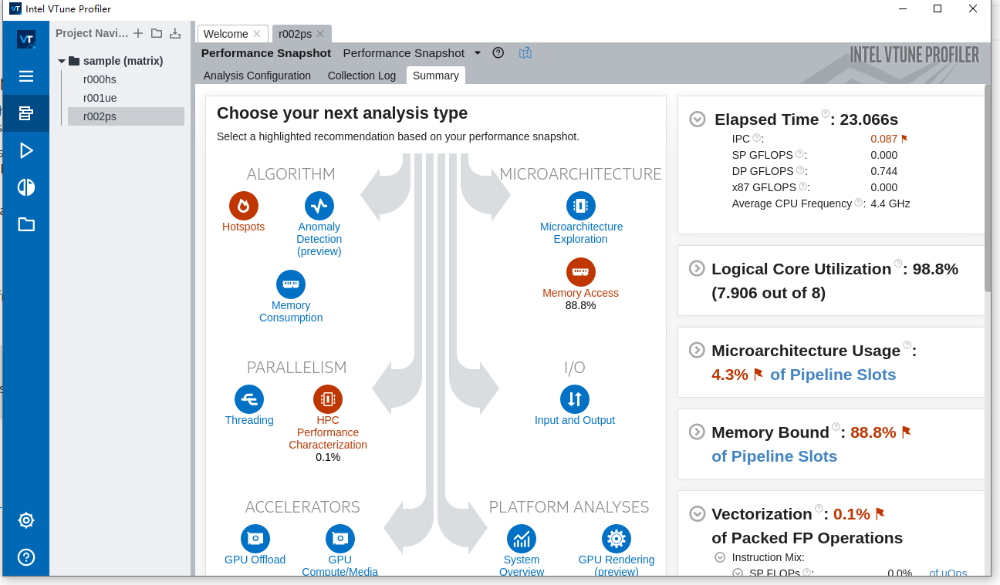
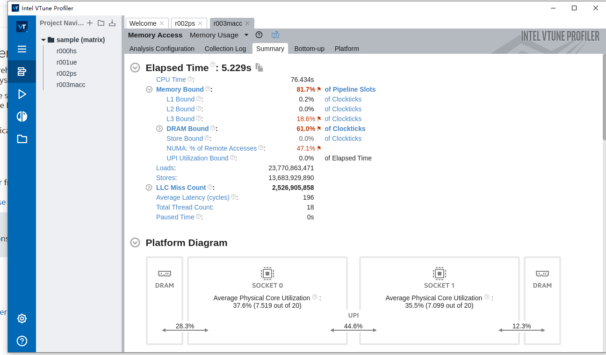
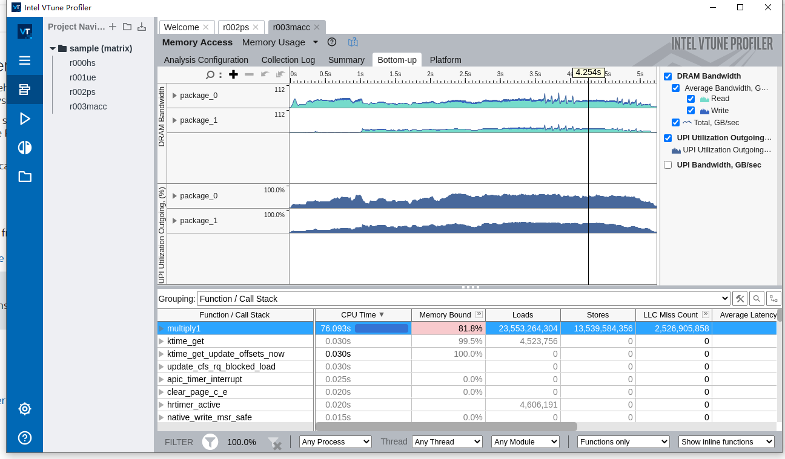
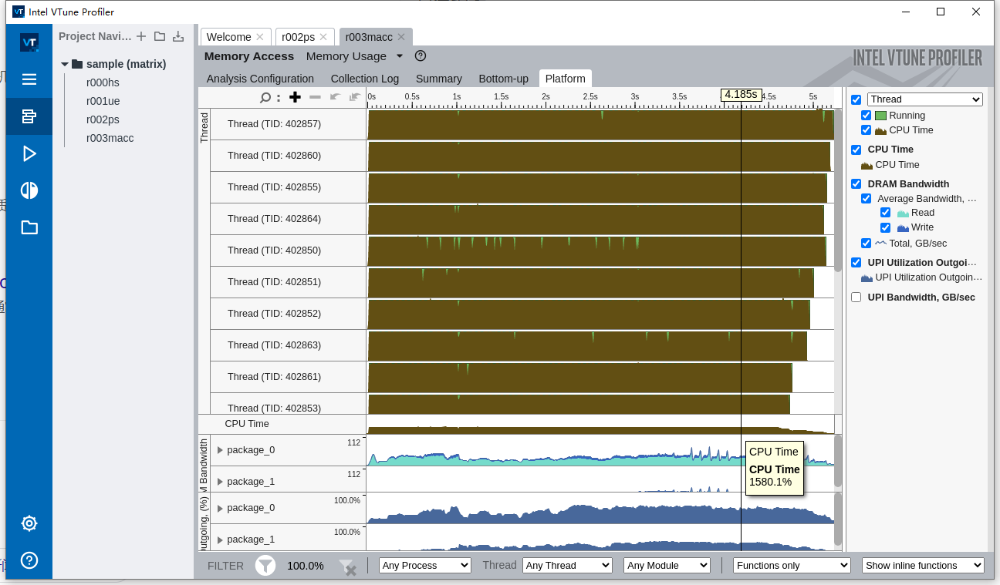

.. _intel_vtune:

Intel-Vtune
========================

英特尔® VTune™ Profiler 为 HPC、云、物联网、媒体、存储等优化应用程序性能、系统性能和系统配置。

加载预安装的Vtune组件
---------------------

可以用以下命令加载集群中已安装的Intel组件:

+----------------------+------------------------------------------+--------------------------+
| 版本                 | 加载方式                                 | 组件说明                 |
+======================+==========================================+==========================+        
| intel-parallel-2019. | module load                              |                          |
| 4/icc-19.0.4         | intel-parallel-studio/cluster.2019.4     |                          |
+----------------------+------------------------------------------+--------------------------+

使用 vtune
---------------------------

目前vtune操作都是在HPC Studio 上进行。

这里，我们演示如何使用系统中的vtune。

1、登录 `hpc studio <https://studio.hpc.sjtu.edu.cn/>`__

2、申请desktop。根据您的项目需要的资源数，确定申请配额。

成功界面：

加载环境：

.. code:: bash

   $ module load intel-parallel-studio/cluster.2019.4
   

vtune命令
-----------------------

1、vtune 可执行文件有两种形式
   vtune-xxxx
   amplxe-xxxx
   具体用那种形式，可以通过“ which vtune ”,查看vtune路径下的可执行文件。
2、收集程序热点
   amplxe-cl -collect hotspots -r test_hot ./test
   通过上面的命令可以收集到test应用的热点数据，保存到test_hot 目录下。
3、打开图形化界面
   amplxe-gui  
   通过以上命令可以打开vtune的图形化界面。
  

目前vtune支持的可执行操作。如图所示：

出现如下页面,说明vtune启动成功。

选择编译好的项目的可执行文件，点击运行，进行性能分析，如图:

vtune可以分析的性能类型: 性能热点、内存消耗、线程、CPU占比、IO性能等，如图所示:

以 r003macc 程序为例,分析得出,程序执行耗时5.229s,内存、三级缓存使用情况、本地内存使用情况、以及NUMA远程访问情况,如图所示:

以 r003macc 程序为例,查看内存读写负载均衡、本地内存使用情况:

以 r003macc 程序为例,查看线程使用，以及CPU使用情况:

参考资料
--------

-  `intel-parallel-studio <https://www.intel.com/content/www/us/en/develop/documentation/vtune-help/top.html/>`__
