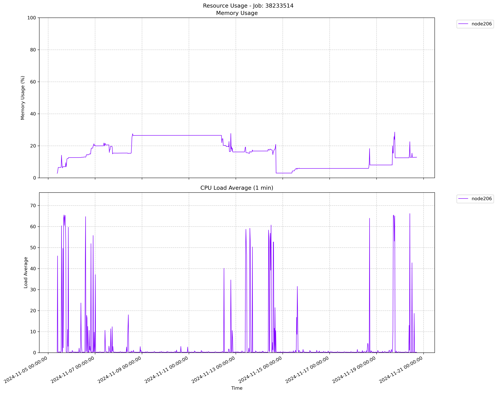

.. _jobtop:

JobTop 作业监控工具
=======================

JobTop是一个用于监控作业的命令行工具，提供了直观的界面来查看作业CPU平均负载和内存的使用情况。使用该工具可查看正在运行作业的资源使用情况，以及最近两个月内的历史作业资源使用情况。

主要功能
--------

- 显示作业的相关信息，如节点、开始时间、结束时间、状态、最大内存使用率、最大CPU负载
- 保存作业的资源图，包括CPU和内存的使用情况
  
使用方法
--------

在终端中直接运行::

    module load jobtop
    jobtop 作业ID
    如: jobtop 38233514

终端输出::

    Job info:
    Job ID: 38233514
    Nodes: ['node206']
    Start time: 2024-11-05 09:15:27
    End time: 2024-11-21 10:03:48
    State: RUNNING
    Max Memory Usage: 49.98%
    Max CPU Load: 376.38

    Job resources Figure saved as: 38233514_cpu_mem.png

作业资源图
------------

注意：

- 作业资源图保存为PNG格式，文件名格式为：作业ID_cpu_mem.png
- 作业资源图保存路径为当前目录

CPU平均负载（1m）
~~~~~~~~~~~~~~~~~

具体指的是过去1分钟内系统中处于以下两种状态的平均任务数量，并计算其指数加权移动平均值得到的。

- 正在运行的任务：正在CPU上执行的进程。
- 等待CPU的任务：因CPU资源不足而排队的进程。

例如：

- 在64核系统中，负载64表示CPU正满负荷工作。 
- 在40核系统中，负载10表示CPU的使用率仅为25%。 
- 负载值大于核心数：意味着任务队列中等待的任务数超过了CPU的处理能力，系统可能出现性能瓶颈。 
- 负载值小于核心数：CPU还有空闲时间，系统负载较轻。 

