.. _matlab:

MATLAB
===============

简介
-------

MATLAB是美国MathWorks公司出品的商业数学软件，用于数据分析、无线通信、深度学习、图像处理与计算机视觉、
信号处理、量化金融与风险管理、机器人，控制系统等领域。

可用的版本
----------------
+----------+----------------+----------+-------------------------------------------------+
|版本      |平台            |构建方式  |名称                                             |
+==========+================+==========+=================================================+
| 2022a    |  |cpu|         | 容器     |/lustre/share/img/matlab_latest.sif              |
+----------+----------------+----------+-------------------------------------------------+
| 2022a    |  |cpu|         | 容器     |/dssg/share/imgs/matlab/matlab_latest.sif思源平台|
+----------+----------------+----------+-------------------------------------------------+
| 2021a    |  |cpu|         | 容器     |/lustre/share/img/matlab_r2021a.sif              |
+----------+----------------+----------+-------------------------------------------------+
| 2021a    |  |cpu|         | 容器     |/dssg/share/imgs/matlab/matlab_r2021a.sif思源平台|
+----------+----------------+----------+-------------------------------------------------+

超算上的MATLAB
------------------------
超算上的CPU及GPU平台均支持MATLAB软件，在π 超算及思源一号均有提供。

超算上的 MATLAB 授权由网络授权服务器自动检查，超算用户无需用户名密码登录，打开即可使用。

MATLAB既可被可视化调用（需启动HPC Studio Desktop），也可从命令行调用。

- `命令行交互式使用 MATLAB`_
- `提交 MATLAB 脚本`_
- `可视化平台部署的 MATLAB`_
- `可视化平台桌面启动 MATLAB`_
- `使用GPU版本的 MATLAB`_

.. _命令行交互式使用 MATLAB:

命令行交互式使用 MATLAB
^^^^^^^^^^^^^^^^^^^^^^^^^^^^^^^

命令行使用 MATLAB，首先在超算平台上申请交互式会话窗口（以思源平台为例）：

.. code:: console

    $ srun -p 64c512g -n 10 --pty /bin/bash    

输入以下命令进入 MATLAB 命令行交互式会话窗口：

.. code:: console

    $ singularity run /dssg/share/imgs/matlab/matlab_latest.sif matlab
    MATLAB is selecting SOFTWARE OPENGL rendering.

                                < M A T L A B (R) >
                    Copyright 1984-2022 The MathWorks, Inc.
                R2022a Update 2 (9.12.0.1956245) 64-bit (glnxa64)
                                    May 11, 2022

    
    To get started, type doc.
    For product information, visit www.mathworks.com.
    
    >> 

在此交互式窗口内，可以执行 MATLAB 命令：

.. code:: console

    >> a=4;
    >> b=5;
    >> a+b

    ans =

        9

    >> 

.. _提交 MATLAB 脚本:

提交 MATLAB 脚本
^^^^^^^^^^^^^^^^^^^^

1. 算例下载

.. code:: console
   
   cd ~
   git clone https://github.com/SJTU-HPC/HPCTesting.git

2. 脚本提交

π 超算提交单核CPU脚本

.. code:: bash

    #!/bin/bash
    #SBATCH -J matlab_test
    #SBATCH -p small
    #SBATCH -o %j.out
    #SBATCH -e %j.err
    #SBATCH -n 1
    #SBATCH --ntasks-per-node=1

    IMAGE_PATH=/lustre/share/img/matlab_latest.sif

    ulimit -s unlimited
    ulimit -l unlimited
    cd ~/HPCTesting/matlab/case1
    singularity exec $IMAGE_PATH matlab -r test

思源一号提交单核CPU脚本

.. code:: bash

    #!/bin/bash
    #SBATCH -J matlab_test
    #SBATCH -p 64c512g
    #SBATCH -o %j.out
    #SBATCH -e %j.err
    #SBATCH -n 1
    #SBATCH --ntasks-per-node=1

    IMAGE_PATH=/dssg/share/imgs/matlab/matlab_latest.sif
    
    ulimit -s unlimited
    ulimit -l unlimited
    cd ~/HPCTesting/matlab/case1
    singularity exec $IMAGE_PATH matlab -r test

使用sbatch命令提交脚本，脚本运行完毕后，在本地将生成一张名为 `1.png` 的图片，如程序运行无误，该图片的内容与本地 `result.png` 内容一致：

.. image:: ../../img/matlab_result.png

π 超算提交多核CPU脚本

.. code:: bash

    #!/bin/bash
    #SBATCH -J matlab_test
    #SBATCH -p small
    #SBATCH -o %j.out
    #SBATCH -e %j.err
    #SBATCH -n 40
    #SBATCH --cpus-per-task 1

    IMAGE_PATH=/lustre/share/img/matlab_latest.sif

    ulimit -s unlimited
    ulimit -l unlimited
    cd ~/HPCTesting/matlab/case2
    singularity exec $IMAGE_PATH matlab -r multicore

思源一号提交多核CPU脚本

.. code:: bash

    #!/bin/bash
    #SBATCH -J matlab_test
    #SBATCH -p 64c512g
    #SBATCH -o %j.out
    #SBATCH -e %j.err
    #SBATCH -n 1
    #SBATCH --cpus-per-task 64

    IMAGE_PATH=/dssg/share/imgs/matlab/matlab_latest.sif
    
    ulimit -s unlimited
    ulimit -l unlimited
    cd ~/HPCTesting/matlab/case2
    singularity exec $IMAGE_PATH matlab -r multicore

.. _可视化平台部署的 MATLAB:

可视化平台部署的 MATLAB
^^^^^^^^^^^^^^^^^^^^^^^

可视化平台部署了 MATLAB 应用，可运行MATLAB自带的可视化界面，进行交互操作。

1. 登录可视化平台，选择 MATLAB 应用

使用hpc帐号登录HPC studio（https://studio.hpc.sjtu.edu.cn）后，点击 MATLAB 应用图标

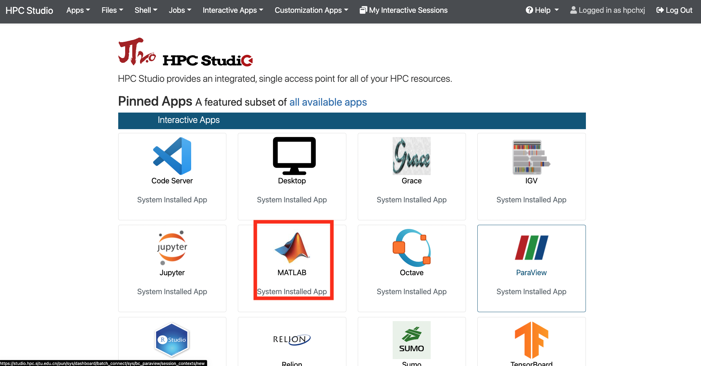

2. 申请资源，选择 MATLAB 版本

点击 MATLAB 图标后会跳转至资源选择界面，该页面上可选择申请的时长、可视化桌面的分辨率、平台资源以及MATLAB版本（默认为2022a）。

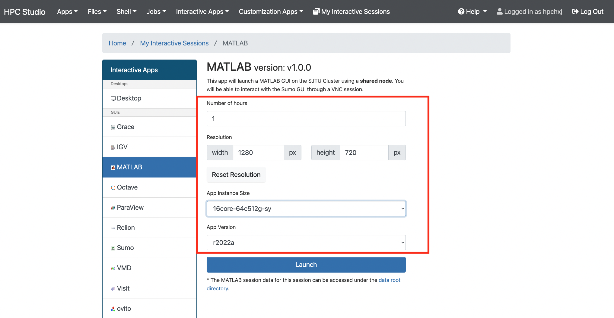

选择完毕后点击Launch按钮即跳转至会话管理界面，该界面会列出近期正在排队、运行或者已完成的studio会话。

等到该会话完成排队，进入Running状态，点击下方 Launch MATLAB 按钮，即可进入MATLAB应用。

.. image:: ../../img/matlab_studio_session.png

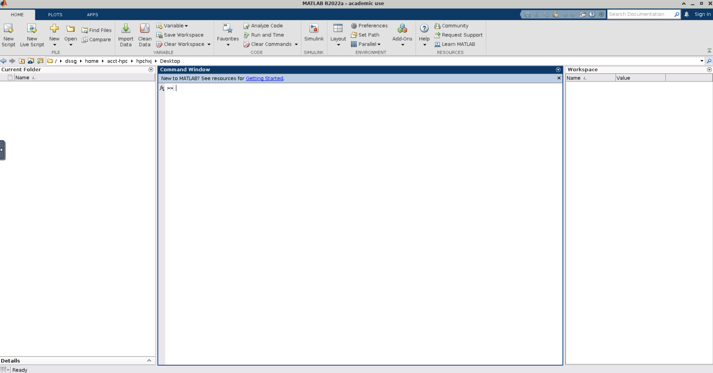

.. _可视化平台桌面启动 MATLAB:

可视化平台桌面启动 MATLAB
^^^^^^^^^^^^^^^^^^^^^^^^^^^^^^^^^^^^^^^

除了从可视化平台的应用入口直接启动 MATLAB, 也可申请远程桌面，从远程桌面的客户端运行 MATLAB 应用。

1. 启动远程桌面

使用hpc帐号登录HPC studio（https://studio.hpc.sjtu.edu.cn）后，点击"Interactive Apps >> Desktop"。选择需要的核数，session时长（默认1核、1小时），点击"Launch"启动远程桌面。待选项卡显示作业在RUNNING的状态时,点击"Launch Desktop"即可进入远程桌面。

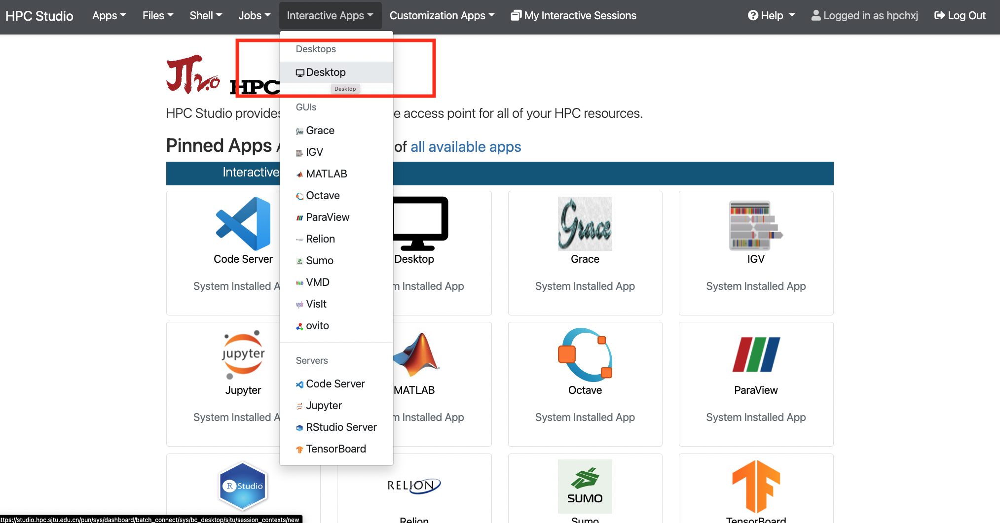

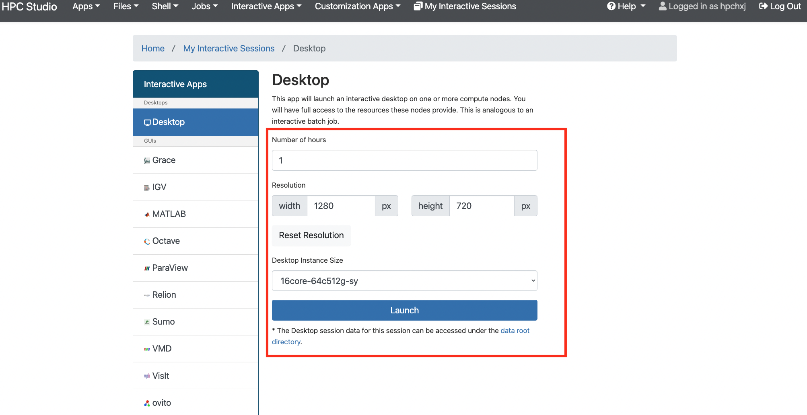

除了从思源一号启动远程桌面外，π 超算也支持启动远程桌面，在选定核数的同时可以同时选定平台：

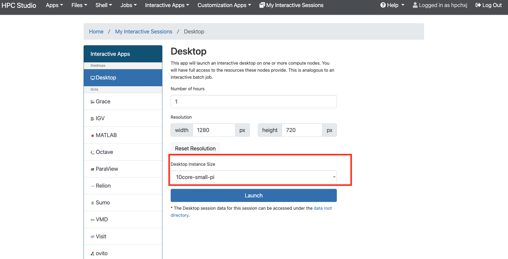

2. 启动MATLAB

远程桌面中点击右键，选择Open Terminal Here打开终端。

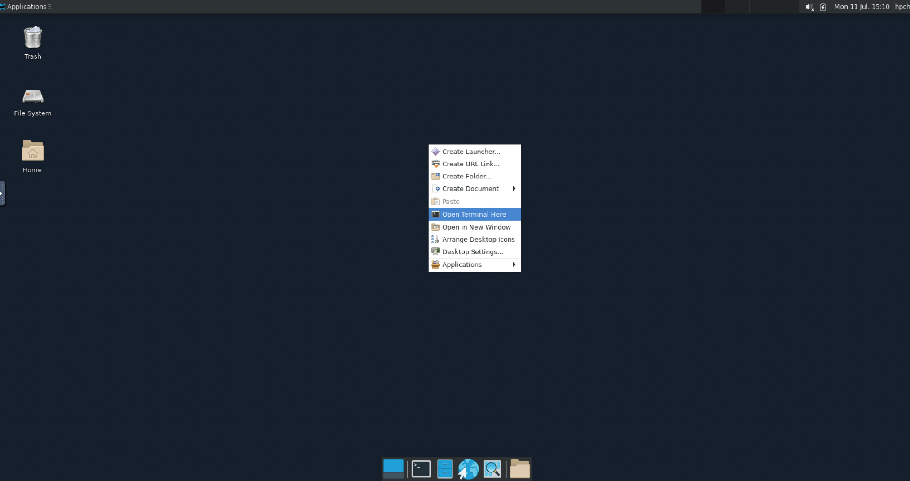

在终端中使用命令 ``singularity run /dssg/share/imgs/matlab/matlab_latest.sif matlab`` , π 超算需使用命令 ``singularity run /lustre/share/img/matlab_latest.sif matlab`` 。

启动后即可使用MATLAB R2022a

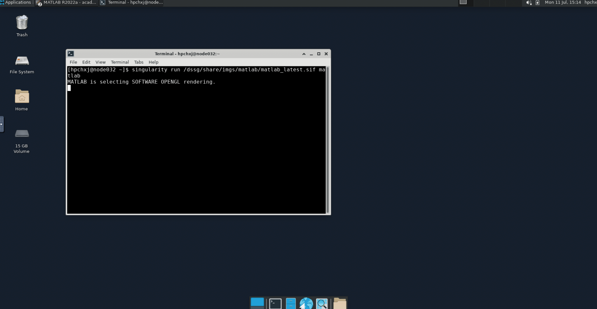

.. _使用GPU版本的MATLAB:

使用GPU版本的 MATLAB
^^^^^^^^^^^^^^^^^^^^

使用GPU版本的MATLAB需要CUDA11，因此该版本只能在思源一号使用。

可视化平台使用MATLAB GPU版
""""""""""""""""""""""""""""""

1. 启动远程桌面

使用hpc帐号登录HPC studio（https://studio.hpc.sjtu.edu.cn）后，点击"Interactive Apps >> Desktop"。选择需要的核数，session时长（默认1核、1小时），点击"Launch"启动远程桌面。待选项卡显示作业在RUNNING的状态时,点击"Launch Desktop"即可进入远程桌面。

.. image:: ../../img/matlab01.png

选定核数的时候选择思源一号的一张GPU卡：

.. image:: ../../img/matlab-siyuan-gpu.png

2. 启动GPU版本MATLAB

在窗口中启动终端（terminal），在终端输入 ``singularity run --nv /dssg/share/imgs/matlab/matlab_latest.sif`` ，即可启动GPU版本matlab。

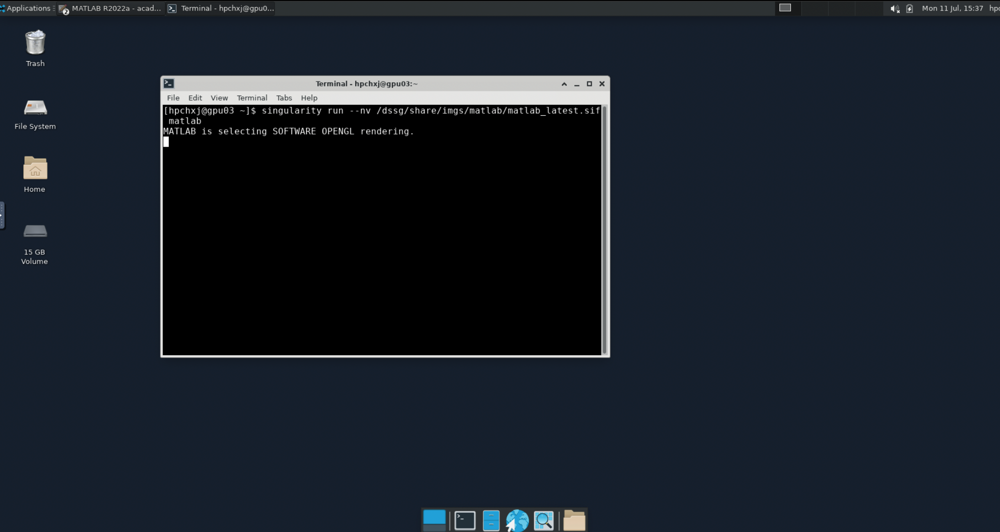

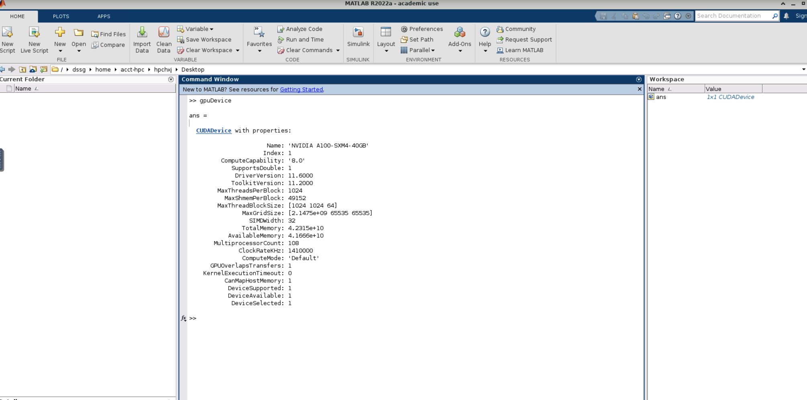

提交MATLAB GPU版脚本
"""""""""""""""""""""""

.. code:: bash

    #!/bin/bash
    #SBATCH -J matlab_test
    #SBATCH -p a100
    #SBATCH -o %j.out
    #SBATCH -e %j.err
    #SBATCH -n 1
    #SBATCH -N 1
    #SBATCH --cpus-per-task 6
    #SBATCH --gres gpu:1

    IMAGE_PATH=/dssg/share/imgs/matlab/matlab_latest.sif
    
    ulimit -s unlimited
    ulimit -l unlimited
    
    singularity run --nv  $IMAGE_PATH matlab -r $YOUR_SCRIPT_FILE

MATLAB Parallel Computing Toolbox
-----------------------------------------

利用 Parallel Computing Toolbox™，可以使用多核处理器、GPU 和计算机集群来解决计算问题和数据密集型问题。利用并行 for 循环、特殊数组类型和并行化数值算法等高级别构造，无需进行 CUDA 或 MPI 编程即可对 MATLAB® 应用程序进行并行化。 通过该工具箱可以使用 MATLAB 和其他工具箱中支持并行的函数。你可以将该工具箱与 Simulink 配合使用，并行运行一个模型的多个仿真。程序和模型可以在交互模式和批处理模式下运行。

集群上部署的 MATLAB 镜像均已安装  Parallel  Computing Toolbox 并获取相关授权，打开 MATLAB 即可使用相应功能。

目前集群上配置的 MATLAB 镜像仅支持单节点并行。因此，在 π 超算上最多可40核并行，在思源超算上最多可64核并行.

了解更多 MATLAB Parallel Computing Toolbox 在超算上的使用，请跳转至文档 :ref:`matlab_pct`.

单节点性能对比
--------------------------

算例为路径 ``~/HPCTesting/matlab/case2`` 。

运行时间

+----------+----------------+----------+
|版本      |平台            |时间(s)   |
+==========+================+==========+
| 2021a    |  思源          |  105     |
+----------+----------------+----------+
| 2021a    |  π 超算        | 176      |
+----------+----------------+----------+

建议
-------------------------

思源超算单节点拥有更多核心、更大内存。在运行多核心任务时推荐使用思源平台。

MATLAB代理设置
-------------------------

使用过程中如果遇到 ``Unable to open the requested feature.`` 等网络问题或者不能正常使用 ``Live Editor`` 功能，可以通过设置代理解决。

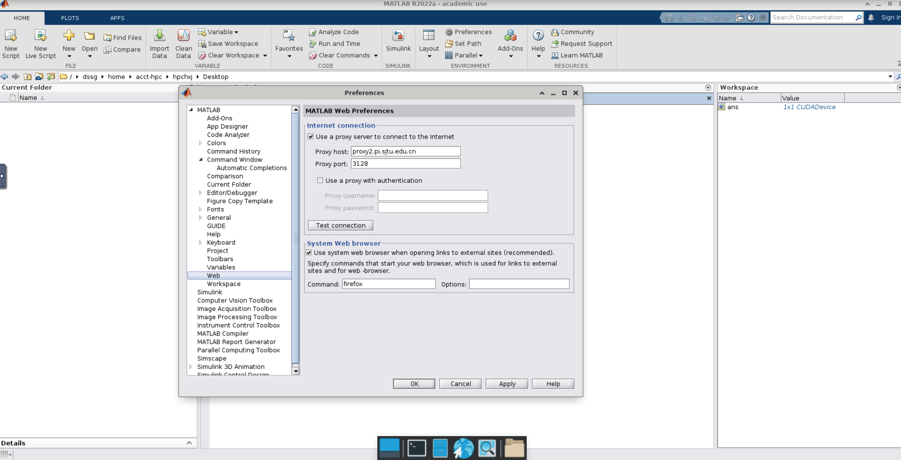

**π 超算代理设置**

``proxy.hpc.sjtu.edu.cn:3004``

**思源一号代理设置**

``proxy2.pi.sjtu.edu.cn:3128``

自定义添加MATLAB插件
-------------------------

首先拷贝集群上的镜像到本地

.. code:: shell

   cp /lustre/share/img/matlab_latest.sif ~/

接下来需要在镜像中添加基础编译环境（该操作可以在build@container-x86中操作）

.. code:: shell

   Bootstrap:localimage
   From:/home/singularity/matlab_latest.sif

   %post
       echo y | apt-get update -y
       echo y | apt-get install gcc -y
       echo y | apt-get install g++ -y

最后在添加自定义的库时，需要先进入容器

.. code:: shell

   singularity shell matlab_latest_self.sif
