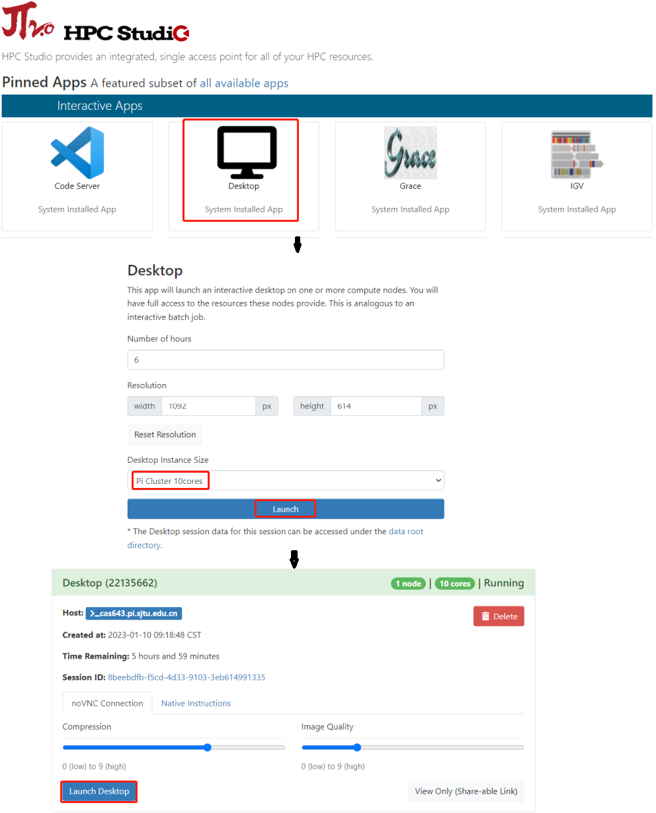
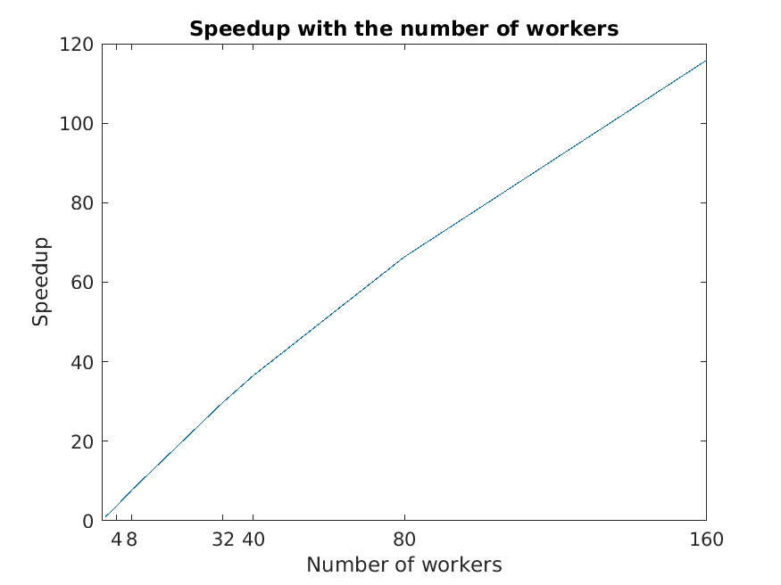

.. _matlab:

MATLAB
===============

简介
-------

MATLAB是美国MathWorks公司出品的商业数学软件，用于数据分析、无线通信、深度学习、图像处理与计算机视觉、
信号处理、量化金融与风险管理、机器人，控制系统等领域。

可用的版本
----------------

+----------+---------------------------+
| 集群平台 | 模块名                    |
+==========+===========================+
| 思源一号 | module load matlab/r2022a |
+----------+---------------------------+
| 思源一号 | module load matlab/r2022b |
+----------+---------------------------+
| pi 2.0   | module load matlab/r2022a |
+----------+---------------------------+
| pi 2.0   | module load matlab/r2022b |
+----------+---------------------------+

算例下载
--------

.. code:: bash

   cd ~
   git clone https://github.com/SJTU-HPC/HPCTesting.git

使用MATLAB的方式
------------------------

- `命令行交互式使用 MATLAB`_
- `提交 MATLAB 脚本`_
- `可视化平台部署的 MATLAB`_
- `可视化平台桌面启动 MATLAB`_
- `使用GPU版本的 MATLAB`_
- `多节点并行版的 MATLAB`_

.. _命令行交互式使用 MATLAB:

命令行交互式使用 MATLAB
^^^^^^^^^^^^^^^^^^^^^^^^^^^^^^^

命令行使用 MATLAB，首先在超算平台上申请交互式会话窗口（以思源平台为例）：

.. code:: console

    $ srun -p 64c512g -n 10 --pty /bin/bash    

输入以下命令进入 MATLAB 命令行交互式会话窗口：

.. code:: console

    $ module load matlab/r2022b
    $ matlab
    MATLAB is selecting SOFTWARE OPENGL rendering.

                                        < M A T L A B (R) >
                              Copyright 1984-2022 The MathWorks, Inc.
                         R2022b Update 5 (9.13.0.2193358) 64-bit (glnxa64)
                                         February 10, 2023

    >> 

在此交互式窗口内，可以执行 MATLAB 命令：

.. code:: console

    >> a=4;
    >> b=5;
    >> a+b

    ans =

        9

    >> 

.. _提交 MATLAB 脚本:

提交 MATLAB 脚本
^^^^^^^^^^^^^^^^^^^^

π 超算提交单核CPU脚本

.. code:: bash

    #!/bin/bash
    #SBATCH -J matlab_test
    #SBATCH -p small
    #SBATCH -o %j.out
    #SBATCH -e %j.err
    #SBATCH -n 1
    #SBATCH --ntasks-per-node=1

    module load matlab/r2022a
    cd ~/HPCTesting/matlab/case1
    matlab -r test

思源一号提交单核CPU脚本

.. code:: bash

    #!/bin/bash
    #SBATCH -J matlab_test
    #SBATCH -p 64c512g
    #SBATCH -o %j.out
    #SBATCH -e %j.err
    #SBATCH -n 1
    #SBATCH --ntasks-per-node=1

    module load matlab/r2022a
    cd ~/HPCTesting/matlab/case1
    matlab -r test

使用sbatch命令提交脚本，脚本运行完毕后，在本地将生成一张名为 `1.png` 的图片，如程序运行无误，该图片的内容与本地 `result.png` 内容一致：

.. image:: ../../img/matlab_result.png

π 超算提交多核CPU脚本

.. code:: bash

    #!/bin/bash
    #SBATCH -J matlab_test
    #SBATCH -p cpu
    #SBATCH -o %j.out
    #SBATCH -e %j.err
    #SBATCH -n 40
    #SBATCH --cpus-per-task 1

    module load matlab/r2022a
    cd ~/HPCTesting/matlab/case2
    singularity exec $IMAGE_PATH matlab -r multicore

思源一号提交多核CPU脚本

.. code:: bash

    #!/bin/bash
    #SBATCH -J matlab_test
    #SBATCH -p 64c512g
    #SBATCH -o %j.out
    #SBATCH -e %j.err
    #SBATCH -n 1
    #SBATCH --cpus-per-task 64

    module load matlab/r2022a
    cd ~/HPCTesting/matlab/case2
    singularity exec $IMAGE_PATH matlab -r multicore

.. _可视化平台部署的 MATLAB:

可视化平台部署的 MATLAB
^^^^^^^^^^^^^^^^^^^^^^^

可视化平台部署了 MATLAB 应用，可运行MATLAB自带的可视化界面，进行交互操作。

1. 登录可视化平台，选择 MATLAB 应用

使用hpc帐号登录HPC studio（https://studio.hpc.sjtu.edu.cn）后，点击 MATLAB 应用图标

.. image:: ../../img/matlab_studio_click.png

2. 申请资源，选择 MATLAB 版本

点击 MATLAB 图标后会跳转至资源选择界面，该页面上可选择申请的时长、可视化桌面的分辨率、平台资源以及MATLAB版本。

.. image:: ../../img/matlab_studio_resources.png

选择完毕后点击Launch按钮即跳转至会话管理界面，该界面会列出近期正在排队、运行或者已完成的studio会话。

等到该会话完成排队，进入Running状态，点击下方 Launch MATLAB 按钮，即可进入MATLAB应用。

.. image:: ../../img/matlab_studio_session.png

.. image:: ../../img/matlab_studio_running.png

.. _可视化平台桌面启动 MATLAB:

可视化平台桌面启动 MATLAB
^^^^^^^^^^^^^^^^^^^^^^^^^^^^^^^^^^^^^^^

除了从可视化平台的应用入口直接启动 MATLAB, 也可申请远程桌面，从远程桌面的客户端运行 MATLAB 应用。

1. 启动远程桌面

使用hpc帐号登录HPC studio（https://studio.hpc.sjtu.edu.cn）后，点击"Interactive Apps >> Desktop"。选择需要的核数，session时长（默认1核、1小时），点击"Launch"启动远程桌面。待选项卡显示作业在RUNNING的状态时,点击"Launch Desktop"即可进入远程桌面。

.. image:: ../../img/matlab_studio_desktop_click.png

.. image:: ../../img/matlab_studio_desktop_resources.png

除了从思源一号启动远程桌面外，π 超算也支持启动远程桌面，在选定核数的同时可以同时选定平台：

.. image:: ../../img/matlab_studio_desktop_resources_pi.png

2. 启动MATLAB

远程桌面中点击右键，选择Open Terminal Here打开终端。

.. image:: ../../img/matlab_studio_desktop_terminal.png

在终端中使用命令 ``module load matlab/r2022a && matlab`` , π 超算和思源一号使用的命令一致。

启动后即可使用MATLAB R2022a

.. image:: ../../img/matlab_studio_running.png

.. _使用GPU版本的MATLAB:

使用GPU版本的 MATLAB
^^^^^^^^^^^^^^^^^^^^

可视化平台使用MATLAB GPU版
""""""""""""""""""""""""""""""

1. 启动远程桌面

使用hpc帐号登录HPC studio（https://studio.hpc.sjtu.edu.cn）后，点击"Interactive Apps >> Desktop"。选择需要的核数，session时长（默认1核、1小时），点击"Launch"启动远程桌面。待选项卡显示作业在RUNNING的状态时,点击"Launch Desktop"即可进入远程桌面。

.. image:: ../../img/matlab01.png

选定核数的时候选择思源一号的一张GPU卡：

.. image:: ../../img/matlab-siyuan-gpu.png

2. 启动GPU版本MATLAB

在窗口中启动终端（terminal），在终端输入 ``module load matlab/r2022a && matlab`` ，即可启动GPU版本matlab。

.. image:: ../../img/matlab_studio_desktop_gpu_running.png

提交MATLAB GPU版脚本
"""""""""""""""""""""""

**思源一号**

.. code:: bash

    #!/bin/bash
    #SBATCH -J matlab_test
    #SBATCH -p a100
    #SBATCH -o %j.out
    #SBATCH -e %j.err
    #SBATCH -n 1
    #SBATCH -N 1
    #SBATCH --cpus-per-task 16
    #SBATCH --gres gpu:1

    module load matlab/r2022a    
    
    matlab -r $YOUR_SCRIPT_FILE

**pi2.0**

.. code:: bash

   #!/bin/bash
   #SBATCH -J matlab_test
   #SBATCH -p dgx2
   #SBATCH -o %j.out
   #SBATCH -e %j.err
   #SBATCH -n 1
   #SBATCH -N 1
   #SBATCH --cpus-per-task 6
   #SBATCH --gres gpu:1

   module load matlab/r2022a 
   matlab -r $YOUR_SCRIPT_FILE

.. _多节点并行版的 MATLAB:

多节点并行版的 MATLAB
^^^^^^^^^^^^^^^^^^^^^^

**pi2.0**

1.首先，进入可视化终端界面

通过HPC Studio ``https://studio.hpc.sjtu.edu.cn`` 打开matlab可视化终端

.. code:: bash

   cd
   mkdir matlab
   cd matlab
   module load matlab/r2022a
   matlab

2.然后，导入SlurmProfile

输入如下命令:

.. code:: bash

   profile_master = parallel.importProfile('/lustre/opt/contribute/cascadelake/matlab/R2022a/ParSlurmProfile/SlurmParForUser.mlsettings');
   parallel.defaultClusterProfile(profile_master);   

3.接下来，运行作业

作业脚本路径如下所示，具体功能为素因素分解，使用的核数为1、4、8、32、40、80和160核，生成的图片为不同核数的计算时间与使用1核时的加速比。

.. code:: bash

   /lustre/share/samples/matlab/composite_speedup.m

输入：

.. code:: bash
 
   composite_speedup

注：第一次申请资源池时，会要求输入在集群上的账号和密码，然后在整个matlab session中均有效。

4.运行结果为

MATLAB代理设置
-------------------------

使用过程中如果遇到 ``Unable to open the requested feature.`` 等网络问题或者不能正常使用 ``Live Editor`` 功能，可以通过设置代理解决。

.. image:: ../../img/matlab_sy_proxy.png

**π 超算代理设置**

``proxy.hpc.sjtu.edu.cn:3004``

**思源一号代理设置**

``proxy2.pi.sjtu.edu.cn:3128``
