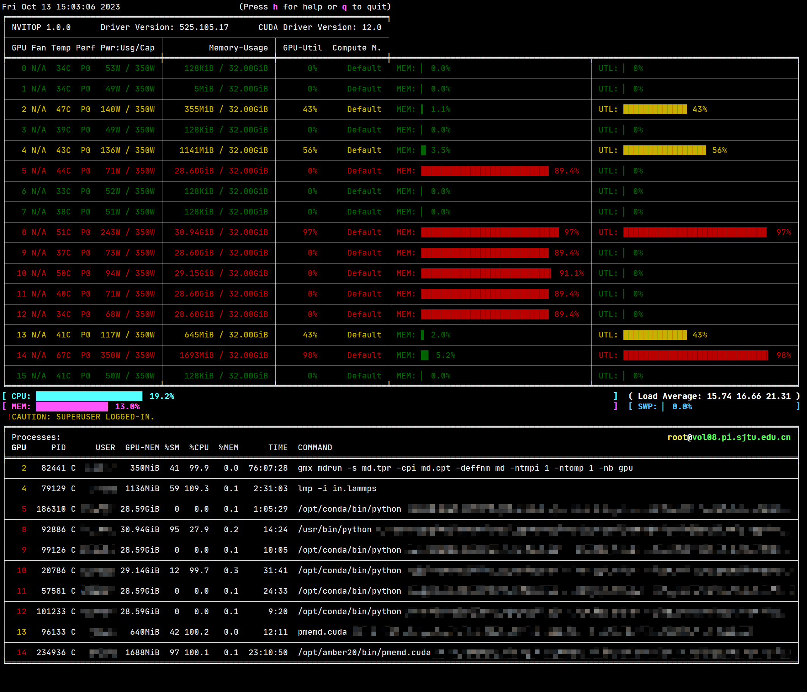
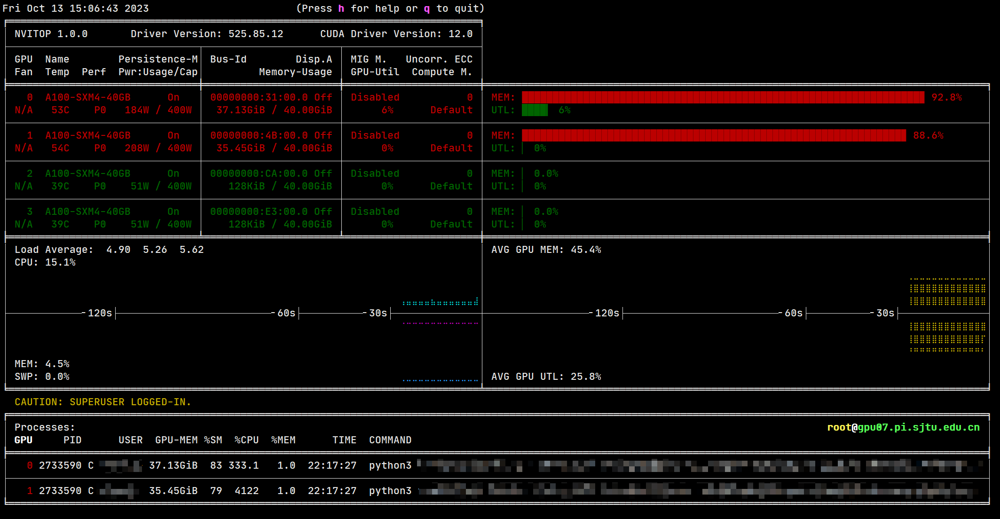

.. _nvitop:

nvitop
===============

简介
------------
``nvitop`` 是一款交互式的 NVIDIA GPU 设备性能、资源、进程的实时监测工具。``nvitop`` 具有以下特点：

* 监控信息丰富：资源监控信息更全面，表现形式更直观
* 实时查看：作为资源监控器，它支持条形图和历史图、监控信息排序和监控信息过滤、GPU进程及其父进程的树视图显示
* 交互式：可在监控模式下响应用户输入（来自键盘或鼠标），比 ``gpustat`` 和 ``py3nvml`` 更具优势
* 可集成：易于集成到其它应用程序中，而不仅仅是监控功能

您可以在登录到 GPU 节点终端后使用 ``nvitop`` 命令来查看 GPU 使用信息。更多使用方法参见文档：https://nvitop.readthedocs.io/en/latest/

GPU 使用信息展示
-------------------
在 DGX-2 节点上使用 ``nvitop`` 命令：

在 A100 节点上使用 ``nvitop`` 命令：

参考
------------
* 官方仓库地址：https://github.com/XuehaiPan/nvitop
* 官方文档地址：https://nvitop.readthedocs.io/en/latest/