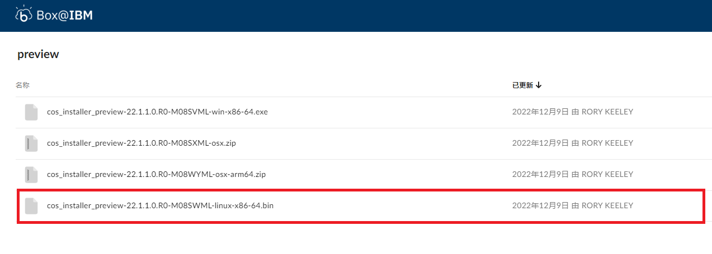

.. _cplex:

cplex
======

cplex是IBM公司开发的一款商业版的优化引擎,该引擎专门用于求解大规模的线性规划（LP）、二次规划（QP）、带约束的二次规划（QCQP）、二阶锥规划（SOCP）等四类基本问题，以及相应的混合整数规划（MIP）问题。

cplex安装以及使用说明
-----------------------------

1. 如下图所示，登录 `IBM cplex 官网 <https://www.ibm.com/cn-zh/products/ilog-cplex-optimization-studio?utm_content=SRCWW&p1=Search&p4=43700074800244544&p5=2&gclid=CPb79Jzplv0CFb1DwgUdCBAAEw&gclsrc=ds>`__ 并注册账号，然后下载linux平台下的cplex安装包(试用免费版)：

|image1|

|image2|

2. 申请计算资源：

.. code::

    srun -p 64c512g -n 4 --pty /bin/bash (思源一号)
    或者
    srun -p cpu -N 1 --ntasks-per-node 40  --exclusive  --pty /bin/bash  (pi2.0)

3. 加载所需模块：

.. code::

    module load gcc openmpi jdk python

4. 在自己的家目录下新建一个目录cplex作为安装目录，进入该目录，并将上一步得到的安装包上传到当前目录：

.. code::

    mkdir cplex
    cd  cplex

5. 执行以下命令使安装文件具有执行权限，然后执行该文件：

.. code::

    chmod 777 cos_installer_preview-22.1.1.0.R0-M08SWML-linux-x86-64.bin
    ./cos_installer_preview-22.1.1.0.R0-M08SWML-linux-x86-64.bin

6. 根据终端输出的安装提示一步一步往下执行即可。

.. caution::

   一定要将默认的安装路径 /opt/ibm/ILOG/CPLEX_Studio_Community2211 改为自己家目录下的某个目录，并且使用绝对路径(比如说/dssg/home/acct-hpc/hpcpzz/cplex)；

7. cplex自带了很多标准算例，用户可以通过执行以下命令来编译并运行这些算例：

.. code::

    export PATH=$PATH:~/cplex/cplex/bin/x86-64_linux:~/cplex/cpoptimizer/bin/x86-64_linux
    cd ~/cplex/cplex/examples/x86-64_linux/static_pic
    make execute  -j

8. 此时在终端中可得到如下结果：

.. code::

    make all_c
    make[1]: Entering directory '/dssg/home/acct-hpc/hpcpzz/cplex214/cplex/examples/x86-64_linux/static_pic'
    gcc -c -m64 -fPIC  -I../../../include ../../../examples/src/c/lpex1.c -o lpex1.o
    gcc -c -m64 -fPIC  -I../../../include ../../../examples/src/c/lpex2.c -o lpex2.o
    gcc -c -m64 -fPIC  -I../../../include ../../../examples/src/c/lpex3.c -o lpex3.o
    gcc -c -m64 -fPIC  -I../../../include ../../../examples/src/c/lpex4.c -o lpex4.o
    gcc -c -m64 -fPIC  -I../../../include ../../../examples/src/c/lpex5.c -o lpex5.o
    gcc -c -m64 -fPIC  -I../../../include ../../../examples/src/c/lpex6.c -o lpex6.o
    gcc -c -m64 -fPIC  -I../../../include ../../../examples/src/c/lpex7.c -o lpex7.o
    gcc -c -m64 -fPIC  -I../../../include ../../../examples/src/c/lpex8.c -o lpex8.o
    gcc -c -m64 -fPIC  -I../../../include ../../../examples/src/c/mipex1.c -o mipex1.o
    gcc -c -m64 -fPIC  -I../../../include ../../../examples/src/c/mipex2.c -o mipex2.o
    gcc -c -m64 -fPIC  -I../../../include ../../../examples/src/c/mipex3.c -o mipex3.o
    gcc -c -m64 -fPIC  -I../../../include ../../../examples/src/c/mipex4.c -o mipex4.o
    gcc -c -m64 -fPIC  -I../../../include ../../../examples/src/c/miqpex1.c -o miqpex1.o
    ...
    ./admipex7 ../../../examples/data/mexample.mps
    Selected objective sense:  MINIMIZE
    Selected objective  name:  obj
    Selected RHS        name:  rhs
    Selected bound      name:  bnd
    Version identifier: 22.1.1.0 | 2022-11-26 | 9160aff4d
    CPXPARAM_MIP_Strategy_Search                     1
    Legacy callback                                  S
    Found incumbent of value -46.000000 after 0.00 sec. (0.00 ticks)
    Tried aggregator 2 times.
    Aggregator did 1 substitutions.
    Reduced MIP has 2 rows, 3 columns, and 6 nonzeros.
    Reduced MIP has 0 binaries, 1 generals, 0 SOSs, and 0 indicators.
    Presolve time = 0.00 sec. (0.01 ticks)
    Tried aggregator 1 time.
    Reduced MIP has 2 rows, 3 columns, and 6 nonzeros.
    Reduced MIP has 0 binaries, 1 generals, 0 SOSs, and 0 indicators.
    Presolve time = 0.00 sec. (0.00 ticks)
    MIP emphasis: balance optimality and feasibility.
    MIP search method: traditional branch-and-cut.
    Parallel mode: none, using 1 thread.
    Root relaxation solution time = 0.00 sec. (0.02 ticks)

           Nodes                                         Cuts/
      Node  Left     Objective  IInf  Best Integer    Best Bound    ItCnt     Gap         Variable B NodeID Parent  Depth

    *     0+    0                          -46.0000     -163.0000           254.35%
    *     0+    0                         -111.0000     -163.0000            46.85%
    *     0+    0                         -122.5000     -163.0000            33.06%
          0     0     -125.2083     1     -122.5000     -125.2083       11    2.21%
          0     0        cutoff           -122.5000                     11    0.00%                        0             0
    Elapsed time = 0.01 sec. (0.09 ticks, tree = 0.01 MB, solutions = 3)

    Root node processing (before b&c):
     Real time             =    0.01 sec. (0.09 ticks)
    Sequential b&c:
     Real time             =    0.00 sec. (0.00 ticks)
                          ------------
    Total (root+branch&cut) =    0.01 sec. (0.09 ticks)
    Solution status 101.
    Objective value -122.5
    ...

参考资料
--------

-  `IBM cplex 官网 <https://www.ibm.com/cn-zh/products/ilog-cplex-optimization-studio?utm_content=SRCWW&p1=Search&p4=43700074800244544&p5=2&gclid=CPb79Jzplv0CFb1DwgUdCBAAEw&gclsrc=ds>`__

