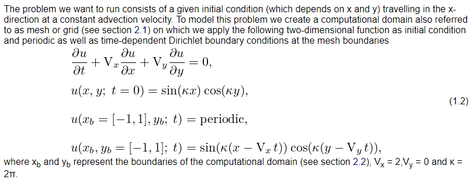

.. _nektar:

Nektar++
==========

简介
----

Nektar++ is a spectral/hp element framework designed to support the
construction of efficient high-performance scalable solvers for a wide
range of partial differential equations.

Nektar++使用说明
-----------------------------

1. 求解二维方形区域的对流方程(pi2.0上单核串行)
~~~~~~~~~~~~~~~~~~~~~~~~~~~~~~~~~~~~~~~~~~~~~~~~~~~~~~~~~~~~~~~~~~~~~~~~~~~~~~~~~~~~~~~~~~~~~~~~~~~~~~~~~~~~~~~
|image1|

其中，:math:`x_b  和  y_b  代表计算域边界，V_x=2，V_y=3，\kappa=2\pi`。

1. 从 `Nektar 官网 <https://www.nektar.info/>`__ 的GETTING STARTED->Tutorials->Basics->Advection-Diffusion->Introduction->Goals板块下载所需要的数据文件basics-advection-diffusion.tar.gz并解压；
 
2. 解压之后会得到两个目录completed以及tutorial；

3. 进入completed目录会看到如下几个文件：

.. code:: bash

   ADR_conditions.xml  

   ADR_mesh.geo  

   ADR_mesh.msh 

   ADR_mesh.xml 

   ADR_mesh_aligned.fld

   ADR_mesh_aligned.xml  

*这几个文件定义了求解本问题所需要的几何信息、网格信息以及初始和边界条件。*

4. 在此目录下编写如下Nektar_run.slurm脚本：

.. code:: bash

   #!/bin/bash

   #SBATCH -J Nektar_test
   #SBATCH -p small
   #SBATCH -n 1
   #SBATCH --ntasks-per-node=1
   #SBATCH -o %j.out
   #SBATCH -e %j.err

   module load nektar/5.0.0-intel-19.0.4-impi

   ulimit -s unlimited
   ulimit -l unlimited

   ADRSolver ADR_mesh_aligned.xml ADR_conditions.xml

5. 使用如下指令提交：

.. code:: bash

   sbatch Nektar_run.slurm

6. 然后即可在.out文件中看到如下结果：

.. code:: bash

  ========================================= 
                EquationType: UnsteadyAdvection 
                Session Name: ADR_mesh_aligned 
                Spatial Dim.: 2 
          Max SEM Exp. Order: 5 
              Expansion Dim.: 2 
              Riemann Solver: Upwind 
              Advection Type: 
             Projection Type: Discontinuous Galerkin 
                   Advection: explicit 
                   Diffusion: explicit 
                   Time Step: 0.001 
                No. of Steps: 1000 
         Checkpoints (steps): 100 
            Integration Type: ClassicalRungeKutta4 
  ========================================== 
  Initial Conditions: 
  - Field u: sin(k*x)*cos(k*y) 
  Writing: "ADR_mesh_aligned_0.chk" 
  Steps: 100      Time: 0.1          CPU Time: 0.435392s 
  Writing: "ADR_mesh_aligned_1.chk" 
  Steps: 200      Time: 0.2          CPU Time: 0.430588s 
  Writing: "ADR_mesh_aligned_2.chk" 
  Steps: 300      Time: 0.3          CPU Time: 0.428503s 
  Writing: "ADR_mesh_aligned_3.chk" 
  Steps: 400      Time: 0.4          CPU Time: 0.428529s 
  Writing: "ADR_mesh_aligned_4.chk" 
  Steps: 500      Time: 0.5          CPU Time: 0.430142s 
  Writing: "ADR_mesh_aligned_5.chk" 
  Steps: 600      Time: 0.6          CPU Time: 0.429481s 
  Writing: "ADR_mesh_aligned_6.chk" 
  Steps: 700      Time: 0.7          CPU Time: 0.433232s 
  Writing: "ADR_mesh_aligned_7.chk" 
  Steps: 800      Time: 0.8          CPU Time: 0.431088s 
  Writing: "ADR_mesh_aligned_8.chk" 
  Steps: 900      Time: 0.9          CPU Time: 0.427919s 
  Writing: "ADR_mesh_aligned_9.chk" 
  Steps: 1000     Time: 1            CPU Time: 0.436098s 
  Writing: "ADR_mesh_aligned_10.chk" 
  Time-integration  : 4.31097s 
  Writing: "ADR_mesh_aligned.fld" 
  ------------------------------------------- 
  Total Computation Time = 4s 
  ------------------------------------------- 
  L 2 error (variable u) : 0.00863475 
  L inf error (variable u) : 0.0390366

2. 可压缩圆柱绕流(pi2.0上多核并行)
~~~~~~~~~~~~~~~~~~~~~~~~~~~~~~~~~~~~~
1. 从 `Nektar 官网 <https://www.nektar.info/>`__ 的GETTING STARTED->Tutorials->Compressible Flow Solver->Subsonic Cylinder->Introduction->Goals板块下载所需要的数据文件cfs-CylinderSubsonic_NS.tar.gz并解压；
 
2. 解压之后会得到两个目录completed以及tutorial；

3. 在tutorial目录下编写以下Nektar_run.slurm脚本：

.. code:: bash

   #!/bin/bash

   #SBATCH -J Nektar_test
   #SBATCH -p cpu
   #SBATCH -N 1
   #SBATCH --ntasks-per-node=40
   #SBATCH --exclusive
   #SBATCH -o %j.out
   #SBATCH -e %j.err

   module load nektar/5.0.0-intel-19.0.4-impi
   module load openmpi/3.1.5-gcc-9.2.0 

   ulimit -s unlimited
   ulimit -l unlimited

   mpirun -np 32 CompressibleFlowSolver CylinderSubsonic_NS.xml

4. 使用如下指令提交：

.. code:: bash

   sbatch Nektar_run.slurm

5. 作业运行完毕后即可在.out文件中看到如下结果(部分)：

.. code:: bash

  =======================================================================
	        EquationType: NavierStokesCFE
	        Session Name: CylinderSubsonic_NS
	        Spatial Dim.: 2
	  Max SEM Exp. Order: 3
	      Expansion Dim.: 2
	      Riemann Solver: HLLC
	      Advection Type: 
	     Projection Type: Discontinuous Galerkin
	      Diffusion Type: 
	           Advection: explicit
	       AdvectionType: WeakDG
	           Diffusion: explicit
	           Time Step: 1e-05
	        No. of Steps: 60000
	 Checkpoints (steps): 400
	    Integration Type: RungeKutta
  =======================================================================
  =======================================================================
	        EquationType: NavierStokesCFE
	        Session Name: CylinderSubsonic_NS
	        Spatial Dim.: 2
	  Max SEM Exp. Order: 3
	      Expansion Dim.: 2
	      Riemann Solver: HLLC
	      Advection Type: 
	     Projection Type: Discontinuous Galerkin
	      Diffusion Type: 
  =======================================================================

3. 在思源一号上通过镜像来使用Nektar++
~~~~~~~~~~~~~~~~~~~~~~~~~~~~~~~~~~~~~

1. 参考上文内容(求解对流方程)从 `Nektar 官网 <https://www.nektar.info/>`__ 下载所需要的数据文件并解压，然后进入对应目录，在该目录下编写以下Nektar_run.slurm脚本：

.. code:: bash

  #!/bin/bash

  #SBATCH --job-name=nektar
  #SBATCH --partition=64c512g
  #SBATCH -N 1
  #SBATCH --ntasks-per-node=2
  #SBATCH --exclusive
  #SBATCH --output=%j.out
  #SBATCH --error=%j.err

  module load openmpi/4.1.1-gcc-8.5.0

  IMAGE_PATH=/dssg/share/imgs/nektar++/nek.sif
  mpirun -np 2 singularity exec $IMAGE_PATH ADRSolver ADR_mesh_aligned.xml ADR_conditions.xml

2. 使用如下指令提交：

.. code:: bash

   sbatch Nektar_run.slurm

3. 作业运行完毕之后即可在.out文件当中看到如下结果：

.. code:: bash

   gs_setup: 30 unique labels shared
   pairwise times (avg, min, max): 2.58603e-06 2.51303e-06 2.65902e-06
   crystal router                : 2.64363e-06 2.61022e-06 2.67704e-06
   all reduce                    : 2.46682e-06 2.36742e-06 2.56621e-06
   used all_to_all method: allreduce
   handle bytes (avg, min, max): 1588 1588 1588
   buffer bytes (avg, min, max): 480 480 480
   =======================================================================
	        EquationType: UnsteadyAdvection
	        Session Name: ADR_mesh_aligned
	        Spatial Dim.: 2
	  Max SEM Exp. Order: 5
	      Num. Processes: 2
	      Expansion Dim.: 2
	      Riemann Solver: Upwind
	      Advection Type: Weak DG
	     Projection Type: Discontinuous Galerkin
	 Advect. advancement: explicit
	 Advect. advancement: explicit
	           Time Step: 0.001
	        No. of Steps: 1000
	 Checkpoints (steps): 100
	    Integration Type: RungeKutta
  =======================================================================
  Initial Conditions:
  - Field u: sin(k*x)*cos(k*y)
  Writing: "ADR_mesh_aligned_0.chk" (0.000970838s, XML)
  Steps: 100      Time: 0.1          CPU Time: 0.0535671s
  Writing: "ADR_mesh_aligned_1.chk" (0.000835073s, XML)
  Steps: 200      Time: 0.2          CPU Time: 0.0540179s
  Writing: "ADR_mesh_aligned_2.chk" (0.000772003s, XML)
  Steps: 300      Time: 0.3          CPU Time: 0.0542538s
  Writing: "ADR_mesh_aligned_3.chk" (0.000588066s, XML)
  Steps: 400      Time: 0.4          CPU Time: 0.0534871s
  Writing: "ADR_mesh_aligned_4.chk" (0.000543744s, XML)
  Steps: 500      Time: 0.5          CPU Time: 0.0529716s
  Writing: "ADR_mesh_aligned_5.chk" (0.000545313s, XML)
  Steps: 600      Time: 0.6          CPU Time: 0.0532116s
  Writing: "ADR_mesh_aligned_6.chk" (0.000557265s, XML)
  Steps: 700      Time: 0.7          CPU Time: 0.0532916s
  Writing: "ADR_mesh_aligned_7.chk" (0.000709478s, XML)
  Steps: 800      Time: 0.8          CPU Time: 0.0533924s
  Writing: "ADR_mesh_aligned_8.chk" (0.000791041s, XML)
  Steps: 900      Time: 0.9          CPU Time: 0.0534512s
  Writing: "ADR_mesh_aligned_9.chk" (0.000566883s, XML)
  Steps: 1000     Time: 1            CPU Time: 0.0532088s
  Writing: "ADR_mesh_aligned_10.chk" (0.000583935s, XML)
  Time-integration  : 0.534853s
  renaming "ADR_mesh_aligned.fld" -> "ADR_mesh_aligned.bak0.fld"
  Writing: "ADR_mesh_aligned.fld" (0.0112913s, XML)
  -------------------------------------------
  Total Computation Time = 1s
  -------------------------------------------
  L 2 error (variable u) : 0.00863475
  L inf error (variable u) : 0.0390366

在自己的目录下自行安装Nektar++
------------------------------------------

1. 执行以下从命令从GitHub上下载Nektar++源码：

.. code:: bash

   git clone http://gitlab.nektar.info/nektar/nektar.git nektar++

2. 下载完成后进入nektar++目录并通过源码编译安装(编译之前需要配置很多可选的编译选项，用户根据自己的具体情况自行选择即可)：

.. code:: bash

  cd nektar++
  mkdir build && cd build
  ccmake ../
  make
  make install

参考资料
--------

-  `Nektar 官网 <https://www.nektar.info/>`__

