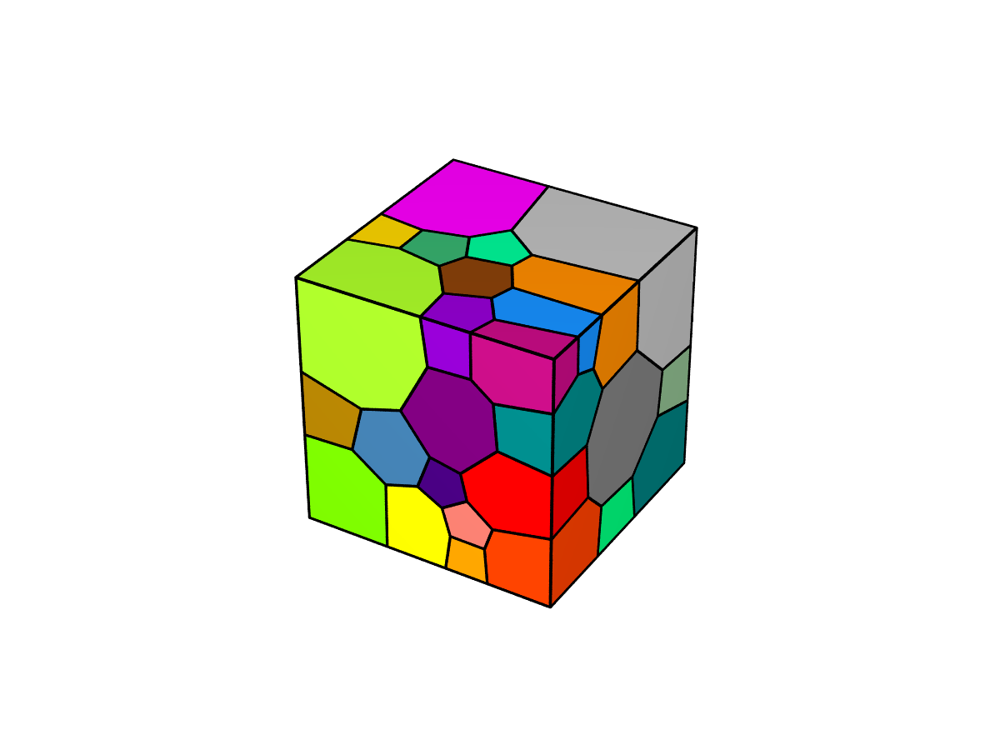
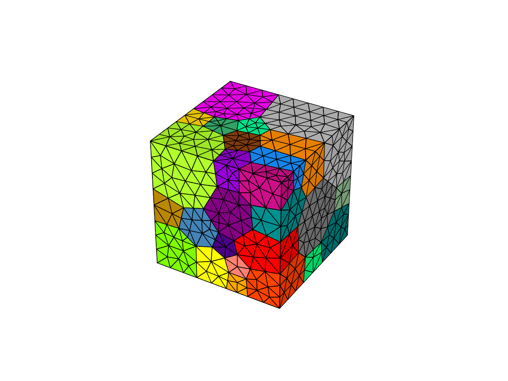

.. _Neper-FEPX:

Neper-FEPX
==========

简介
----

Neper是一款用于多晶体生成和网格划分的免费/开源软件包。
它可用于生成具有各种形态特性的多晶体，从非常简单的形态到涉及晶粒细分的复杂、多相或多尺度微结构。
生成的网格可以划分成适合有限元模拟的高质量网格。

FEPX是一款用于多晶塑性的有限元软件包，与Neper配合使用。
它可以通过一个可扩展的并行框架，对具有复杂微观结构的大型多晶聚集体的整体和局部力学行为进行建模。

可用版本
--------

+--------+---------+----------+---------------------------------------------+
| 版本   | 平台    | 构建方式 | 模块名                                      |
+========+=========+==========+=============================================+
| 4.6.1  | |cpu|   | 源码     | Neper/4.6.1-gcc-11.2.0 思源一号             |
+--------+---------+----------+---------------------------------------------+
| 1.3.0  | |cpu|   | 源码     | FEPX/1.3.0-gcc-11.2.0 思源一号              |
+--------+---------+----------+---------------------------------------------+

集群上的Neper和FEPX
-----------------------

- `思源一号上的Neper和FEPX`_

.. _思源一号上的Neper和FEPX:

思源一号上的Neper和FEPX
-----------------------
   
自定义编译Neper和FEPX
~~~~~~~~~~~~~~~~~~~~~

自安装依赖库
>>>>>>>>>>>>

.. code:: bash

   module load gcc
   spack install nlopt
   spack install povray
   spack install gsl
   spack install gmsh

思源一号上已部署所依赖的库及版本
>>>>>>>>>>>>>>>>>>>>>>>>>>>>>>>>>

.. code:: bash

   nlopt/2.7.0-gcc-11.2.0-openblas
   gmsh/4.8.4-gcc-11.2.0-hdf5-openblas
   gsl/2.7.1-gcc-11.2.0
   imagemagick/7.0.8-7-gcc-11.2.0
   povray/3.7.0.8-gcc-11.2.0
   openmpi/4.1.5-gcc-11.2.0
   gcc/11.2.0

编译Neper和FEPX前导入所需的环境变量

.. code:: bash

   module load nlopt/2.7.0-gcc-11.2.0-openblas
   module load gmsh/4.8.4-gcc-11.2.0-hdf5-openblas
   module load gsl/2.7.1-gcc-11.2.0
   module load imagemagick/7.0.8-7-gcc-11.2.0
   module load povray/3.7.0.8-gcc-11.2.0
   module load openmpi/4.1.5-gcc-11.2.0
   module load gcc/11.2.0

自定义编译Neper
>>>>>>>>>>>>>>>

.. code:: bash

   git clone https://github.com/rquey/neper.git
   cd ~/neper/src
   mkdir build
   cd build
   cmake -DCMAKE_INSTALL_PREFIX=~/neper/build ..
   cmake -DCMAKE_INSTALL_PREFIX_COMPLETION=~/completions .. 
   make
   make install
   
可根据所需选择安装的目录，思源一号上的预编译版本安装目录如下：

.. code:: bash

   cmake -DCMAKE_INSTALL_PREFIX=/dssg/opt/icelake/linux-centos8-icelake/gcc-11.2.0/neper-v4.6.1/build ..
   cmake -DCMAKE_INSTALL_PREFIX_COMPLETION=/dssg/opt/icelake/linux-centos8-icelake/gcc-11.2.0/neper-v4.6.1/completions ..
   
自定义编译FEPX
>>>>>>>>>>>>>>>

.. code:: bash

   unzip FEPX-1.3.0.zip
   cd fepx-1.3.0/src
   mkdir build
   cd build
   cmake -DCMAKE_INSTALL_PREFIX=~/fepx-v1.3.0 ..
   make
   make install

可根据所需选择安装的目录，思源一号上的预编译版本安装目录如下：

.. code:: bash

   cmake -DCMAKE_INSTALL_PREFIX=/dssg/opt/icelake/linux-centos8-icelake/gcc-11.2.0/fepx-v1.3.0 ..

思源一号上使用预编译的Neper和FEPX
~~~~~~~~~~~~~~~~~~~~~~~~~~~~~~~~~~

.. code:: bash

   module load nlopt/2.7.0-gcc-11.2.0-openblas
   module load gmsh/4.8.4-gcc-11.2.0-hdf5-openblas
   module load gsl/2.7.1-gcc-11.2.0
   module load imagemagick/7.0.8-7-gcc-11.2.0
   module load povray/3.7.0.8-gcc-11.2.0
   module load openmpi/4.1.5-gcc-11.2.0
   module load gcc/11.2.0
   export PATH=/dssg/opt/icelake/linux-centos8-icelake/gcc-11.2.0/neper-v4.6.1/build/bin:$PATH
   export PATH=/dssg/opt/icelake/linux-centos8-icelake/gcc-11.2.0/fepx-v1.3.0/bin:$PATH

可将上述命令写入mysource.sh文件，每次仅需source mysource.sh即可调用

Step1-Create microstructure
>>>>>>>>>>>>>>>>>>>>>>>>>>>>

.. code:: bash
   
   neper -T -n 50 -reg 1 -morpho gg -o simulation
   neper -V simulation.tess -datacellcol id -print Image_Polycrystal

运行完成后生成simulation.tess和Image_Polycrystal.png，如图1所示。
|image1|

Step2-Create mesh
>>>>>>>>>>>>>>>>>>>>>>>>>>>>

.. code:: bash
   
   neper -M simulation.tess -order 2 -part 4
   neper -V simulation.tess,simulation.msh -dataelsetcol id -print Image_Mesh

运行完成后生成simulation.msh和Image_Mesh.png，如图2所示。
|image2|

Step-3 Apply material properties, BC and simulate;将 “simulation.config” 文件复制到当前文件夹
>>>>>>>>>>>>>>>>>>>>>>>>>>>>>>>>>>>>>>>>>>>>>>>>>>>>>>>>>>>>>>>>>>>>>>>>>>>>>>>>>>>>>>>>>>>>>

.. code:: bash

   cp /dssg/opt/icelake/linux-centos8-icelake/gcc-11.2.0/fepx-v1.3.0/data/simulation.config ~
   fepx

Step-4 Postprocess raw results
>>>>>>>>>>>>>>>>>>>>>>>>>>>>>>>

.. code:: bash

   neper -S .

运行后当前文件夹生成.sim文件

step-5 Visualize the results
>>>>>>>>>>>>>>>>>>>>>>>>>>>>>>>

.. code:: bash

   neper -V ../fepx_example.sim \
   -simstep 2 \
   -datanodecoo coo \
   -dataelt1drad 0.004 \
   -dataelt3dedgerad 0.0015 \
   -datanodecoofact 10 \
   -dataelt3dcol stress33 \
   -dataeltscaletitle "Stress 33 (MPa)" \
   -dataeltscale 0:850 \
   -showelt1d all \
   -cameraangle 13.5 \
   -imagesize 800:800 \
   -print 1_s33_deform

运行后生成文件1_s33_deform.png和1_s33_deform-scale3d.png，如图3所示
|image3|

参考资料
--------

-  `Neper 官网 <https://neper.info>`__
-  `FEPX 官网 <https://fepx.info>`__

.. |image3| image:: ../../img/Neper-FEPX3.png
