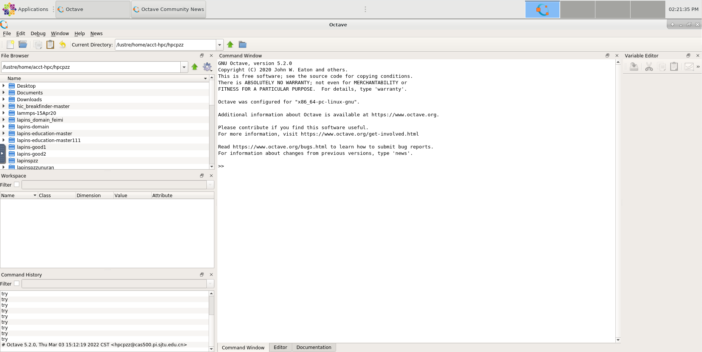
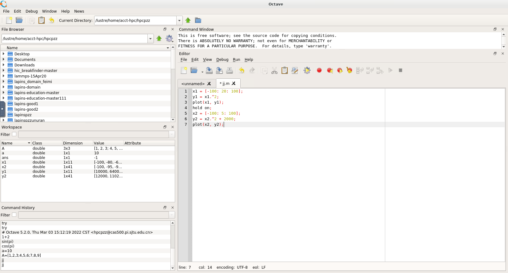
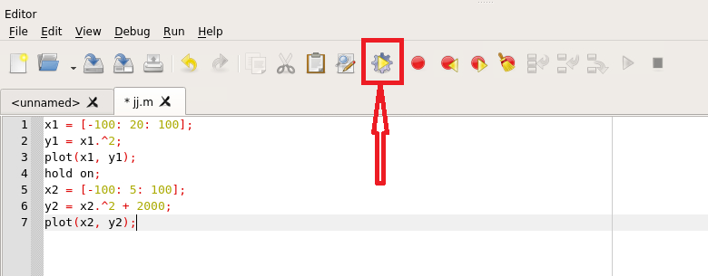
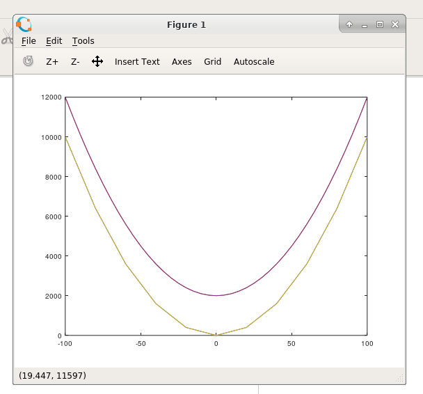

.. _octave:

Octave
======

GNU
Octave是一种采用高级编程语言的主要用于数值分析的软件。Octave有助于以数值方式解决线性和非线性问题，并使用与MATLAB兼容的语言进行其他数值实验。它也可以作为面向批处理的语言使用。因为它是GNU计划的一部分，所以它是GNU通用公共许可证条款下的自由软件。

使用singularity容器提交Octave作业
---------------------------------

以下是基于Singularity的作业脚本\ ``octave_singularity.slurm``\ 示例：

.. code:: bash

   #!/bin/bash
   #SBATCH -J octave_test
   #SBATCH -p cpu
   #SBATCH -o %j.out
   #SBATCH -e %j.err
   #SBATCH -n 1
   #SBATCH --ntasks-per-node=1

   IMAGE_PATH=/lustre/share/img/octave.simg

   ulimit -s unlimited
   ulimit -l unlimited

   singularity run $IMAGE_PATH octave [FILE_NAME]

并使用如下指令提交：

.. code:: bash

   sbatch octave_singularity.slurm

使用singularity容器提交Octave交互式作业
---------------------------------------

可以通过如下指令提交Octave交互式作业：

.. code:: bash

   srun -p cpu -N 1 --exclusive --pty singularity run /lustre/share/img/octave.simg octave-cli

使用HPC Studio启动Octave可视化界面
----------------------------------
1. 用pi集群帐号登录  `HPC Studio <https://studio.hpc.sjtu.edu.cn/>`__ 平台;
2. 在Interactive Apps面板中点击如下图所示Octave选项申请Octave GUI 界面(要排一会儿队，请耐心等待)：
 
|image1|

3. 申请成功后会看到如下界面：

|image2|

4. Octave的语法和Matlab几乎完全相同，我们可以在右侧Command Window窗口中进行简单的数学运算，如下图所示：

|image3|

5. 如果要编写脚本进行比较复杂的计算的话(绘图或者是其他)，可以点击左上角File->New->New Script选项，然后在弹出的Editor窗口进行脚本编写，如下图所示：

|image4|

6. 编写完成之后，点击如下图所示按钮保存为.m文件并运行：

|image5|

7. 结果如图所示：

|image6|

参考资料
--------

-  `Octave <https://www.gnu.org/software/octave/>`__
-  `Singularity文档 <https://sylabs.io/guides/3.5/user-guide/>`__

.. |image1| image:: ../../img/Octave1.png

.. |image3| image:: ../../img/Octave3.png

