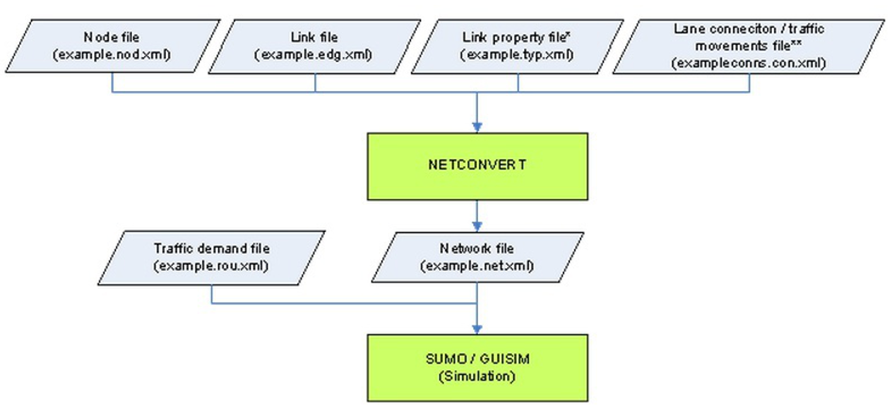
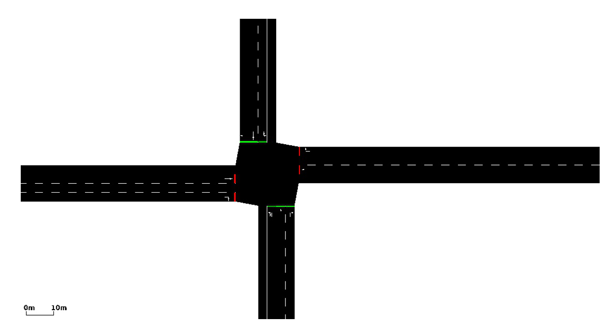

.. _sumo:

SUMO
=====================

简介
---------------

SUMO，全称Simulation of Urban Mobility，是开源、微观、多模态的交通仿真软件，发展始于2000年。
它纯粹是微观的，可以针对每辆车进行单独控制，因此非常适合交通控制模型的开发。

SUMO(GUI)使用方法  
---------------------------

1. 用pi集群帐号登录  `HPC Studio <https://studio.hpc.sjtu.edu.cn/>`__ 平台;
2. 在网站通过Interactive Apps->Desktop->Launch进入桌面(注意使用GPU桌面);
3. 打开终端，通过以下命令来调用软件：

.. code:: bash

      module load sumo/1.10.0-sumo
      sumo-gui 

4. 从以下仿真流程图可知，每一次模拟都需要rou.xml 和net.xml两个参数配置文件。其中rou.xml用来表述交通需求，net.xml用来表述道路信息。而道路信息又由下面四个文件通过netconvert命令生成:

.. code:: bash

      nod.xml： 用来描述节点信息
      edg.xml： 用来描述边的信息
      typ.xml： 用来描述预定义的边的类型（类似于做一个封装）
      con.xml： 用来描述边到边的合并形式

|image1|

具体案例
------------------------------------

1. 编写exa.nod.xml文件:
     
.. code:: bash   

    
      <nodes> <!-- The opening tag -->
   <node id="0" x="0.0" y="0.0" type="traffic_light"/> <!-- def. of node "0" -->
   <node id="1" x="-500.0" y="0.0" type="priority"/> <!-- def. of node "1" -->
   <node id="2" x="+500.0" y="0.0" type="priority"/> <!-- def. of node "2" -->
   <node id="3" x="0.0" y="-500.0" type="priority"/> <!-- def. of node "3" -->
   <node id="4" x="0.0" y="+500.0" type="priority"/> <!-- def. of node "4" -->
   <node id="m1" x="-250.0" y="0.0" type="priority"/> <!-- def. of node "m1" -->
   <node id="m2" x="+250.0" y="0.0" type="priority"/> <!-- def. of node "m2" -->
   <node id="m3" x="0.0" y="-250.0" type="priority"/> <!-- def. of node "m3" -->
   <node id="m4" x="0.0" y="+250.0" type="priority"/> <!-- def. of node "m4" -->
      </nodes> <!-- The closing tag -->

2. 编写exa.edg.xml文件:

.. code:: bash      

      <edges>
   <edge id="1fi" from="1" to="m1" priority="2" numLanes="2" speed="11.11"/>
   <edge id="1si" from="m1" to="0" priority="3" numLanes="3" speed="13.89"/>
   <edge id="1o" from="0" to="1" priority="1" numLanes="1" speed="11.11"/>
   <edge id="2fi" from="2" to="m2" priority="2" numLanes="2" speed="11.11"/>
   <edge id="2si" from="m2" to="0" priority="3" numLanes="3" speed="13.89"/>
   <edge id="2o" from="0" to="2" priority="1" numLanes="1" speed="11.11"/>
   <edge id="3fi" from="3" to="m3" priority="2" numLanes="2" speed="11.11"/>
   <edge id="3si" from="m3" to="0" priority="3" numLanes="3" speed="13.89"/>
   <edge id="3o" from="0" to="3" priority="1" numLanes="1" speed="11.11"/>
   <edge id="4fi" from="4" to="m4" priority="2" numLanes="2" speed="11.11"/>
   <edge id="4si" from="m4" to="0" priority="3" numLanes="3" speed="13.89"/>
   <edge id="4o" from="0" to="4" priority="1" numLanes="1" speed="11.11"/>
      </edges>

3. 编写exa.typ.xml文件。这里就不详细描述了，因为就类似于建立一个type类供edge使用。

4. 编写exa.con.xml文件：

.. code:: bash 
     
      <connections>
   <connection from="1si" to="3o" fromLane="0" toLane="0"/>
   <connection from="1si" to="2o" fromLane="2" toLane="0"/>
   <connection from="2si" to="4o" fromLane="0" toLane="0"/>
   <connection from="2si" to="1o" fromLane="2" toLane="0"/>
      </connections>

5. 使用netconvert命令生成exa.net.xml：

.. code:: bash    

      
      netconvert --node-files=exa.nod.xml --edge-files=exa.edg.xml \  --connection-files=exa.con.xml --type-files=exa.typ.xml \  --output-file=exa.net.xml

*如果没有con.xml或者typ.xml则忽略对应的参数。使用sumo-gui查看net结果如下：*

|image2|

6. 编写exa.rou.xml文件:

.. code:: bash

     
      <routes>
    <vType accel="1.0" decel="5.0" id="ACar" length="2.0" maxSpeed="10.0" sigma="1.0" />
    <vType accel="0.8" decel="5.0" id="BCar" length="2.0" maxSpeed="15.0" sigma="1.0" />
    <route id="route_ns" edges="4fi 4si 3o"/>
    <route id="route_we" edges="1fi 1si 2o"/>
    <flow depart="1" id="flow_n_s" route="route_ns" type="ACar" begin="0" end="3600" probability="0.1" />
    <flow depart="1" id="flow_w_e" route="route_we" type="BCar" begin="0" end="3600" probability="0.3" />
      </routes>

7. 编写exa.sumocfg文件:

.. code:: bash

     
      <configuration>
    <input>
        <net-file value="exa.net.xml"/>
        <route-files value="exa.rou.xml"/>
    </input>
    <time>
        <begin value="0"/>
        <end value="10000"/>
    </time>
      </configuration>

8. 在命令行中执行以下命令：

.. code:: bash

      sumo-gui -c exa.sumocfg 

*或者直接打开sumo-gui选择open simulation，打开exa.sumocfg文件即可。
对于较为复杂的情况，建议直接使用netedit软件以图形界面的方式生成net.xml道路信息文件。*

参考资料
--------

-  `SUMO 知乎学习笔记 <https://zhuanlan.zhihu.com/p/78262100>`__
-  `SUMO 官网 <https://sumo.dlr.de/docs/index.html>`__
-  `SUMO参考视频教程 <https://www.bilibili.com/video/BV1H7411F76B?from=search&seid=7433094760012566668&spm_id_from=333.337.0.0>`__

