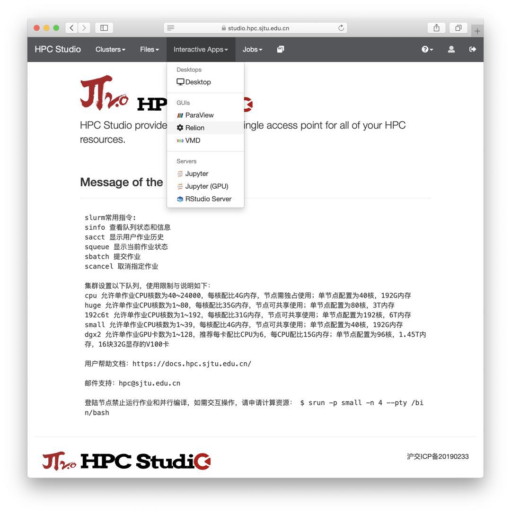
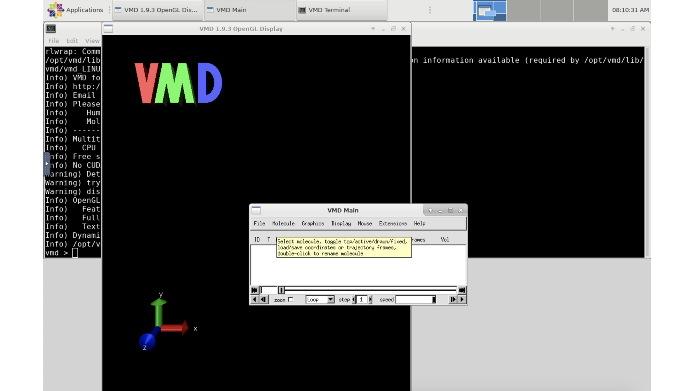

.. _vmd:

VMD
====

简介
----

Visual Molecular Dynamics is a molecular modelling and visualization
computer program. VMD is developed as mainly a tool to view and analyze
the results of molecular dynamics simulations. It also includes tools
for working with volumetric data, sequence data, and arbitrary graphics
objects.

π 集群上的 VMD
-------------------

集群中已预置了编译优化的容器镜像，通过调用该镜像即可运行 VMD，无需单独安装，目前版本为 ``vmd-1.9.3``\ 。该容器文件位于
``/lustre/share/img/vmd-1.9.3.simg``

使用 HPC Studio 启动可视化界面
------------------------------

参照\ `可视化平台 <../../../login/HpcStudio/>`__\ ，登录 HPC Studio，在顶栏选择 VMD：

|avater| |image1|

参考资料
--------

-  `VMD <https://www.ks.uiuc.edu/Research/vmd/>`__
-  `Singularity文档 <https://sylabs.io/guides/3.5/user-guide/>`__

