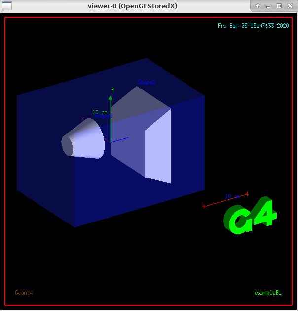

.. _geant4:

Geant4
======

安装spack包管理器
-----------------

克隆spack仓库代码

.. code:: bash

   $ cd
   $ git clone https://github.com/spack/spack.git

将spack初始化变量加入到\ ``.bashrc``\ 文件中

::

   # Spack package management
   if [ -d "$HOME/spack" ]; then
       export SPACK_ROOT=$HOME/spack
       PATH=$PATH:~/spack/bin
       source $SPACK_ROOT/share/spack/setup-env.sh
   fi

手动初始化spack，或重新登陆集群自动初始化spack

.. code:: bash

   $ source ~/.bashrc

将module内置gcc 9.2.0注册到spack中

.. code:: bash

   $ module purge 
   $ module load gcc/9.2.0-gcc-4.8.5
   $ spack compiler find
   $ spack compilers
   ==> Available compilers
   -- gcc centos7-x86_64 -------------------------------------------
   gcc@9.2.0 gcc@4.8.5

安装Geant4
----------

由于spack在安装Geant4时会占用较多的系统资源，在登录节点安装会影响其他用户正常使用，故需要申请small队列节点安装

.. code:: bash

   $ srun -p small -n 8 --pty bash

使用spack安装Geant4

.. code:: bash

   $ spack install geant4@10.6.2 +opengl +x11 +python %gcc@9.2.0

!!! tip
根据您得计算需要，您可能需要使用以下指令以添加Geant4对VecGeom的支持。
``bash     $ spack install geant4@10.6.2 +opengl +x11 +python +vecgeom %gcc@9.2.0``
该选项的具体含义为\ ``replace Geant4 solids with VecGeom equivalents``

安装过程可能会花费较长的时间，请耐心等待。

安装完成后使用以下指令推出\ ``small``\ 节点

.. code:: bash

   $ exit

运行Geant4示例任务
------------------

由于Geant4包含可视化部分，需要使用HPC
Studio的支持，请参考\ `远程桌面 <../../studio/remote-desktop>`__\ 登录HPC
Studio后在远程桌面中打开终端。

加载Geant4并激活Geant4相关的环境变量

.. code:: bash

   module purge 
   module load gcc/9.2.0-gcc-4.8.5
   spack load geant4 %gcc@9.2.0
   source `spack location -i geant4 %gcc@9.2.0`/bin/geant4.sh
   source `spack location -i geant4 %gcc@9.2.0`/share/Geant4-10.6.2/geant4make/geant4make.sh

拷贝Geant4自带的算例\ ``B1``

.. code:: bash

   $ mkdir ~/tmp
   $ cp -r `spack location -i geant4 %gcc@9.2.0`/share/Geant4-10.6.2/examples/basic/B1 ~/tmp/
   $ cd ~/tmp/B1

编译算例

.. code:: bash

   $ mkdir build
   $ cd build
   $ cmake ..
   $ make -j 8

如果这一顺利，则\ ``build``\ 文件夹下会生成可执行文件\ ``exampleB1``\ 。

运行算例

.. code:: bash

   $ ./exampleB1

成功运行后会出现如下所示窗口

参考资料
--------

-  `Geant4 offical website <https://geant4.web.cern.ch/>`__
-  `Geant4
   installation <http://geant4-userdoc.web.cern.ch/geant4-userdoc/UsersGuides/InstallationGuide/html/installguide.html>`__
-  `spack <https://spack.io/>`__
