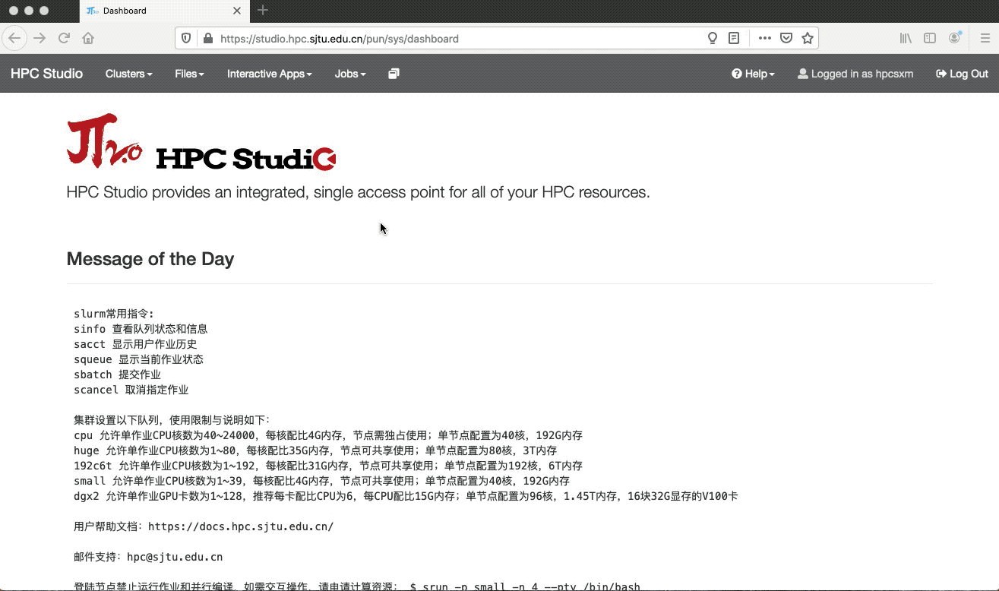

.. _gnuplot:

gnuplot
=======

简介
----

Gnuplot is a command-driven interactive function plotting program. It
can be used to plot functions and data points in both two- and
three-dimensional plots in many different formats. It was originally
created to allow scientists and students to visualize mathematical
functions and data interactively, but has grown to support many
non-interactive uses such as web scripting. It is also used as a
plotting engine by third-party applications like Octave.

π集群 上的 gnuplot
--------------------

gnuplot 需要在 HPC Studio 可视化平台上使用。π集群 登陆节点不支持 gnuplot
显示。

HPC Studio 可视化平台通过浏览器访问：https://studio.hpc.sjtu.edu.cn

浏览器需为 chrome, firefox 或 edge。

使用 gnuplot
------------

在 HPC Studio 上连接远程桌面
~~~~~~~~~~~~~~~~~~~~~~~~~~~~

1. 浏览器打开 https://studio.hpc.sjtu.edu.cn

2. 顶栏 Interactive Apps 下拉菜单，选择第一个 Desktop

3. Desktop 里第一个 “Desktop Instance Size” 选择最基本的
   1core-desktop（画图所需资源少，1 core 够用），然后点击 Launch

4. 等待几秒，甚或更长时间，取决于 small 队列可用资源量。Studio
   的远程桌面以一个正常的 small 队列作业启动

5. 启动后，右上角会显示 1 node 1 core Running. 然后点击 Launch Desktop

远程桌面启动 gnuplot
~~~~~~~~~~~~~~~~~~~~

在远程桌面空白处右键单击，Open Terminal Here 打开终端

.. code:: bash

   $ gnuplot
   gnuplot> p x    (以绘制 y = x 函数为例)

结束后退出远程桌面
~~~~~~~~~~~~~~~~~~

远程桌面作业，使用完毕后需退出，否则会持续计费。两种退出方法：

1. 在 Studio 界面上点 “Delete” 删除该作业

2. 或在 π集群 上用 squeue 查看作业，并用 scancel 终止该作业

参考资料
--------

-  `gnuplot 官网 <http://www.gnuplot.info/>`__
