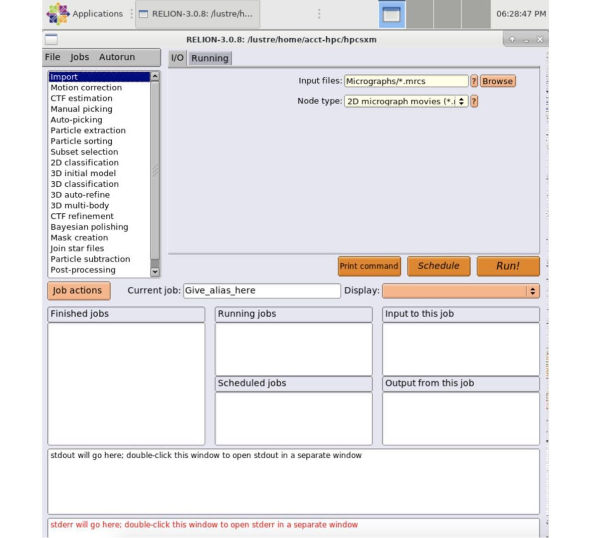

# <center>Relion</center> 

-----

## 简介

Relion 是由 MRC 的 Scheres 在 2012 年发布的针对单颗粒冷冻电镜图片进行处理的框架。

## 使用 Relion 容器镜像

集群中已预置了编译优化的容器镜像，通过调用该镜像即可运行 Relion，无需单独安装，目前版本为 `relion-3.0.8`。该容器文件位于 `/lustre/share/img/relion-3.0.8-cuda9.2-openmpi4.0.simg`

### 使用 singularity 容器提交 PyTorch 作业

示例：在 DGX-2 上使用 Relion 容器，作业使用单节点并分配 2 块 GPU：

```bash
#!/bin/bash
#SBATCH -J test
#SBATCH -p dgx2
#SBATCH -o %j.out
#SBATCH -e %j.err
#SBATCH -N 1
#SBATCH --ntasks-per-node=1
#SBATCH --cpus-per-task=12
#SBATCH --mem=MaxMemPerNode
#SBATCH --gres=gpu:2

IMAGE_PATH=/lustre/share/img/relion-3.0.8-cuda9.2-openmpi4.0.simg

singularity run --nv $IMAGE_PATH relion_refine_mpi --version
```

假设这个脚本文件名为 `relion_singularity.slurm`，使用以下指令提交作业

```bash
$ sbatch relion_singularity.slurm
```

### 使用 HPC Studio 启动可视化界面

参照[可视化平台](../../login/HpcStudio/)，登陆 HPC Studio，在顶栏选择 Relion：




## 参考链接

- [Relion 官网](http://www2.mrc-lmb.cam.ac.uk/relion)
- [Singularity 文档](https://sylabs.io/guides/3.5/user-guide/)
