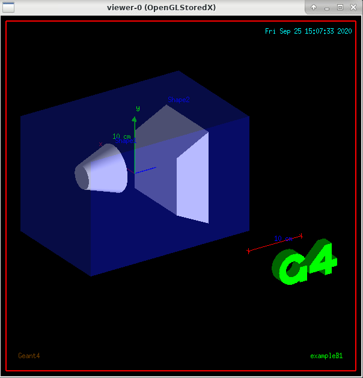

# <center>Geant4<center/>

-------
## 安装spack包管理器

克隆spack仓库代码
```bash
$ cd
$ git clone https://github.com/spack/spack.git
```

将spack初始化变量加入到`.bashrc`文件中
```
# Spack package management
if [ -d "$HOME/spack" ]; then
    export SPACK_ROOT=$HOME/spack
    PATH=$PATH:~/spack/bin
    source $SPACK_ROOT/share/spack/setup-env.sh
fi
```

手动初始化spack，或重新登陆集群自动初始化spack
```bash
$ source ~/.bashrc
```

将module内置gcc 9.2.0注册到spack中
```bash
$ module purge 
$ module load gcc/9.2.0-gcc-4.8.5
$ spack compiler find
$ spack compilers
==> Available compilers
-- gcc centos7-x86_64 -------------------------------------------
gcc@9.2.0 gcc@4.8.5
```

## 安装Geant4

由于spack在安装Geant4时会占用较多的系统资源，在登录节点安装会影响其他用户正常使用，故需要申请small队列节点安装
```bash
$ srun -p small -n 8 --pty bash
```

使用spack安装Geant4
```bash
$ spack install geant4@10.6.2 +opengl +x11 +python %gcc@9.2.0
```
!!! tip
    根据您得计算需要，您可能需要使用以下指令以添加Geant4对VecGeom的支持。
    ```bash
    $ spack install geant4@10.6.2 +opengl +x11 +python +vecgeom %gcc@9.2.0
    ```
    该选项的具体含义为`replace Geant4 solids with VecGeom equivalents`

安装过程可能会花费较长的时间，请耐心等待。

安装完成后使用以下指令推出`small`节点
```bash
$ exit
```

## 运行Geant4示例任务

由于Geant4包含可视化部分，需要使用HPC Studio的支持，请参考[远程桌面](../../studio/remote-desktop)登录HPC Studio后在远程桌面中打开终端。

加载Geant4并激活Geant4相关的环境变量
```bash
module purge 
module load gcc/9.2.0-gcc-4.8.5
spack load geant4 %gcc@9.2.0
source `spack location -i geant4 %gcc@9.2.0`/bin/geant4.sh
source `spack location -i geant4 %gcc@9.2.0`/share/Geant4-10.6.2/geant4make/geant4make.sh
```

拷贝Geant4自带的算例`B1`
```bash
$ mkdir ~/tmp
$ cp -r `spack location -i geant4 %gcc@9.2.0`/share/Geant4-10.6.2/examples/basic/B1 ~/tmp/
$ cd ~/tmp/B1
```

编译算例
```bash
$ mkdir build
$ cd build
$ cmake ..
$ make -j 8
```

如果这一顺利，则`build`文件夹下会生成可执行文件`exampleB1`。

运行算例
```bash
$ ./exampleB1
```

成功运行后会出现如下所示窗口




## 参考文献

- [Geant4 offical website](https://geant4.web.cern.ch/)
- [Geant4 installation](http://geant4-userdoc.web.cern.ch/geant4-userdoc/UsersGuides/InstallationGuide/html/installguide.html)
- [spack](https://spack.io/)
