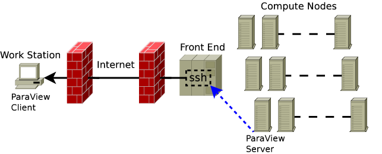
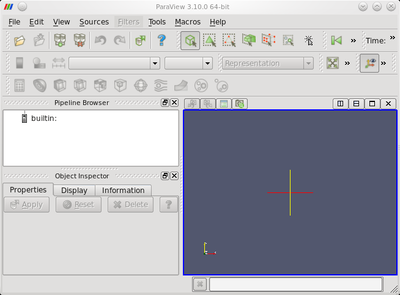
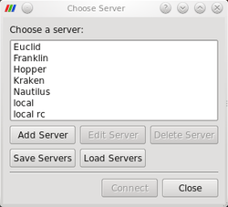
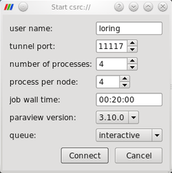
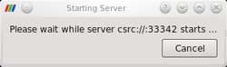
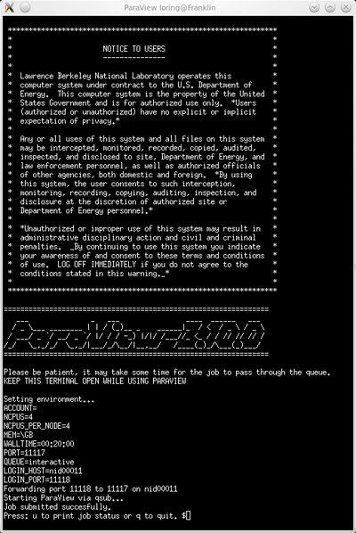

# ParaView

## Introduction

ParaView is an open-source, multi-platform data analysis and visualization application. ParaView users can quickly build visualizations to analyze their data using both qualitative and quantitative techniques. The data exploration can be done interactively in 3D or programmatically using ParaView's batch processing capabilities. ParaView was developed to analyze extremely large datasets using distributed memory computing resources and can be run on supercomputers to analyze terascale datasets, as well as on laptops for smaller data.

## Remote Visualization with ParaView

ParaView is a client-server application. The ParaView client (or simply paraview) will run on your desktop while the server will run at the remote supercomputing site. The following describes the steps you will take to install ParaView on your desktop and configure it so that you can launch parallel jobs on remote systems from within the ParaView GUI. Running ParaView remotely in a client-server configuration involves establishing an ssh tunnel to the login node, launching the ParaView server, and connecting the server to the client over the tunnel via a socket.



## Install the ParaView Client

The first step is to install ParaView. It is recommended that you use the binaries provided by Kitware on your workstation matching the NERSC installed version. This ensures client-server compatibility. The version number that you install must identically match the version installed at NERSC. Use the following link to download the correct ParaView client binary version for your desktop environment: [ParaView binaries](https://www.paraview.org/download/).

## Install Dependencies

In order to use ParaView remotely you will also need an ssh client and a terminal program. On Linux and Mac this functionality is provided by the ssh and xterm programs, both of which should come pre-installed on most Linux and Mac systems. On Windows the ssh and terminal functions are provided by the programs plink.exe and cmd.exe, of which only cmd.exe will come pre-installed. The ssh client, plink.exe, needs to be installed before using ParaView. This program can be installed using the Windows installer from the [PuTTY download site](https://www.chiark.greenend.org.uk/~sgtatham/putty/). The PuTTY install folder needs to be added to the system path after the install. This can be done in the Windows control panel, by opening "Control Panel\System and Security\System" , opening the "Advanced System Settings" page, and opening the "Environment Variables" dialog box.

## Install the NERSC server config

NERSC provides an integrated server configuration that enables "point and click" ssh tunnel configuration, job configuration and submission, enabling users to quickly launch the ParaView server on NERSC systems.

  1. Close any instances of ParaView running on your desktop.
  2. Download one of the following NERSC server configurations to your workstation. Choose a "win" configuration if you are running Windows. Choose a "unix" configuration if you are running MacOS or Linux.

	NERSC System | ParaView Configuration | Recommended Version
	--------------|------------------------|--------------------
	cori | [cori-unix.pvsc](https://www.nersc.gov/assets/ParaView-Server-Config/cori-unix.pvsc),  [cori-win.pvsc](https://www.nersc.gov/assets/ParaView-Server-Config/cori-win.pvsc) | 5.4.1
	edison | [edison-unix.pvsc](https://www.nersc.gov/assets/ParaView-Server-Config/edison-unix.pvsc), [edison-win.pvsc](https://www.nersc.gov/assets/ParaView-Server-Config/edison-win.pvsc) | 5.3.0

  3. Open the ParaView client and click the Connect button or from the File menu choose connect. In the choose a server dialog box click the load servers button and select the NERSC server config.

The NERSC server configurations will now show up in ParaView's connect menu. 

## Launching the server on NERSC systems

  1. Start ParaView on your desktop
  2. Open the **_File->Connect_** menu
  3. Select a server (Edison or Cori) and click **_Connect_**
  4. Configure the job with number of CPUs, walltime and so on. Click **_Connect_** to submit the job.
  5. In the xterm that opens enter your password. This creates the ssh tunnel to the remote system and submits the job.

After a brief wait the newly launched ParaView server will connect back to your desktop. One common issue for Mac users is that ParaView does not find the xterm program. When this occurs, the ParaView client reports `"The process failed to start. Either the invoked program is missing..."`. This is resolved by locating the full path to the xterm program in step 4 above.


1. Open ParaView and select **File->Connect** from the menu.

    

2. Select a NERSC system from the Choose server dialog.

    

3. Configure the run and ssh tunnel options in the server configuration dialog.

    

4. The Starting server dialog will be shown while the client waits for the server to start and connect back.

    

5. The server config script will start an xterm allowing you to login to the selected system. The tunnel is established between the workstation the remote system and the job is submitted. This window needs to stay open while you use ParaView.

    

## Running in Batch Mode

In batch mode the ParaView server runs on its own without a client executing a python script. Batch mode provides a way to automate common visualization tasks and alleviates the necessity of being present when the job executes. Log in to the desired system, and submit your job using the batch startup script. For example, on Edison the sequence of command would be:

```
$ ssh user@edison.nersc.gov
$ module load ParaView
$ start_pvbatch.sh 4 4 00:30:00 default debug `pwd`/pvbatch-test.py
```
 

For more information execute start_pvbatch.sh with no command line arguments and an explanation of the required command line argumnets will be printed.

### Example ParaView Batch Python Script

 The following ParaView batch script renders a sphere colored by MPI Rank. It can be used for basic testing.

```
	from paraview.simple import *

	 s = Sphere()
	 s.ThetaResolution = 128
	 s.PhiResolution = 128

	 p = ProcessIdScalars()

	 rep = Show(p)
	 Render()

	 lr = p.PointData.GetArray("ProcessId").GetRange()
	 lut = GetLookupTableForArray("ProcessId",
	     1,
	     RGBPoints=[lr[0], 0.0, 0.0, 1.0, lr[1], 1.0, 0.0, 0.0],
	     ColorSpace='Diverging',
	     VectorMode='Magnitude',
	     ScalarRangeInitialized=1.0)

	 rep.ColorArrayName = 'ProcessId'
	 rep.LookupTable = lut

	 Render()

	 WriteImage('pvbatch-test.png') 
```

### See Also

ParaView home page. [http://www.ParaView.org](http://www.paraview.org/)