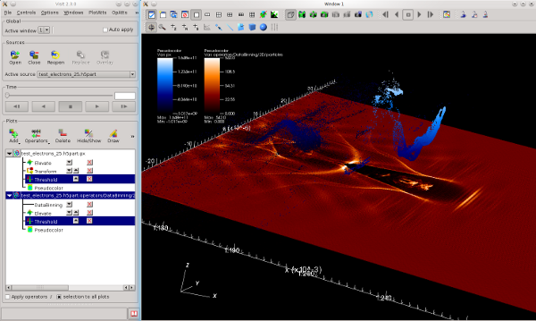
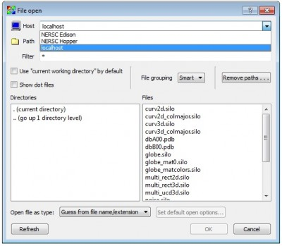
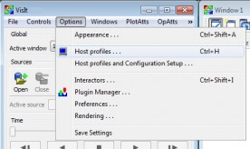
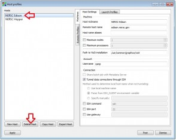
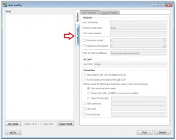
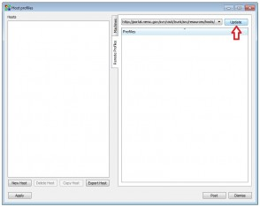
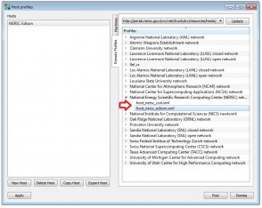
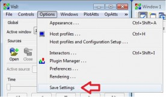

# VisIt

 

## Description and Overview

VisIt is a point-and-click 3D scientific visualization application
that supports common visualization techniques (e.g., iso-contouring
and volume rendering) on structured and unstructured grids. Due to its
distributed and parallel architecture, VisIt is able to handle very
large datasets interactively. In addition, VisIt is extensible,
allowing users to add data loaders or additional analysis tools. The
NERSC Data Analytics & Services Group has developed extensions to
VisIt to support NERSC user applications, and coordinates with the
VisIt development team to add these extensions to the main VisIt
development code branch.

### Overview

VisIt supports visualization and analysis of a **wide range of
computational meshes**, including two- and three-dimensional
rectilinear, curvilinear, and unstructured meshes as well as
structured AMR and CSG meshes (see the VisIt FAQ
for
[a list of supported formats](https://wci.llnl.gov/simulation/computer-codes/visit/faqs/faq11)). VisIt
provides extensive functionality for interactive and static
visualization and analysis of extremely large data and also has the
ability to **animate** data, allowing users to see the time evolution
of their data and create **movies**. An example screenshot of VisIt is
shown below.



VisIt provides via its **distributed and parallel architecture**
support for interactive visualization and analysis of extremely large
data sets. VisIt's rendering and data processing capabilities are
split into viewer and engine components. These components may be
executed in a distributed fashion across multiple machines. The
**Viewer** is responsible for rendering and is typically run on a
local desktop or visualization server to allow VisIt to leverage the
available graphics hardware. The **Engine** is typically run on a
remote machine (where the data is located) and is responsible for
performing most of the data processing and I/O. This eliminates the
need to move the data and makes high-end compute and I/O resources
available to the engine. The engine can be run serially on a single
processor or in parallel on many processors.

VisIt's visualization capabilities are grouped into two main
categories. **Plots** provide functionality for visualizing data and
include, e.g., contour, curve, mesh, pseudocolor, streamline, surface,
vector or volume plots. **Operators** define operations performed on
the data prior to visualization, such as data slicing, selection, or
transformation. VisIt also provides additional extensive data analysis
functionality via, e.g., expressions and queries.

VisIt achieves **extensibility** through the use of dynamically loaded
plugins. All of VisIt's plots, operators, and database readers are
implemented as plugins and are loaded at run-time from the plugin
directory. New plugins can be added easily by installing them in the
plugin directory. VisIt also provides a graphical plugin creation tool
that greatly simplifies the process of creating new plugins.

VisIt provides an **easy-to-use GUI** as well as **C++, Python and
Java interfaces**. The Python scripting interface gives users the
ability to batch process data using a powerful scripting
language. This feature can be used to create extremely sophisticated
animations or implement regression suites. It also allows simulation
systems that use Python as a back-plane to easily integrate
visualization capabilities into their systems. The C++ and Java
interfaces make it possible to provide alternate user interfaces for
VisIt or allow existing C++ or Java applications to add visualization
support.

## Getting Started

The best way to learn how to use VisIt is to go through
the
[tutorials available online](http://www.visitusers.org/index.php?title=Short_Tutorial). Looking
at examples of visualizations similar to what you want to do, or from
your science domain, can also be helpful (see Examples below). VisIt
supports a large variety of data formats (see the VisIt FAQ for
a
[list of supported formats](https://wci.llnl.gov/simulation/computer-codes/visit/faqs/faq11)). If
your data format is not supported by VisIt, then you may have to
convert your data files in order access them in VisIt or write your
own data reader (see the VisIt
documentation,
[Getting Data into VisIt](https://wci.llnl.gov/simulation/computer-codes/visit/manuals),
for more information).

## Using VisIt at NERSC

VisIt supports different modes for visualizing and analyzing
data. Remote visualization allows you to run VisIt's GUI on a local
desktop while using the compute power of one of the NERSC large
systems by executing VisIt's compute engine on, e.g., Cori. In the
batch data analysis and visualization mode, VisIt provides a command
line interface or you can execute a set of predefined analysis scripts
without displaying the GUI.

### Using VisIt on NERSC Systems

The VisIt installations on NERSC systems (e.g. Cori) are provided for
the purpose of running the parallel remote visualization backend and
for running scripts via VisIt's Python Command Line Interface
(CLI). If you need to run VisIt's GUI, please install a compatible
version of VisIt on your local workstation (recommended).

### Remote Visualization

To run VisIt in client-server mode, you must install a version of
VisIt on your local machine that is the same as the version of VisIt
that you want to run on the remote compute engine. For example, if you
installed version 2.12.x on your local machine, and VisIt 2.12.x has
been installed at NERSC, then you will be able to run a remote compute
engine here. For more details on how to obtain and install appropriate
versions of VisIt, see the Installing VisIt section below. When
running VisIt remotely, you only need to run `module load visit` on
the NERSC machine on which you are running the VisIt GUI and not on
the machine that is running the compute engine. This means, if you are
running the VisIt GUI on a local desktop (recommended for best
performance) and the compute engine on Cori, then no module load call
is required.

**To use a remote compute engine on Cori**, start VisIt on your
local machine, and select **Open file** from the File menu.




In the File Open GUI, choose the appropriate Host (e.g, NERSC
Cori). You'll be prompted to enter your password on Cori.
 
After you have entered your password, you will be able to browse
directories on Cori. You can type a path into the Path field
(obscured in the screen shot), or use the file browser GUI (shown to
the right) to navigate to a directory. Select your data file from the
list on the right side of the GUI. By default, VisIt tries to guess
which file reader it should use to open a file. In order to define a
specific database plugin that should be used for opening the file,
select, the appropriate plugin from the drop down list next to **Open
file as type**.

After you select a data file, the **OK** button will be active. Click
it to continue.

After you open a file on Cori, VisIt's profile select dialog will be
displayed. Here you need to select the profile corresponding to the
queue you want to use and specify the number of processors, e.g., 64,
to be used for your session. (For the regular profile you may also
want to change the time limit.)

### Batch Data Analysis using VisIt's CLI

To perform batch data analysis or visualization using VisIt's CLI, use
the modules facility to load VisIt and then launch the application by
typing visit using the additional **-cli -nowin** options as shown in
the example below:

```bash
nersc$ module load visit
```

To execute a predefined VisIt python script on start-up use the **-s**
option. On Cori it is necessary to ensure that a parallel compute
engine is launched. It is possible to accomplish this launch using the
following command line:

General Format:

```shell
cori$ visit -cli -nowin -l sbatch/srun -p "Queue to use for submitting job" -np "Number of processors" -t "Wall time limit for job" -s "script name"
```

```shell
cori$ visit -cli -nowin -l sbatch/srun -p debug -np 24 -t 00:02:00 -la "-C haswell" -s ComputeIsosurface.py
```

VisIt will automatically submit a job for launching its parallel
compute engine to the desired queue. For example, assume one wants to
run the following script, named "ComputeIsosurface.py:"

```python
# ComputeIsosurface.py:
import sys

# Open the file to visualize/analyze
OpenDatabase("/usr/common/software/visit/data/multi_rect3d.silo")

#  Set options for writing output images
swa = SaveWindowAttributes()
swa.outputToCurrentDirectory = 1      # Save images in current directory
swa.fileName = "multi_rect3d_contour" # Image filename
swa.family = 0                        # Do not append numbers to filename
swa.format = swa.PNG                  # Save as PNG
swa.width = 1024                      # Image width 
swa.height = 1024                     # Image heiggt
swa.resConstraint = swa.NoConstraint  # Do not force aspect ratio, use width and height
SetSaveWindowAttributes(swa)

# Create an isosurface plot
AddPlot("Contour", "v") # Second string is the name of dependent variable for isosurface

# Set options  for contouring
catts = ContourAttributes()
catts.contourMethod = catts.Value # Specify specific isovalues
catts.contourValue = (-0.5, 0.5)  # List of isovalues
catts.colorType = catts.ColorByMultipleColors # Color each isosurface in separate color
catts.SetMultiColor(0, (0, 0, 255, 255)) # Display first isosurface (-0.5) in blue
catts.SetMultiColor(1, (255, 0, 0, 255)) # Display second isosurface (0.5) in red
SetPlotOptions(catts)

# Set viewpoint
vatts = View3DAttributes()
vatts.viewNormal = (-0.696999, 0.396325, 0.597595)
vatts.focus = (0.5, 0.5, 0.5)
vatts.viewUp = (0.287917, 0.91793, -0.272963)
vatts.viewAngle = 30
vatts.parallelScale = 0.866025
vatts.nearPlane = -1.73205
vatts.farPlane = 1.73205
vatts.imagePan = (0, 0)
vatts.imageZoom = 1
vatts.perspective = 1
vatts.eyeAngle = 2
SetView3D(vatts)

# Draw plots and save resulting image
DrawPlots()
SaveWindow()

# Quit
sys.exit(0)
```

This script computes an isosurface for the data set
`multi_rect3d.silo` which is distributed with VisIt, and saves the
resulting image as `ulti_rect3d_contour.png`. To run this script on
Cori using 16 processors in the regular queue with a wall clock time
limit of two minutes, one would issue the command:

```
$ visit -cli -nowin -p regular -np 16 -t 00:02:00 -s ComputeIsosurface.py
```

To use a version of VisIt other than the default, include the version
number on the module load line, e.g., to use version 2.10.0:

```
nersc$ module load visit/2.12.0 
```

For a list of additional command line options use:

```
nersc$ module load visit                     #Load the VisIt module
nersc$ visit -help                           #List most common command line options
nersc$ visit -fullhelp                       #List all command line options
```

For more detailed information about using VisIt's CLI
see
[the VisIt user group's CLI documentation](http://visitusers.org/index.php?title=Using_CLI). The
documentation of VisIt's python interface is available in
the
[VisIt manuals](https://wci.llnl.gov/codes/visit/manuals.html). Some
[example python scripts for VisIt](http://visitusers.org/index.php?title=Python_examples) are
also available from the visitusers.org wiki.

## Installing VisIt

In general we recommend to install VisIt using the pre-compiled
binaries. In the case that none of the pre-built binaries should work
on your platform or you want to do VisIt development, you can also
build VisIt from source. In order to use the remote visualization
capabilities of VisIt you will need a version of VisIt that is
compatible with a version of VisIt available at NERSC (ideally the
default version). To check which versions are available at NERSC see
Availability below. In addition you will need a host profile for the
NERSC machine of your choice (see Installing NERSC Host Profiles
below).

### Installing VisIt using a Pre-built Binary

Pre-compiled binaries of VisIt for Unix, Windows, and Mac-OS X systems
with detailed install notes describing the installation process are
available online here. The Windows executables are packaged in a self
contained installer. The Unix and Mac OS X executables require
downloading an install script along with the file containing the
executable. Instructions for installing VisIt can be found in the
install notes. In order to run VisIt's GUI on a local desktop while
using a remote compute engine on, e.g. Cori, an appropriate host
profile needs to be setup. Host profiles can be download from the
VisIt application (see Installing NERSC Host Profiles). The example
below illustrates an example installation on a linux-based system.

```
#Download the VisIt binary and installation script from the VisIt webpage, change the permissions 
#of the visit-install script to make it executable and execute the script.
$ chmod 755 visit-install2_12_0           
$ ./visit-install2_12_0 -c "version" "platform" "directory" 
```

"version" indicates the version of VisIt, 2.12.0. The "platform"
parameter indicates for which type of machine VisIt should be
installed and should match the accompanying distribution file, e.g.,
linux-x86-64. The "directory" parameter defines the directory where
VisIt should be installed.

### Installing VisIt from Source

The VisIt sources are available from
the
[VisIt webpage](https://wci.llnl.gov/simulation/computer-codes/visit/source). VisIt
provides a convenient build_visit script which automates the complex
VisIt built process. The build_visit script automates downloading
required VisIt and 3rd party source code as well as configuring and
building VisIt and 3rd party libraries. For information about the
build_visit command line options use build_visit --help. Additional
information on how to install VisIt from source is also available on
the
[visitusers.org wiki](http://visitusers.org/index.php?title=Main_Page).

### Installing NERSC Host Profiles

VisIt has a remote site with NERSC systems host profiles. These
instructions demonstrate how to install the host profiles. (Note:
check Troubleshooting below for potential issues with profiles)

Open the Host profiles dialog under the Visit options menu, Click on
"Options->Host profiles...".



If you are updating a NERSC host profile, please remove the old host
profile from the list of profiles.

Select host name from the list of systems and then click the "Delete
Host" button.
	


Then click on the "Remote Profiles" tab.	



Click on the "Update" button, to list the Host profiles.	



Now open the "National Energy Scientific Research Computing Center
(NERSC)" section.

Drag the host profile from there to the Host list. This will install
the host profile to your system.



Dismiss the Host Profile dialog.

Use the save setting option to save your new host profile, by clicking
the menu option, "Options->Save Settings...".



VisIt's settings are stored in a folder _.visit_ usually located in
your home directory. If you have VisIt installed and would like to add
the appropriate host profiles for NERSC, you can simply copy the
according host profiles into your .visit/hosts folder.

## Building a Plugin for VisIt

The following commands show how to set up your environment to build
VisIt plugins on NERSC systems. This duplicates the environment which
was used to build VisIt on NERSC.

Setup Build Environment on Cori:

```
cori$ module use -a /usr/common/software/visit/installs/modulefiles
cori$ module swap PrgEnv-intel PrgEnv-gnu-VisIt
cori$ module unload darshan
cori$ module unload craype
cori$ module load visit
cori$ module load cmake/3.8.2
```

Sample build instruction for a plugin.

```bash
cd MyPlugin

# Generate the CMakeLists.txt file to build with VisIt.
xml2cmake -clobber MyPlugin.xml

# I like to build the code outside the code directory.
cd ..
mkdir build
cd build

# Build your plugin against the installed VisIt
cmake -DCMAKE_BUILD_TYPE:STRING=Release ../MyPlugin
make

# You should see that your plugin is built and is located in your home directory.
# If it is a database plugin you will see it here:
ls ~/.visit/2.13.3/linux-x86_64/plugins/databases/
```

For more information on how to build VisIt plugins please use this
link:
[Building plugins using CMake](http://www.visitusers.org/index.php?title=Building_plugins_using_CMake).
You can also find
a
[Tutorial on building an advanced database plugin](http://www.visitusers.org/index.php?title=VisIt-tutorial-Advanced-DBPlugin).

## Availability

For up-to-date information on which versions of VisIt are currently
available on the NERSC machine of your choice, login and execute:

```
$ module avail visit                    #List all available VisIt modules 
```

To use a version of VisIt other than the default, include the version
number on the module load line, e.g., to use version 2.10.0:

```
$ module load visit/2.10.0 
```

## Examples

Many images featured on the following NERSC and LBNL websites were
generated using VisIt:

  *  [Science at NERSC](https://www.nersc.gov/science/)
  *  [Vignettes page of the Visualization Group at LBNL](https://vis.lbl.gov/vignettes/)

## Further Information      

Further information about VisIt is available from the following
external websites:

  *  A
     [series of VisIt tutorials](http://www.visitusers.org/index.php?title=Short_Tutorial) are
     available online at the vistusers.org wiki.
  *  The
     [VisIt user manual](https://wci.llnl.gov/simulation/computer-codes/visit/manuals) and
     other helpful information on how to use VisIt is available from
     the VisIt website.
  *  The VisIt user community has created a wiki at
     http://visitusers.org/ which contains up-to-date information
     about VisIt including valuable user and developer documentation.

## Troubleshooting

  * The version of VisIt on your desktop must match the version available on
    Cori (which may not be the most recent version available for download).
    Check for the latest installed version on the cluster with "module avail
    visit", and select a version to download accordingly

  * Older versions of VisIt for the desktop include an out-of-date
    profile for Cori. The key difference is that previously Cori
    used the Torque/Moab batch scheduler and now it uses
    Slurm. Attempting to launch a VisIt remote compute engine on
    Cori via Torque/Moab will not work!

    You can update the profile by editing
    $HOME/.visit/hosts/host_nersc_cori.xml, search for fields named
    "launchMethod" (there will be one for each queue) and change the
    launchMethod from "qsub/aprun" to "sbatch/srun". VisIt must be
    restarted after making this change.

  * If a remote compute engine job appears to take a very long time to
    start, open a terminal on the NERSC cluster and type `sqs` to check
    that the job is in the queue.
 
  * If the job mysteriously crashes partway through, it may require
    more memory than the amount of nodes allocated. You can change the
    number of nodes with the "numProcessors" field in the profile at
    `$HOME/.visit/hosts/*.xml` (remember that one Cori node is 32
    processors).

  * If you need a longer walltime limit, you can also set this in the
    profile - update the "timeLimit" field

## Getting Help with VisIt

*  If you have questions about or problems running VisIt on a NERSC
   platform or advice about using VisIt to visualize or analyze your
   data, please open a [support ticket](https://help.nersc.gov).
*   VisIt bugs should be reported to <visit-users@ornl.gov>.
