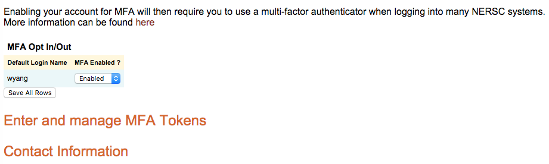
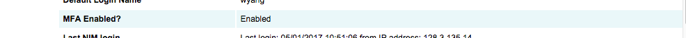
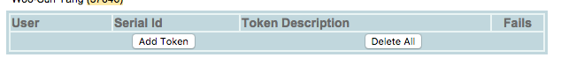
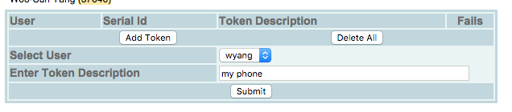
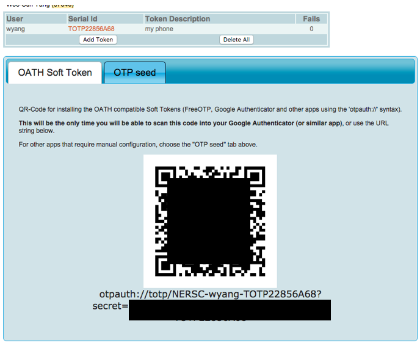
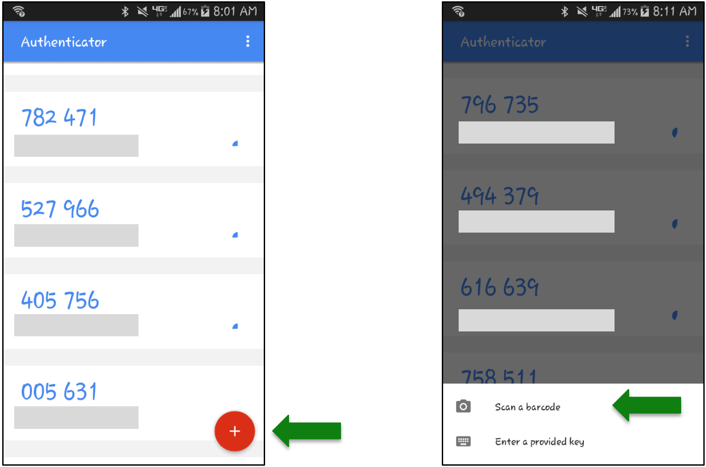
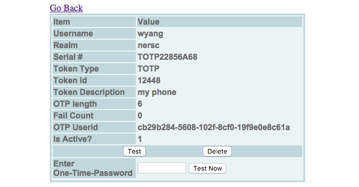
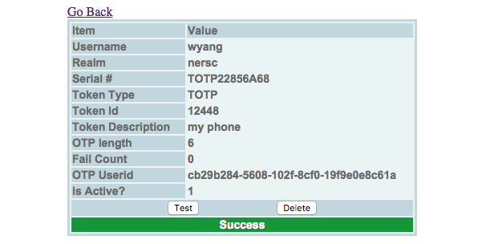
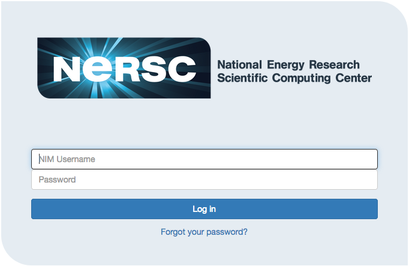

# Introduction to MFA

NERSC provides users with the ability to use __Multi-Factor
Authentication__ (__MFA__) for logging into NERSC resources.  MFA
provides greater protection than regular passwords against phishing
and other modern threats to your digital security.

Currently, we support MFA for ssh logins to NERSC.  In September
2018, we will be rolling out several new technologies to enhance
the MFA experience, and provide MFA support for most NERSC user
resources.

We have implemented MFA in ways that only minimally impact how you
work at NERSC. For example, we’ve created technologies that allow
you to authenticate with MFA only once per day as well as incorporate
MFA into automated workflows.

See below for more details on these new features.

### About the Implementation

The NERSC MFA implementation uses Google Authenticator, an application
for mobile phones and devices available for download from Google,
which you configure through [NIM](https://nim.nersc.gov/). The
authenticator presents a unique one-time password (OTP) that changes
every 30 seconds (thus, time-based one-time password or TOTP), and
each password can only be used for one login.  When you login to
an MFA-enabled system, you will enter your NIM password followed
by the OTP digits displayed on your Google Authenticator app.


## Registering and Using an MFA Token

The steps for registering your token are:

- Install Google Authenticator on your smart phone or tablet

- Enable MFA in your NIM account

- Initialize your One Time Password via NIM

- Initialize OTP on Google Authenticator

### Installing Google Authenticator

Install the __Google Authenticator__ app on your smartphone or
tablet. For an Android device, you can download from
[here](https://play.google.com/store/apps/details?id=com.google.android.apps.authenticator2&hl=en_US);
for an Apple device, download from
[here](https://itunes.apple.com/us/app/google-authenticator/id388497605?mt=8).
If you do not have a mobile device, there are some hardware tokens
that you can purchase which can be configured with our system.
Contact us at [https://help.nersc.gov](https://help.nersc.gov) to
request more information.

### Enabling MFA in NIM

First, you need to select 'MFA Opt In' in your NIM account. Login
to your NIM account using your login ID and NIM password at

 [https://nim.nersc.gov](https://nim.nersc.gov)

Note that, even after you have already opted in, you should use the
NIM password only (that is, with no Google Authenticator OTP) to
login to your NIM account.

Select '__MFA Opt In/Out__' under the __Actions__ pull-down menu:


Select 'Enabled' and click the 'Save All Rows' button.



Clicking the '__Contact Information__' link above, you will see
that the Contact Info page correctly indicates that MFA has been
enabled:



### Enrolling TOTP Token

In this step you will connect your mobile device to your NIM account.
To do that, go back to the previous page (MFA Opt In/Out). Click
the '__Enter and manage MFA Tokens__' button. It will display the
content of the '__MFA Tokens__' tab:



To add a new token, click on the '__Add Token__' button. Then, it
will show your NERSC account name in the '__Select User__' field.
You can add a descriptive text in the '__Enter Token Description__'.



In the above example ("my phone"), the user is trying to generate
a token that will be used with the Google Authenticator on a phone.
If you have more than one token from different devices, you can add
a proper description for each token for your reference.

Click the '__Submit__' button. Then, the webpage will display a
token and a QR code that is to be scanned into your device. Note
the token ID (TOTP22856A68 in the following example).



Start up Google Authenticator on your device and click the red '+'
button on the bottom right (in case of an Android phone), then 'Scan
a barcode'.

[comment]: <> ()


On Apple devices, look for the '+' sign at the top right of the
app:

[comment]: <> ()


If necessary, allow the app to access your camera, and point the
camera at the QR code.  It should register automatically and then
show the new token in your list. Your phone is now connected to
your NIM account for MFA logins.

When you add the token on your device, the token name, in the form
of NERSC-nersc_login_id-token_id (NERSC-wyang-TOTP22856A68 in the
above example), appears in the far left side under the token list
on your device.

To test if the new token is set correctly, click on the token in
NIM. This will show detailed information about the token along with
the '__Test__' and '__Delete__' buttons. Click on the 'Test' button,
and you will see the following:



Enter the one time password generated on Google Authenticator in
the '__Enter One-Time-Password__' field. Then, click on the '__Test
Now__' button. If everything is successfully set, NIM page will
show 'Success':



### Multiple Tokens

If you have more than one mobile device, you can create a token for
each one. For example, you can have one for each phone and also for
a tablet, as shown below:


When you login to NERSC resources, you can use any token for
authentication, and do not have to specify which one you will use
– the server will match your one-time password against all of the
tokens that you have created.

### Checking and Managing Tokens

You can view all the tokens you have created from the '__MFA Tokens__'
tab in NIM (see the picture above).

### Deleting a Token

If you don't need a token any more, you can delete it. Select the
token in NIM that you want to remove and press the '__Delete__'
button.

If you want to delete all tokens, then click the '__Delete All__'
button under the MFA Tokens tab.


## Login to NERSC Machines

When you login with ssh to a NERSC machine, you will be prompted
to enter 'Password + OTP':

```shell
$ ssh cori.nersc.gov
 *****************************************************************
 *                                                               *
 *                      NOTICE TO USERS                          *
 *                      ---------------                          *
...
Password + OTP:
```

Start Google Authenticator and read the 6-digit code corresponding
to the token generated for your device (for example,
'NERSC-wyang-TOTP22856A68' in the previous snapshot):


Enter your __NIM password immediately followed by the 6-number
Google Authenticator OTP number__, all in one line at the "Password
+ OTP: " prompt. For example, if your NIM password is “iL0ve\_Burrit0\$”
and your app shows "015 691", as displayed in the screenshot, you
must type “iL0ve\_Burrit0\$015691”. (Don't type the space shown in
the app).

After you log in, you can build your code, submit batch jobs, debug
your code, etc. as you would normally do on any login node.

You can transfer a file to or from a NERSC machine with scp, in the
same manner as you use ssh:

```shell
$ scp myfile cori.nersc.gov:~/
 *****************************************************************
 *                                                               *
 *                      NOTICE TO USERS                          *
 *                      ---------------                          *
...
Password + OTP:
```

Enter your NIM password followed by the Google code concatenated
as a single word.


## Host Based Authentication

NERSC HPC hosts are configured to use ssh "hostbased" authentication
for logins between hosts.  This means that, once you log in to a
NERSC machine from a remote host, you can ssh from that NERSC host
to other NERSC HPC hosts without having to authenticate again.

```shell
$ ssh cori.nersc.gov
 *****************************************************************
 *                                                               *
 *                      NOTICE TO USERS                          *
 *                      ---------------                          *
...
Password + OTP:
$ nersc_host         # You're on Cori
cori

$ ssh cori         # no authentication required
 *****************************************************************
 *                                                               *
 *                      NOTICE TO USERS                          *
 *                      ---------------                          *
...
$ nersc_host         # You're now on Cori
cori
```

## SSH Control Master

Unlike using [passphraseless ssh with
ssh-agent](https://www.nersc.gov/users/connecting-to-nersc/connecting-with-ssh/),
with MFA, users must enter password + OTP for each ssh connection.
NERSC will be providing tools to allow for single-sign-on type
logins in the near future (see the 'Coming in September, 2018'
section below).

In the meantime, you may be able to make use of a feature of SSH
called ControlMaster. ControlMaster allows you to authenticate to
a host once, and then open additional ssh sessions to the same host
without authenticating again. The additional sessions are multiplexed
over the original session. This feature is also called SSH Multiplexing.

Keep in mind that, since with ControlMaster the ssh sessions all
flow over one TCP connection, a large data transfer in one session
can have a noticeable impact on your other multiplexed sessions.
You may find that impact undesirable.

To use this feature, you need to set the ssh Control Master option
in the ssh configuration on your local desktop/laptop. In a Linux-like
platform, you can set the following in `~/.ssh/config`:

```shell
$ cat ~/.ssh/config
Host cori.nersc.gov cori.nersc.gov
ControlMaster auto
ControlPath ~/.ssh/%r@%h:%p
<...Other configurations you may have...>

...
```

The above example enables Control Master for two hosts, cori.nersc.gov
and edision.nersc.gov (you can customize the list), and defines
name for a Unix domain socket which gets created when the first
(master) session gets established to the remote host. In this
example, the socket will be written to the `~/.ssh` directory on
your local machine, with the name `%r@%h:%p`, where `%r` gets
replaced with your NERSC username, `%h` with the remote host name,
and `%p` with the port number.  The socket gets used by ssh to
establish secondary connections to the same remote host. Please
read the `ssh_config` man page for other configuration possibilities.

Here is how it looks when you connect to a NERSC host from one
terminal window on your desktop/laptop, using ControlMaster:

```shell
$ ssh cori.nersc.gov
 *****************************************************************
 *                                                               *
 *                      NOTICE TO USERS                          *
 *                      ---------------                          *
...
Password + OTP:
$
```

You can see that a socket file was indeed created on your local
machine:

```shell
$ ls -l ~/.ssh
...
srw-------  1 wyang  wyang      0 Jan 11 20:26 wyang@cori.nersc.gov:22=
...
```

Then, run a ssh command from another terminal window for another
ssh connection. This time, you will not be asked to authenticate.

```shell
$ ssh cori.nersc.gov                # no authentication required
...[MOTD messages]...
$
```

You can open yet another ssh or scp connection from another terminal
window:

```shell
$ scp myfile cori.nersc.gov:~/      # no authentication required
myfile                                        100%  229    57.1KB/s   00:00
$
```

Keep in mind that, to use a client ssh connection, you have to keep
the master connection open. If the initial connection is terminated,
all the other connections will be closed. This behavior can be
overridden when you set the ControlPersistent option in `~/.ssh/config`
on your local machine. You can specify a time value (e.g., 2h for
2 hours) to keep the master connection open in the background for
a limited amount of time, or use the value 'yes' or '0' to keep the
master connection in the background indefinitely.

For more information on the Control Master feature, please read the
`ssh_config` man page.

If your local desktop or laptop is a Windows machine and you use
PuTTY as a ssh client, mark the '__Share SSH connections if possible__'
checkbox in the SSH Connections options section (Connection
&rightarrow; SSH from the Category frame on the left).


## Coming in September, 2018

Beginning in September, we will be providing MFA support for most
NERSC services.  We will also have several new technologies which
will make MFA easier to use and provide support for automated
workflows.  For example, you will be able to authenticate using MFA
just once per day, instead of every time you login.

A brief description of these new services is below. We will have
more detailed information available here as these services get
rolled out.

### MFA for ssh keys (sshproxy)

The __sshproxy__ is NERSC-developed solution to provide single sign-on (SSO)
ssh capability, and enable automated workflows. With sshproxy, you can get an
ssh key (using MFA) that you can use for a limited amount of time (default of
24 hours). You can use the key to access NERSC systems (e.g., Cori) via ssh,
without further authentication. Options will be available to request keys with
longer lifetimes if you have a specific need.

### MFA for MyProxy

The NERSC MyProxy service will require MFA-enabled users to
authenticate using their password and OTP.

### MFA for Web Services

Most NERSC web sites authenticate users using one of two authentication
services, Shiibboleth or NEWT, which each provide single sign-on
capability across participating sites. For each of those services,
once you have authenticated to one NERSC site, you will be able to
access all other sites using that service without having to
authenticate again for 24 hours. Both Shibboleth and NEWT will
require MFA-enabled users to enter their OTP in addition to their
password.

Sites that use Shibboleth will present a login page that looks like
this:



Sites that use NEWT will have login pages that look different than
the Shibboleth login banner.  A few NERSC sites use neither Shibboleth
nor NEWT for various technical reasons. For those sites, single
sign-on is unavailable and you will have to individually authenticate
to them using MFA.

Some NERSC sites do not use Shibboleth for various technical reasons,
e.g., those that use NEWT.  For those sites, single sign-on is
unavailable and you will have to individually authenticate to them
using MFA.

The NIM User Portal will also require MFA-enabled users to login
using MFA.

### MFA for HPSS Tokens

The HPSS authentication token generation service will support MFA
for creating tokens.

## Status of MFA on User Systems

Currently, MFA is supported on most of the systems that users access via ssh,
such as Cori. Web and other services will start supporting MFA in September
2018. The table below shows the status of MFA on NERSC systems and services.

#### MFA Available Now


[comment]: <> (| Authentication | Host |)
[comment]: <> (|:---:|:---:|)
[comment]: <> (| SSH | Cori |)
[comment]: <> (|     | Denovo |)
[comment]: <> (|     | PDSF |)
[comment]: <> (|     | Genepool |)
[comment]: <> (|     | Data Transfer Nodes |)
[comment]: <> (|     | gpweb |)
[comment]: <> (|     | gpdb |)

<table>
<tbody>
<tr>
<th style="text-align: center;"><strong>Authentication</strong></th>
<th style="text-align: center;"><strong>Host</strong></th>
</tr>
<tr>
<td style="text-align: center; vertical-align: middle;" rowspan="8">SSH</td>
<td style="text-align: center;">Cori</td>
</tr>
<tr>
<td style="text-align: center;">Denovo</td>
</tr>
<tr>
<td style="text-align: center;">PDSF</td>
</tr>
<tr>
<td style="text-align: center;">Genepool</td>
</tr>
<tr>
<td style="text-align: center;">Data Transfer Nodes</td>
</tr>
<tr>
<td style="text-align: center;">gpweb</td>
</tr>
<tr>
<td style="text-align: center;">gpdb</td>
</tr>
</tbody>
</table>

#### MFA Available in September, 2018

[comment]: <> (| Authentication | Host |)
[comment]: <> (|:---:|:---:|)
[comment]: <> (| Shibboleth | Online Help Desk ([https://help.nersc.gov/](https://help.nersc.gov)) |)
[comment]: <> (|            | [Science gateways](https://portal.nersc.gov/) with NERSC (Shibboleth) login banner |)
[comment]: <> (| NEWT       | [My NERSC](https://my.nersc.gov/) |)
[comment]: <> (|            | [Science gateways](https://portal.nersc.gov/) accepting NIM passwords not displaying the  NERSC (Shibboleth)  login banner |)
[comment]: <> (| Others     | [JupyterHub](https://jupyter.nersc.gov/) |)
[comment]: <> (|            | [RStudio](https://rstudio.nersc.gov/) |)
[comment]: <> (|            | NX and [NX-cloud](https://nxcloud01.nersc.gov/) |)

<table>
<tbody>
<tr>
<th style="text-align: center;"><strong>Authentication</strong></th>
<th style="text-align: center;"><strong>Host</strong></th>
</tr>
<tr>
<td style="text-align: center; vertical-align: middle;" rowspan="2">Shibboleth</td>
<td style="text-align: center;">Online Help Desk (<a href="https://help.nersc.gov">https://help.nersc.gov</a>)</td>
</tr>
<tr>
<td style="text-align: center;"><a href="https://portal.nersc.gov">Science gateways</a> with NERSC (Shibboleth) login banner</td>
</tr>
<tr>
<td style="text-align: center; vertical-align: middle;" rowspan="2">NEWT</td>
<td style="text-align: center;"><a title="https://my.nersc.gov" href="https://my.nersc.gov">My NERSC</a></td>
</tr>
<tr>
<td style="text-align: center;">
<a href="https://portal.nersc.gov">Science gateways</a> accepting NIM passwords not displaying the&nbsp; NERSC (Shibboleth)&nbsp; login banner</td>
</tr>
<tr>
<td style="text-align: center; vertical-align: middle;" rowspan="3">Others</td>
<td style="text-align: center;">JupyterHubs (<a title="https://jupyter.nersc.gov" href="https://jupyter.nersc.gov">Jupyter</a>&nbsp;and&nbsp;<a title="https://jupyter-dev.nersc.gov" href="https://jupyter-dev.nersc.gov">Jupyter-dev</a>)</td>
</tr>
<tr>
<td style="text-align: center;"><a title="https://rstudio.nersc.gov" href="https://rstudio.nersc.gov">RStudio</a></td>
</tr>
<tr>
<td style="text-align: center;">NX and <a title="https://nxcloud01.nersc.gov" href="https://nxcloud01.nersc.gov">NX-cloud</a></td>
</tr>
</tbody>
</table>

#### MFA Coming Soon

[comment]: <> (| Authentication | Host |)
[comment]: <> (|:---:|:---:|)
[comment]: <> (| - | [NERSC Spin Registry](https://registry.spin.nersc.gov/) |)

<table>
<tbody>
<tr>
<th style="text-align: center;"><strong>Authentication</strong></th>
<th style="text-align: center;"><strong>Host</strong></th>
</tr>
<tr>
<td style="text-align: center; vertical-align: middle;">-</td>
<td style="text-align: center;"><a title="https://registry.spin.nersc.gov" href="https://registry.spin.nersc.gov">NERSC Spin Registry</a></td>
</tr>
</tbody>
</table>

#### MFA Not Applicable

[comment]: <> (| Authentication | Host |)
[comment]: <> (|:---:|:---:|)
[comment]: <> (| -   | Other science gateways hosted on [portal.nersc.gov](https://portal.nersc.gov/) |)
[comment]: <> (|     | GRDC |)
[comment]: <> (|     | WeFold |)
[comment]: <> (|     | CRCNS |)
[comment]: <> (|     | The Materials Project |)
[comment]: <> (|     | QCD |)

<table>
<tbody>
<tr>
<th style="text-align: center;"><strong>Authentication</strong></th>
<th style="text-align: center;"><strong>Host</strong></th>
</tr>
<tr>
<td style="text-align: center; vertical-align: middle;" rowspan="6">-</td>
<td style="text-align: center;">Other science gateways hosted on <a href="https://portal.nersc.gov/">portal.nersc.gov</a></td>
</tr>
<tr>
<td style="text-align: center;">GRDC</td>
</tr>
<tr>
<td style="text-align: center;">WeFold</td>
</tr>
<tr>
<td style="text-align: center;">CRCNS</td>
</tr>
<tr>
<td style="text-align: center;">The Materials Project</td>
</tr>
<tr>
<td style="text-align: center;">QCD</td>
</tr>
</tbody>
</table>

## Questions, Comments, ...

If you have any questions, problems or comments, please contact us
at [https://help.nersc.gov](https://help.nersc.gov).
