# Intel Advisor

## Table of Contents

1. [Introduction](#introduction)
2. [Note](#note)
3. [Using Intel Advisor on Edison and Cori](#using-intel-advisor-on-edison-and-cori)
4. [Important Command Line Options for Intel Advisor](#important-command-line-options-for-intel-advisor)
5. [Using the Advisor GUI](#using-the-advisor-gui)
6. [Roofline Tool on Cori](#roofline-tool-on-cori)
7. [Downloads](#downloads)

## Introduction

Intel Advisor provides two workflows to help ensure that Fortran, C, and C++
applications can make the most of today's processors:

* **Vectorization Advisor** identifies loops that will benefit most from
  vectorization, specifies what is blocking effective vectorization, finds the
  benefit of alternative data reorganizations, and increases the confidence
  that vectorization is safe.
* **Threading Advisor** is used for threading design and prototyping and to
  analyze, design, tune, and check threading design options without disrupting
  normal code development.

For more information on Intel Advisor, visit
https://software.intel.com/en-us/intel-advisor-xe.

## Note

The `-no-auto-finalize` option that we have been recommending users to use (in
our Advisor training slides) may not work after the recent security patch on
Cori and Edison. Please run Advisor without this option until further notice.
This option allows the data finalizing to be done on a login node instead of a
compute node. The `-no-auto-finalize` option was recommended mainly to avoid
wasting the compute resources when running jobs across multiple nodes;
Advisor finalizes the collected data on the head node only, leaving all the
rest of the compute nodes idle. In addition, for KNL jobs, even for the single
node jobs, the `-no-auto-finalize` option was preferred so as to process the
collected data on a much faster login node.

## Using Intel Advisor on Edison and Cori

To launch Advisor, the Lustre File System should be used instead of GPFS.
Either the command line tool, `advixe-cl` or the GUI can be used. We recommend
that you use the command line tool `inspxe-cl`  to collect data via batch jobs
and then display results using the GUI `inspxe-gui` on a login node on Edison.

### Compiling Codes to Run with Advisor

#### Additional Compiler Flags

In order to compile code to work with Advisor, some additional flags need to be
used.

##### Cray Compiler Wrappers (`ftn`, `cc`, `CC`)

When using the Cray compiler wrappers to compile codes to work with Advisor,
the `-g` and `-dynamic` flags should be used. It is recommended that a minimum
optimization level of 2 should be used for compiling codes that will be
analyzed using Intel Advisor. To compile a C code for MPI as well as OpenMP,
use the following command:

```
nersc$ cc -g -dynamic -openmp -O2 -o mycode.exe mycode.c
```

Here, the `-g` option is needed to assist Advisor to associate addresses to
source code lines, and the `-dynamic` option is needed to build dynamically
linked applications with the compiler wrappers on Edison (the compiler wrappers
`ftn`, `cc`, and `CC`, link applications statically by default). 

Without the `-dynamic` option, the following error is generated:

```
nersc$ module load advisor
nersc$ cc -g -openmp -o mycode.exe mycode.c
nersc$ srun -n 1 -c 8 advixe-cl --collect survey --project-dir ./myproj  -- ./mycode.exe
advixe: Error: Binary file of the analysis target does not contain symbols required for profiling. See the 'Analyzing Statically Linked Binaries' help topic for more details.
advixe: Error: Valid pthread_spin_trylock symbol is not found in the binary of the analysis target.
```
##### Intel Native Compilers (`mpiifort`, `mpiicc`, `mpiicpc`)

When using the Intel native compilers to compile codes to work with Advisor,
the `-g` flag should be used. There is no need to use the `-dynamic` flag
because it is already a dynamic build. To compile C code for MPI as well as
OpenMP, use the following command:

```
nersc$ mpiicc -g -openmp -O3 -o mycode.impi mycode.c
```

### Launching Advisor with a Single MPI Rank

It is recommended that the following commands should be executed from the
Lustre file system.

#### Cray Compiler Wrappers

To launch Advisor for an MPI plus OpenMP code, use the following commands:

```
nersc$ salloc -N 1 -t 30:00 -q debug
nersc$ module load advisor
nersc$ export OMP_NUM_THREADS=8
nersc$ cc -g -dynamic -openmp -o mycode.exe mycode.c
nersc$ srun -n 1 -c 8 advixe-cl --collect survey --project-dir ./myproj  -- ./mycode.exe
```

This will store the results of the analysis performed by Advisor in the
`myproj` directory.

#### Intel Native Compilers

To launch Advisor for an MPI plus OpenMP code, use the following commands:

```
nersc$ salloc -N 1 -t 30:00 -q debug
nersc$ module load advisor
nersc$ export OMP_NUM_THREADS=8
nersc$ module load impi
nersc$ mpiicc -g -openmp  -o mycode.exe mycode.c
nersc$ export I_MPI_PMI_LIBRARY=/opt/slurm/default/lib/pmi/libpmi.so
nersc$ srun -n 1 -c 8 advixe-cl --collect survey --project-dir ./myproj  -- ./mycode.exe
```

This will store the results of the analysis performed by Advisor in the
`myproj` directory.

### Launching Advisor with Multiple MPI Ranks

It is recommended that the following commands should be executed from the
Lustre file system.

#### Using MPMD

This can be done using code compiled with Cray compiler wrappers or with the
Intel native compilers.

##### Cray Compiler Wrappers

To launch Advisor using MPMD for an MPI plus OpenMP code having multiple MPI
ranks, use the following commands which involve creating the "mpmd.conf" file:

```
nersc$ salloc -N 1 -t 30:00 -q debug
nersc$ module load advisor
nersc$ export OMP_NUM_THREADS=8
nersc$ vi mpmd.conf
```

Contents of "mpmd.conf":

```
0 advixe-cl --collect survey --project-dir ./myproj -- ./mycode.exe
1-3 ./mycode.exe
```

Compilation and execution:

```
nersc$ cc -g -dynamic -openmp -O3 -o mycode.exe mycode.c
nersc$ srun --multi-prog ./mpmd.conf
```

##### Intel Native Compilers

To launch Advisor using MPMD for an MPI plus OpenMP code having multiple MPI
ranks, use the following commands which involve creating the "mpmd.conf" file:

```
nersc$ salloc -N 1 -t 30:00 -q debug  
nersc$ module load advisor
nersc$ export OMP_NUM_THREADS=8
nersc$ vi mpmd.conf
```

Contents of "mpmd.conf":

```
0 advixe-cl --collect survey --project-dir ./myproj -- ./mycode.exe
1-3 ./mycode.exe
```

Compilation and execution:

```
nersc$ module load impi
nersc$ mpiicc -g -openmp -O3 -o mycode.exe mycode.c
nersc$ export I_MPI_PMI_LIBRARY=/opt/slurm/default/lib/pmi/libpmi.so
nersc$ srun --multi-prog ./mpmd.conf
```

#### Using a Script

This can be done using code compiled with Cray compiler wrappers or with the
Intel native compilers.

##### Cray Compiler Wrappers

To launch Advisor using a script for an MPI plus OpenMP code having multiple
MPI ranks, use the following commands which involve creating a script:

```
nersc$ salloc -N 1 -t 30:00 -q debug
nersc$ module load advisor
nersc$ export OMP_NUM_THREADS=8
nersc$ vi ascript
```

Contents of "ascript":

```
#!/bin/bash
if [ $SLURM_PROCID -eq 0 ]
then
 advixe-cl --collect survey   --search-dir src:r=./ -- ./mycode.exe
else
 ./mycode.exe
fi
```

Compilation and execution:

```
nersc$ cc -g -dynamic -openmp -O3 -o mycode.exe mycode.c
nersc$ srun -n 4  -c 8 ./ascript
```

##### Intel Native Compilers

To launch Advisor using a script for an MPI plus OpenMP code having multiple
MPI ranks, use the following commands which involve creating a script:

```
nersc$ salloc -N 1 -t 30:00 -q debug
nersc$ module load advisor
nersc$ export OMP_NUM_THREADS=8
nersc$ vi ascript
```

Contents of "ascript":

```
#!/bin/bash
if [ $SLURM_PROCID -eq 0 ]
then
 advixe-cl --collect survey   --search-dir src:r=./ -- ./mycode.exe
else
 ./mycode.exe
fi
```

Compilation and execution:

```
nersc$ module load impi
nersc$ mpiicc -g -openmp -O3 -o mycode.exe mycode.c
nersc$ export I_MPI_PMI_LIBRARY=/opt/slurm/default/lib/pmi/libpmi.so
nersc$ srun –n 4 ./ascript
```

#### Using `mpirun`

This can only be done using code compiled with an Intel native compiler.

##### Intel Native Compilers

To launch Advisor using `mpirun` for an MPI plus OpenMP code having multiple
MPI ranks, use the following commands:

```
nersc$ salloc -N 1 -t 30:00 -q debug  
nersc$ module load advisor
nersc$ export OMP_NUM_THREADS=8
nersc$ module load impi
nersc$ mpiicc -g -openmp -O3 -o mycode.exe mycode.c
nersc$ mpirun -n 4 advixe-cl --collect survey --project-dir ./myproj  -- ./mycode.exe
```

The `I_MPI_PMI_LIBRARY` environment variable needs to be unset for this.

#### Using the `-trace-mpi` Flag

This can be done using code compiled with Cray compiler wrappers or with the
Intel native compilers. However, this option is not available in the current
Advisor version and is expected to be available in future versions of Advisor.

##### Cray Compiler Wrappers

To launch Advisor using the `-trace-mpi` flag for an MPI plus OpenMP code
having multiple MPI ranks, use the following commands:

```
nersc$ salloc -N 1 -t 30:00 -q debug  
nersc$ module load advisor
nersc$ export OMP_NUM_THREADS=8
nersc$ cc -g -dynamic -openmp -O3 -o mycode.exe mycode.c
nersc$ srun -n 4  -c 8 advixe-cl --collect survey --trace-mpi --project-dir ./myproj  -- ./mycode.exe
```

##### Intel Native Compilers

To launch Advisor using the `-trace-mpi` flag for an MPI plus OpenMP code
having multiple MPI ranks, use the following commands:

```
nersc$ salloc -N 1 -t 30:00 -q debug  
nersc$ module load advisor
nersc$ export OMP_NUM_THREADS=8
nersc$ module load impi
nersc$ mpiicc -g -openmp -O3 -o mycode.exe mycode.c
nersc$ export I_MPI_PMI_LIBRARY=/opt/slurm/default/lib/pmi/libpmi.so
nersc$ srun -n 4 -c 8 advixe-cl --collect survey --trace-mpi --project-dir ./myproj  -- ./mycode.exe
```

### Using the GUI to View Results

Note that the performance of the XWindows-based Graphical User Interface can be
greatly improved if used in conjunction with the free
[NX software](../../connect/nx.md).

#### Launching Advisor in GUI Mode

Log into Edison using the following command:

```
$ ssh -XY edison.nersc.gov
```

On the login node, load the Advisor module and then open the GUI:

```
edison$ module load advisor
edison$ advixe-gui
```

#### Viewing Results using the GUI


Use the "Open Result" button to browse for and open the ".advixeexp" file in
the directory that contains the result. Then, you should see a screen similar
to the following one which shows a list of top time-consuming loops:


To exit the GUI, simply click the cross on the top left hand corner of the
Advisor dialog box.

## Important Command Line Options for Intel Advisor

The general Intel Advisor `advixe-cl` command syntax is:

```
advixe-cl <-action> [-project-dir PATH] [-action-options] [-global-options] [[--] target [target options]]
```

In our case, we use `srun` or `mpirun` with this command. Here, `<-action>`
specifies the action to perform, such as collect. There must be only one action
per command. There are a number of available actions, but `report` and
`collect` are the most common. What follows is a list of the available
"action-options" for these two types of actions:

### Options for the Collect Action

| Option      | Description |
|-------------|-------------|
| survey      | Surveys the application and collects data about sites in the code that may benefit from parallelism |
| suitability | Collects suitability data by executing the annotated code to analyze the proposed parallelism opportunities and estimate where performance gains are most likely |
| correctness | Collects correctness data from annotated code and helps to predict and eliminate data sharing problems |

The `search-dir` option should be used to specify which directories store the
source, symbol and binary files that are to be used during analysis. For the
collect action option `suitability`, the annotations can only be found if the 
location of the source file is known. To perform a Suitability Analysis, the 
following command can be used:

```
nersc$ srun -n 1 advixe-cl -search-dir src:=/scratch2/scratchdirs/elvis --collect suitability --project-dir ./bigsci  -- ./mulmvma 10000
```

This command also specifies the source directory.

### Options for the Report Action

| Option      | Description |
|-------------|-------------|
| survey      | Generates a report on the data obtained from the Survey analysis |
| suitability | Generates a report on the data obtained from the Suitability analysis |
| correctness | Generates a report on the data obtained from the Correctness analysis data |
| annotations | Generates an Annotation report which displays the locations of annotations in the source code |
| summary     | Generates a Summary report, which summarizes the analysis |

#### Using the Advisor GUI

In order to launch Advisor in GUI mode so that the code is executed on the
compute nodes, use the following commands:

```
$ ssh -XY edison.nersc.gov
edison$ cd $SCRATCH
edison$ salloc -N 1 -t 30:00 -q debug
edison$ module load advisor
edison$ advixe-gui
```

##### Creating a Project

To create a project, click on the "New Project" button on the Welcome screen.

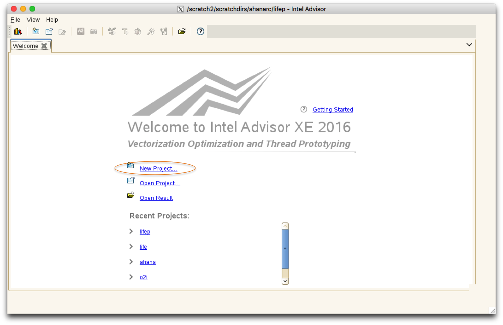

Then, enter the name of the project and click the "Create Project" button.

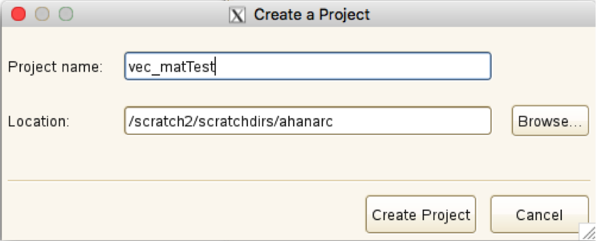

Next, browse for and select the binary file that is to be executed. If
required, also specify the parameters to be passed to the application and the
required environment variables and their values.

You might also want to modify the working directory and the directory where the
results will be stored. By default, the result directory is the same as the
project directory.

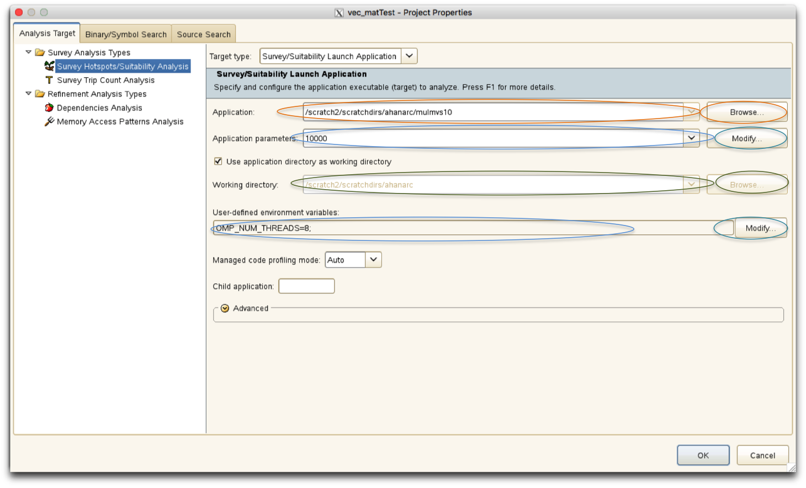

In the "Source Search" tab, browse for and select the directory that contains
your source file. 

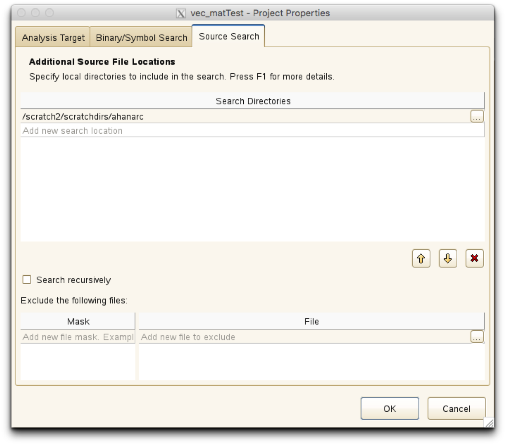

Then, click on the "OK" button to create the project.

##### Opening a Project

To open a project, click on the "Open Project" button on the Welcome screen.

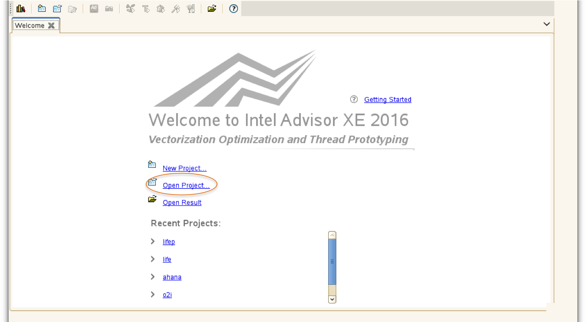

Browse for and select the ".advixeproj" file in the project directory and then
click the "Open" button.

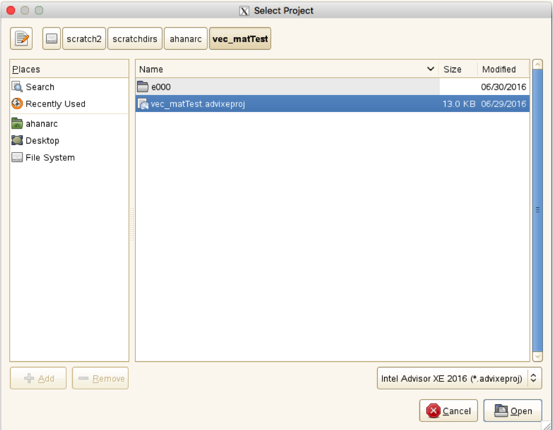

##### Collecting Survey Data

After opening a project, click on the "Collect Survey Data" button in the
Workflow or the "Collect" button in the "Survey Target" box.

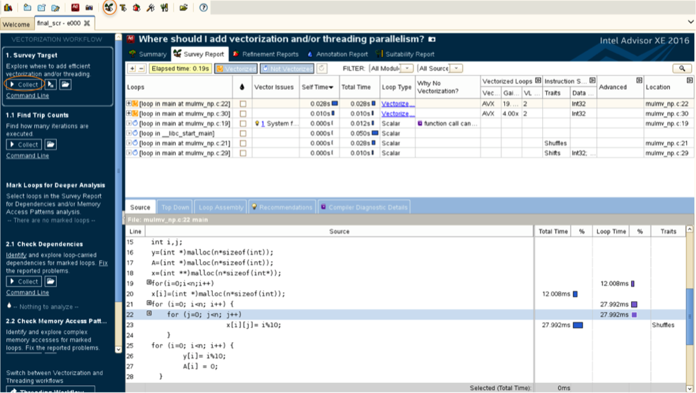

This executes the code and provides an analysis. It shows the time taken to
execute the loops in decreasing order of time. It also shows the source code
for the selected loop.

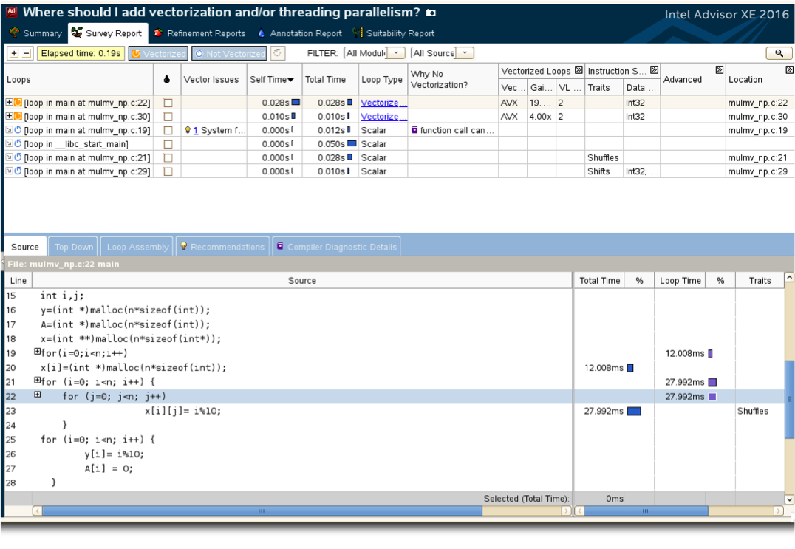

##### Inserting Annotations

Double click on a the line representing a specific loop in the survey output to
open the following window:

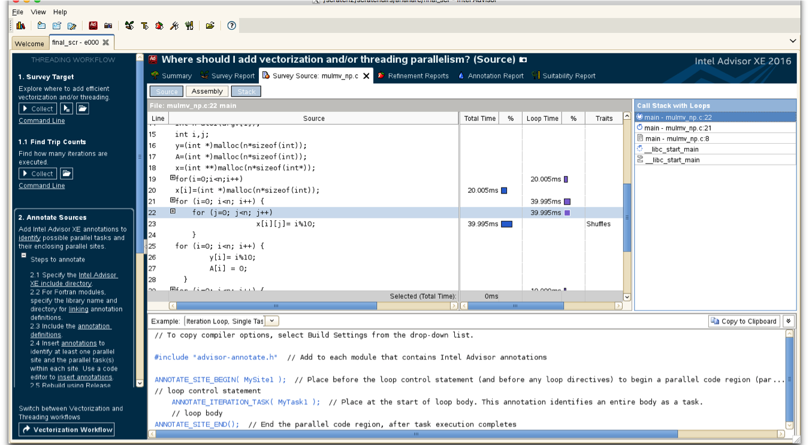

The lower part of the window shows annotation suggestions. Use the "Copy to 
Clipboard" button in order to copy the annotation suggestion. The annotation
suggestions provide a description of exactly how the annotations should be
placed in the source code.

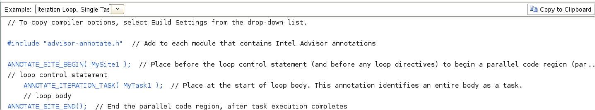

After copying the annotations, double click on any part of the code in the
upper half of the window to open the source code file in an editor.

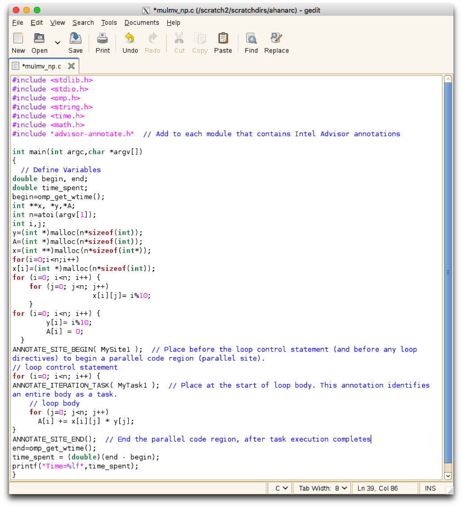

Insert the annotations in the correct positions and save the file. Here, the
annotation indicates the intent to parallelize a simple loop. Then, build the
application again using the following command:

```
icpc -g -openmp -I${ADVISOR_XE_2016_DIR}/include -o mulmvs10 mulmv_fp.c
```

The `-I${ADVISOR_XE_2016_DIR}/include` option is used so that the annotations
for Advisor can be recognized.

!!! note
    In order to access all the following types of analysis, you may have to click the Threading Workflow/ Vectorization Workflow button at the bottom left hand corner of the window.

##### Performing Suitability Analysis for the Annotations

After compiling the annotated source file, collect the "Survey" report once
again. Then, click on the "Collect" button in the "Check Suitability" box in
order to analyze the annotated program to check its predicted parallel
performance.

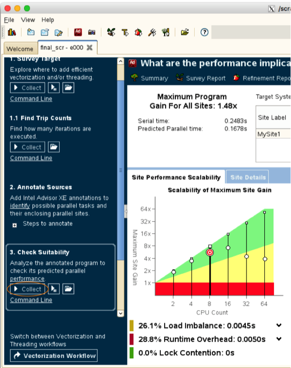

Once the analysis has been performed, you will see the details of the
results as follows:

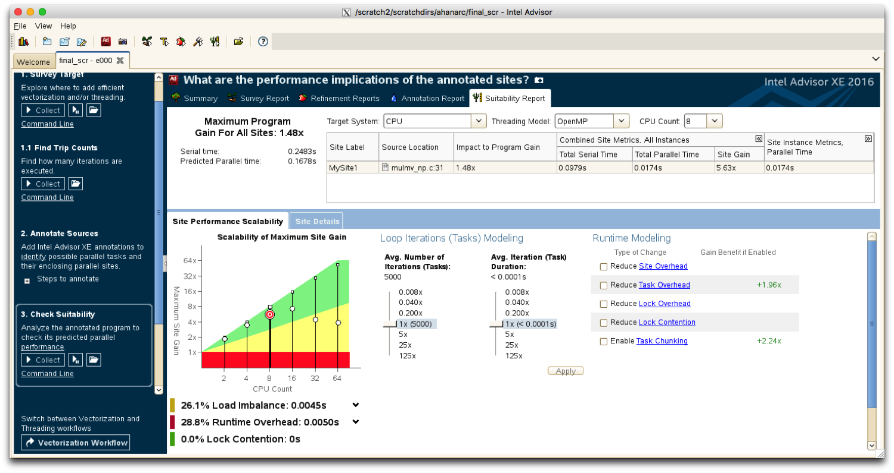

By default, Advisor uses CPU as the target system with 8 threads and Intel TBB
as the threading model. However, it is possible to increase or decrease the
number of threads, change the Threading Model to any one of the other available
options(including OpenMP) and change the Target System to Intel Xeon Phi. The
number of coprocessor threads to be executed on the Intel Xeon Phi can also be
selected.

The suitability analysis result also shows:

1. Expected speedup
2. Scalability graph: The green region in the scalability graph shows that the
   program scales well and the advantage to be obtained from parallelizing the
   code is well worth the effort. The yellow region indicates that there will
   be some advantage when the annotated part is parallelized but it may or may
   not justify the required effort. The red part indicates that parallelizing
   the annotated part might even degrade performance and is not worth the
   effort. The small red circle shows the currently selected conditions and
   marks out its location on the graph.
3. Runtime Environment: This indicates the amount of performance gain that can
   be obtained by selecting a runtime environment that minimizes different
   types of overheads or allows task chunking. Select the checkboxes against
   these options to identify the performance improvement or see the best
   possible performance.
4. The Task Modeling allows the user to model for different sizes of data sets
   (by changing the number of iterations). Also, the duration of each iteration
   can be modified. This helps to see how the parallel code will scale.
5. Current percentages of Load Imbalance, Lock Contention and Runtime Overhead

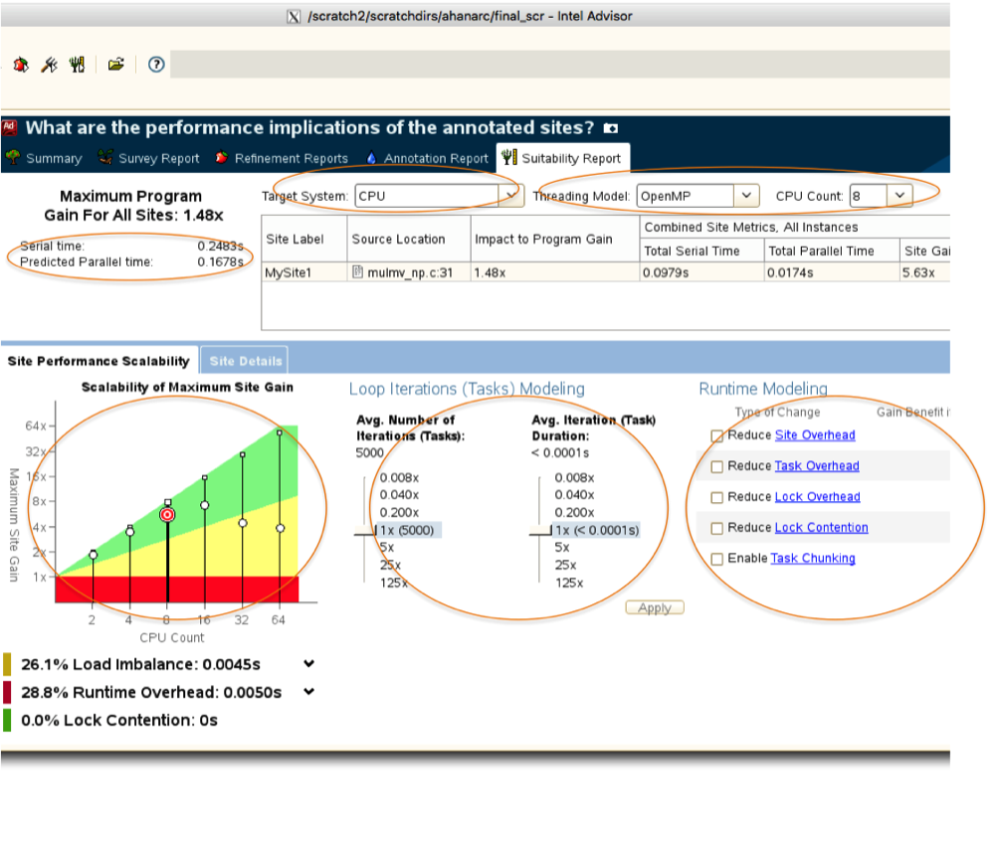

###### Comparison of Advisor Estimated Performance and Actual, Measured Performance

Comparison between Advisor estimated and measured wall clock times:

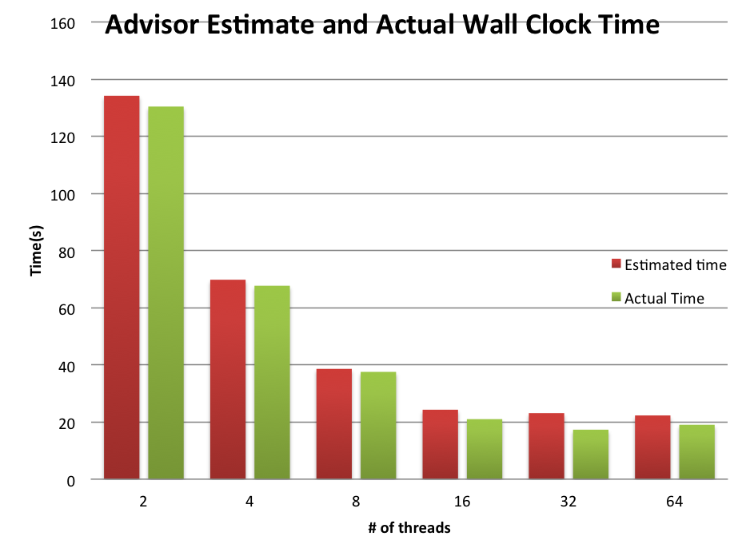

The variation range is 3-15% and increases with increasing numbers of threads.

##### Performing Trip Count Analysis

To find how many iterations of each loop are executed, click on the "Collect"
button in the "Trip Count" box. This should only be done after the Survey
information has been collected.

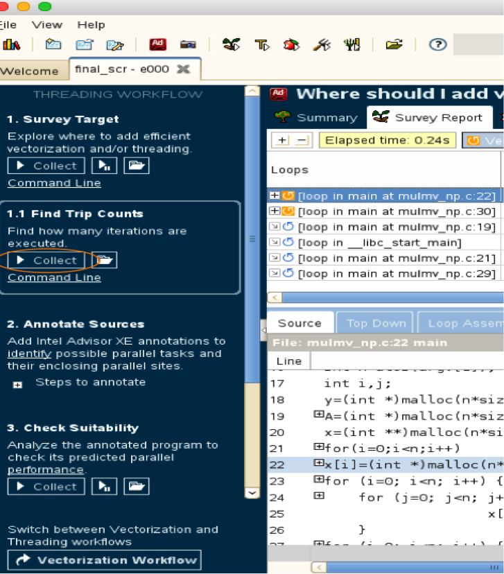

The number of times each loop was executed is displayed as follows:

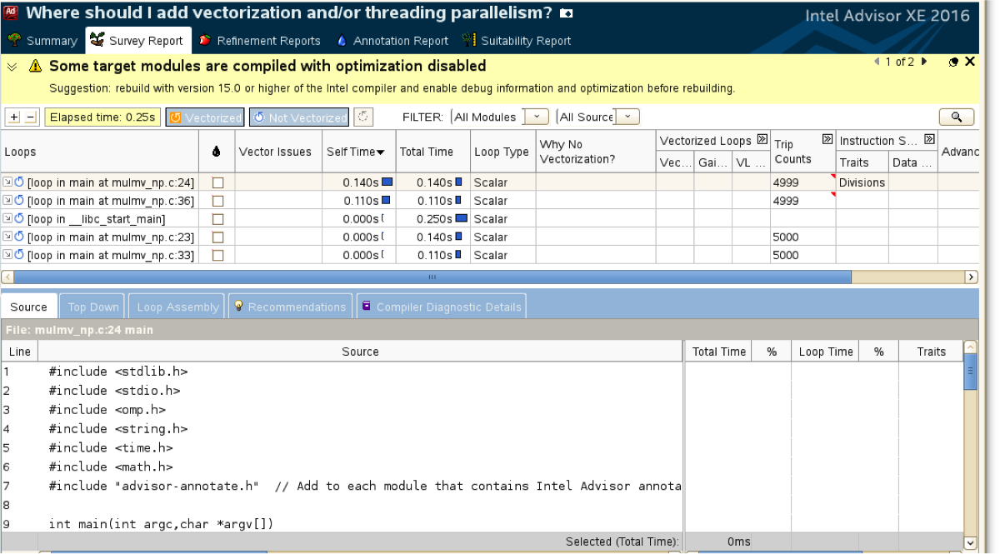

##### Marking Loops for Deeper Analysis

In order to perform dependency analysis of a loop or check the memory access
pattern, the check box next to the specific loop in the Survey report has to be
marked.

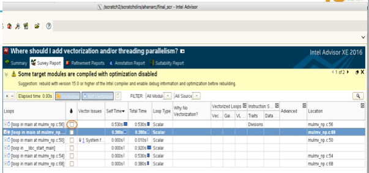

##### Checking Dependencies

To check loop-carried dependences in the loops that have been marked for deeper
analysis, click on the "Collect" button in the "Check Dependences" box.

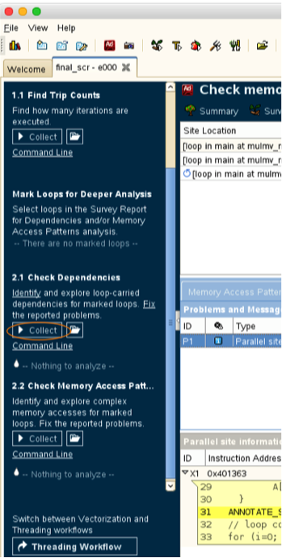

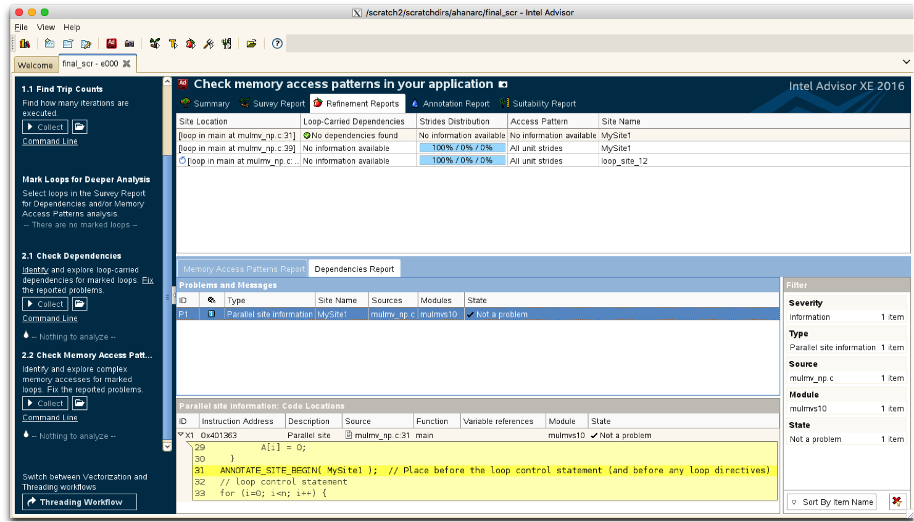

As in the above screenshot, if there is no loop-carried dependency, the report
will specify that. In case there is any loop-carried dependency, the report
will specify the kind of dependency and when that row is selected, the bottom
part of the window will show the line of code that causes this dependency.

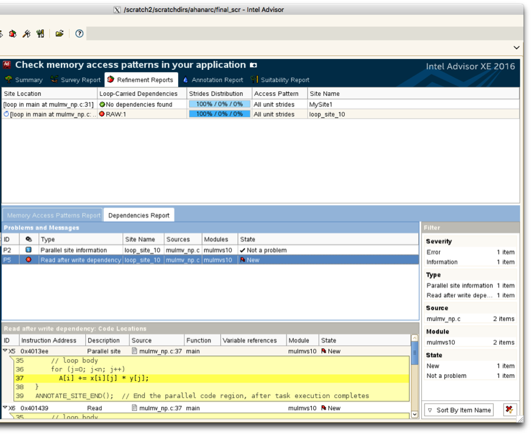

##### Checking Memory Access Patterns

To check the memory access patterns in the loops that have been marked for
deeper analysis, click on the "Collect" button in the "Check Memory Access
Patterns" box. 

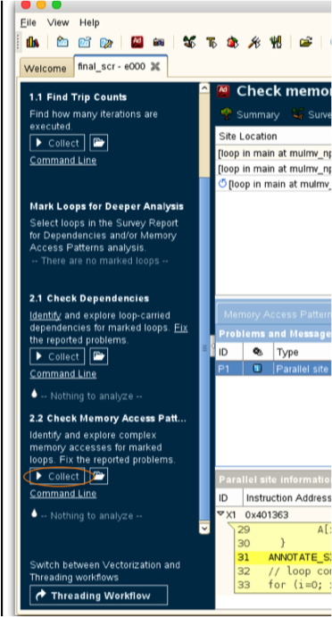

This analysis specifies the stride at which the data is accessed in the loop
and helps in optimizations that can improve memory access, prefetching and
locality.

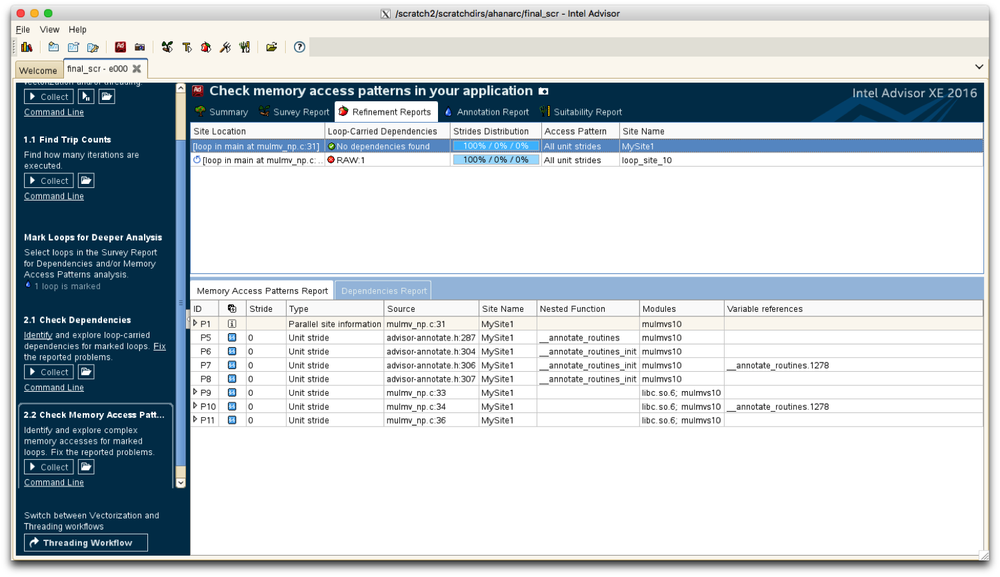

The access pattern is displayed in the form of "x%/y%/z%". The significance of
this is displayed when the mouse pointer is made to point to any one of the
cells in the "Strides Distribution" column.

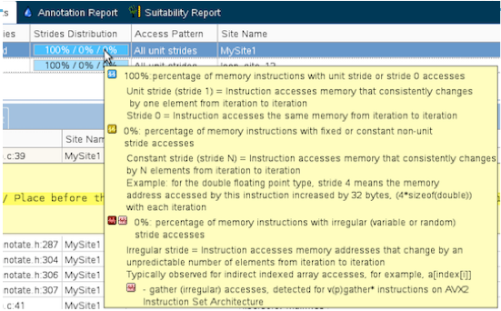

## Roofline Tool on Cori

The latest versions of Advisor (v2018) provide the
[Roofline model](http://www.nersc.gov/assets/Uploads/2-SWillams-Roofline-Intro.pdf)
automation. Two analyses, the survey and trip counts, are required to run the
Roofline analysis. We ran into some issues to use this feature on Cori (this
feature is still in its early development stage), especially on Cori KNL. While
Intel and Cray work to resolve the issues, the following job scripts worked to
collect data for the Roofline analysis:

### Sample job script to collect data for Roofline analysis on Cori KNL with an application linked to Cray MPICH

```
#!/bin/bash -l
#SBATCH -q regular
#SBATCH -C knl,quad,cache
#SBATCH -N 4
#SBATCH -t 8:00:00

export OMP_PROC_BIND=true
export OMP_PLACES=threads
export OMP_NUM_THREADS=8

module swap craype-haswell craype-mic-knl

module load advisor/2018.integrated_roofline

export PMI_MMAP_SYNC_WAIT_TIME=3600
export PMI_CONNECT_RETRIES=3600

srun -N 4 -n 64 -c 16 --cpu_bind=cores run_survey.sh

srun -N 4 -n 64 -c 16 --cpu_bind=cores run_tripcounts.sh
```

Contents of "run_survey.sh":

```
#!/bin/bash
 
if [[ $SLURM_PROCID == 0 ]];then
  advixe-cl -collect=survey --project-dir knl-result -data-limit=0 -- ./a.out
else
  sleep 30
  ./a.out
fi

```

Contents of "run_tripcounts.sh":

```
#!/bin/bash

if [[ $SLURM_PROCID == 0 ]];then
  advixe-cl -collect=tripcounts -flop --project-dir knl-result -data-limit=0 -- ./a.out
else
  ./a.out
fi 
```

### Sample job script to collect data for Roofline analysis on Cori KNL with an application linked to Intel MPI

```
#!/bin/bash -l
#SBATCH -q regular
#SBATCH -C knl,quad,cache
#SBATCH -N 4
#SBATCH -t 8:00:00

export OMP_PROC_BIND=true
export OMP_PLACES=threads
export OMP_NUM_THREADS=8

module load impi

export I_MPI_PMI_LIBRARY=/usr/lib64/slurmpmi/libpmi.so
export I_MPI_FABRICS=shm:tcp

module load advisor/2018.integrated_roofline

export PMI_MMAP_SYNC_WAIT_TIME=1800

srun -N 4 -n 64 -c 16 --cpu_bind=cores run_survey.sh

srun -N 4 -n 64 -c 16 --cpu_bind=cores run_tripcounts.sh
```

Contents of "run_survey.sh":

```
#!/bin/bash
if [[ $SLURM_PROCID == 0 ]];then
  advixe-cl -collect=survey --project-dir impi-knl3 -data-limit=0 -- ./a.out
else
  ./a.out
fi
```

Contents of "run_tripcounts.sh":

```
#!/bin/bash
if [[ $SLURM_PROCID == 0 ]];then
  advixe-cl -collect=tripcounts -flops-and-masks --project-dir impi-knl3 -data-limit=0 -- ./a.out
else
  ./a.out
fi
```

Intel has posted a
[video on Youtube](https://www.youtube.com/watch?v=h2QEM1HpFgg) about how to
use this functionality.

## Downloads

[mulmv.c.txt](http://www.nersc.gov/assets/Uploads/mulmv.c.txt)

This is the sample code used for the Advisor analysis. It is a matrix and
vector multiplication code.

[mulmv-annotated.c.txt](http://www.nersc.gov/assets/Uploads/mulmv-annotated.c.txt)

This file contains the annotations.

