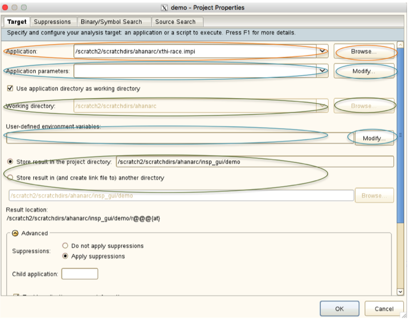
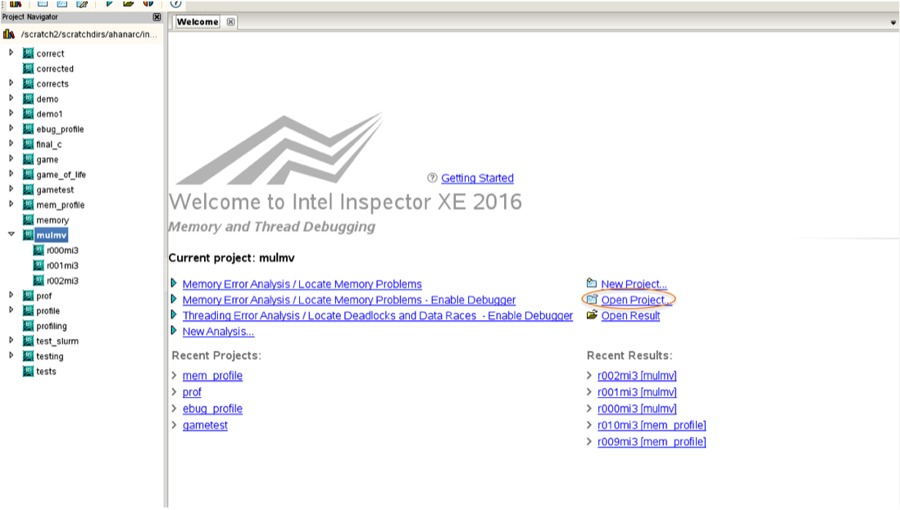
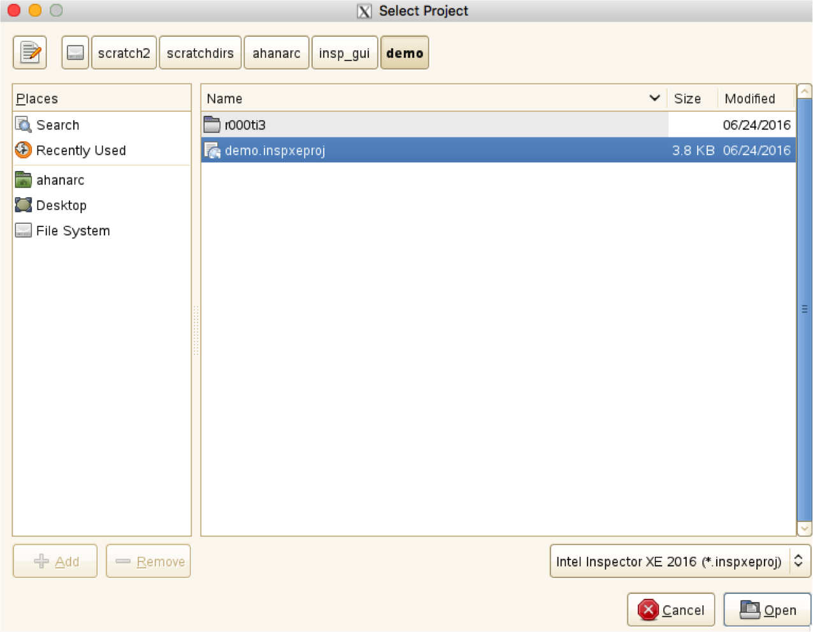
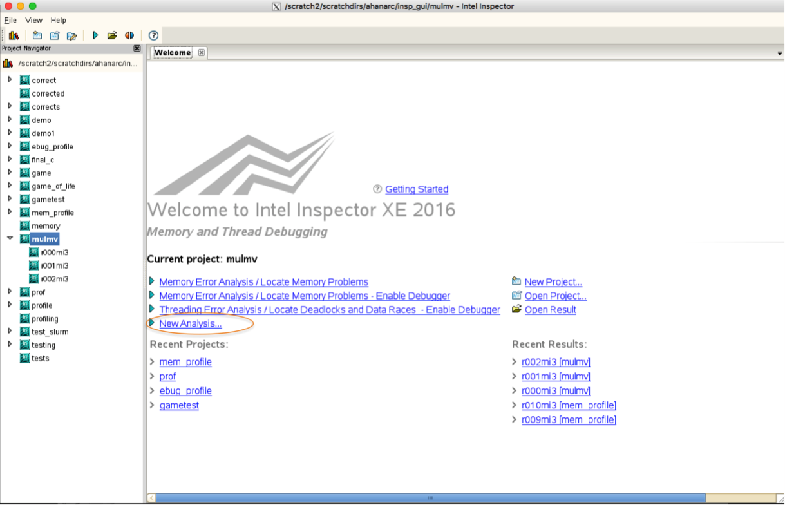
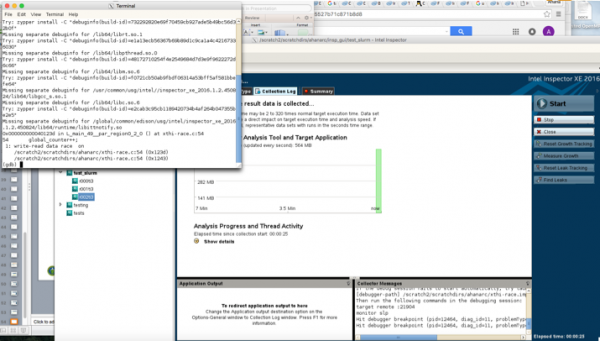
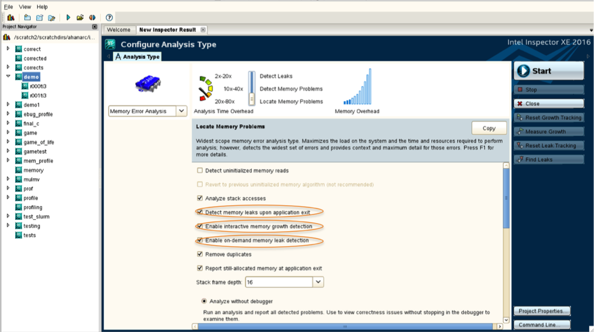
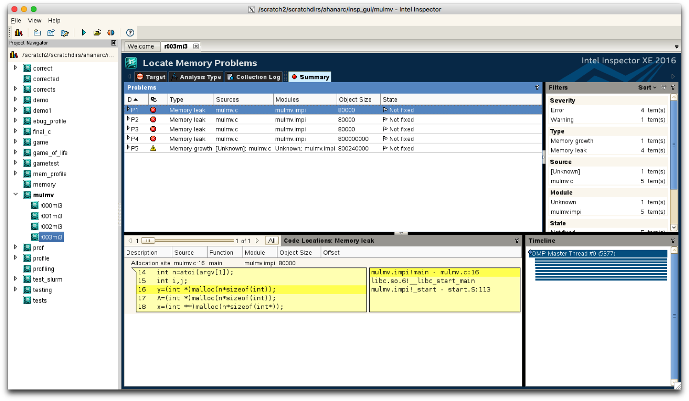
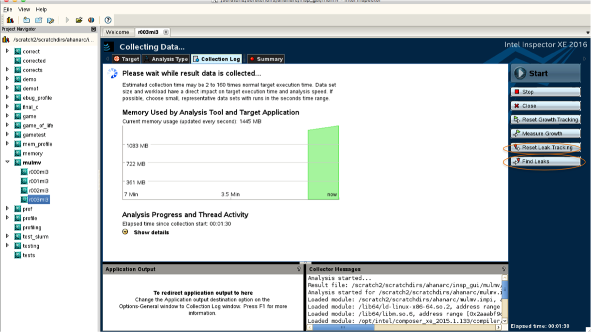
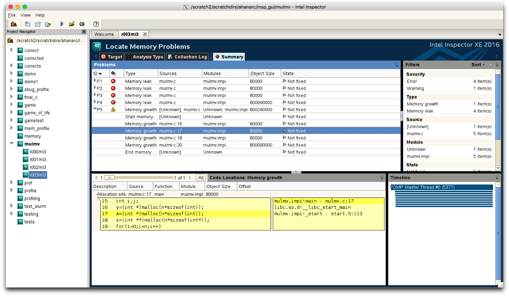
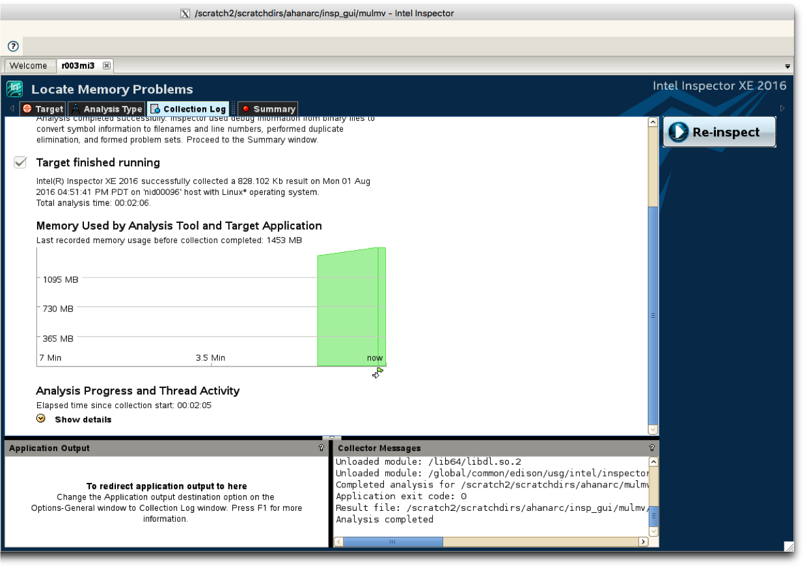

# Intel Inspector

## Table of Contents

1. [Introduction](#introduction)
2. [Using Intel Inspector on Edison and Cori](#using-intel-inspector-on-edison-and-cori)
3. [Important Command Line Options for Intel Inspector](#important-command-line-options-for-intel-inspector)
4. [Using the Inspector GUI](#using-the-inspector-gui)
5. [Known Issues](#known-issues)
6. [Downloads](#downloads)

## Introduction

Intel Inspector is a memory and threading error checking tool for users
developing serial and multithreaded applications on Windows and Linux operating
systems. The important features of Intel Inspector for Linux are:

* Standalone GUI and command line environments
* Preset analysis configurations (with some configurable settings) and the
  ability to create custom analysis configurations to help the user control
  analysis scope and cost
* Interactive debugging capability so one can investigate problems more deeply
  during analysis
* A large number of reported memory errors, including on-demand memory leak
  detection
* Memory growth measurement to help ensure that the application uses no more
  memory than expected
* Data race, deadlock, lock hierarchy violation, and cross-thread stack access
  error detection

For more information on Intel Inspector, please visit
https://software.intel.com/en-us/intel-inspector-xe.

## Using Intel Inspector on Edison and Cori

To launch Inspector, a Lustre File System should be used instead of GPFS. We
recommend that you use the command line tool  `inspxe-cl`  to collect data via
batch jobs and then display results using the GUI, `inspxe-gui`, on a login
node on Edison.

### Compiling Codes to Run with Inspector

#### Additional Compiler Flags

In order to compile the code to work with Inspector, some additional flags need to be used.

##### Cray Compiler Wrappers (`ftn`, `cc`, `CC`)

When using the Cray compiler wrappers to compile codes to work with Inspector,
the `-g` and `-dynamic` flags should be used. To compile a C code for MPI as
well as OpenMP, use the following command:

```
nersc$ cc -g -dynamic -openmp -o mycode.exe mycode.c
```

Here, the `-g` option is needed to assist Inspector to associate addresses to
source lines, and the `-dynamic` option is needed to build dynamically linked
applications with the compiler wrappers (`ftn`, `cc`, and `CC` link
applications statically by default).

If the `-g` option is not used, there are no source code lines in the GUI and
the problems are not detected in either the command line or GUI modes.

Without the `-dynamic` option, the following error is generated:

```
nersc$ module load inspector
nersc$ cc -g -openmp -o mycode.exe mycode.c
nersc$ srun -n 4 -c 8 inspxe-cl -c ti2 -- ./mycode.exe
Error: An internal error has occurred. Our apologies for this inconvenience. Please gather a description of the steps leading up to the problem and contact the Intel customer support team.
Warning: Encountered an issue while loading result [/scratch2/scratchdirs/elvis/r118ti2]. Run terminated abnormally. Some data may be lost.
```

##### Intel Native Compilers (`mpiifort`,`mpiicc`,`mpiicpc`)

When using the Intel native compilers to compile codes to work with Inspector,
the `-g` flag should be used. There is no need to use the `-dynamic` flag
because it is already a dynamic build. To compile a C code for MPI as well as
OpenMP, use the following command:

```
nersc$ mpiicc -g -openmp -O3 -o mycode.impi mycode.c
```

In this case too, if the `-g` option is not used, there are no source code 
ines in the GUI and the problems are not detected in either the command line or
GUI modes.

### Launching Inspector with Single or Multiple MPI Ranks

#### Using the `srun` Command

It is recommended that these commands should be executed from a Lustre file
system.

##### Cray Compiler Wrappers

!!! warning
    Using the Cray compiler wrappers prevents Inspector from detecting errors.

To launch Inspector using `srun` for an MPI plus OpenMP code, use the following
commands:

```
nersc$ salloc -N 1 -t 30:00 -q debug
nersc$ module load inspector
nersc$ export OMP_NUM_THREADS=8
nersc$ cc -g -dynamic -openmp -o mycode.exe mycode.c
nersc$ srun -n 4 -c 8 inspxe-cl -c ti2 -- ./mycode.exe
```

##### Intel Native Compilers

To launch Inspector using `srun` for an MPI plus OpenMP code, use the following
commands:

```
nersc$ salloc -N 1 -t 30:00 -q debug
nersc$ module load inspector
nersc$ export OMP_NUM_THREADS=8
nersc$ module load impi
nersc$ mpiicc -g -openmp  -o mycode.exe mycode.c
nersc$ export I_MPI_PMI_LIBRARY=/usr/lib64/slurmpmi/libpmi.so
nersc$ srun -n 4 -c 8 inspxe-cl -c ti2 -- ./mycode.exe
```

#### Using the `mpirun` command for MPI/OpenMPI Code

It is recommended that the following commands should be executed from a Lustre
file system. In this case, only codes compiled using an Intel native compiler
can be executed, and errors *are* detected.

To launch Inspector using `mpirun` for an MPI plus OpenMP code, use the
following commands:

```
nersc$ salloc -N 1 -t 30:00 -q debug
nersc$ module load inspector/2017.beta
nersc$ export OMP_NUM_THREADS=8
nersc$ module load impi
nersc$ mpiicc -g -openmp -O3 -o mycode.exe mycode.c
nersc$ mpirun -n 4 inspxe-cl -c ti2 --result-dir=./myresult -- ./mycode.exe
```

In this case, the value of the environment variable `I_MPI_PMI_LIBRARY` should
be unset.

### Using the GUI to View Results

Note that the performance of the XWindows-based Graphical User Interface can be
greatly improved if used in conjunction with the free
[NX software](../../connect/nx.md).

#### Launching Inspector in GUI Mode

Log into Edison using the following command:

```
$ ssh -XY edison.nersc.gov
```

On the login node, load the Inspector module and then open the GUI:

```
edison$ module load inspector
edison$ inspxe-gui
```

#### Viewing Results using the GUI


Use the "Open Result" link to browse for and open the ".inspxe" file in the
directory that contains the result. Then, you should see a screen similar to
the following one which shows a list of detected problems:


In this case, the code had a Data Race Condition and this was detected by
Inspector.

To exit the GUI, simply click the cross on the top left hand corner of the
Inspector dialog box.

### Example of Detection of a Data Race using Inspector

#### Code

```
#define _GNU_SOURCE
#include <stdio.h>
#include <unistd.h>
#include <string.h>
#include <sched.h>
#include <mpi.h>
#include <omp.h>
int global_counter;
/* Borrowed from util-linux-2.13-pre7/schedutils/taskset.c */
static char *cpuset_to_cstr(cpu_set_t *mask, char *str)
{
  char *ptr = str;
  int i, j, entry_made = 0;
  for (i = 0; i < CPU_SETSIZE; i++) {
   if (CPU_ISSET(i, mask)) {
    int run = 0;
    entry_made = 1;
    for (j = i + 1; j < CPU_SETSIZE; j++) {
     if (CPU_ISSET(j, mask)) run++;
     elsebreak;
    }
   if (!run)
   sprintf(ptr, "%d,", i); 
   elseif (run == 1) {
    sprintf(ptr, "%d,%d,", i, i + 1);
    i++;
   } 
   else {
    sprintf(ptr, "%d-%d,", i, i + run);
    i += run;
   }
   while (*ptr != 0) ptr++;
  }
 }
 ptr -= entry_made;
 *ptr = 0;
 return(str);
}
/* Based on Cray's original xthi.c */
int main(int argc, char *argv[]) 
{
 int rank, thread, provided;
 cpu_set_t coremask;
 char clbuf[7 * CPU_SETSIZE], hnbuf[64];
 MPI_Init_thread(&argc, &argv, 3, &provided);
 MPI_Comm_rank(MPI_COMM_WORLD, &rank);
 memset(clbuf, 0, sizeof(clbuf));
 memset(hnbuf, 0, sizeof(hnbuf));
 (void)gethostname(hnbuf, sizeof(hnbuf));
 #pragma omp parallel private(thread, coremask, clbuf)
 {
  thread = omp_get_thread_num();
  (void)sched_getaffinity(0, sizeof(coremask), &coremask);
  cpuset_to_cstr(&coremask, clbuf);
  global_counter++;
  #pragma omp barrier
  printf("Hello from level 1: rank= %d, thread level 1= %d, on %s. (core affinity = %s)\n",rank, thread, hnbuf, clbuf); 
  printf("global_counter=%d\n",global_counter);
 }
MPI_Finalize();
return(0);
}
```

#### Compiling the Code and Launching Inspector

##### Cray Compiler Wrappers

!!! warning
    This will not detect errors.

```
nersc$ salloc -N 1 -q debug
nersc$ module load inspector
nersc$ module load impi
nersc$ cc -g -dynamic -openmp –o xthi-race xthi-race.c
nersc$ export OMP_NUM_THREADS=8
nersc$ srun -n 4 -c 8 inspxe-cl -c ti2 -- ./xthi-race
```

Output:

```
Warning: One or more threads in the application accessed the stack of another thread. This may indicate one or more bugs in your application. Setting the Inspector to detect data races on stack accesses and running another analysis may help you locate these and other bugs.

......................

Hello from level 1: rank= 0, thread level 1= 3, on nid00042. (core affinity = 0-3,24-27)
global_counter=8
Hello from level 1: rank= 0, thread level 1= 5, on nid00042. (core affinity = 0-3,24-27)
global_counter=8

.................................

Hello from level 1: rank= 1, thread level 1= 0, on nid00042. (core affinity = 12-15,36-39)
global_counter=8
Hello from level 1: rank= 1, thread level 1= 2, on nid00042. (core affinity = 12-15,36-39)
global_counter=8
global_counter=8

................................

0 new problem(s) found
```

Although it is evident from the code that there is a data race, Inspector
fails to detect this when it is launched with code that has been compiled using
the Cray compiler wrapper.

##### Intel Native Compilers

```
nersc$ salloc -N 1 -q debug
nersc$ module load inspector
nersc$ module load impi
nersc$ mpiicc -g openmp -o xthi-race.impi xthi-race.c
nersc$ export OMP_NUM_THREADS=8
nersc$ export I_MPI_PMI_LIBRARY=/usr/lib64/slurmpmi/libpmi.so
nersc$ srun -n 4 -c 8 inspxe-cl -c ti2 -- ./xthi-race.impi
```

Output:

```
Hello from level 1: rank= 1, thread level 1= 6, on nid00273. (core affinity = 12-15,36-39)
global_counter=8
Hello from level 1: rank= 1, thread level 1= 4, on nid00273. (core affinity = 12-15,36-39)
global_counter=8

..................................

global_counter=8
Hello from level 1: rank= 0, thread level 1= 4, on nid00273. (core affinity = 0-3,24-27)
global_counter=8
Warning: One or more threads in the application accessed the stack of another thread. This may indicate one or more bugs in your application. Setting the Inspector to detect data races on stack accesses and running another analysis may help you locate these and other bugs.

..................................

global_counter=8
Hello from level 1: rank= 2, thread level 1= 6, on nid00273. (core affinity = 4-7,28-31)
global_counter=8

................................

1 new problem(s) found 

   1 Data race problem(s) detected
```

When Inspector is launched for code that has been compiled using an Intel
native compiler, it is able to detect the error(s). In this case, a data race
exists.

## Important Command Line Options for Intel Inspector

The general Intel Inspector `inspxe-cl` command syntax is:

```
nersc$ inspxe-cl <-action> [-action-options] [-global-options] [-- application [application options]]

```

We use `srun` or `mpirun` with this command. Here, `<-action>` specifies the
action to perform, such as collect or report. There must be only one action per
command. There are a number of available actions, but "report" and "collect"
are the most common. Following is a list of the available "action-options" for
these two types of actions:

### Options for the Collect Action

| Option | Description                     |
|--------|---------------------------------|
| mi1    | Detect memory leaks             |
| mi2    | Detect memory problems          |
| mi3    | Locate memory problems          |
| ti1    | Detect deadlocks                |
| ti2    | Detect deadlocks and data races |
| ti3    | Locate deadlocks and data races |

### Options for the Report Action

| Option       | Description |
|--------------|-------------|
| summary      | A brief statement of the total number of new problems found grouped by problem type |
| problems     | A detailed report of detected problem sets in the result, along with their location in the source code |
| observations | A detailed report of all code locations used to form new problem sets |
| status       | A brief statement of the total number of detected problems and the number that are *not investigated*, grouped by category |

## Using the Inspector GUI

In order to launch Inspector in GUI mode such that the code is executed on the
compute nodes, use the following commands:

```
$ ssh -XY edison.nersc.gov
edison$ cd $SCRATCH
edison$ salloc -N 1 -t 10:00 -q debug
edison$ module load inspector
edison$ inspxe-gui
```

Once you have opened the Inspector GUI using the `inspxe-gui` command, you can
create and open projects as well as perform different types of analyses.

The four possible types of analyses are:

1. Memory Error Analysis/Locate Memory Problems
2. Threading Error Analysis/Locate Deadlocks and Data Races
3. Memory Error Analysis/Detect Leaks
4. Custom Analysis

### Creating a Project

To create a project, click on the "New Project" link in the Welcome screen.


Then, enter the name of the project and click the "Create Project" button.


Next, browse for and select the binary file that is to be executed. If required,
specify the parameters to be passed to the application as well as the necessary
environment variables and their values.

You might also want to modify the working directory and the directory where the
results will be stored. By default, the result directory is the same as the
project directory. Then click on the 'OK' button to create the project.



### Opening a Project

To open an existing project, click on the "Open Project" link on the welcome
screen.



Browse for and select the ".inspxeproj" file in the project directory and then
click the "Open" button.



### Performing an Analysis using the Inspector GUI

When a project is opened, select one of the analysis types to start the
analysis. This executes the code and performs the analysis.

Here, we select the "Threading Error Analysis/Locate Deadlocks and Data Races"
analysis.


The analysis is performed and then the result of the analysis is displayed as
follows:


Since the sample code had a data race error, Inspector detects and reports the
same. Additionally, it points out the specific line in the code that is causing
the error.

### Using a Debugger with Intel Inspector

A debugger can be used with Inspector so that those parts of the code that
cause errors can be inspected in detail. The combination of Inspector with a
debugger gives access to information about variables and workflow at the time
of an issue that are not directly accessible through the use of one tool alone.

When launching a new analysis at any level other than "Detect Leaks", the user
can select the option to break into the debugger as soon as any problem is
detected.  However, running both the analysis tool and the debugger has a
negative effect on performance. To select this option, open a project and then
select the "New Analysis" type as shown below:



In the following window, select "Threading Error Analysis" from the drop-down
list and then select the indicated option. You can also run the debugger while
performing memory analysis by enabling the same option.


When this analysis is started, the detection of any problem other than memory
leaks will result in breaking into the debugger.



The data race condition in the example causes the debugger window to be opened.
It breaks into the debugger at the line that causes the issue.

### Detecting Memory Problems and Analyzing Memory Growth

To use Inspector to find memory problems, use the "Memory Errors" type of
analysis. Note that using the "New Analysis" type provides several options.
Open a project and select the "New Analysis" type. In the following window, the
"Memory Error Analysis" option is selected by default from the drop-down list.
Some of the available variations are described below.



There are three levels of memory analysis (in increasing order of scope and
cost):

1. Detect Leaks
2. Detect Memory Problems
3. Locate Memory Problems

#### Memory Leaks

When the "Detect memory leaks upon application exit" checkbox is selected on
the "Configure Analysis Type" window, Inspector detects all memory leaks
present when the application exits. This option is enabled by default in all
preset memory error analysis types.

At the end of the analysis, the GUI displays memory leaks as "Memory leak"
problems on the "Summary" window.



To identify leaks that occur at or during a specific time interval with an
on-demand leak detection functionality, select the "Enable on-demand memory
leak detection" checkbox on the "Configure Analysis Type" window. This
activates the on-demand leak detection functionality.

Selecting on-demand leak detection activates two buttons on the right side of
the GUI during analysis. They are labeled "Reset Leak Tracking" and "Find
Leaks".



By default, Inspector tracks all memory allocations when the application
starts. Hence, if any of these allocations are leaked, they appear as a Memory
leak problem. However, if the "Reset Leak Tracking" button is clicked,
Inspector discards information about earlier allocations and tracks leaks only
for those allocations that occur after the Reset Leak Tracking button is clicked.

When the "Find Leaks" button is clicked, Inspector will show any memory that
the application has leaked util that point. Newly found leaks appear in the
Summary window as "Memory leak problems".

#### Memory Growth

To find out how much memory is in use at a given time during the run, or how
much memory is growing during a particular section of the code, the interactive
memory growth functionality can be used.

When the "Enable Interactive Memory Growth Detection" checkbox is selected, it
enables two buttons on the right side of the GUI during analysis. They are
labeled "Reset Growth Tracking" and "Measure Growth". 


During the analysis, clicking the Reset Growth Tracking button changes the
starting point for detecting memory growth to the current time. By default,
Inspector detects all growth since the start of the application.

Click the "Measure Growth" button to generate a memory growth report that is
available in the "Summary" window. Memory growth reports describe the memory
that has been allocated, but not (yet) deallocated from the time of the
previous growth reset operation up until the time of the report. Clicking the
Reset Growth Tracking button results in a growth reset operation.



Inspector has a real-time memory usage graph that can be used to determine at
what point in the program the use of memory is increasing. The memory graph is
also marked with symbols to indicate when the on-demand leak detection and the
memory analysis buttons were pressed.



## Known Issues

If Inspector is launched for code that has been compiled using the Cray
compiler wrapper, then it does not detect errors.

## Downloads

[mulmv-p.c.txt](http://www.nersc.gov/assets/Uploads/mulmv-p.c.txt)

This is the C code to multiply a matrix and a vector in parallel and is the
sample code used for the Inspector memory analysis. Only the size of the
matrix/vector should be passed as an argument. It is assumed that the matrix is
square and that the number of rows in the matrix is equal to the size of the
vector.
