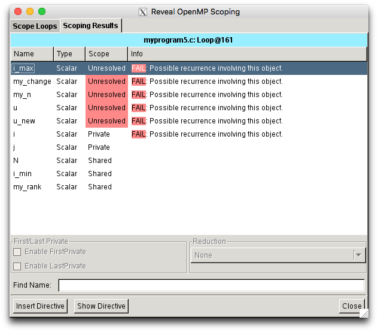
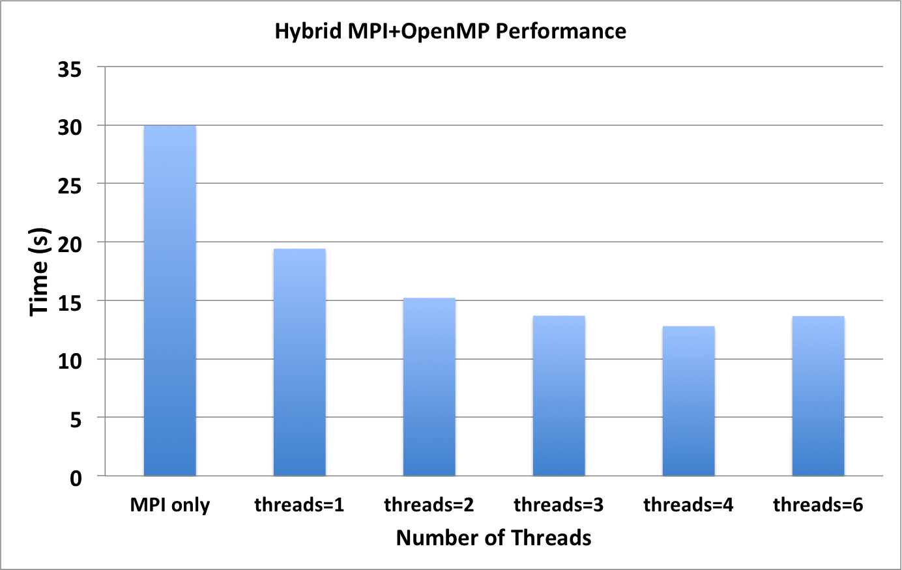

# Cray Reveal

## Description

Cray Reveal is part of the Cray Perftools software package. It utilizes the
Cray CCE program library (hence it only works under `PrgEnv-cray`) for source
code analysis, combined with performance data collected from CrayPat. Reveal
helps to identify top time-consuming loops, with compiler feedback on
dependency and vectorization.

Attempting to achieve best performance on today's supercomputers demands that
besides using MPI between nodes or sockets, the developer must also use a
shared-memory programming paradigm on the node and vectorize low-level looping
structures.

The process of adding parallelism involves finding top serial work-intensive
loops, performing parallel analysis, scoping and vectorization, adding OpenMP
layers of parallelism, and analyzing performance for further optimizations,
specifically vectorization of innermost loops. Cray Reveal can be used to
simplify these tasks. Its loop scope analysis provides variable scope and
compiler directive suggestions for inserting OpenMP parallelism to serial or
pure MPI code. 

## Steps to Use Cray Reveal

Reveal is available on Edison under PrgEnv-cray by loading the Cray `perftools`
module. It has conflicts with the NERSC default loaded `darshan` module (used
for collecting I/O information). Reveal has a GUI interface, so it needs X11
access.  Make sure to access Edison via the `ssh -XY` option.

### 1. Basic Steps to Setup User Environment

```
edison$ module swap PrgEnv-intel PrgEnv-cray        
edison$ module unload darshan
edison$ module load perftools-base/6.3.2
edison$ module load perftools/6.3.2
```

### 2. Generate Loop Work Estimates

#### a. Build with `-h profile_generate`

Fortran code example:

```
edison$ ftn -c -h profile_generate myprogram.f90
edison$ ftn -o myprogram -h profile_generate myprogram.o
```

C code example (this code will be used in following steps):

```
edison$ cc -c -h profile_generate myprogram.c
edison$ cc -o myprogram -h profile_generate myprogram.o
```

The C code is available [here](http://www.nersc.gov/assets/poisson-mpi.c.txt).

!!! note
    It is a good idea to separate compilation and linking to preserve object
    files. It is also suggested to separate this step from generating the
    program library (with `-hpl`) since `-h profile_generate` disables all
    optimizations.

#### b. Build CrayPat Executable

```
edison$ pat_build -w myprogram
```

The executable `myprogram+pat` will be generated. Here, the `-w` flag is used
to enable tracing.

#### c. Run the Program to Generate Raw Performance Data in \*.xf Format

Below is a simple batch interactive session example. A regular batch script can
also be used to launch the `myprogram+pat` program. It is recommended that you
execute the code from a Lustre file system.

```
edison$ salloc -q debug -t 30:00
```

Then, use `srun` to run the code. In this case, 4 MPI tasks are used.

```
edison$ srun -n 4 ./myprogram+pat
```

This generates one or more raw data files in \*.xf format.

Before proceeding, relinquish the job allocation:

```
edison$ exit
``` 

#### d. Generate \*.ap2 and \*.rpt Files via `pat_report`

```
edison$ pat_report myprogram+pat+......xf > myprogram+pat.rpt  
```

### 3. Generate a Program Library

```
edison$ cc -O3 -hpl=myprogram.pl -c myprogram.c
```

!!! warning
     If there are multiple source code directories, this program library
     directory needs to be an absolute path.

!!! note
    `myprograml.pl` is a directory; users need to clean it from time to time.

### 4. Save an Original Copy of Your Source Code

```
edison$ cp myprogram.c myprogram_orig.c
```

The Reveal suggested code may overwrite your original version.

### 5. Launch Reveal

```
edison$ reveal myprogram.pl myprogram+pat+....ap2
```

(Use the exact \*.ap2 file name in the above command.)

### 6. Perform Loop Scoping

Choose the "Loop Performance" view from the "Navigation" drop-down list, pick
some of the high time-consuming loops, start scoping, and insert directives.

The left-side panel lists the top time consuming loops. The top right panel
displays the source code. The right bottom panel displays the compiler
information about a loop.


Double click a line in the "Info" section to display more explanations of a
compiler decision about each loop, such as whether it is vectorized or
unrolled.


Double click a line corresponding to a loop from the section that displays the
code and a new "Reveal OpenMP Scoping" window will pop up:


Ensure that the only the required loop is checked. Click the "Start Scoping"
button on the bottom left. The scoping results for each variable will be
provided in the "Scoping Results" tab. Some of the variables are marked red as
"Unresolved". The reason why it fails in scoping is also specified. 



Click the "Show Directive" button and the Reveal-suggested OpenMP Directive
will be displayed:


Click the "Insert Directive" button to insert the suggested directive in the
code:


Click the "Save" button on the top right hand corner of the main window. A
"Save Source" window will pop up:


Choose "Yes", and a file having the same name as the original file and with
the OpenMP directives inserted will be created. The original file will be
overwritten.

The above steps can be repeated for one loop at a time. Note that the newly
saved file will have the same file name as your original code.

```
edison$ cp myprogram.c myprogram.c.reveal # (myprogram.c.reveal is the code with OpenMP directives generated by Reveal)
edison$ cp myprogram.c.orig myprogram.c # (these are copies of your original code)
edison$ cp myprogram.c.reveal myprogram_omp.c # (myprogram_omp.c is the copy where all the variables will be resolved)
```

### 7. Work with `myprogram_omp.c`

#### a. Start to resolve all unresolved variables by changing them to private, shared or reduction

For example, Reveal provides the following directive for the selected loop:

```
// Directive inserted by Cray Reveal.  May be incomplete.
#pragma omp parallel for default(none)                      \
   unresolved (i,my_change,my_n,i_max,u_new,u)              \
      private (j)                                           \
      shared  (my_rank,N,i_min)
for ( i = i_min[my_rank]; i <= i_max[my_rank]; i++ )
{
    for ( j = 1; j <= N; j++ )
    {
        if ( u_new[INDEX(i,j)] != 0.0 )
         {
            my_change = my_change
            + fabs ( 1.0 - u[INDEX(i,j)] / u_new[INDEX(i,j)] );
            my_n = my_n + 1;
         }
    }
}
```

Note that the keyword `unresolved` is used above since Reveal could not resolve
the data scope. We need to change these to `reduction(+:my_change)` and
`shared(u_new,u)` and save a new copy of the code as "myprogram_omp.c".

```
// Directive inserted by Cray Reveal.  May be incomplete.
#pragma omp parallel for default(none)                \
   reduction (+:my_change,my_n)                      \
        private (i,j)                                \
        shared  (my_rank,N,i_min,i_max,u,u_new)
   for ( i = i_min[my_rank]; i <= i_max[my_rank]; i++ )
    {
      for ( j = 1; j <= N; j++ )
      {
        if( u_new[INDEX(i,j)] != 0.0 )
        {
           my_change = my_change
          + fabs ( 1.0 - u[INDEX(i,j)] / u_new[INDEX(i,j)] );
          my_n = my_n + 1;
        }
      }
    }
```

#### b. Compile with OpenMP enabled.

This can be done under any `PrgEnv`. Make sure to resolve compilation warnings
and errors.

!!! note
    Use `--cpus-per-task=num_threads` if you are using `srun` to execute your
    code.

#### c. Compare the performance between `myprogram` and `myprogram_omp`

### Output for MPI code only (myprogram.c) using 4 MPI Processes

```
POISSON_MPI!!
  C version
  2-D Poisson equation using Jacobi algorithm
  ===========================================
  MPI version: 1-D domains, non-blocking send/receive
  Number of processes         = 4
  Number of interior vertices = 1200
  Desired fractional accuracy = 0.001000

  N = 1200, n = 1373424, my_n = 326781, Step 1000  Error = 0.143433
  N = 1200, n = 1439848, my_n = 359992, Step 2000  Error = 0.0442104
  N = 1200, n = 1439907, my_n = 359994, Step 3000  Error = 0.0200615
  N = 1200, n = 1439928, my_n = 360000, Step 4000  Error = 0.0114007
  N = 1200, n = 1439936, my_n = 359983, Step 5000  Error = 0.0073485
  N = 1200, n = 1439916, my_n = 359983, Step 6000  Error = 0.00513294
  N = 1200, n = 1439935, my_n = 359996, Step 7000  Error = 0.00379038
  N = 1200, n = 1439915, my_n = 359997, Step 8000  Error = 0.00291566
  N = 1200, n = 1439950, my_n = 359997, Step 9000  Error = 0.00231378
  N = 1200, n = 1439982, my_n = 360000, Step 10000  Error = 0.00188195
  N = 1200, n = 1439988, my_n = 360000, Step 11000  Error = 0.00156145
  N = 1200, n = 1439983, my_n = 360000, Step 12000  Error = 0.00131704
  N = 1200, n = 1439983, my_n = 360000, Step 13000  Error = 0.00112634 
  

Wall clock time =29.937182 secs 

POISSON_MPI:

    Normal end of execution.
```

### Output for MPI+OpenMP code (myprogram_omp.c) using 4 MPI Processes with 4 OpenMP Threads per MPI Process

```
POISSON_MPI!!
  C version
  2-D Poisson equation using Jacobi algorithm
  ===========================================
  MPI version: 1-D domains, non-blocking send/receive
  Number of processes         = 4
  Number of interior vertices = 1200
  Desired fractional accuracy = 0.001000 

  N = 1200, n = 1373424, my_n = 326781, Step 1000  Error = 0.143433
  N = 1200, n = 1439848, my_n = 359992, Step 2000  Error = 0.0442104
  N = 1200, n = 1439907, my_n = 359994, Step 3000  Error = 0.0200615
  N = 1200, n = 1439928, my_n = 360000, Step 4000  Error = 0.0114007
  N = 1200, n = 1439936, my_n = 359983, Step 5000  Error = 0.00734855
  N = 1200, n = 1439916, my_n = 359983, Step 6000  Error = 0.00513294
  N = 1200, n = 1439935, my_n = 359996, Step 7000  Error = 0.00379038
  N = 1200, n = 1439915, my_n = 359997, Step 8000  Error = 0.00291566
  N = 1200, n = 1439950, my_n = 359997, Step 9000  Error = 0.00231378
  N = 1200, n = 1439982, my_n = 360000, Step 10000  Error = 0.00188195
  N = 1200, n = 1439988, my_n = 360000, Step 11000  Error = 0.00156145
  N = 1200, n = 1439983, my_n = 360000, Step 12000  Error = 0.00131704
  N = 1200, n = 1439983, my_n = 360000, Step 13000  Error = 0.00112634
 

  Wall clock time = 12.807604 secs
  POISSON_MPI:

   Normal end of execution.
```

### Results

The following results were obtained by executing on Edison for 4 MPI tasks.



## Issues and Limitations

* Cray Reveal works only under PrgEnv-cray with the CCE compiler
* There will be unresolved and incomplete variable scopes
* There may be more incomplete and incorrect variables identified when
  compiling OpenMP code
* The user still needs to understand OpenMP and resolve the issues
* Reveal does not insert OpenMP tasks, barrier, critical, atomic, etc. regions

## More Information

* `man reveal`, when the perftools module is loaded
* [Using Cray Performance Measurement and Analysis Tools](http://docs.cray.com/books/S-2376-613/S-2376-613.pdf),
  Cray documentation
* [Adding OpenMP to Your Code Using Cray Reveal](http://www.nersc.gov/assets/Documentation/Performance/Reveal/Reveal-2013.pdf),
  NERSC Edison Performance 2013 Training talk
* [Cray Reveal Training](http://www.nersc.gov/users/training/events/cray-reveal-tool-training-sept-18-2014/),
  presented by Heidi Paxon, September 2014
* [Lecture Slides](http://www.nersc.gov/assets/Uploads/Day-1B-01-Cray-PE-workshop-Reveal-NERSC.pdf)
  for talk on Cray Reveal by Heidi Paxon, March 2016