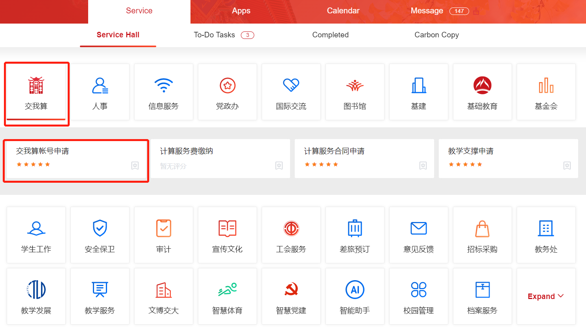

============================================================
Getting Started
============================================================

Shanghai Jiao Tong University Counting On Me platform is a university-level platform which provides HPC & AI computing service. It was established in 2013 and aims to provide technical support for large-scale scientific and engineering computing needs in the university.

Computing Resources
============================
**Siyuan-1**

Siyuan-1 is the No.1 supercomputer in domestic universities, ranking 132nd on the TOP500 list. It has 938 CPU nodes (Intel Xeon ICX Platinum 8358) and 23 GPU nodes (NVIDIA HGX A100).

* `Siyuan-1 Documentation <https://docs.hpc.sjtu.edu.cn/job/siyuan.html>`_

**Pi 2.0**

Pi 2.0 is one of the earliest supercomputers built with Intel Cascade Lake CPU in China. It has a total of 656 CPU nodes, with a double-precision theoretical peak performance of 2.1 PFLOPS.

**AI**

AI platform has 8 NVIDIA DGX-2 servers, with 16 Tesla V100 GPU accelerator cards each.

* `AI Documentation <https://docs.hpc.sjtu.edu.cn/job/dgx.html>`_

**ARM**

ARM platform is the first university-level supercomputing cluster based on the ARM processor in China. It has a total of 100 CPU nodes.

* `ARM Documentation <https://docs.hpc.sjtu.edu.cn/job/siyuan.html>`_

HPC Account
===============
**How to Apply**

HPC account is NOT your jAccount. Apply for an HPC account in ‘交我算’ in `my.sjtu.edu.cn <https://my.sjtu.edu.cn>`_ as shown. Your application will be processed in 2 business days. The owner of the main account MUST be faculty members, postdocs, or employees of affiliated hospitals. You may also apply for sub-accounts. Sharing accounts is NOT recommended.

**Login**

1. `Connecting with SSH <https://docs.hpc.sjtu.edu.cn/login/index.html#ssh>`_

* Siyuan-1: ``ssh username@sylogin.hpc.sjtu.edu.cn``

* Pi2.0 & AI: ``ssh username@pilogin.hpc.sjtu.edu.cn``

* ARM: ``ssh username@armlogin.hpc.sjtu.edu.cn``

Notice: For Windows users, you may need an SSH client like Putty.

2. Login using `HPC Studio <https://docs.hpc.sjtu.edu.cn/studio/basic.html>`_

Data Storage
===============

The platform has two file systems: ``lustre`` and ``dssg``. Both ``lustre`` and ``dssg`` are distributed, scalable high-performance parallel file systems, that can support PB-level storage capacity and large aggregated I/O throughput.

Different partitions use different file systems：

* ``lustre``: small, cpu, huge, 192c6t, dgx2, arm128c256g

* ``dssg``: 64c512g, a100

Your home directory is different on different file system as well.

* ``lustre``: /lustre/home/acct-accountname/username

* ``dssg``: /dssg/home/acct-accountname/username

**Data Transfer Nodes**

Please use data transfer nodes for data transfers. Data transfer nodes hostnames:

* Siyuan-1: sydata.hpc.sjtu.edu.cn

* Pi 2.0/AI/ARM: data.hpc.sjtu.edu.cn

**External Data Transfer**

For Windows users, you may use \ `WinSCP <https://winscp.net/eng/index.php>`__\  to transfer data between your PC and the cluster. Use your password, username and the data transfer node hostname to login. And then you will be able to drag your files for data transfers.

For Linux/Unix/Mac users, you may use either ``scp`` or ``rsync`` command to transfer data.

1. New data: ``$ scp -r [local/path] username@hostname:[target/path]``

2. Changes made to existing data: ``$ rsync --archive --partial --progress [local/path] username@hostname:[target/path]``

.. code:: bash

   # Suppose the home directory of user expuser01 in Siyuan-1 is /dssg/home/acct-exp/expuser01
   # His/her local directory is /home/local_user/

   # Example 1: upload all files in ~/data folder to Siyuan-1 cluster
   $ scp -r /home/local_user/data/ expuser01@sydata.hpc.sjtu.edu.cn:/dssg/home/acct-exp/expuser01/

   # Example 2: download ~/math.dat file in Siyuan-1 to the local directory
   $ scp expuser01@sydata.hpc.sjtu.edu.cn:/dssg/home/acct-exp/expuser01/math.dat /home/local_user/

**Transferring Data between Clusters**

You can use either ``data`` or ``sydata`` data transfer node to transfer data between two file systems. For example, you can ssh data.hpc.sjtu.edu.cn from Pi 2.0 cluster, and then transfer data using either ``scp`` or ``rsync`` command.

.. code:: bash

   # Example 3: transfer data in lustre home directory ~/data to dssg home directory ~/data
   $ scp -r /lustre/home/acct-exp/expuser01/data/ expuser01@sydata.hpc.sjtu.edu.cn:/dssg/home/acct-exp/expuser01/data/

Running Jobs
===============

SLURM (Simple Linux Utility for Resource Management) is a scalable workload manager. The platform uses Slurm for cluster management and job scheduling.

* `Common SLURM commands <https://docs.hpc.sjtu.edu.cn/job/slurm.html>`_

Here is a typical slurm script example.

.. code:: bash

	#!/bin/bash

	#SBATCH --job-name=test                #job name
	#SBATCH --partition=64c512g            #partition name
	#SBATCH -N 1                           #number of nodes
	#SBATCH --ntasks-per-node=64           #number of tasks (1 core = 1 task by default)
	#SBATCH --output=%j.out                #output file
	#SBATCH --error=%j.err                 #error file

	module load XXX                        #load modules

	mpirun -n $SLURM_NTASKS ...

Suppose your script file name is example.slurm. You may submit your job by using the command ``sbatch example.slurm``.

* `Variety of script templates <https://docs.hpc.sjtu.edu.cn/job/jobsample1.html>`_

Top Documentation Pages
============================

1. `Overview <https://docs.hpc.sjtu.edu.cn/quickstart/index.html>`_ - Platform overview
2. `System <https://docs.hpc.sjtu.edu.cn/system/index.html>`_ - File and computing systems
3. `Account <https://docs.hpc.sjtu.edu.cn/accounts/index.html>`_ - HPC account and password
4. `Login <https://docs.hpc.sjtu.edu.cn/login/index.html>`_ - How to login
5. `HPC Studio <https://docs.hpc.sjtu.edu.cn/studio/basic.html>`_ - Web-based graphical user interface
6. `Jobs <https://docs.hpc.sjtu.edu.cn/job/index.html>`_ - Slurm commands and job script basics
7. `Software <https://docs.hpc.sjtu.edu.cn/app/index.html>`_ - Software overview and slurm job script templates
8. `Q&A <https://docs.hpc.sjtu.edu.cn/faq/index.html>`_ - Common questions

Useful Links
======================================

1. HPC Home Page：`https://hpc.sjtu.edu.cn/ <https://hpc.sjtu.edu.cn/>`_ 
2. HPC Studio：`https://studio.hpc.sjtu.edu.cn/ <https://studio.hpc.sjtu.edu.cn/>`_ 
3. Platform Live Usage：`https://account.hpc.sjtu.edu.cn/top/ <https://account.hpc.sjtu.edu.cn/top/>`_ 
4. Cluster Operation Monitor：`https://mon.hpc.sjtu.edu.cn/ <https://mon.hpc.sjtu.edu.cn/>`_ 
5. Account and Bill Portal：`https://account.hpc.sjtu.edu.cn/ <https://account.hpc.sjtu.edu.cn/>`_ 

Acknowledgement
======================================

Acknowledgment templates：

* Siyuan-1

The computations in this paper were run on the Siyuan-1 cluster supported by the Center for High Performance Computing at Shanghai Jiao Tong University.

* π 2.0

The computations in this paper were run on the π 2.0 cluster supported by the Center for High Performance Computing at Shanghai Jiao Tong University.

Notifications
===================

- Running any classified jobs is prohibited
- For any questions, contact us：hpc[AT]sjtu.edu.cn

.. toctree::
   :maxdepth: 3
   :hidden:

