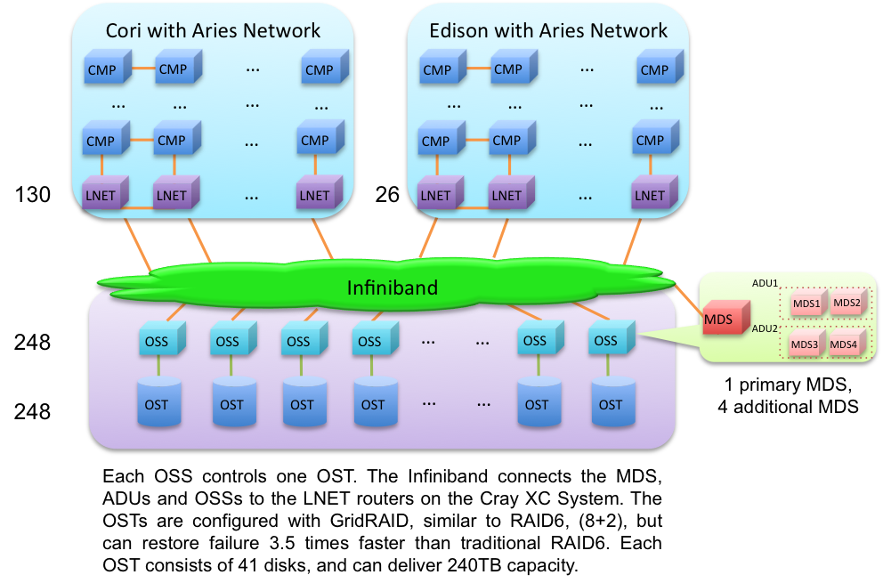
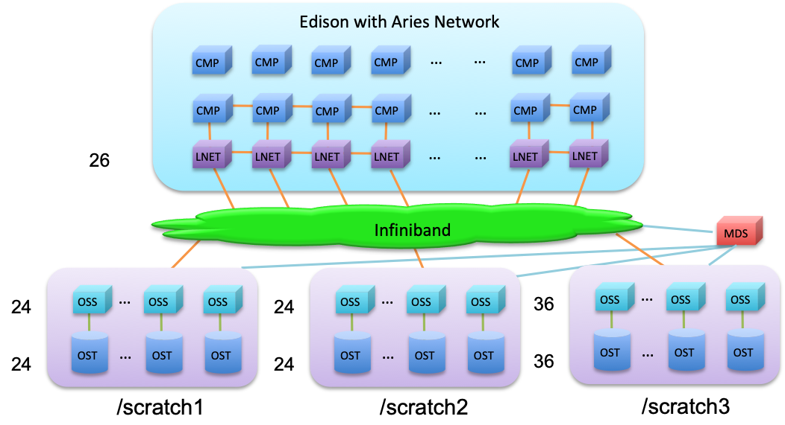
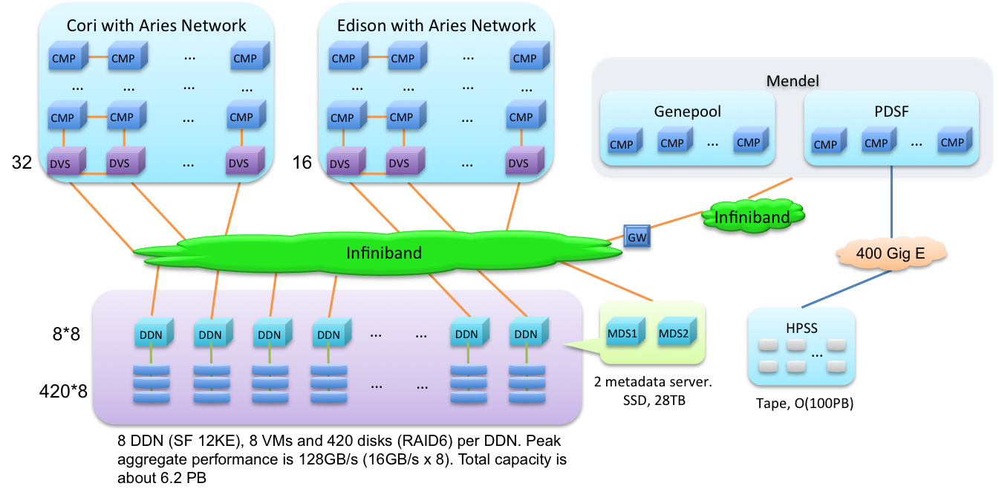

# Cori Scratch

# Edison Scratch
Edison was decomissioned on May 13, 2019.

# Project

# Abbreviations
|||
|:--:|-------------------------|
| CMP| Chip Multicore Processor|
| OSS|Object Storage Server: a component of a Lustre File System|
| OST|Object Storage Target: a component of a Lustre File System|
| LNET|Lustre network router|
| MDS| Metadata Server, manage file operation, e.g., create new file, write to shared file|
| DVS|Data Virtualization Server, Running a service to mount external storage to Cray systems|
| HPSS|High Performance Storage Systems|
| 400 Gig E|400 Gb/s Ethernet|
| GW|Gateway|
