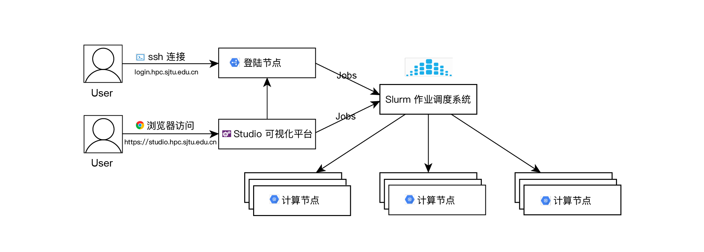

Slurm 作业调度系统
==================

`SLURM <http://slurm.schedmd.com/>`_ （Simple Linux Utility for Resource Management）是一种可扩展的工作负载管理器，已被全世界的国家超级计算机中心广泛采用。
它是免费且开源的，根据\ `GPL通用公共许可证 <http://www.gnu.org/licenses/gpl.html>`__\ 发行。

本文档将协助您通过 Slurm 管理作业。 在这里可以找到更多的工作样本。

如果我们可以提供任何帮助，请随时联系 \ `HPC 邮箱 <mailto:hpc@sjtu.edu.cn>`__\ 。

Slurm 概览
-----------

======== ==============================
Slurm    功能
======== ==============================
sinfo    π 集群状态
squeue   排队作业状态
sbatch   作业提交
scontrol 查看和修改作业参数
sacct    已完成作业报告
scancel  删除作业
======== ==============================

``sinfo`` 查看 π 集群状态
-------------------------

====================== ================
Slurm                   功能
====================== ================
sinfo -N               查看节点级信息
sinfo -N --states=idle 查看可用节点信息
sinfo --partition=cpu  查看队列信息
sinfo --help           查看所有选项
====================== ================

节点状态包括：

\ ``drain``\ (节点故障)，\ ``alloc``\ (节点在用)，\ ``idle``\ (节点可用)，\ ``down``\ (节点下线)，\ ``mix``\ (节点部分占用，但仍有剩余资源）。

π 集群设置以下队列，使用限制与说明如下

======= ====================================================================================================
队列名   说明
======= ====================================================================================================
cpu     允许单作业CPU核数为40~24000，每核配比4G内存，节点需独占使用；单节点配置为40核，192G内存
huge    允许单作业CPU核数为1~80，每核配比35G内存，节点可共享使用；单节点配置为80核，3T内存
192c6t  允许单作业CPU核数为1~192，每核配比31G内存，节点可共享使用；单节点配置为192核，6T内存
small   允许单作业CPU核数为1~35，每核配比4G内存，节点可共享使用；单节点配置为40核，192G内存
dgx2    允许单作业GPU卡数为1~128，推荐每卡配比CPU为6，每CPU配比15G内存；单节点配置为96核，1.45T内存，16块32G显存的V100卡 
======= ====================================================================================================

查看总体资源信息：

.. code:: bash

   $ sinfo
   PARTITION AVAIL  TIMELIMIT  NODES  STATE NODELIST
   cpu         up  30-00:00:0    656   idle cas[001-656]
   dgx2        up  30-00:00:0      8   idle vol[01-08]

``squeue`` 查看作业信息
----------------------------------

========================= ==========================
Slurm                     功能
========================= ==========================
squeue -j jobid           查看作业信息
squeue -l                 查看细节信息
squeue -n HOST            查看特定节点作业信息
squeue -A ACCOUNT_LIST    查看ACCOUNT_LIST的作业
squeue                    查看USER_LIST的作业
squeue --state=R          查看特定状态的作业
squeue --start            查看排队作业的估计开始时间
squeue --format=“LAYOUT”  使用给定的LAYOUT自定义输出
squeue --help             查看所有的选项
========================= ==========================

作业状态包括\ ``R``\ (正在运行)，\ ``PD``\ (正在排队)，\ ``CG``\ (即将完成)，\ ``CD``\ (已完成)。

默认情况下，\ ``squeue``\ 只会展示在排队或在运行的作业。

.. code:: bash

   $ squeue
   JOBID PARTITION     NAME     USER ST       TIME  NODES NODELIST(REASON)
   18046      dgx2   ZXLing     eenl  R    1:35:53      1 vol04
   17796      dgx2   python    eexdl  R 3-00:22:04      1 vol02

显示您自己账户下的作业：

.. code:: bash

   squeue
   JOBID PARTITION     NAME     USER ST       TIME  NODES NODELIST(REASON)
   17923      dgx2     bash    hpcwj  R 1-12:59:05      1 vol05

``-l``\ 选项可以显示更细节的信息。

.. code:: bash

   squeue
   JOBID PARTITION     NAME     USER    STATE       TIME TIME_LIMI  NODES NODELIST(REASON)
   17923      dgx2     bash    hpcwj  RUNNING 1-13:00:53 30-00:00:00    1 vol05

``SBATCH`` 作业提交
----------------------

准备作业脚本然后通过\ ``sbatch``\ 提交是 Slurm 的最常见用法。
为了将作业脚本提交给作业系统，Slurm 使用

.. code:: bash

   $ sbatch jobscript.slurm

Slurm 具有丰富的参数集。 以下最常用的。

+--------------------------------------+-----------------------------------------+
| Slurm                                | 含义                                    |
+======================================+=========================================+
| -n [count]                           | 总进程数                                |
+--------------------------------------+-----------------------------------------+
| --ntasks-per-node=[count]            | 每台节点上的进程数                      |
+--------------------------------------+-----------------------------------------+
| -p [partition]                       | 作业队列                                |
+--------------------------------------+-----------------------------------------+
| --job-name=[name]                    | 作业名                                  |
+--------------------------------------+-----------------------------------------+
| --output=[file_name]                 | 标准输出文件                            |
+--------------------------------------+-----------------------------------------+
| --error=[file_name]                  | 标准错误文件                            |
+--------------------------------------+-----------------------------------------+
| --time=[dd-hh:mm:ss]                 | 作业最大运行时长                        |
+--------------------------------------+-----------------------------------------+
| --exclusive                          | 独占节点                                |
+--------------------------------------+-----------------------------------------+
| --mail-type=[type]                   | 通知类型，可选 all, fail,               |
|                                      | end，分别对应全通知、故障通知、结束通知 |
+--------------------------------------+-----------------------------------------+
| --mail-user=[mail_address]           | 通知邮箱                                |
+--------------------------------------+-----------------------------------------+
| --nodelist=[nodes]                   | 偏好的作业节点                          |
+--------------------------------------+-----------------------------------------+
| --exclude=[nodes]                    | 避免的作业节点                          |
+--------------------------------------+-----------------------------------------+
| --depend=[state:job_id]              | 作业依赖                                |
+--------------------------------------+-----------------------------------------+
| --array=[array_spec]                 | 序列作业                                |
+--------------------------------------+-----------------------------------------+

这是一个名为\ ``cpu.slurm``\ 的作业脚本，该脚本向cpu队列申请1个节点40核，并在作业完成时通知。在此作业中执行的命令是\ ``/bin/hostname``\ 。

.. code:: bash

   #!/bin/bash

   #SBATCH --job-name=hostname
   #SBATCH --partition=cpu
   #SBATCH -N 1
   #SBATCH --mail-type=end
   #SBATCH --mail-user=YOU@EMAIL.COM
   #SBATCH --output=%j.out
   #SBATCH --error=%j.err

   /bin/hostname

用以下方式提交作业：

.. code:: bash

   sbatch cpu.slurm

``squeue``\ 可用于检查作业状态。用户可以在作业执行期间通过SSH登录到计算节点。输出将实时更新到文件[jobid]
.out和[jobid] .err。

这里展示一个更复杂的作业要求，其中将启动80个进程，每台主机40个进程。

.. code:: bash

   #!/bin/bash

   #SBATCH --job-name=LINPACK
   #SBATCH --partition=cpu
   #SBATCH -n 80
   #SBATCH --ntasks-per-node=40
   #SBATCH --mail-type=end
   #SBATCH --mail-user=YOU@EMAIL.COM
   #SBATCH --output=%j.out
   #SBATCH --error=%j.err

以下作业请求4张GPU卡，其中1个CPU进程管理1张GPU卡。

.. code:: bash

   #!/bin/bash

   #SBATCH --job-name=GPU_HPL
   #SBATCH --partition=dgx2
   #SBATCH -n 4
   #SBATCH --ntasks-per-node=4
   #SBATCH --gres=gpu:4
   #SBATCH --mail-type=end
   #SBATCH --mail-user=YOU@MAIL.COM
   #SBATCH --output=%j.out
   #SBATCH --error=%j.err

以下作业启动一个3任务序列（从0到2），每个任务需要1个CPU内核。关于 π 集群上的Python，您可以查阅我们的\ `Python文档 <https://docs.hpc.sjtu.edu.cn/application/Python/>`__\ 。

.. code:: bash

   #!/bin/bash

   #SBATCH --job-name=python_array
   #SBATCH --mail-user=YOU@MAIL.COM
   #SBATCH --mail-type=ALL
   #SBATCH --ntasks=1
   #SBATCH --time=00:30:00
   #SBATCH --array=0-2
   #SBATCH --output=python_array_%A_%a.out
   #SBATCH --output=python_array_%A_%a.err

   module load miniconda2/4.6.14-gcc-4.8.5

   source activate YOUR_ENV_NAME

   echo "SLURM_JOBID: " $SLURM_JOBID
   echo "SLURM_ARRAY_TASK_ID: " $SLURM_ARRAY_TASK_ID
   echo "SLURM_ARRAY_JOB_ID: " $SLURM_ARRAY_JOB_ID

   python < vec_${SLURM_ARRAY_TASK_ID}.py

``srun`` 和 ``salloc``  交互式作业
---------------------------------------

``srun``\ 可以启动交互式作业。该操作将阻塞，直到完成或终止。例如，在计算主机上运行\ ``hostname``\ 。

.. code:: bash

   $ srun -N 1 -n 4 -p small hostname
   cas006

启动远程主机bash终端：

.. code:: bash

   srun -p small -n 4 --exclusive --pty /bin/bash

或者，可以通过\ ``salloc``\ 请求资源，然后在获取节点后登录到计算节点：

.. code:: bash

   salloc -N 1 -n 4 -p small
   ssh casxxx

``scontrol``: 查看和修改作业参数

+-----------------------------------+-----------------------------------+
| Slurm                             | 功能                              |
+===================================+===================================+
| scontrol show job JOB_ID          | 查看排队或正在运行的作业的信息    |
+-----------------------------------+-----------------------------------+
| scontrol hold JOB_ID              | 暂停JOB_ID                        |
+-----------------------------------+-----------------------------------+
| scontrol release JOB_ID           | 恢复JOB_ID                        |
+-----------------------------------+-----------------------------------+
| scontrol update dependency=JOB_ID | 添加作业依赖性                    |
|                                   | ，以便仅在JOB_ID完成后才开始作业  |
+-----------------------------------+-----------------------------------+
| scontrol --help                   | 查看所有选项                      |
+-----------------------------------+-----------------------------------+

``sacct`` 查看作业记录

======================= ====================================
Slurm                   功能
======================= ====================================
sacct -l                查看详细的帐户作业信息
sacct --states=R        查看具有特定状态的作业的账号作业信息
sacct -S YYYY-MM-DD     在指定时间后选择处于任意状态的作业
sacct --format=“LAYOUT” 使用给定的LAYOUT自定义sacct输出
sacct --help            查看所有选项
======================= ====================================

默认情况下，sacct显示过去 **24小时** 的账号作业信息。

.. code:: bash

   $ sacct

查看更多的信息：

.. code:: bash

   $ sacct --format=jobid,jobname,account,partition,ntasks,alloccpus,elapsed,state,exitcode -j 3224

查看平均作业内存消耗和最大内存消耗：

.. code:: bash

   $ sacct --format="JobId,AveRSS,MaxRSS" -P -j xxx

Slurm环境变量
-------------

====================== ==========================
Slurm                  功能
====================== ==========================
$SLURM_JOB_ID          作业ID
$SLURM_JOB_NAME        作业名
$SLURM_JOB_PARTITION   队列的名称
$SLURM_NTASKS          进程总数
$SLURM_NTASKS_PER_NODE 每个节点请求的任务数
$SLURM_JOB_NUM_NODES   节点数
$SLURM_JOB_NODELIST    节点列表
$SLURM_LOCALID         作业中流程的节点本地任务ID
$SLURM_ARRAY_TASK_ID   作业序列中的任务ID
$SLURM_SUBMIT_DIR      工作目录
$SLURM_SUBMIT_HOST     提交作业的主机名
====================== ==========================

参考资料
--------

-  `SLURM Workload Manager <http://slurm.schedmd.com>`__
-  `ACCRE’s SLURM
   Documentation <http://www.accre.vanderbilt.edu/?page_id=2154>`__
-  `Introduction to SLURM (NCCS lunchtime
   series) <http://www.nccs.nasa.gov/images/intro-to-slurm-20131218.pdf>`__