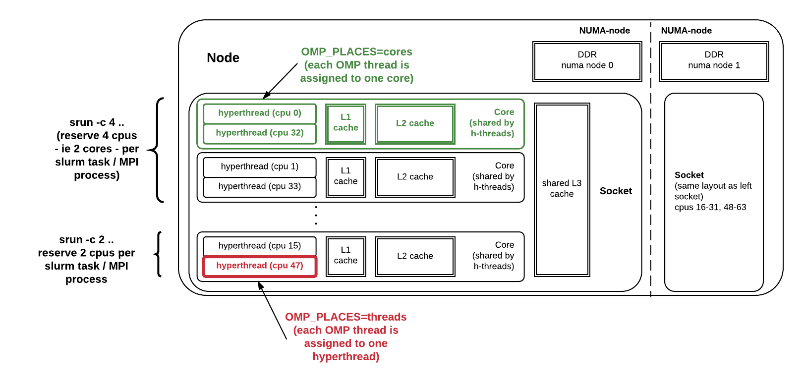
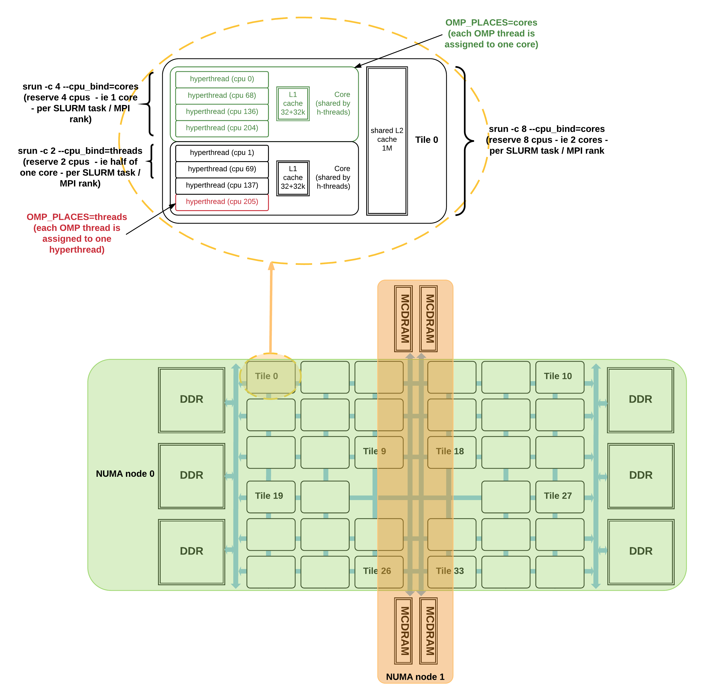

# Process and Thread Affinity

## Introduction

Process affinity (or CPU pinning) means to bind MPI process to a CPU or a range of CPUs on the node.  It is important to spread MPI ranks evenly onto different NUMA nodes. Thread affinity forces each process or thread to run on a specific subset of processors, to take advantage of local process state. Correct process and thread affinity is essential for getting optimal performance.

Each Haswell node contains 2 processors, there is 1 socket per processor, thus 2 sockets per node.  Each processor has 16 cores, and each core has 2 hyperthreads. See Figure 1 below.

<a name="fig1"></a>


*Fig 1: CPUs, cores and sockets on a Haswell (Cori Phase 1) node.*

A Cori KNL node has 68 cores, 4 hyperthreads (cpus) per core and an additional level of hierarchy: each pair of cores share an L2 cache on a tile. The node is a single socket, but its tiles can be organized as 1, 2 or 4 NUMA nodes. Moreover, the MCDRAM can be used as an invisible-to-the-OS cache, or as one or more NUMA nodes. Figure 2 below illustrates a KNL node in "quad,flat" mode, in which all cpus share a single NUMA node with the DDR memory, and the MCDRAM is configured as a separate NUMA node. (Note that tile numbering here is illustrative, not accurate).

<a name="fig2"></a>


*Fig 2: CPUs, cores and tiles on a KNL (Cori Phase 2) node in "quad,flat" mode*


## Recommendations

1) Use the "-n" flag for srun. Set the value to total number of MPI tasks for the job.

2) Use the "-c" flag for srun. Set the value as "number of of logical cores (CPUs) per MPI task" for MPI and hybrid MPI/OpenMP jobs. The "-c" flag is optional for fully packed pure MPI jobs.

On Haswell, there are a total of 32 physical cores (each with 2 hyperthreads, making 64 logical cpus total), so the value of "-c" should be set to 64/#MPI_per_node. For example, to use 16 MPI tasks per node, the "-c" value should be set to 64/16=4. If the#MPI_per_node is not a divisor of 64, the "-c" value should be set to floor (32/#MPI_per_node)*2. For example, to run with 12 MPI tasks per node, the "-c" value should be set to floor (32/12)*2 = 4.

On KNL, there are a total of 68 physical cores (with 4 hyperthreads, it is 272 logical cpus total), so the value of "-c" should be set to 68*4/#MPI_per_node. For example, to use 34 MPI tasks per node, the "-c" value should be set to 68*4/34=8. If #MPI_per_node is not a divisor of 68, the "-c" value should be set to floor (68 / #MPI_per_node)*4. For example, to run with 8 MPI tasks per node, the "-c" value should be set to floor (68/8)*4 = 32, or just think as using a total of 64 physical cores only, and set -c value as 64*4/8=32.

3) If #MPI tasks per node is not a divisor of 64 on Haswell (meaning the node is not fully packed), need to add an srun flag "--cpu_bind=cores". Add "--cpu_bind=threads" instead if #MPI_per_node > 32.    In most cases for KNL, when use only 64 cores out of 68 cores, --cpu_bind is needed.

4) Set OMP_NUM_THREADS environment variable to number of OpenMP threads per MPI task.

5) Recommend to set run time environment variable for hybrid MPI/OpenMP jobs: OMP_PROC_BIND (mostly set to "true" or "spread") and OMP_PLACES (mostly set to "threads" or "cores"). These are useful for fine tuning thread affinity.

6) Recommend to use the [Slurm bcast option](/jobs/best-practices/) for large jobs to copy executables to the compute nodes before jobs starting.  See details here.

7) Recommend to use the [core specialization](/jobs/best-practices/) feature to isloate system overhead to specific cores.


## Job Script Generator

An interactive [Job Script Generator](https://my.nersc.gov/script_generator.php) is available at MyNERSC to provide some guidance on getting optimal process and thread binding on Edison, Cori Haswell, and Cori KNL.

## Methods to Check Process and Thread Affinity

Pre-built binaries from a small test code (xthi.c) with pure MPI or hybrid MPI/OpenMP can be used to check affinity.   Binaries are in users default path, and named as such: check-mpi.<compiler>.<machine> (pure MPI), or check-hybrid.<compiler>.<machine> (hybrid MPI/OpenMP), for example: check-mpi.intel.cori, check-hybrid.intel.cori, check-mpi.gnu.cori, check-hybrid.gnu.cori, etc.   Run one of the small test binaries using the same choices of number of nodes, MPI tasks, and OpenMP threads as what your application will use, and check if the desired binding is obtained. The Cori binaries can be used to check for both Haswell or KNL, since binaries are compatible.

Alternatively an srun flag "--cpu_bind=verbose" can be added to report process and thread binding.

Or you can set the following run time environment to obtain affinity information as part of the job stdout:

```
export KMP_AFFINITY=verbose   (for Intel compiler)
export CRAY_OMP_CHECK_AFFINITY=TRUE   (for CCE compiler)
```


