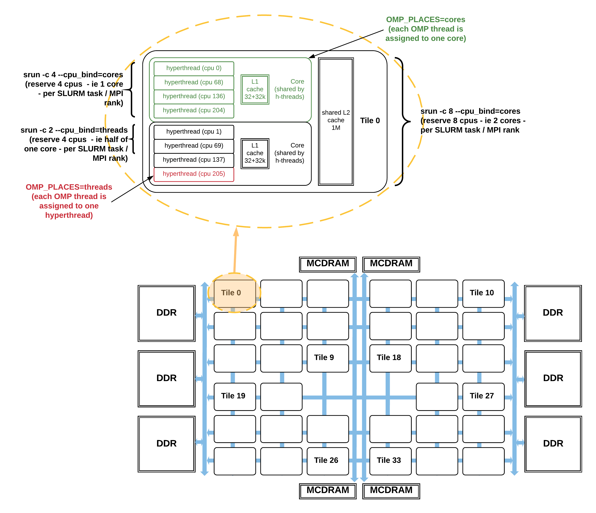

# Process and Thread Affinity

## Introduction

[Process affinity](https://en.wikipedia.org/wiki/Processor_affinity)
(or CPU pinning) means to bind each MPI process to a CPU or a range of
CPUs on the node.  It is important to spread MPI processes evenly onto
different NUMA nodes.

Thread affinity means to map threads onto a particular subset of CPUs
(called "places") that belong to the parent process (such as an MPI
process) and to bind them to these places so the OS cannot migrate
them to different places. It helps to take advantage of the local
process state and to achieve better memory locality.

Memory locality is the degree to which data resides in memory that is
close to the processors/threads working with the data.

Modern processors have multiple sockets
and
[NUMA (Non-Uniform Memory Access)](https://en.wikipedia.org/wiki/Non-uniform_memory_access) domains.
Threads accessing memory in a remote NUMA domain is slower than
accessing memory in a local NUMA domain.

Improper process and thread affinity could slow down code performance
significantly. A combination of OpenMP environment variables and
runtime flags are needed for different compilers and for the batch
scheduler used on the system.

Figure 1 below illustrates a Haswell compute node. Each node contains
2 processors; There is 1 socket per processor, thus 2 sockets per
node. Each processor has 16 cores, and each core has 2
hyperthreads. Socket 1 has physical cores 0 to 15, and socket 2 has
physical cores 16 to 31.  Core 0 has 2 hyperthreads, with the logical
CPUs numbered as 0 and 32; Core 1 has logical CPUs of 1 and 33, and so
on.  When OMP_PLACES is set to "cores", each OpenMP thread binds to
one core; And when OMP_PLACES is set to "threads", each OpenMP thread
binds to one hyperthread.

<a name="fig1"></a> 

*Fig 1: CPUs, cores, and sockets on a Cori Haswell node.*

Below is the "numactl -H" result from a Haswell compute node:

```
% numactl -H 
available: 2 nodes (0-1)
node 0 cpus: 0 1 2 3 4 5 6 7 8 9 10 11 12 13 14 15 32 33 34 35 36 37 38 39 40 
41 42 43 44 45 46 47
node 0 size: 64430 MB
node 0 free: 63002 MB
node 1 cpus: 16 17 18 19 20 21 22 23 24 25 26 27 28 29 30 31 48 49 50 51 52 53
54 55 56 57 58 59 60 61 62 63
node 1 size: 64635 MB
node 1 free: 63395 MB
node distances:node   0   1
0:  10  21
1:  21  10 
```

It reports that each Haswell compute node is composed of 2 NUMA
"nodes" (i.e., NUMA domains 0 and 1).  NUMA node 0 has logical CPUs
0-15 and 32-47. NUMA node 1 has logical CPUs 16-31 and 48-63. The tool
also reports the total and available memory sizes on each NUMA domain
and the relative distances from CPUs on each NUMA domain to access
memory in both NUMA domains.  Memory distance from NUMA domain 0 to 0
or 1 to 1 is closer than between NUMA domains 0 and 1.  Note that the
values 10 and 21 are relative numbers; they do not necessarily mean
that the ratio of the distances is exactly 21 to 10.

A Cori KNL node has 68 cores, 4 hyperthreads (cpus) per core and an
additional level of hierarchy: each pair of cores share an L2 cache on
a tile. The node is a single socket.  Depending on the KNL mode a node
is configured, its tiles can be organized as 1, 2 or 4 NUMA
nodes. Moreover, the MCDRAM can be used as an invisible-to-the-OS
cache, or as one or more NUMA nodes.

Figure 2 below illustrates a KNL node in the "quad,cache" mode, in
which all cpus share a single NUMA node with the DDR memory, and the
MCDRAM is used as cache so is not considered as a separate NUMA
node. (Note that tile numbering here is illustrative, not accurate).

<a name="fig2"></a>


*Fig 2: CPUs, cores, and tiles on a Cori KNL node in "quad,cache" mode*

Below is the "numactl -H" result from a KNL "quad,cache" compute node:

```
% numactl -H 
available: 1 nodes (0)
node 0 cpus: 0 1 2 3 4 5 6 7 8 9 10 11 12 13 14 15 16 17 18 19 20 21 22 23 24 
25 26 27 28 29 30 31 32 33 34 35 36 37 38 39 40 41 42 43 44 45 46 47 48 49 50
51 52 53 54 55 56 57 58 59 60 61 62 63 64 65 66 67 68 69 70 71 72 73 74 75 76
77 78 79 80 81 82 83 84 85 86 87 88 89 90 91 92 93 94 95 96 97 98 99 100 101
102 103 104 105 106 107 108 109 110 111 112 113 114 115 116 117 118 119 120 121
122 123 124 125 126 127 128 129 130 131 132 133 134 135 136 137 138 139 140 141
142 143 144 145 146 147 148 149 150 151 152 153 154 155 156 157 158 159 160 161
162 163 164 165 166 167 168 169 170 171 172 173 174 175 176 177 178 179 180 181
182 183 184 185 186 187 188 189 190 191 192 193 194 195 196 197 198 199 200 201
202 203 204 205 206 207 208 209 210 211 212 213 214 215 216 217 218 219 220 221
222 223 224 225 226 227 228 229 230 231 232 233 234 235 236 237 238 239 240 241
242 243 244 245 246 247 248 249 250 251 252 253 254 255 256 257 258 259 260 261
262 263 264 265 266 267 268 269 270 271
node 0 size: 96527 MB
node 0 free: 93656 MB
node distances:
node   0 
  0:  10 
```

Each KNL "quad,cache" compute node has only a single NUMA "node"
(i.e., NUMA domains 0), which has logical CPUs 0 to 271, i.e., all the
logical CPUs on the 68 physical cores. The KNL compute node has 96 GB
of memory, and the 16GB MCDRAM is "invisible" as cache memory.

It is essential that we understand the compute node schemes of the
compute nodes and how the CPUs of each core and hardware threads are
numbered on a node.  We then use this information to help us better
understand the runtime report of process and thread affinity result to
ensure the optimal binding is achieved.  A general recommendation is
to have at least one MPI rank per NUMA domain, and use OpenMP thread
parallelism inside a NUMA domain so the data each thread works on are
within the same NUMA domain.

## OpenMP Environment Variables

### `OMP_PLACES`

`OMP_PLACES` defines a list of places that threads can be pinned
on. It is used for complex layouts of threads. The possible values
are:

* **threads**: Each place corresponds to a single hardware thread on
  the target machine.
* **cores**: Each place corresponds to a single core (having one or
  more hardware threads) on the target machine.
* **sockets**: Each place corresponds to a single socket (consisting
  of one or more cores) on the target machine.
* **A list** with explicit place values: such as:
  "{0,1,2,3},{4,5,6,7},{8,9,10,11},{12,13,14,15}” or
  “{0:4},{4:4},{8:4},{12:4}” can also be used. It has the following
  form "{lower-bound:length:stride}" Thus, specifying "{0:3:2}" is the
  same as specifying "{0,2,4}". Multiple locations can be included in
  a place.

On Cori, it is recommended to set `OMP_PLACES=threads` or
`OMP_PLACES=cores`.

### `OMP_PROC_BIND`

`OMP_PROC_BIND` sets the binding of threads to processors. The options
are:

* **true**: Thread affinity is enabled with an implementation-defined
  default place list.
* **false**: Thread affinity is disabled.
* **spread**: Bind threads as evenly distributed (spread) as possible.
* **close**: Bind threads close to the master thread while still
  distributing threads for load balancing.
* **master**: Bind threads to the same place as the master thread.

On Cori, it is recommended to set `OMP_PROC_BIND=true` or
`OMP_PROC_BIND=spread`.

### `OMP_NUM_THREADS`

`OMP_NUM_THREADS` sets the number of threads to be used for the OpenMP
parallel regions.

## Slurm Options

* **srun option "-n"**: Set the value to total number of MPI
   tasks for the job.

!!! warning 
	It is rare to get good performance when using more
	MPI ranks than physical cores.

* **srun option "-c"**: Set the value as "number of logical
   cores (CPUs) per MPI task" for MPI and hybrid MPI/OpenMP jobs. The
   "-c" flag is optional for fully packed pure MPI jobs.

   On Haswell, there are a total of 32 physical cores (each with 2
   hyperthreads, so 64 logical cpus total), the value of "-c" should
   be set to "64/#MPI\_tasks\_per_node". For example, to use 16 MPI
   tasks per node, the "-c" value should be set to 64/16, which
   is 4. If the #MPI\_tasks\_per\_node is not a divisor of 64, the
   "-c" value should be set to
   "floor(32/#MPI\_tasks\_per\_node)\*2". For example, to run with 12
   MPI tasks per node, the "-c" value should be set to
   "floor(32/12)\*2", which is 4.

   On KNL, there are a total of 68 physical cores (each with 4
   hyperthreads, so 272 logical cpus total), the value of "-c"
   should be set to "68\*4/#MPI\_tasks\_per\_node". For example, to use 34 MPI
   tasks per node, the "-c" value should be set to 68\*4/34, which is
   8. If #MPI\_tasks\_per\_node is not a divisor of 68, the "-c" value
   should be set to "floor(68 /#MPI\_tasks\_per\_node)\*4". For
   example, to run with 8 MPI tasks per node, the "-c" value should be
   set to "floor(68/8)\*4", which is 32, or just simply calculate as
   using a total of 64 physical cores only, and set "-c" value as
   64\*4/8, which is 32.

*  **srun option "--cpu-bind"**: If #MPI tasks per node is not a
   divisor of 64 on Haswell (meaning the node is not fully packed), an
   additional srun flag "--cpu-bind=cores" is needed. Add
   "--cpu-bind=threads" instead if #MPI_per_node > 32.  In most cases
   for KNL, we use only 64 cores out of 68 cores, so "--cpu-bind" is
   needed.

* **sbcast**: Use the [Slurm bcast option](../best-practices.md) for large jobs
   to copy executables to the compute nodes before jobs starting.

* **SBATCH or srun `-S` option**: Use
   the [core specialization](../best-practices.md) feature to isolate
   system overhead to specific cores.

## Job Script Generator

An
interactive
[Job Script Generator](https://my.nersc.gov/script_generator.php) is
available at [MyNERSC](https://my.nersc.gov/) to provide some guidance
on getting optimal process and thread binding on Cori Haswell and Cori
KNL. It is a GUI tool that allows you to input the Slurm parameters of
your intended application run, and get a job script template.

## Methods to Check Process and Thread Affinity

### Use NERSC Prebuilt Binaries

Pre-built binaries from a small test code xthi.c
with [pure MPI](xthi-mpi.c) or [hybrid MPI/OpenMP](xthi.c) can be used
to check affinity.  Binaries are in users default path, and named as
such: `check-mpi.<compiler>.<machine>` (MPI), or
`check-hybrid.<compiler>.<machine>` (MPI/OpenMP), for example:
`check-mpi.intel.cori`, `check-hybrid.intel.cori`,
`check-mpi.gnu.cori`, `check-hybrid.gnu.cori`, etc. The Cori binaries
can be used to check both Haswell or KNL.
 
It is recommended that you replace your application executable with
one of the small test binaries, and run with the exact same number of
nodes, MPI tasks, and OpenMP threads as those your application will
use and check if the desired binding is obtained.

Below is sample output (with interleaved notes) on Cori Haswell with
an interactive batch session with various tests from differenet
settings.  The test results report that for each MPI rank, which node
it runs on; and for each OpenMP thread that belongs to each MPI rank,
which logical CPUs it binds to.

#### MPI example

8 MPI ranks on one node. Using the correct `-n`, `-c`, and
`--cpu-bind=cores` options, the MPI tasks are spread out, and bind to
both sockets on the Haswell node. MPI ranks 0,2,4,6 are on the first
socket, and MPI ranks 1,3,5,7 are on the second socket. Each MPI rank
binds to 4 physical CPUs (which has 8 logical CPUs total). For
example, MPI rank 0 binds to physical cores 0-3, which includes
logical CPUs 0-3,32-25.

```slurm
cori$ salloc -N 1 -C haswell --qos=interactive -t 20:00
salloc: Pending job allocation
21541802 salloc: job 21541802 queued and waiting for resources salloc:
job 21541802 has been allocated resources salloc: Granted job
allocation 21541802
 
elvis@nid00224:~> srun -n 8 -c 8 --cpu-bind=cores check-mpi.intel.cori
Hello from rank 0, on nid00224. (core affinity = 0-3,32-35)
Hello from rank 1, on nid00224. (core affinity = 16-19,48-51)
Hello from rank 2, on nid00224. (core affinity = 4-7,36-39)
Hello from rank 3, on nid00224. (core affinity = 20-23,52-55)
Hello from rank 4, on nid00224. (core affinity = 8-11,40-43)
Hello from rank 5, on nid00224. (core affinity = 24-27,56-59)
Hello from rank 6, on nid00224. (core affinity = 12-15,44-47)
Hello from rank 7, on nid00224. (core affinity = 28-31,60-63)
```

#### MPI/OpenMP example

8 MPI tasks, 4 OpenMP threads per MPI task. You could see the MPI
tasks are again spread out on both sockets.  Setting
`OMP_PLACES=threads` will result in each thread bind to a specific
hyperthread (a unique logical CPU as reported by Slurm).  For GNU
compiler, we set `OMP_PROC_BIND=true`, it spreads out the threads onto
CPUs.

```slurm
elvis@nid00224:~> export OMP_NUM_THREADS=4
elvis@nid00224:~> export OMP_PLACES=threads
elvis@nid00224:~> export OMP_PROC_BIND=true
elvis@nid00224:~> srun -n 8 -c 8 --cpu-bind=cores check-hybrid.gnu.cori |sort -k 4,6
Hello from rank 0, thread 0, on nid00224. (core affinity = 0)
Hello from rank 0, thread 1, on nid00224. (core affinity = 1)
Hello from rank 0, thread 2, on nid00224. (core affinity = 2)
Hello from rank 0, thread 3, on nid00224. (core affinity = 3)
Hello from rank 1, thread 0, on nid00224. (core affinity = 16)
Hello from rank 1, thread 1, on nid00224. (core affinity = 17)
Hello from rank 1, thread 2, on nid00224. (core affinity = 18)
Hello from rank 1, thread 3, on nid00224. (core affinity = 19)
Hello from rank 2, thread 0, on nid00224. (core affinity = 4)
Hello from rank 2, thread 1, on nid00224. (core affinity = 5)
Hello from rank 2, thread 2, on nid00224. (core affinity = 6)
Hello from rank 2, thread 3, on nid00224. (core affinity = 7)
Hello from rank 3, thread 0, on nid00224. (core affinity = 20)
Hello from rank 3, thread 1, on nid00224. (core affinity = 21)
Hello from rank 3, thread 2, on nid00224. (core affinity = 22)
Hello from rank 3, thread 3, on nid00224. (core affinity = 23)
Hello from rank 4, thread 0, on nid00224. (core affinity = 8)
Hello from rank 4, thread 1, on nid00224. (core affinity = 9)
Hello from rank 4, thread 2, on nid00224. (core affinity = 10)
Hello from rank 4, thread 3, on nid00224. (core affinity = 11)
Hello from rank 5, thread 0, on nid00224. (core affinity = 24)
Hello from rank 5, thread 1, on nid00224. (core affinity = 25)
Hello from rank 5, thread 2, on nid00224. (core affinity = 26)
Hello from rank 5, thread 3, on nid00224. (core affinity = 27)
Hello from rank 6, thread 0, on nid00224. (core affinity = 12)
Hello from rank 6, thread 1, on nid00224. (core affinity = 13)
Hello from rank 6, thread 2, on nid00224. (core affinity = 14)
Hello from rank 6, thread 3, on nid00224. (core affinity = 15)
Hello from rank 7, thread 0, on nid00224. (core affinity = 28)
Hello from rank 7, thread 1, on nid00224. (core affinity = 29)
Hello from rank 7, thread 2, on nid00224. (core affinity = 30)
Hello from rank 7, thread 3, on nid00224. (core affinity = 31)
```

#### MPI/OpenMP example 2

Below is another hybrid MPI/OpenMP example. 4 MPI tasks, 4 OpenMP
threads per MPI task. You could see the MPI tasks are again spread out
on both sockets. Setting `OMP_PLACES=cores` will result in each thread
bind to a specific core (on Haswell, it has 2 logical CPUs on a
physical core as reported by Slurm). For Intel compiler, we set
`OMP_PROC_BIND=spread`.

```
elvis@nid00224:~> export OMP_NUM_THREADS=4
elvis@nid00224:~> export OMP_PLACES=cores
elvis@nid00224:~> export OMP_PROC_BIND=spread
elvis@nid00224:~> srun -n 4 -c 16 --cpu-bind=cores check-hybrid.intel.cori |sort -k 4,6
Hello from rank 0, thread 0, on nid00224. (core affinity = 0,32)
Hello from rank 0, thread 1, on nid00224. (core affinity = 2,34)
Hello from rank 0, thread 2, on nid00224. (core affinity = 4,36)
Hello from rank 0, thread 3, on nid00224. (core affinity = 6,38)
Hello from rank 1, thread 0, on nid00224. (core affinity = 16,48)
Hello from rank 1, thread 1, on nid00224. (core affinity = 18,50)
Hello from rank 1, thread 2, on nid00224. (core affinity = 20,52)
Hello from rank 1, thread 3, on nid00224. (core affinity = 22,54)
Hello from rank 2, thread 0, on nid00224. (core affinity = 8,40)
Hello from rank 2, thread 1, on nid00224. (core affinity = 10,42)
Hello from rank 2, thread 2, on nid00224. (core affinity = 12,44)
Hello from rank 2, thread 3, on nid00224. (core affinity = 14,46)
Hello from rank 3, thread 0, on nid00224. (core affinity = 24,56)
Hello from rank 3, thread 1, on nid00224. (core affinity = 26,58)
Hello from rank 3, thread 2, on nid00224. (core affinity = 28,60)
Hello from rank 3, thread 3, on nid00224. (core affinity = 30,62)
```

### Use OpenMP 5.0 Environment Variables

A runtime thread affinity display feature is now included in the
OpenMP 5.0 standard. This feature allows more portable and standard
thread affinity display info across all compilers. It is available now
for Intel compiler (18.0.5 and newer), and will be available soon for
gcc (9.0 and newer) and CCE (9.0 and newer) on Cori:

The runtime display OpenMP thread affinity feature is enabled with two
environment variables:

* `OMP_DISPLAY_AFFINITY`: set to TRUE or FALSE. Setting this to true
  will cause the system to display affinity information for all OpenMP
  threads when entering the first parallel region and when any thread
  affinity information changes in subsequent parallel regions.

* `OMP_AFFINITY_FORMAT`: set to a string that defines the output
  affinity values that will be output and the format used when
  displaying them.

The format for each field is: `%[[[0].]size]type`, where size defines
the number of characters used for an output field and type indicates
the information to output. The period indicates that the values are to
be right-justified (the default is left-justified) and the 0 indicates
that you want leading zeros to be included.

Some sample `OMP_AFFINITY_FORMAT` strings are:

```shell
OMP_AFFINITY_FORMAT="host=%H, pid=%P, thread_num=%n, thread affinity=%A"
```

```shell
OMP_AFFINITY_FORMAT="Thread Level=%0.3L, Parent TLevel=%5a, thread_num=%5n, thread_affinity=%15A, host=%10H”
```

Not specifying a size for each field allows it to expand the display result as needed. Notice this is an OpenMP only feature, so it does not have specific info on MPI ranks, etc.  The host and pid fields are useful in identifying all the OpenMP threads belong to the same MPI task.

There are also `omp_display_affinity()` and `omp_capture_affinity()`
APIs available that you could call from specific threads. Details for
the available display affinity fields (with short and long names) and
runtime APIs are
in
[OpenMP 5.0 Specification](https://www.openmp.org/wp-content/uploads/OpenMP-API-Specification-5.0.pdf) and
in the OpenMP 5.0 Examples document.

Below is sample output on Cori KNL (using intel/19.0.3.199, with a
sample code [hybrid-hello.f90](hybrid-hello.f90) with the code output
commented out). You could see that with `OMP_PROC_BIND=spread`, the
OpenMP threads are evenly spread out, and with `OMP_PLACES=threads`,
each thread binds to a specific hyperthread on a core; and with
`OMP_PLACES=cores`, each thread binds to a specific core, and is
allowed to freely migrate within the core on any of the hyperthreads
(as reported as logical CPUs by Slurm. For example, logical CPUs
0,68,136,204 are all on physical core 0).

```
cori$ module swap intel intel/19.0.3.199
cori$ ftn -qopenmp -o hybrid-hello hybrid-hello.f90
```

Then either in the batch script of in an interactive session set the
appropriate variables before the `srun` command.

```
export OMP_NUM_THREADS=2
export OMP_PROC_BIND=spread
export OMP_PLACES=threads
export OMP_DISPLAY_AFFINITY=true
export OMP_AFFINITY_FORMAT="host=%H, pid=%P, thread_num=%n, thread affinity=%A"
```

```
$ srun -n 8 -c 32 --cpu-bind=cores ./hybrid-hello |sort -k1,3
host=nid02496, pid=150147, thread_num=0, thread affinity=0
host=nid02496, pid=150147, thread_num=1, thread affinity=4
host=nid02496, pid=150148, thread_num=0, thread affinity=8
host=nid02496, pid=150148, thread_num=1, thread affinity=12
host=nid02496, pid=150149, thread_num=0, thread affinity=16
host=nid02496, pid=150149, thread_num=1, thread affinity=20
host=nid02496, pid=150150, thread_num=0, thread affinity=24
host=nid02496, pid=150150, thread_num=1, thread affinity=28
host=nid02496, pid=150151, thread_num=0, thread affinity=32
host=nid02496, pid=150151, thread_num=1, thread affinity=36
host=nid02496, pid=150152, thread_num=0, thread affinity=40
host=nid02496, pid=150152, thread_num=1, thread affinity=44
host=nid02496, pid=150153, thread_num=0, thread affinity=48
host=nid02496, pid=150153, thread_num=1, thread affinity=52
host=nid02496, pid=150154, thread_num=0, thread affinity=56
host=nid02496, pid=150154, thread_num=1, thread affinity=60
```

```
$ export OMP_PLACES=cores
$ srun -n 8 -c 32 --cpu-bind=cores ./hybrid-hello |sort -k1,3
host=nid02496, pid=150071, thread_num=0, thread affinity=0,68,136,204
host=nid02496, pid=150071, thread_num=1, thread affinity=4,72,140,208
host=nid02496, pid=150072, thread_num=0, thread affinity=8,76,144,212
host=nid02496, pid=150072, thread_num=1, thread affinity=12,80,148,216
host=nid02496, pid=150073, thread_num=0, thread affinity=16,84,152,220
host=nid02496, pid=150073, thread_num=1, thread affinity=20,88,156,224
host=nid02496, pid=150074, thread_num=0, thread affinity=24,92,160,228
host=nid02496, pid=150074, thread_num=1, thread affinity=28,96,164,232
host=nid02496, pid=150075, thread_num=0, thread affinity=32,100,168,236
host=nid02496, pid=150075, thread_num=1, thread affinity=36,104,172,240
host=nid02496, pid=150076, thread_num=0, thread affinity=40,108,176,244
host=nid02496, pid=150076, thread_num=1, thread affinity=44,112,180,248
host=nid02496, pid=150077, thread_num=0, thread affinity=48,116,184,252
host=nid02496, pid=150077, thread_num=1, thread affinity=52,120,188,256
host=nid02496, pid=150078, thread_num=0, thread affinity=56,124,192,260
host=nid02496, pid=150078, thread_num=1, thread affinity=60,128,196,264
```

### Slurm cpu-bind flag

The srun flag `--cpu-bind=verbose` can be used to report process and
thread binding.  This option is recommended for advanced users only to
interpret the "mask" output for CPUs on the node, such as:

```
cpu-bind=MASK - nid02496, task  0  0 [151947]: mask 0xff000000000000000ff000000000000000ff000000000000000ff set
cpu-bind=MASK - nid02496, task  1  1 [151948]: mask 0xff000000000000000ff000000000000000ff000000000000000ff00 set
```

### Compiler Specific Environment Variables

Or you can set the following runtime environment to obtain affinity
information as part of the job stdout:

#### Intel

```shell
export KMP_AFFINITY=verbose
```

#### Cray CCE

```shell
export CRAY_OMP_CHECK_AFFINITY=TRUE
```

The results from each compiler have different formats and are not
portable.
