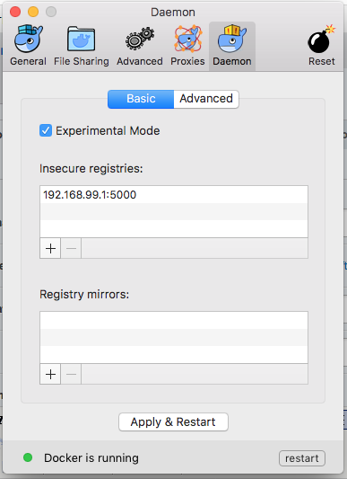

#Using Shifter at NERSC

Shifter is a software package that allows user-created images to run at NERSC. These images can be Docker images or other formats. Using Shifter you can create an image with your desired operating system and easily install your software stacks and dependencies. If you make your image in Docker, it can also be run at any other computing center that is Docker friendly. Shifter also comes with improvements in performance, especially for shared libraries. It is currently the best performing option for python code stacks across multiple nodes. Also, Shifter can leverage its volume mounting capabilities to provide local-disk like functionality and IO performance.
Shifter functionality at NERSC is undergoing rapid development and is an experimental service. Usage will change over time, we will do our best to keep the documentation up to date, but there may be inconsistencies.
Currently, Shifter images can only be accessed via the batch system on Edison and Cori and are visible to all users.

##Building Shifter Images

The easiest way to create a Shifter image is with [Docker](https://www.docker.com). You can run Docker on your laptop or local node (see the Docker [Getting Started](https://docs.docker.com/get-started) page for help setting up and running Docker). You can create a Docker image with your desired software and operating system.

When you're building images it's better to try to keep the image as compact as possible. This will decrease the time to upload the image to Docker Hub and to upload it into the Shifter framework. Images larger than about 20GB will likely timeout when uploading to Docker Hub. You can keep image size down by removing software source tarballs after you install them and by limiting images to specific target applications and what is needed to support them. Small datasets that are static could go into an image, but it is better to put large datasets on the file system and use Shifter's volume mount capability to mount them into the image.

Once you have built your image, you can upload it to Docker Hub. Once that's done you can pull the image down onto Cori or Edison. Alternatively, you can use our private image registry if you do not want to upload your image to a public repository. If your image is too large to comfortably go through Docker Hub or our private repository (> 20GB), please contact our [consulting service](mailto:consult@nersc.gov).

Shifter images have a naming scheme that follows `source:image_name:image_version`. Typically the image source will be docker and the image name and version are defined by the user.

###Differences Between Shifter and Docker

Please keep in mind that root is squashed on Shifter images, so the software should be installed in a way that is executable to someone with user-level permissions. Additionally, images are mounted read-only at NERSC, so software should be configured to output to NERSC file systems, like `$SCRATCH` or project.You can test user level access permissions with your docker image by running as a non-root user:

```Shell
docker run -it --user 500 <image_name> /bin/bash
```

Currently the `/etc` and `/var` directories are reserved for use by the system and will be overwritten when the image is mounted.

Project must be accessed in a shifter image by using its full path `/global/project/` instead of just `/project`.

##Using MPI in Shifter
Shifter has the ability to automatically allow communication between nodes using the high-speed Aries network. Just compile your image against the standard MPICH libraries and the Cray libraries will be swapped into the image at run time. No special compiler arguments are needed. However, this will only work with operating systems with glibc version 2.17 or higher. This includes Ubuntu 15.10 and Scientific Linux / RedHat 7. We are working on MPI support for images with older OSes, but it is not yet available.

Here's an example batch script showing how to run on two nodes:

```Shell
#!/bin/bash
#SBATCH --image=docker:image_name:latest
#SBATCH --qos=regular
#SBATCH -N 2

srun -n 64 shifter python ~/hello.py
```

Currently this functionality is only available for images where MPICH is installed in user space (i.e. **not** with `apt-get install mpich-dev`). Below is a sample Dockerfile that shows how to build a basic image with `mpi4py` in it:

```Shell
FROM ubuntu:15.10

RUN apt-get update && apt-get install -y autoconf automake gcc g++ make gfortran wget && apt-get clean all

RUN mkdir /build/

RUN cd /build && wget https://www.python.org/ftp/python/2.7.13/Python-2.7.13.tgz \
  && tar xvzf Python-2.7.13.tgz && cd /build/Python-2.7.13 \
  && ./configure && make -j4 && make install && make clean && rm /build/Python-2.7.13.tgz
  
RUN cd /build && wget http://www.mpich.org/static/downloads/3.2/mpich-3.2.tar.gz \
  && tar xvzf mpich-3.2.tar.gz && cd /build/mpich-3.2 \
  && ./configure && make -j4 && make install && make clean && rm /build/mpich-3.2.tar.gz

RUN cd /build && wget https://bitbucket.org/mpi4py/mpi4py/downloads/mpi4py-2.0.0.tar.gz \
  && tar xvzf mpi4py-2.0.0.tar.gz

RUN cd /build/mpi4py-2.0.0 && python setup.py build && python setup.py install && rm -rf /build/

RUN /sbin/ldconfig
```

We have observed that programs built with `CMAKE` may override the use of the `LD_LIBRARY_PATH`.  You can use `CMAKE_SKIP_RPATH` to disable this behavior. You will need to make sure any libraries installed in the image are in the standard search path.  We recommend running an ``/sbin/ldconfig`` as part of the image build (e.g. in the Dockerfile) to update the cache after installing any new libraries in in the image build.

## Downloading Shifter Images To NERSC

Shifter images can be downloaded from public docker repositories.

```Shell
shifterimg -v pull docker:image_name:latest
```

where `docker:image_name:latest` is replaced with some existing and publicly available docker image (like `docker:ubuntu:15.10`). The output will update while the image is pulled down and converted so it can run on our systems. Once the "status" field is "READY", the image has been downloaded and can be used.

To see a list of all available images, type:

```Shell
shifterimg images
```

In the future, pulling Shifter images from private repositories or sources other than Docker will be enabled. If you have a specific need for this now, please email [consulting services](mailto:consult@nersc.gov).

##Running Jobs in Shifter Images

Shifter images can only be accessed via the batch system. For each of the examples below, you can submit them to the batch system with `sbatch <your_shifter_job_script_name.sh>`.

Here's the syntax for a basic Shifter script:

```Shell
#!/bin/bash
#SBATCH --image=docker:image_name:latest
#SBATCH --nodes=1
#SBATCH --qos=regular
 
srun -n 32 shifter python myPythonScript.py args
```

This will invoke 32 instances of your image and run the `myPythonScript.py` in each one. If you are running in the jgi qos, you will need to add ``#SBATCH --exclusive`` for spark to work.

For serial jobs (aka shared or single-node jobs), you can leave off the srun since it runs on a single core by default:

```Shell
#!/bin/bash
#SBATCH --image=docker:image_name:latest
#SBATCH --qos=shared
 
shifter python myPythonScript.py args
```

Sometimes it may be helpful during debugging to run a Shifter image interactively. You can do this using the batch system as well. The following commands will give you an interactive bash shell in your Shifter image on a single node. Please note that for this to work you must have bash installed in your image.

```Shell
salloc -N 1 -p debug --image=docker:image_name:latest -t 00:30:00
shifter /bin/bash
```

You can also run several different Shifter images inside of a single job. The script below starts two images. The first runs only once and uses the workflow_manager image. Inside this image it runs a lightweight manager program that mostly sleeps and occasionally monitors the other jobs. The second image runs 4096 times (on 32 cores for 128 nodes) and uses the workflow image. It runs the worker.sh script that checks in with the workflow manager and runs the heavy workload. The second image also binds a directory in Cori's Lustre scratch file system to a predefined directory inside the image.

```Shell
#!/bin/bash
#SBATCH --image=docker:workflow:latest
#SBATCH -N 128
#SBATCH -p regular
 
tasks = $(( 128 * 32 ))
 
srun -N 1 -n 1 shifter --image=docker:workflow_manager:latest workflow_man.sh &
srun -N 128 -n $tasks shifter --volume=$SCRATCH/path/to/my/data:/data/in worker.sh
``` 

##Volume Mounting in Shifter
Existing directories can be mounted inside a Shifter image using a `--volume directory_to_be_mounted:targer_directory_in_image` flag.  This allows you to potentially run an image at multiple sites and direct the output to the best file system without modifying the code in the image.  This option can be used on the shifter command-line or in an `#SBATCH`-directive.  When specifying a volume mount in a batch submission using an `#SBATCH`-directive, you must avoid using environment variables such as `$HOME` or `$SCRATCH` since they will not be resolved. For example, you might want to mount your scratch directory into a directory called output in your Shifter image. You can do this with a batch directive by including the line:

```Shell
#SBATCH --volume="/global/cscratch1/sd/<username>:/output"
```

To do multiple volume mounts, separate the mounts with a semi-colon.  Also, note that project mounts should include /global in the beginning of the path.  Here is an example that mounts the same project space in two locations inside the container:

```Shell
#SBATCH --volume="/global/project/projectdirs/mpcc:/output;/global/project/projectdirs/mpccc:/input"
```

Shifter also has the ability to create temporary xfs files for each node. These files are created on the Lustre file system, but because all of the metadata operations are taking place on a single node the IO is very fast. This is a good place to put temporary output, just remember to copy anything you want to keep to a permanent home at the end of the job. Users have also had success storing small databases that will be accessed frequently in these temporary directories. You can request the temporary files be created by adding this flag to your batch script:

```Shell
#SBATCH --volume="/global/cscratch1/sd/<username>/tmpfiles:/tmp:perNodeCache=size=200G"
```

This will create a xfs file with a 200 GB capacity for every node in the job and mount it at `/tmp` in the image.

##Using NERSC's Private Registry
NERSC runs a private registry that can be used to store images that may include proprietary software or other files that users may not wish to store in a public registry like DockerHub. External access to the registry is blocked at the NERSC border.  Note that other NERSC users still have access to all images in the NERSC registry and can run the images via Shifter (the functionality to limit image access to a set of users is on the development road map, but not yet available). The NERSC registry should not be used to store images with sensitive private applications or data. NERSC is working on enhancements to Shifter to support this in future releases.

Since the registry is blocked at the border, pushing images to the NERSC registry must be routed through a proxy. Below are instructions on how to push an image to the NERSC registry for a Mac system running Docker4Mac. Please adjust the instructions for other environments.

1. Determine your local IP address. You can do this by running `ifconfig | grep inet | grep broad` and using the first IP address. In our example, the address is 192.168.99.1.
2. Add this address plus a random port to the list of *Insecure registries* that your Docker instance will use. This is accessed by clicking on the Docker Icon in the tool bar, selecting *Preferences*, then selecting *Advanced*. Click on the plus button and add the address and port separated by a colon. In our example this would be 192.168.99.1:5000. Be sure to apply the change and restart docker by clicking the *Apply & Restart* button. Establish an ssh tunnel from your system to NERSC to the registry. Preface the local port with the IP address so it listens on the appropriate interface. In our example we do 
```Shell 
ssh -L 192.168.99.1:5000:registry.services.nersc.gov:443 <your_nersc_user_name>@edison.nersc.gov
```


3. Tag the image and prepend it with the IP address and port number. Please preface the image with your username to avoid conflicts. For example:
```Shell
docker tag <imageid> 192.168.99.1:5000/myusername/myimage:latest

```
4. Push the image using the tag that was used:
```Shell
docker push 192.168.99.1:5000/myusername/myimage:latest

```
5. The image should now be available in the NERSC registry. To use the image in Shifter, use the shifterimg pull command but replace the IP and port number from the previous step with `registry.services.nersc.gov`:
```Shell
shifterimg pull 
registry.services.nersc.gov/myusername/myimage:latest

```
