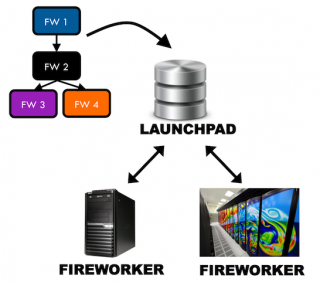

# Fireworks

FireWorks is a free, open-source code for defining, managing, and
executing scientific workflows. It can be used to automate
calculations over arbitrary computing resources, including those that
have a queueing system. Some features that distinguish FireWorks are
dynamic workflows, failure-detection routines, and built-in tools and
execution modes for running high-throughput computations at large
computing centers. It uses a centralized server model, where the
server manages the workflows and workers run the jobs.

Fireworks is the primary workflow engine for the Materials Project,
and is also being evaluated by several other projects. For more
information on Fireworks visit:
https://materialsproject.github.io/fireworks/index.html

Please contact consult@nersc.gov if you are interested in using
Fireworks. The following is a quick example for running at NERSC based
on the Fireworks tutorial. Note that you will need access to a
mongoDB - you can request one to be set up for you at NERSC using this
form.

## Terminology

FireWorks uses a number of terms to describe the different parts of
the workflow manager.



* FireServer: MongoDB that controls the workflow. Also referred to as
  the LaunchPad. It contains all the tasks to be run, and whether they
  have run successfully etc.
* FireTask: computing tasks to be performed.
* FireWork: list of FireTasks.
* Rocket: fetches a FireWork from the LaunchPad and runs it. Could be
  run on a separate machine (FireWorker) or through a batch system.

## Setting up your LaunchPad

Fireworks requires a mongoDB to define and log the progress of your
tasks. Here we will assume this is running at NERSC on
mongodb03.nersc.gov (the exact location will depend on where your
database is allocated).

Log in to a Cori or Edison node. Fireworks is installed under the
python anaconda environment, which is the default python module on
both Edison and Cori:

```shell
% module load python
```

Setting up the Launchpad can be done interactively using the command
"lpad init", similar to the example shown below. You will need to
specify the name of the database host and your own username and
password - note that you need to have admin access to the database, so
make sure you use the administrators username/password.

```
% lpad init
Please supply the following configuration values
(press Enter if you want to accept the defaults)

Enter host (default: localhost) : mongodb03
Enter port (default: 27017) :
Enter name (default: fireworks) : my_db
Enter username (default: None) : my_db_admin
Enter password (default: None) : my_pswd
```

This information will go into a file named
"my_launchpad.yaml". Fireworks will look for this file in your working
directory - if it is not in the same directory you will need to
specify it's location.

## Interactive example

To run a simple example on the interactive node, you first need to add
a job to the launchpad, then run the job. Note that Fireworks
automatically looks for a launchpad file named `my_launchpad.yaml` in
the working directory. If you have named your launchpad file something
else, you need to add the option `-l my_launchpad_name.yaml` to every
command.

Reset the launchpad - but be careful careful! This will delete any
existing tasks the launchpad already contains:

    %lpad reset

Add a simple script workflow to the launchpad:

    %lpad add_scripts 'echo "hello"' -n hello -w test_workflow

The option "-n" give the name of the firework (i.e. the list of tasks
task), and the option "-w" gives the name of the workflow.

Examine the contents of the launchpad. If you have many different
workflows in your launchpad, you can search for workflows by name
using the option "-w test_workflow".

    %lpad get_wflows

The json output of this command will give you some basic information
about the workflow you just added - including its name and status
(which should be "READY").

Now you want to run (launch) the job using the command "rlaunch". This
will pull a job from the launchpad defined in "my_launchpad.yaml". If
you need to use a different launchpad file, use the option "-l". The
"singleshot" option launches one job only (we will see later how to
run multiple jobs).

    %rlaunch singleshot

The output will look something like:

```
%rlaunch singleshot
2016-09-23 15:45:14,929 INFO Hostname/IP lookup (this will take a few seconds)
2016-09-23 15:45:14,931 INFO Launching Rocket
2016-09-23 15:45:15,250 INFO RUNNING fw_id: 1 in directory: /global/u1/a/auser/fireworks
2016-09-23 15:45:15,752 INFO Task started: ScriptTask.
hello
2016-09-23 15:45:15,793 INFO Task completed: ScriptTask
2016-09-23 15:45:15,900 INFO Rocket finished
```

Now let's write a FireWork script to do this, call it "fw-test.yaml".

```yaml
spec:
 _tasks:
 - _fw_name: ScriptTask
 script: echo "hello!" >> hello.txt
```

Add it to the launchpad. Adding it multiple times will add multiple, identical tasks.

    %lpad add fw-test.yaml
    %lpad add fw-test.yaml

Now run the FireWork:

    %rlaunch rapidfire

In this example we have used the option "rapidfire" instead of
"singleshot". This will keep pulling jobs from the launchpad until all
are completed. The output data (output files and job status) is given
in "launcher_*" directories.

Batch job on Cori and Edison To run in batch mode, you will need to
define a "Fireworker". This can be as simple as the following:

The job that is sent to the batch system will want to pull down a job
from the FireServer. It does this via a FireWorker script, which can
be as simple as:

```
name: test Cori fireworker
category: ''
query: '{}'
```

The commands that exist by default in the FireWorks Slurm template are
as follows. If you need to add more options, you can copy this file
and add to the template as described here.

```bash
#!/bin/bash -l

#SBATCH --nodes=$${nodes}
#SBATCH --ntasks=$${ntasks}
#SBATCH --ntasks-per-node=$${ntasks_per_node}
#SBATCH --cpus-per-task=$${cpus_per_task}
#SBATCH --gres=$${gres}
#SBATCH --qos=$${qos}
#SBATCH --time=$${walltime}
#SBATCH --partition=$${queue}
#SBATCH --account=$${account}
#SBATCH --job-name=$${job_name}
#SBATCH --license=$${license}
#SBATCH --output=$${job_name}-%j.out
#SBATCH --error=$${job_name}-%j.error
#SBATCH --constraint=$${constraint}

$${pre_rocket}
cd $${launch_dir}
$${rocket_launch}
$${post_rocket}

# CommonAdapter (SLURM) completed writing Template
```

You will need to write a queue adapter, which defines how the jobs
will be launched into the queue. Note that you need to specify here
all the usual Slurm options - if you do not, Fireworks will fail to
launch with an error message reading "RuntimeError: queue script could
not be submitted, check queue script/queue adapter/queue server
status!".  We've assume that the fireworker file is called
`my_fireworker.yaml`, and the launchpad file is `my_launchpad.yaml`.

```yaml
_fw_name: CommonAdapter
_fw_q_type: SLURM
rocket_launch: rlaunch -w my_fireworker.yaml -l my_launchpad.yaml rapidfire
nnodes: 1
ppnode: 1
walltime: '00:20:00'
queue: debug
account: null
job_name: null
constraint: haswell
logdir: fw_logs/
pre_rocket: null
post_rocket: null
```

You can then submit to the batch system using the "qlaunch" command:

    qlaunch -l my_launchpad.yaml -w my_fireworker.yaml  -q qadaptor.yaml singleshot

The output will show up in the "fw_logs" directory.
