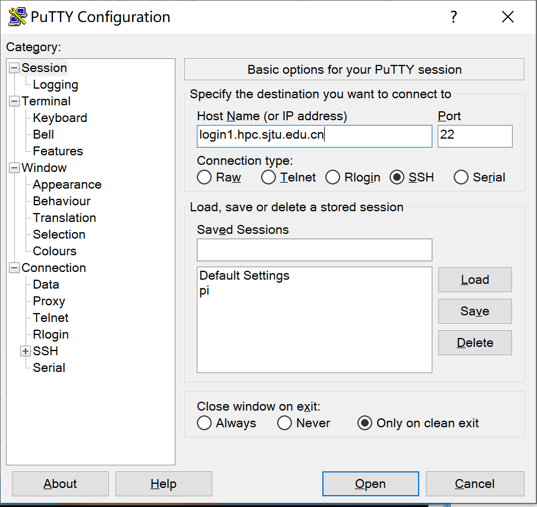
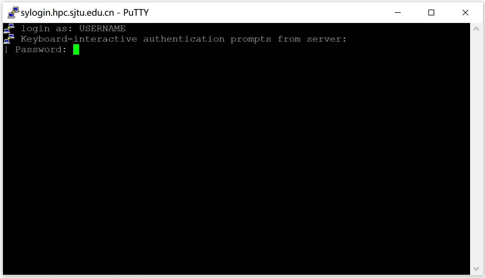
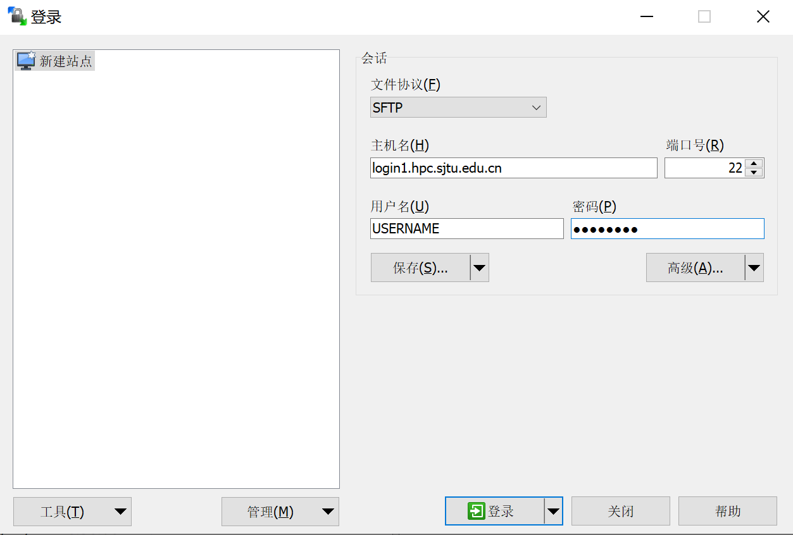
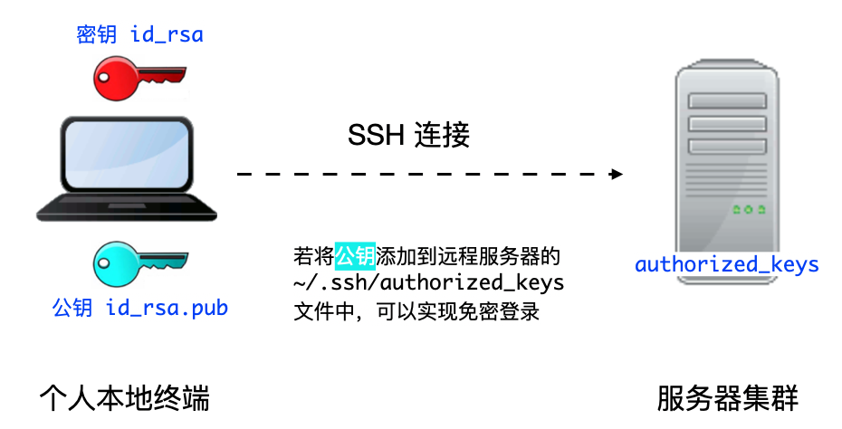

# <center>通过SSH登录HPC集群<center/>

-------

本文将向大家介绍如何通过SSH远程登录到HPC集群上。在阅读本文档之前，您需要具备Linux/Unix、终端、MS-DOS、SSH远程登录的相关知识，或者您可以阅读参考资料理解这些概念。

本文主要内容：

 * 使用ssh登录集群的注意事项；
 * 首次登录准备，如信息采集、客户端下载、ssh登录、ssh文件传输、无密码登录等；
 * 故障排除和反馈。
 
按照文档的操作说明将有助于您完成工作，谢谢您的配合！

# 注意事项

 * HPC账号仅限于同一课题组的成员使用，请勿将账号借给他人使用。
 * 请妥善保管好您的账号密码，不要告知他人。HPC管理员不会要求您提供密码。
 * 恶意的SSH客户端软件会窃取您的密码，请在官网下载正版授权SSH客户端软件。
 * 登录HPC集群后，请不要跳转到其他登录节点。任务完成后请关闭SSH会话。
 * 若无法登录，请检查输入密码或确认IP地址是否正确。您可以参考故障排除和反馈，将诊断信息发送给集群管理员hpc@sjtu.edu.cn。

# 准备
## 收集信息
通过SSH登录HPC集群，需要在客户端输入登录节点IP地址（或主机名），SSH端口，SSH用户名和密码。账号开通好后我们会给您发送邮件确认，邮件内容如下：

```
SSH login node:login.hpc.sjtu.edu.cn
Username: YOUR_USERNAME
Password: YOUR_PASSWORD
Home: /lustre/home/YOUR_HOME
```

详细信息：

```
SSH username: YOUR_USERNAME    
SSH password: YOUR_PASSWORD    
SSH login node’s IP address: login.hpc.sjtu.edu.cn
user’s home folder: /lustre/home/YOUR_HOME
```

*提示：为了便于叙述，以下文档内容将遵循上述信息。在实际操作中，请参阅收到的电子邮件，并注意您的登录信息。*
 
## 下载客户端
### Windows
Windows用户可以使用putty免费客户端登录软件，下载后双击即可运行使用。putty可通过以下连接下载：http://www.putty.org/.
 
### Linux/Unix/Mac
Linux / Unix / Mac 操作系统拥有自己的SSH客户端，包括ssh, scp, sftp等，因此没必要再去下载其他登录软件。

# 通过SSH登录集群
## Windows用户
启动客户端putty，填写登录节点地址login.hpc.sjtu.edu.cn，端口号，然后点Open按钮，如下图所示：
 

 
在终端窗口中，输入您的SSH用户名和密码进行登录，如图2所示：



*提示：输入密码时，没有可显示字符，请照常进行操作，然后按回车键登录。*
  
## Linux/Unix/Mac用户
Linux / Unix / Mac用户可以使用终端中的命令行工具登录。下列语句指出了该节点的IP地址、用户名和SSH端口。

```bash
$ ssh YOUR_USERNAME@TARGET_IP
```

# 通过SSH传输文件
## Windows用户
 Windows用户可以使用WinSCP在群集和您自己的计算机之间传输文件。如下图所示，填写节点的地址，SSH端口，SSH用户名，SSH密码，然后点击Login进行连接。 使用WinSCP的方法类似于使用FTP客户端GUI，如下图所示：




## Linux/Unix/Mac用户

Linux/Unix/Mac 用户可以使用命令行工具在集群和您自己的计算机之间传输数据。下列语句会将文件夹data/上传到主文件夹的tmp/。

```bash
$ scp -r data/ YOUR_USERNAME@TARGET_IP:tmp/
```

下列语句会将主文件夹的data.out下载到本地当前工作目录中。

```bash
$ scp YOUR_USERNAME@TARGET_IP:data.out ./
```

如果要完成更复杂的数据传输操作，可以使用sftp。它类似于FTP命令行客户端。

```bash
$ sftp YOUR_USERNAME@TARGET_IP
Connected to TARGET_IP
sftp> ls 
```

# 无密码登录
*提示：“无密码登录”仅适用于使用 SSH 命令行工具的 Linux/ UNIX / Mac 用户*

“无密码登录”使您无需输入用户名和密码即可登录，它还可以作为服务器的别名来简化说明。无密码登录需要建立从远程主机（群集的登录节点）到本地主机（您自己的计算机）的SSH信任关系。建立信任关系后，双方将通过 SSH 密钥对进行身份验证。

首先，您需要在本地主机上生成的 SSH 密钥对。为安全期间，HPC 集群要求使用密码短语 (passphrase) 来保护密钥对。使用密码短语来保护密钥对，每次双方身份验证时都需要输入密码。

```bash 
$ ssh-keygen -t rsa
```

接下来屏幕会显示：
```bash 
Generating public/private rsa key pair.
Enter file in which to save the key (/XXX/XXX/.ssh/id_rsa):   # 存储地址，默认回车即可
Enter passphrase (empty for no passphrase):                   # 请设置密码短语，并记住。输入的时候屏幕无显示
Enter same passphrase again:                                  # 再输入一遍密码短语
```

!!! tips
    为何要设置含有密码短语的密钥对：
    输入 ssh-keygen 时，会请求您输入一个密码短语，您应该输入一些难以猜到的短语。
    在无密码短语的情况下，您的私钥未经加密就存储在您的硬盘上，任何人拿到您的私钥都可以随意的访问对应的 SSH 服务器。

ssh-keygen 将在 ~/.ssh 中生成一个密钥对，包含两个文件：id_rsa (需保留的私钥)，和 id_rsa.pub（可作为您的身份发送的公钥）。然后，使用 ssh-copy-id 将本地主机的公钥 id_rsa.pub 添加到远程主机的信任列表中。实际上，ssh-copy-id 所做的就是将 id_rsa.pub 的内容添加到远程主机的文件 ~/.ssh/authorized_keys 中。

```bash
（在自己电脑上）$ ssh-copy-id YOUR_USERNAME@TARGET_IP
```

若手动自行在服务器上添加 authorized_keys 文件，需确保 authorized_keys 文件的权限为 600：

 ```bash
 （在 HPC 集群上）$ chmod 600 ~/.ssh/authorized_keys
 ```



我们还可以将连接参数写入 ~/.ssh/config 中，以使其简洁明了。 新建或编辑文件 ~/.ssh/config：

```bash
$ EDIT ~/.ssh/config
```

 还需分配以下内容： 主机分配远程主机的别名，主机名是远程主机的真实域名或IP地址，端口分配SSH端口，用户分配SSH用户名。

```
Host hpc
HostName TARGET_IP
User YOUR_USERNAME
```

 您需要确保此文件的权限正确：
 
 ```bash
 $ chmod 600 ~/.ssh/config
 ```

 然后，您只需输入以下内容即可登录HPC群集：

```bash
 $ ssh hpc
``` 

!!! suggetion
    当 SSH 密钥对发生泄漏，请立即清理本地电脑 .ssh 文件夹里的密钥对，并重新在本地生成密钥对（生成时请设置密码短语）。另外请删除 HPC 集群上的 ~/.ssh/authorized_keys 文件。
    
## 如何清理 .ssh 文件夹，并重新生成密钥对（含密码短语）：
```bash 
（在 HPC 集群上）$ rm -f ~/.ssh/authorized_keys           # 清除服务器上原有的 authorized_keys
（在自己电脑上）$ rm  ~/.ssh/id*                           # 清除本地 .ssh 文件夹中的密钥对
（在自己电脑上）$ ssh-keygen -t rsa                        # 在本地重新生成密钥对。第二个问题，设置密码短语 (passphrase)，并记住密码短语
（在自己电脑上）$ ssh-keygen -R login.hpc.sjtu.edu.cn      # 清理本地 known_hosts 里关于 HPC 的条目     
（在自己电脑上）$ ssh-copy-id YOUR_USERNAME@TARGET_IP      # 将本地新的公钥发给服务器，存在服务器的 authorized_keys 文件里
```

# SSH 重置 known_hosts

若遇到上方图片中的问题，请重置 known_hosts，命令如下：

```bash
（在自己电脑上）$ ssh-keygen -R login.hpc.sjtu.edu.cn
``` 


# 调试SSH登录问题
有许多原因可能会阻止您登录到HPC集群。因两次尝试失败而失败的IP地址将被阻止两次。在阻塞期间，建议尝试其他登录节点。 如果两个小时后此问题仍然存在，请与管理员联系并附上以下信息。

1.检查您的IP地址

2.使用ping命令检查您的电脑和集群连接状态。

```bash
$ ping IP
```

3.使用telnet检查登录节点

```bash
$ telnet IP 22
```

请与管理员联系，并在消息中附加调试信息（您的IP，Ping、telnet、ssh结果）。

# 登陆常掉线的问题
如果SSH客户端长时间静默后，SSH服务器端会自动断开相关会话。要解决这个，需要调整SSH的keepalive值，设置一个较长的静默时长阈值。

## 1.mac/linux用户

对于unix like用户，并且使用操作系统原生的终端(terminal)，需要修改`$HOME/.ssh/config`。具体的，在文件中添加如下内容：

```bash
Host pi-sjtu-login:
    HostName login.hpc.sjtu.edu.cn
    ServerAliveInterval 240
```

其中ServerAliveInterval后的值即为阈值，单位为秒，用户可根据需要自行调整。

或者为了对所有的服务器设置长静默阈值：

```bash
Host *
    ServerAliveInterval 240
```

之后保持`config`文件为只可读：

```bash
chmod 600 ~/.ssh/config
```

## 2.Windows/三方SSH客户端用户

这里我们以putty为例。市面有不同的SSH客户端，您可以根据自身情况自行搜索您使用的SSH客户端的设置方法。

在putty的session的属性中，`Connection` -> `Sending of null packets to keep session active` -> `Seconds between keepalives (0 to turn off)`后的文本框中，输入对应的值，如240。

# 参考文献
*  http://www.ee.surrey.ac.uk/Teaching/Unix/
*  http://vbird.dic.ksu.edu.tw/linux_server/0310telnetssh.php#ssh_server
*  http://nerderati.com/2011/03/simplify-your-life-with-an-ssh-config-file/
*  http://www.cyberciti.biz/faq/ssh-passwordless-login-with-keychain-for-scripts/
*  https://stackoverflow.com/questions/25084288/keep-ssh-session-alive
*  https://patrickmn.com/aside/how-to-keep-alive-ssh-sessions/
