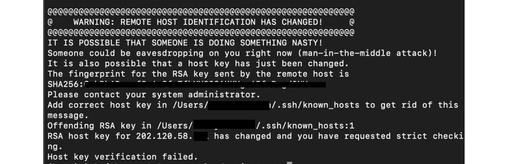

****
登录
****

获取交我算帐号后，可通过浏览器登录 \ `可视化平台 HPC Studio <../studio/index.html>`__\ ，也可通过传统的 SSH 登录。下面将介绍 SSH 登录方法。

通过 SSH 登录集群
==========================

本文主要内容：

-  使用 SSH 登录集群的注意事项；
-  首次登录准备，如信息采集、客户端下载、SSH 登录、SSH 文件传输、无密码登录等；
-  故障排除和反馈。

注意事项
--------

-  交我算帐号仅限于同一课题组的成员使用，请勿将帐号借给他人使用。
-  请妥善保管好您的帐号密码，不要告知他人。管理员不会要求您提供密码。
-  恶意的 SSH 客户端软件会窃取您的密码，请在官网下载正版授权 SSH 客户端软件。
-  登录集群后，请不要跳转到其他登录节点。任务完成后请关闭 SSH 会话。
-  若无法登录，请检查输入密码或确认 IP 地址是否正确。您可以参考故障排除和反馈，将诊断信息发送给 \ `HPC 邮箱 <mailto:hpc@sjtu.edu.cn>`__\ 。

SSH 登录
-------------------

帐号开通后您会收到含有以下内容的邮件，包含帐号用户名和密码用于登录集群。登录集群有两种方式：SSH 命令行登录、SSH 客户端登录。

::

   Username: YOUR_USERNAME
   Password: YOUR_PASSWORD

登录方法一：命令行登录
^^^^^^^^^^^^^^^^^^^^^^^^^^^^

* 思源一号

.. code:: bash

   $ ssh username@sylogin.hpc.sjtu.edu.cn

* π 2.0 和 AI 平台

.. code:: bash

   $ ssh username@login.hpc.sjtu.edu.cn

* ARM 平台（限校内 IP，或使用 SJTU VPN）
  
.. code:: bash

   $ ssh username@armlogin.hpc.sjtu.edu.cn

说明：

* 登录节点 IP 地址（或主机名）分别为 sylogin.hpc.sjtu.edu.cn（思源一号）、login.hpc.sjtu.edu.cn（π 2.0 和 AI）、armlogin.hpc.sjtu.edu.cn（ARM）

* 思源一号和 π 2.0/AI 集群通过上述命令登录，会自动分配到多个登录节点之一，如 sylogin1, sylogin2, login1, login2, login3。也可以手动指定这五个具体的登录节点之一登录，如 ssh username@sylogin1.hpc.sjtu.edu.cn

* SSH 端口均为默认值 22

登录方法二：客户端登录
^^^^^^^^^^^^^^^^^^^^^^^^^^^^

Windows 推荐使用 Putty 免费客户端，下载后双击即可运行使用。可至 \ `Putty 官网 <https://www.putty.org>`__\
下载。Linux / Unix / Mac 操作系统拥有自己的 SSH 客户端，包括 ssh, scp, sftp 等。

下面介绍 Windows 用户使用 Putty 客户端登录思源一号。

启动客户端 Putty，填写登录节点地址 sylogin.hpc.sjtu.edu.cn （适用于思源一号），或  login.hpc.sjtu.edu.cn （适用于 π 2.0 和 AI 集群），端口号采用默认值 22，然后点 Open 按钮，如下图所示：

.. image:: ../img/putty1.png

在终端窗口中，输入您的 SSH 用户名和密码进行登录：

.. image:: ../img/putty2.png

*提示：输入密码时，不显示字符，请照常进行操作，然后按回车键登录。*

通过 SSH 传输文件
-----------------

登录节点资源有限，不推荐在登录节点直接进行大批量的数据传输。交我算HPC+AI平台提供了专门用于数据传输的节点，登录该节点后可以通过rsync，scp等方式将个人目录下的数据下载到本地，或者反向上传本地数据到个人目录。详情请参考具体请参考 :ref:`label_transfer` 。

.. _label_no_password_login:

无密码登录
----------

*提示：“无密码登录”仅适用于使用 SSH 命令行工具的 Linux/ UNIX / Mac 用户*

“无密码登录”使您无需输入用户名和密码即可登录，它还可以作为服务器的别名来简化使用。无密码登录需要建立从远程主机（集群的登录节点）到本地主机（您自己的计算机）的SSH信任关系。建立信任关系后，双方将通过 SSH 密钥对进行身份验证。

首先，您需要在本地主机上生成的 SSH 密钥对。为安全起见，集群要求使用密码短语 (passphrase) 来保护密钥对。使用密码短语来保护密钥对，每次双方身份验证时都需要输入密码。

.. code:: bash

   $ ssh-keygen -t rsa

接下来屏幕会显示：

.. code:: bash

   Generating public/private rsa key pair.
   Enter file in which to save the key (/XXX/XXX/.ssh/id_rsa):   # 存储地址，默认回车即可
   Enter passphrase (empty for no passphrase):                   # 请设置密码短语，并记住。输入的时候屏幕无显示
   Enter same passphrase again:                                  # 再输入一遍密码短语

.. tips: 为何要设置含有密码短语的密钥对： 输入ssh-keygen时，会请求您输入一个密码短语，您应该输入一些难以猜到的短语。

在无密码短语的情况下，您的私钥未经加密就存储在您的硬盘上，任何人拿到您的私钥都可以随意的访问对应的SSH服务器。

ssh-keygen 将在 ~/.ssh 中生成一个密钥对，包含两个文件：id_rsa(需保留的私钥)，和id_rsa.pub可作为您的身份发送的公钥）。然后，使用
ssh-copy-id 将本地主机的公钥 id_rsa.pub添加到远程主机的信任列表中。实际上，ssh-copy-id 所做的就是将id_rsa.pub的内容添加到远程主机的文件 ~/.ssh/authorized_keys 中。

.. code:: bash

   （在自己电脑上）$ ssh-copy-id YOUR_USERNAME@TARGET_IP

若手动自行在服务器上添加 authorized_keys 文件，需确保 authorized_keys
文件的权限为 600：

.. code:: bash

   （在集群上）$ chmod 600 ~/.ssh/authorized_keys

.. image:: ../img/sshfile.png

我们还可以将连接参数写入 ~/.ssh/config 中，以使其简洁明了。
新建或编辑文件 ~/.ssh/config：

.. code:: bash

   $ EDIT ~/.ssh/config

还需分配以下内容：
主机分配远程主机的别名，主机名是远程主机的真实域名或IP地址，端口分配 SSH 端口，用户分配 SSH 用户名。

::

   Host hpc
   HostName TARGET_IP
   User YOUR_USERNAME

您需要确保此文件的权限正确：

.. code:: bash

   $ chmod 600 ~/.ssh/config

然后，您只需输入以下内容即可登录集群：

.. code:: bash

    $ ssh hpc

*当 SSH 密钥对发生泄漏，请立即清理本地电脑 .ssh
文件夹里的密钥对，并重新在本地生成密钥对（生成时请设置密码短语）。另外请删除集群上的 ~/.ssh/authorized_keys 文件。*

如何重新生成密钥对
----------------------------------------------------

.. code:: bash

   （在集群上）$ rm -f ~/.ssh/authorized_keys             # 清除服务器上原有的 authorized_keys
   （在自己电脑上）$ rm  ~/.ssh/id*                           # 清除本地 .ssh 文件夹中的密钥对
   （在自己电脑上）$ ssh-keygen -t rsa                        # 在本地重新生成密钥对。第二个问题，设置密码短语 (passphrase)，并记住密码短语
   （在自己电脑上）$ ssh-keygen -R sylogin.hpc.sjtu.edu.cn    # 清理本地 known_hosts 里关于集群的条目
   （在自己电脑上）$ ssh-copy-id YOUR_USERNAME@TARGET_IP      # 将本地新的公钥发给服务器，存在服务器的 authorized_keys 文件里

SSH 重置 known_hosts
--------------------

|avater| 若遇到上方图片中的问题，请重置 known_hosts，命令如下：

.. code:: bash

   （在自己电脑上）$ ssh-keygen -R sylogin.hpc.sjtu.edu.cn

调试 SSH 登录问题
-----------------

有多种原因可能会阻止您登录到集群。

1. 连续多次错输密码会被临时封禁 1 小时。集群登录节点设置了 fail2ban 服务，多次输入密码错误后会被临时封禁 1 小时。

2. 若在登录节点运行计算密集的作业，程序会被自动查杀，您的帐号会被加入到黑名单，并在 30-120 分钟内无法登录。

若需重置密码，请使用或抄送帐号负责人邮箱发送邮件到  \ `HPC 邮箱 <mailto:hpc@sjtu.edu.cn>`__\ ，我们将会在 1 个工作日内响应您的申请。

排查登录问题，还可以使用 ping 命令检查您的电脑和集群连接状态。

.. code:: bash

   $ ping sylogin.hpc.sjtu.edu.cn

登录常掉线的问题
----------------

如果 SSH 客户端长时间静默后，SSH 服务器端会自动断开相关会话。要解决这个，需要调整 SSH 的 keepalive 值，设置一个较长的静默时长阈值。

Mac/Linux用户
^^^^^^^^^^^^^

对于 Mac/Linux 用户，并且使用操作系统原生的终端 (terminal)，需要修改 \ ``$HOME/.ssh/config``\ 。具体的，在文件中添加如下内容：

.. code:: bash

   Host pi-sjtu-login:
       HostName sylogin.hpc.sjtu.edu.cn
       ServerAliveInterval 240

其中 ServerAliveInterval 后的值即为阈值，单位为秒，用户可根据需要自行调整。

或者为了对所有的服务器设置长静默阈值：

.. code:: bash

   Host *
       ServerAliveInterval 240

之后保持 \ ``config``\ 文件为只可读：

.. code:: bash

   chmod 600 ~/.ssh/config

Windows SSH 客户端用户
^^^^^^^^^^^^^^^^^^^^^^^^^^^^^

这里我们以 Putty 为例。市面有不同的 SSH 客户端，您可以根据自身情况自行搜索您使用的 SSH 客户端的设置方法。

在 Putty的 Session 的属性中，\ ``Connection`` ->
``Sending of null packets to keep session active`` ->
``Seconds between keepalives (0 to turn off)``\ 后的文本框中，输入对应的值，如 240。

Tmux
====

Tmux是一个终端复用器（terminal multiplexer）。如果您有使用screen的经历的话，您可以理解为Tmux是screen的不同实现软件。本教程将讲解Tmux的基础用法。

Tmux是什么？
----------------

会话与进程
^^^^^^^^^^^^^^^^^^^

命令行的典型用法是打开终端（terminal）后，在里面输入指令。用户的这种与计算机交互的手段，称为\ **会话**\ （session）。

在会话中，通过命令行启动的所有进程均与会话进程绑定。当会话进程终止时，该会话启动的所有进程也会随之强行结束。

一点最常见的例子就是通过SSH连接到远程计算机。当SSH连接因为网络等原因断开时，那么SSH会话就被终止，这次会话启动的任务也会被强制结束。

为了解决这个问题，一种手段就是用户终端窗口与会话“解绑”。即关闭用户端窗口，仍然维持该会话，进而保证用户进程不变。

Tmux的作用
^^^^^^^^^^^^^^^^^^^

Tmux就是这样一款会话与窗口的“解绑”工具。

::

   （1）它允许在单个窗口中，同时访问多个会话。这对于同时运行多个命令行程序很有用。

   （2）它可以让新窗口"接入"已经存在的会话。

   （3）它允许每个会话有多个连接窗口，因此可以多人实时共享会话。

   （4）它还支持窗口任意的垂直和水平拆分

基本用法
------------

安装
^^^^^^^^^^^^^^^^^^^

集群中已经默认安装了Tmux，无须操作。如果您需要在自己的服务器上安装Tmux，请参考以下指令：

.. code:: bash

   # Ubuntu 或 Debian
   $ sudo apt-get install tmux

   # CentOS 或 Fedora
   $ sudo yum install tmux

   # Mac
   $ brew install tmux

启动与退出
~~~~~~~~~~~~~~

直接在终端中键入\ ``tmux``\ 指令，即可进入Tmux窗口。

.. code:: bash

   $ tmux

上面命令会启动 Tmux
窗口，底部有一个状态栏。状态栏的左侧是窗口信息（编号和名称），右侧是系统信息。

.. image:: /img/tmux_1.png

按下\ ``Ctrl+d``\ 或者显式输入\ ``exit``\ 命令，就可以退出 Tmux 窗口。

.. code:: bash

   $ exit

快捷键
^^^^^^^^^^^^^^^^^^^

Tmux有大量的快捷键。所有的快捷键都要使用\ ``Ctrl+b``\ 作为前缀唤醒。我们将会在后续章节中讲解快捷键的具体使用。

会话管理
------------

新建会话
^^^^^^^^^^^^^^^^^^^

第一个启动的会话名为\ ``0``\ ，之后是\ ``1``\ 、\ ``2``\ 一次类推。

但是有时候我们希望为会话起名以方便区分。

.. code:: bash

   $ tmux new -s SESSION_NAME

以上指令启动了一个名为\ ``SESSION_NAME``\ 的会话。

分离会话
^^^^^^^^^^^^^^^^^^^

如果我们想离开会话，但又不想关闭会话，有两种方式。按下\ ``Ctrl+b d``\ 或者\ ``tmux detach``\ 指令，将会分离会话与窗口

.. code:: bash

   $ tmux detach

后面一种方法要求当前会话无正在运行的进程，即保证终端可操作。我们更推荐使用前者。

查看会话
^^^^^^^^^^^^^^^^^^^

要查看当前已有会话，使用\ ``tmux ls``\ 指令。

.. code:: bash

   $ tmux ls

接入会话
^^^^^^^^^^^^^^^^^^^

``tmux attach``\ 命令用于重新接入某个已存在的会话。

.. code:: bash

   # 使用会话编号
   $ tmux attach -t 0

   # 使用会话名称
   $ tmux attach -t SESSION_NAME

杀死会话
^^^^^^^^^^^^^^^^^^^

``tmux kill-session``\ 命令用于杀死某个会话。

.. code:: bash

   # 使用会话编号
   $ tmux kill-session -t 0

   # 使用会话名称
   $ tmux kill-session -t SESSION_NAME

切换会话
^^^^^^^^^^^^^^^^^^^

``tmux switch``\ 命令用于切换会话。

.. code:: bash

   # 使用会话编号
   $ tmux switch -t 0

   # 使用会话名称
   $ tmux switch -t SESSION_NAME

``Ctrl+b s``\ 可以快捷地查看并切换会话

重命名会话
^^^^^^^^^^^^^^^^^^^

``tmux rename-session``\ 命令用于重命名会话。

.. code:: bash

   # 将0号会话重命名为SESSION_NAME
   $ tmux rename-session -t 0 SESSION_NAME

对应快捷键为\ ``Ctrl+b $``\ 。

窗格（window）操作
----------------------

Tmux可以将窗口分成多个窗格（window），每个窗格运行不同的命令。以下命令都是在Tmux窗口中执行。

划分窗格
^^^^^^^^^^^^^^^^^^^

``tmux split-window``\ 命令用来划分窗格。

.. code:: bash

   # 划分上下两个窗格
   $ tmux split-window

   # 划分左右两个窗格
   $ tmux split-window -h

.. image:: /img/tmux_2.png

对应快捷键为\ ``Ctrl+b "``\ 和\ ``Ctrl+b %``

移动光标
^^^^^^^^^^^^^^^^^^^

``tmux select-pane``\ 命令用来移动光标位置。

.. code:: bash

   # 光标切换到上方窗格
   $ tmux select-pane -U

   # 光标切换到下方窗格
   $ tmux select-pane -D

   # 光标切换到左边窗格
   $ tmux select-pane -L

   # 光标切换到右边窗格
   $ tmux select-pane -R

对应快捷键为\ ``Ctrl+b ↑``\ 、\ ``Ctrl+b ↓``\ 、\ ``Ctrl+b ←``\ 、\ ``Ctrl+b →``\ 。

窗格快捷键
^^^^^^^^^^^^^^^^^^^

.. code:: bash

   $ Ctrl+b %：划分左右两个窗格。
   $ Ctrl+b "：划分上下两个窗格。
   $ Ctrl+b <arrow key>：光标切换到其他窗格。<arrow key>是指向要切换到的窗格的方向键，比如切换到下方窗格，就按方向键↓。
   $ Ctrl+b ;：光标切换到上一个窗格。
   $ Ctrl+b o：光标切换到下一个窗格。
   $ Ctrl+b {：当前窗格左移。
   $ Ctrl+b }：当前窗格右移。
   $ Ctrl+b Ctrl+o：当前窗格上移。
   $ Ctrl+b Alt+o：当前窗格下移。
   $ Ctrl+b x：关闭当前窗格。
   $ Ctrl+b !：将当前窗格拆分为一个独立窗口。
   $ Ctrl+b z：当前窗格全屏显示，再使用一次会变回原来大小。
   $ Ctrl+b Ctrl+<arrow key>：按箭头方向调整窗格大小。
   $ Ctrl+b q：显示窗格编号。

VS Code
===============

Visual Studio Code（简称VS Code）是一款由微软开发且跨平台的免费源代码编辑器。 该软件支持语法高亮、代码自动补全（又称IntelliSense）、代码重构功能，并且内置了命令行工具和Git 版本控制系统。

使用VS Code连接集群
-----------------------

VS Code经过配置，可以远程连接到Pi集群及思源一号，在本地进行远程的开发部署工作。配置VS Code进行远程开发主要分为4个步骤：

1. 在本地电脑安装兼容的SSH客户端;
2. 配置SSH免密登录集群；
3. 在本地电脑安装VS Code客户端并安装相应插件；
4. 使用VS Code远程访问；

安装兼容的SSH客户端
^^^^^^^^^^^^^^^^^^^^
首先需要在本地电脑上安装OpenSSH兼容的SSH客户端（Putty不支持）。

对于Mac，系统自带的SSH客户端就可满足需求，无需安装。

对于linux用户，需要安装 `openssh-client`。

运行

.. code:: console

   $ sudo apt-get install openssh-client

或者

.. code:: console

   $ sudo yum install openssh-client

对于 Windows 用户，请安装 Windows OpenSSH Client。Windows 用户可以使用 Windows 设置或者 PowerShell 来安装该客户端，具体请参考链接 `安装 OpenSSH <https://docs.microsoft.com/zh-cn/windows-server/administration/openssh/openssh_install_firstuse>`_。

SSH免密登录集群
^^^^^^^^^^^^^^^^^^^^

关于SSH免密登录的配置请参考 :ref:`ssh免密登录<label_no_password_login>`。

一个可参考的 `~/.ssh/config` 文件内容如下：

.. code:: bash

   Host x86
     HostName login.hpc.sjtu.edu.cn
     User $YOUR_USERNAME
     Port 22

   Host arm
     HostName kplogin1.hpc.sjtu.edu.cn
     User $YOUR_USERNAME
     Port 22

   Host siyuan
     HostName sylogin.hpc.sjtu.edu.cn
     User $YOUR_USERNAME
     Port 22

配置完毕后请在本地终端测试是否能访问集群。

.. code:: console

   $ ssh siyuan
   Enter passphrase for key '/Users/YOUR_HOME/.ssh/id_rsa': 
   Last failed login: Wed Jun 22 18:34:38 CST 2022 from xxx.xxx.xxx.xx on ssh:notty
   There were 2 failed login attempts since the last successful login.
   Last login: Wed Jun 22 18:28:52 2022 from xxx.xxx.xxx.xx

本地安装 VS Code 及插件
^^^^^^^^^^^^^^^^^^^^^^^^^

请至 `VS code download <https://code.visualstudio.com/download>`_ 下载于本地操作系统对应的 VS Code安装包并根据步骤安装。

打开VS Code软件， 安装 Remote SSH插件。

.. image:: /img/remote-ssh_install.png

使用VS Code 访问集群
^^^^^^^^^^^^^^^^^^^^^^^^^

安装完毕后点开左方工具栏中remote-ssh插件的图标，该插件会自动读取 `~/.ssh/config` 中的主机名。

.. image:: /img/remote-ssh-servers.png

右键相应的主机名即可选择连接主机：

.. image:: /img/remote-ssh-click.png

此时会弹出窗口要求输入先前设置的passphrase:

.. image:: /img/passphrase.png

输入密码后即可链接至远程主机：

.. image:: /img/remote-ssh-connection.png

连接后可选择打开文件夹或者终端：

.. image:: /img/remote-ssh-file-terminal.png

X Server
=========

图形视窗系统
-------------

``X11`` 是UNIX上图形视窗系统的标准规范，主要分为3个部分：X Server（X服务器）、X Client（X客户端）、Window Manager（窗口管理器）。X Server是整个X Window System的中心，协调X客户端和窗口管理器的通信。

使用X Server显示图形界面
-------------------------

``X Server`` 运行在本地，推荐 ``MobaXterm`` 终端工具，包含了 ``X server`` 功能。使用前需要确认开启了 ``X11-Forwarding``，并启动 ``X server``。

启动步骤
^^^^^^^^^^^^

以思源一号为例：

.. code-block:: bash

   module load rdp                             # 加载远程桌面及VNC启动脚本
   sbatch -p 64c512g -n 4 -J rdp --wrap="rdp"  # 提交计算节点执行
   squeue                                      # 查看分配到的节点
   ssh -X node055                              # 通过登录节点登录到计算节点，需要-X参数
   module load relion                          # 运行GUI程序
   relion

.. image:: /img/rdp.png

.. warning::

   ``X Server`` 显示图形界面的方式需要保持SSH连接，不然GUI程序会中断运行。

参考资料
========

-  http://www.ee.surrey.ac.uk/Teaching/Unix/
-  http://vbird.dic.ksu.edu.tw/linux_server/0310telnetssh.php#ssh_server
-  http://nerderati.com/2011/03/simplify-your-life-with-an-ssh-config-file/
-  http://www.cyberciti.biz/faq/ssh-passwordless-login-with-keychain-for-scripts/
-  https://stackoverflow.com/questions/25084288/keep-ssh-session-alive
-  https://patrickmn.com/aside/how-to-keep-alive-ssh-sessions/
-  https://www.hamvocke.com/blog/a-quick-and-easy-guide-to-tmux/
-  https://danielmiessler.com/study/tmux/
-  https://linuxize.com/post/getting-started-with-tmux/
-  https://www.ruanyifeng.com/blog/2019/10/tmux.html
