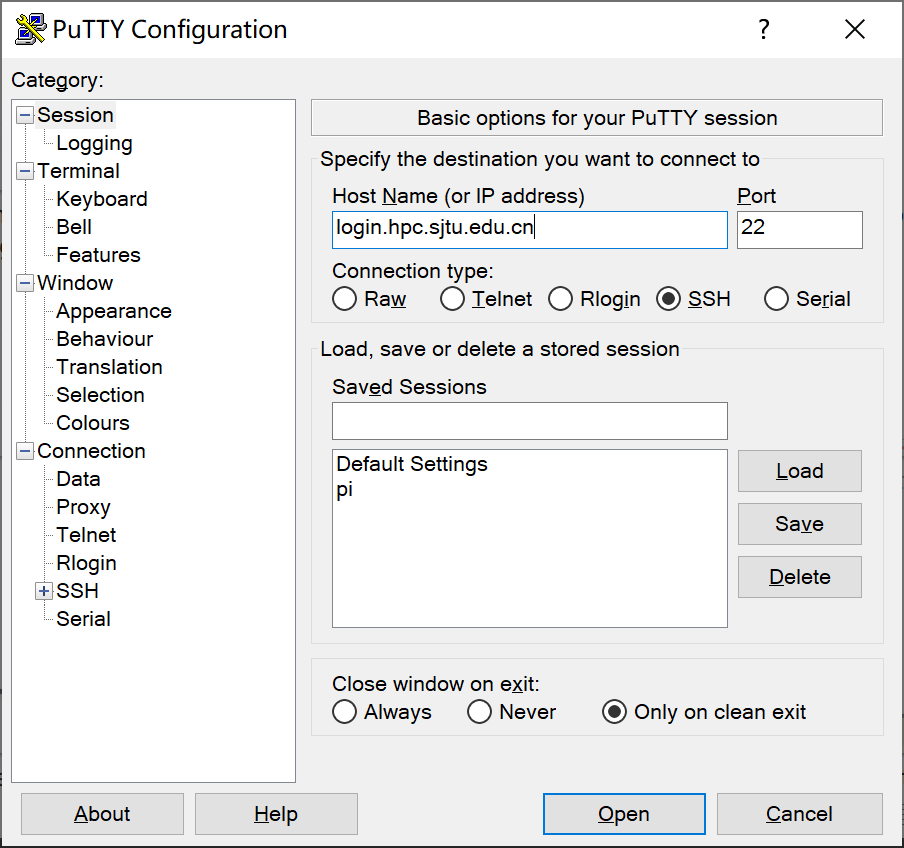
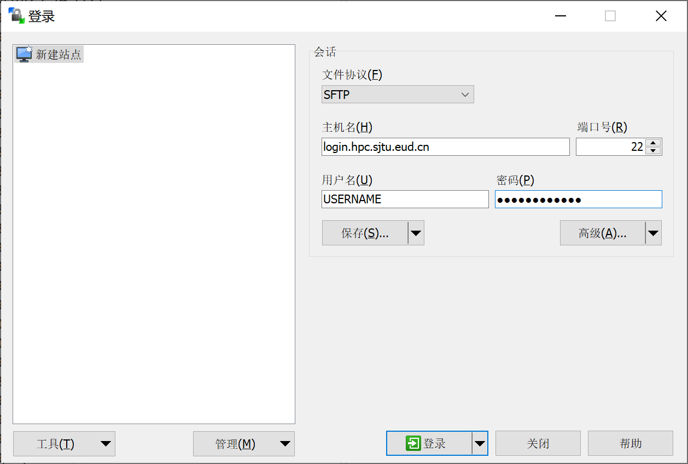
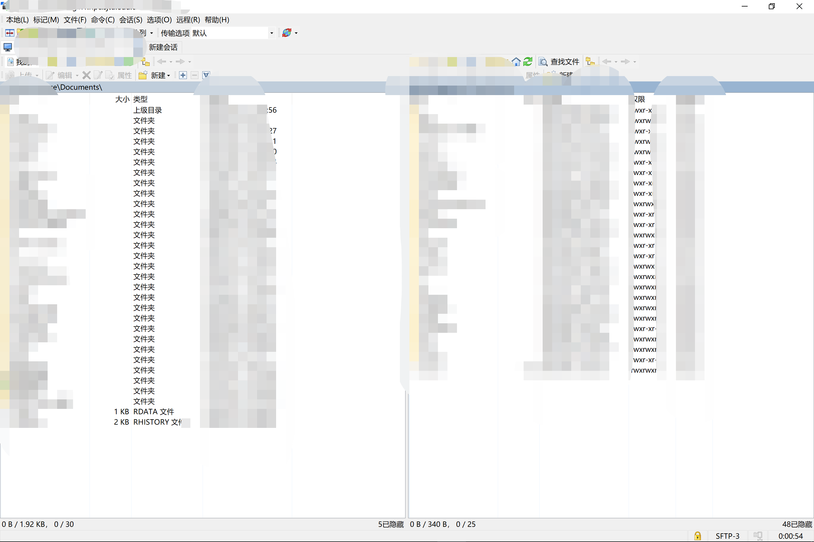

.. _loginssh:

通过SSH登录HPC集群
==================

本文将向大家介绍如何通过 SSH 远程登录到 HPC
集群上。在阅读本文档之前，您需要具备 Linux/Unix、终端、MS-DOS、SSH
远程登录的相关知识，或者您可以阅读参考资料理解这些概念。

本文主要内容：

-  使用ssh登录集群的注意事项；
-  首次登录准备，如信息采集、客户端下载、ssh登录、ssh文件传输、无密码登录等；
-  故障排除和反馈。

按照文档的操作说明将有助于您完成工作，谢谢您的配合！

注意事项
--------

-  HPC账号仅限于同一课题组的成员使用，请勿将账号借给他人使用。
-  请妥善保管好您的账号密码，不要告知他人。HPC管理员不会要求您提供密码。
-  恶意的SSH客户端软件会窃取您的密码，请在官网下载正版授权SSH客户端软件。
-  登录HPC集群后，请不要跳转到其他登录节点。任务完成后请关闭SSH会话。
-  若无法登录，请检查输入密码或确认IP地址是否正确。您可以参考故障排除和反馈，将诊断信息发送给集群管理员hpc@sjtu.edu.cn。

准备
----

通过 SSH 登录 HPC 集群，需要在客户端输入登录节点 IP
地址（或主机名），SSH 端口，SSH
用户名和密码。账号开通后您会收到以下内容的邮件：

::

   SSH login node: login.hpc.sjtu.edu.cn
   Username: YOUR_USERNAME
   Password: YOUR_PASSWORD

登录节点 IP 地址（或主机名）为 login.hpc.sjtu.edu.cn

SSH 端口为 22

下载客户端
----------

Windows
^^^^^^^

Windows 推荐使用 putty 免费客户端，下载后双击即可运行使用。putty
下载链接：http://www.putty.org/.

Linux/Unix/Mac
^^^^^^^^^^^^^^

Linux / Unix / Mac 操作系统拥有自己的 SSH 客户端，包括 ssh, scp, sftp
等。

通过 SSH 登录集群
-----------------

Windows用户
^^^^^^^^^^^

启动客户端 putty，填写登录节点地址
login.hpc.sjtu.edu.cn，端口号采用默认值 22，然后点 Open
按钮，如下图所示：

   avater

在终端窗口中，输入您的SSH用户名和密码进行登录，如图2所示：

.. figure:: ../img/putty2.png
   :alt: avater

   avater

*提示：输入密码时，没有可显示字符，请照常进行操作，然后按回车键登录。*

Linux/Unix/Mac 用户
^^^^^^^^^^^^^^^^^^^

Linux / Unix / Mac 用户可以使用终端中的命令行工具登录。下列语句指出了该节点的IP地址、用户名和SSH端口。

.. code:: bash

   $ ssh YOUR_USERNAME@TARGET_IP

通过SSH传输文件
---------------

Windows 用户
^^^^^^^^^^^^

Windows 用户可以使用 WinSCP
在群集和您自己的计算机之间传输文件。如下图所示，填写节点的地址，SSH
端口，SSH 用户名，SSH 密码，然后点击 Login 进行连接。 使用 WinSCP
的方法类似于使用 FTP 客户端 GUI，如下图所示：

   avater

   avater

Linux/Unix/Mac用户
^^^^^^^^^^^^^^^^^^

Linux/Unix/Mac用户可以使用命令行工具在集群和您自己的计算机之间传输数据。下列语句会将文件夹data/上传到主文件夹的tmp/。

.. code:: bash

   $ scp -r data/ YOUR_USERNAME@TARGET_IP:tmp/

下列语句会将主文件夹的data.out下载到本地当前工作目录中。

.. code:: bash

   $ scp YOUR_USERNAME@TARGET_IP:data.out ./

如果要完成更复杂的数据传输操作，可以使用sftp。它类似于FTP命令行客户端。

.. code:: bash

   $ sftp YOUR_USERNAME@TARGET_IP
   Connected to TARGET_IP
   sftp> ls 

无密码登录
----------

*提示：“无密码登录”仅适用于使用 SSH 命令行工具的 Linux/ UNIX / Mac 用户*

“无密码登录”使您无需输入用户名和密码即可登录，它还可以作为服务器的别名来简化说明。无密码登录需要建立从远程主机（群集的登录节点）到本地主机（您自己的计算机）的SSH信任关系。建立信任关系后，双方将通过
SSH 密钥对进行身份验证。

首先，您需要在本地主机上生成的 SSH 密钥对。为安全期间，HPC
集群要求使用密码短语 (passphrase)
来保护密钥对。使用密码短语来保护密钥对，每次双方身份验证时都需要输入密码。

.. code:: bash

   $ ssh-keygen -t rsa

接下来屏幕会显示：

.. code:: bash

   Generating public/private rsa key pair.
   Enter file in which to save the key (/XXX/XXX/.ssh/id_rsa):   # 存储地址，默认回车即可
   Enter passphrase (empty for no passphrase):                   # 请设置密码短语，并记住。输入的时候屏幕无显示
   Enter same passphrase again:                                  # 再输入一遍密码短语

.. tips: 为何要设置含有密码短语的密钥对： 输入ssh-keygen时，会请求您输入一个密码短语，您应该输入一些难以猜到的短语。

在无密码短语的情况下，您的私钥未经加密就存储在您的硬盘上，任何人拿到您的私钥都可以随意的访问对应的SSH服务器。

ssh-keygen 将在 ~/.ssh 中生成一个密钥对，包含两个文件：id_rsa(需保留的私钥)，和id_rsa.pub可作为您的身份发送的公钥）。然后，使用
ssh-copy-id 将本地主机的公钥 id_rsa.pub添加到远程主机的信任列表中。实际上，ssh-copy-id 所做的就是将id_rsa.pub的内容添加到远程主机的文件 ~/.ssh/authorized_keys 中。

.. code:: bash

   （在自己电脑上）$ ssh-copy-id YOUR_USERNAME@TARGET_IP

若手动自行在服务器上添加 authorized_keys 文件，需确保 authorized_keys
文件的权限为 600：

.. code:: bash

   （在 HPC 集群上）$ chmod 600 ~/.ssh/authorized_keys

.. figure:: ../img/sshfile.png
   :alt: avater

   avater

我们还可以将连接参数写入 ~/.ssh/config 中，以使其简洁明了。
新建或编辑文件 ~/.ssh/config：

.. code:: bash

   $ EDIT ~/.ssh/config

还需分配以下内容：
主机分配远程主机的别名，主机名是远程主机的真实域名或IP地址，端口分配SSH端口，用户分配SSH用户名。

::

   Host hpc
   HostName TARGET_IP
   User YOUR_USERNAME

您需要确保此文件的权限正确：

.. code:: bash

   $ chmod 600 ~/.ssh/config

然后，您只需输入以下内容即可登录HPC群集：

.. code:: bash

    $ ssh hpc

!!! suggetion 当 SSH 密钥对发生泄漏，请立即清理本地电脑 .ssh
文件夹里的密钥对，并重新在本地生成密钥对（生成时请设置密码短语）。另外请删除
HPC 集群上的 ~/.ssh/authorized_keys 文件。

如何清理 .ssh 文件夹，并重新生成密钥对（含密码短语）
----------------------------------------------------

.. code:: bash

   （在 HPC 集群上）$ rm -f ~/.ssh/authorized_keys           # 清除服务器上原有的 authorized_keys
   （在自己电脑上）$ rm  ~/.ssh/id*                           # 清除本地 .ssh 文件夹中的密钥对
   （在自己电脑上）$ ssh-keygen -t rsa                        # 在本地重新生成密钥对。第二个问题，设置密码短语 (passphrase)，并记住密码短语
   （在自己电脑上）$ ssh-keygen -R login.hpc.sjtu.edu.cn      # 清理本地 known_hosts 里关于 HPC 的条目     
   （在自己电脑上）$ ssh-copy-id YOUR_USERNAME@TARGET_IP      # 将本地新的公钥发给服务器，存在服务器的 authorized_keys 文件里

SSH 重置 known_hosts
--------------------

|avater| 若遇到上方图片中的问题，请重置 known_hosts，命令如下：

.. code:: bash

   （在自己电脑上）$ ssh-keygen -R login.hpc.sjtu.edu.cn

调试SSH登录问题
---------------

有许多原因可能会阻止您登录到HPC集群。因两次尝试失败而失败的IP地址将被阻止两次。在阻塞期间，建议尝试其他登录节点。
如果两个小时后此问题仍然存在，请与管理员联系并附上以下信息。

1.检查您的IP地址

2.使用ping命令检查您的电脑和集群连接状态。

.. code:: bash

   $ ping IP

3.使用telnet检查登录节点

.. code:: bash

   $ telnet IP 22

请与管理员联系，并在消息中附加调试信息（您的IP，Ping、telnet、ssh结果）。

登陆常掉线的问题
----------------

如果SSH客户端长时间静默后，SSH服务器端会自动断开相关会话。要解决这个，需要调整SSH的keepalive值，设置一个较长的静默时长阈值。

mac/linux用户
^^^^^^^^^^^^^

对于mac/linux用户，并且使用操作系统原生的终端(terminal)，需要修改\ ``$HOME/.ssh/config``\ 。具体的，在文件中添加如下内容：

.. code:: bash

   Host pi-sjtu-login:
       HostName login.hpc.sjtu.edu.cn
       ServerAliveInterval 240

其中ServerAliveInterval后的值即为阈值，单位为秒，用户可根据需要自行调整。

或者为了对所有的服务器设置长静默阈值：

.. code:: bash

   Host *
       ServerAliveInterval 240

之后保持\ ``config``\ 文件为只可读：

.. code:: bash

   chmod 600 ~/.ssh/config

Windows/第三方SSH客户端用户
^^^^^^^^^^^^^^^^^^^^^^^^^^^

这里我们以putty为例。市面有不同的SSH客户端，您可以根据自身情况自行搜索您使用的SSH客户端的设置方法。

在putty的session的属性中，\ ``Connection`` ->
``Sending of null packets to keep session active`` ->
``Seconds between keepalives (0 to turn off)``\ 后的文本框中，输入对应的值，如240。

参考文献
--------

-  http://www.ee.surrey.ac.uk/Teaching/Unix/
-  http://vbird.dic.ksu.edu.tw/linux_server/0310telnetssh.php#ssh_server
-  http://nerderati.com/2011/03/simplify-your-life-with-an-ssh-config-file/
-  http://www.cyberciti.biz/faq/ssh-passwordless-login-with-keychain-for-scripts/
-  https://stackoverflow.com/questions/25084288/keep-ssh-session-alive
-  https://patrickmn.com/aside/how-to-keep-alive-ssh-sessions/

.. |avater| image:: ../img/knownhosts.png
