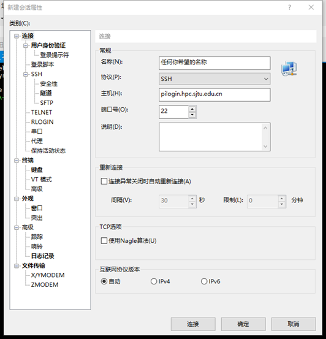
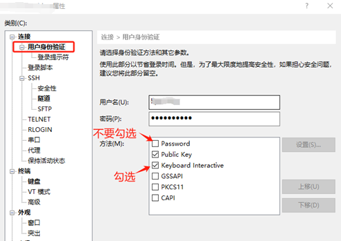
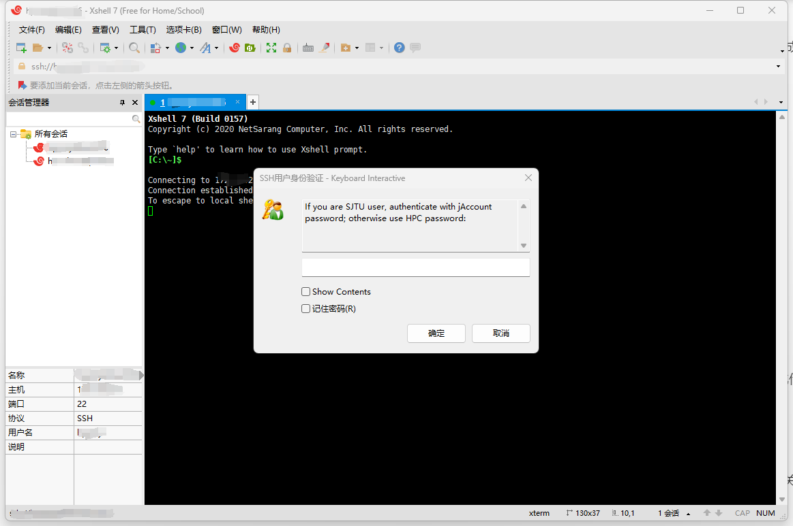
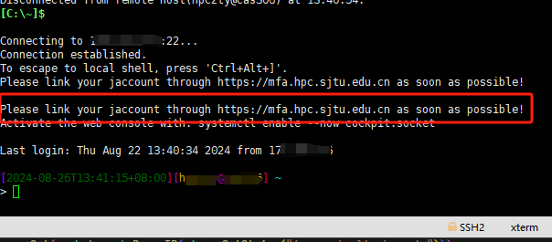
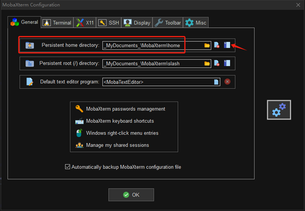
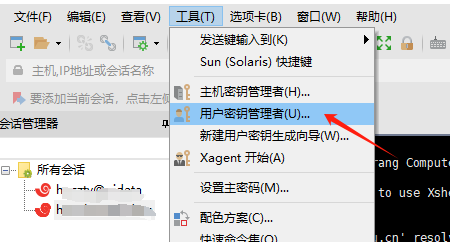
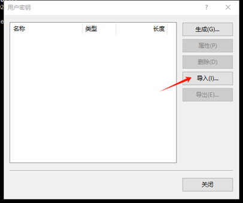

********************
通过 SSH 登录集群
********************

超算平台于2024年9月23日开始对接交大jAccount账号，对于校内用户，超算账号关联jAccount后您可以用 **超算账号和jAccount密码** 进行SSH登录。如果您希望进行免密登录，需要向平台申请免密证书。

注意事项:

-  2024年9月之后的校内新用户，超算账号将与您的jAccount同名；而此时间点之前的老用户，将保留原有的独立用户名。因此校内的老用户绑定jAccount之后需要使用 **原用户名+jAccount密码** 进行SSH登录。
-  任务完成后请主动结束后台进程，关闭 SSH 会话。长时间不活动的用户滞留进程会由系统强制清理。
-  恶意的 SSH 客户端软件会窃取您的密码，请在官网下载正版授权 SSH 客户端软件。
-  若无法登录，请检查输入密码或确认 IP 地址是否正确。您可以参考故障排除和反馈，将诊断信息发送给 `HPC 邮箱 <mailto:hpc@sjtu.edu.cn>`_ 。

登录入口
------------

交我算平台目前有3个用于作业交互的登录入口和2个用于数据传输的数据节点，其中部分入口有负载均衡功能，会根据后端的负载情况将您的会话分流到合适的服务器上，请根据自己的业务场景选择合适的入口。

===========================  ========= ========= =======================================================================================
入口域名                     用途分类  负载均衡    说明                                                      
===========================  ========= ========= =======================================================================================
pilogin.hpc.sjtu.edu.cn      作业交互  是         π2.0和AI集群的登录入口，用于向cpu, huge, dgx2, debug队列投递作业
sylogin.hpc.sjtu.edu.cn      作业交互  是         思源集群的登录入口，用于向64c512g, a100, a800和对应的debug队列投递作业
kplogin.hpc.sjtu.edu.cn      作业交互  否         arm集群的登录入口，用于向arm128c256g, debugarm队列投递作业
data.hpc.sjtu.edu.cn         数据传输  否         主要用于在本地和/lustre/home/XXX存储池之间传输数据，也可在lustre和dssg之间转移数据
sydata.hpc.sjtu.edu.cn       数据传输  否         用于在本地和/dssg/home/XXX存储池之间传输数据
===========================  ========= ========= =======================================================================================

本章节后续内容均以登录 **pilogin.hpc.sjtu.edu.cn** 入口为例，如果登录其他入口，请自行替换指令中的域名。

进行密码认证的SSH登录
------------------------

不同类型的用户在绑定jAccount/邮箱后，进行SSH登录需要使用的账号和密码整理如下表：

+----------+--------------------------------------------------+-------------+
|用户类型  |SSH账号名                                         |SSH密码      |
+==========+==================================================+=============+
|交大用户  |实际账号名                                        |jAccount密码 |
|          |                                                  |             |
|          |2024/09以后的新账号统一为jAccount名，             |             |
|          |在这以前的老账号继续保持原账号名                  |             |
+----------+--------------------------------------------------+-------------+
|合作用户  |自定义用户名                                      |自定义密码   |
+----------+--------------------------------------------------+-------------+

当您的账号成功登录后，系统将根据您选择的通知渠道，发送对应的登录行为通知，这可能是 **一条交我办APP消息** 或者 **一封邮件** 。

如果您需要在短时间内频繁登录超算，或者通过脚本进行scp、rsync等批量操作，请参阅 `账号安全信息管理 <https://docs.hpc.sjtu.edu.cn/accounts/security.html>`_ 的相关章节，申请免密证书。

以Mobaxterm为代表的命令行客户端进行SSH登录
~~~~~~~~~~~~~~~~~~~~~~~~~~~~~~~~~~~~~~~~~~~~~

`Mobaxterm <https://mobaxterm.mobatek.net/>`_ 可以在windows系统上提供模拟的linux环境，用此客户端进行SSH登录的操作与原生linux环境相同。同理本章节也适用于从原生linux环境发起SSH登录。

假设您的超算账号为 **user01** ，需要登录的入口为 **pilogin.hpc.sjtu.edu.cn** 。

1. 在客户端的命令行窗口发起ssh连接： ``ssh user01@pilogin.hpc.sjtu.edu.cn`` 。
#. 如果您没有保存过密码，根据命令行提示完成传统账号密码认证。登录成功后您可以选择保存密码，以便在后续登录时跳过此步骤。
#. 如果登录后您看到如下提示，请参阅 `账号安全信息管理 <https://docs.hpc.sjtu.edu.cn/accounts/security.html>`_ 的相关章节，及时关联jAccount/邮箱。

**图片占位**

以XShell为代表的图形界面客户端进行SSH登录
~~~~~~~~~~~~~~~~~~~~~~~~~~~~~~~~~~~~~~~~~~~~~

不同客户端对SSH登录的图形化封装通常存在较大差异，本章节以XShell为例。如果您倾向使用其他图形化客户端，可能需要查询官方文档以找到等效的操作方式。

1. 点击 ``文件-新建`` 打开新建会话窗口，填入希望登录的目标入口。

2. 新建ssh连接时请在身份验证方法中勾选Keyboard Interactive方式。您也可以在这里预先填好密码。设置完成后保存连接。

3. 打开上一步建立好的连接，如果在前面已经输入了密码，客户端会自动完成传统密码认证，您将跳过此步骤；否则客户端会弹窗要求您输入密码。

4. 如果登录后您看到如下提示，请参阅 `账号安全信息管理 <https://docs.hpc.sjtu.edu.cn/accounts/security.html>`_ 的相关章节，及时关联jAccount/邮箱。

.. _label_no_password_login:

免密SSH登录
----------------

经过安全升级后，超算平台不再支持传统的公私钥免密，将公钥写入个人家目录的 ``~/.ssh/authorized_keys`` **不会** 再赋予您免密登录的权限。

如果您希望继续进行SSH免密登录，需要从 `超算账号管理平台 <https://mfa.hpc.sjtu.edu.cn>`_ 申请免密证书。以RSA密钥为例，公私钥免密和证书免密的区别如下表所示。

================================================  ==================================================
传统公钥免密	                                    证书免密
================================================  ==================================================
生成公钥id_rsa.pub和私钥id_rsa文件	                 生成公钥id_rsa.pub和私钥id_rsa文件
\                                                  用户提交公钥id_rsa.pub申请证书id_rsa-cert.pub
将公钥内容写入服务器的~/.ssh/authorized_keys中       \
本地使用私钥id_rsa进行免密登录	                     本地使用私钥id_rsa和证书id_rsa-cert.pub进行免密登录
================================================  ==================================================

申请免密证书的方法请参阅 `账号安全信息管理 <https://docs.hpc.sjtu.edu.cn/accounts/security.html>`_ 的相关章节。

以Mobaxterm为代表的命令行客户端进行免密登录
~~~~~~~~~~~~~~~~~~~~~~~~~~~~~~~~~~~~~~~~~~~~~

此章节同样适用于原生linux环境进行免密登录。

将下载得到的证书文件存放到 ``~/.ssh/`` 目录，同时您原有的或者下载得到的私钥文件也应该存在于此目录，并与证书文件名保持上表所示的匹配关系。如果您不确定Mobaxterm将个人家目录映射到了哪里，请打开 ``settings - configurations`` 检查下图所示的路径配置。

    
    Mobaxterm查看个人目录映射位置

之后在免密有效期内发起ssh连接即可实现免密登录。 

以XShell为代表的图形界面客户端进行免密登录
~~~~~~~~~~~~~~~~~~~~~~~~~~~~~~~~~~~~~~~~~~~~~

不同客户端对SSH登录的图形化封装通常存在较大差异，本章节以XShell为例。如果您倾向使用其他图形化客户端，可能需要查询官方文档以找到等效的操作方式。

图形界面使用和管理秘钥、证书操作较为繁琐，不建议使用此类客户端。

1. 点击 ``工具-用户密钥管理者`` 打开管理窗口，点击导入，分别导入您下载到的私钥和证书。请确保两个文件名符合上表演示的对应关系。

    
    XShell导入秘钥和证书

2. 右键您的SSH会话，进入属性设置，在 ``用户身份验证`` 选项卡中，勾选 ``Public Key`` 方法，并确保此方法排序在 ``Keyboard interactive`` 方法之前。点击设置，选择上一步您导入的秘钥。
#. 在免密有效期内，您使用此会话进行SSH登录将不再需要手动认证。有效期过后，您需要重新申请新的免密证书。

如何生成自己的公私钥对
---------------------------

.. code:: bash

   （在集群上）$ rm -f ~/.ssh/authorized_keys             # 清除服务器上原有的 authorized_keys
   （在自己电脑上）$ rm  ~/.ssh/id*                           # 清除本地 .ssh 文件夹中的密钥对
   （在自己电脑上）$ ssh-keygen -t rsa                        # 在本地重新生成密钥对。第二个问题，设置密码短语 (passphrase)，并记住密码短语
   （在自己电脑上）$ ssh-keygen -R sylogin.hpc.sjtu.edu.cn    # 清理本地 known_hosts 里关于集群的条目
   （在自己电脑上）$ ssh-copy-id YOUR_USERNAME@TARGET_IP      # 将本地新的公钥发给服务器，存在服务器的 authorized_keys 文件里

SSH 重置 known_hosts
--------------------

.. image:: ../img/knownhosts.png

若遇到上方图片中的问题，请重置 known_hosts，命令如下：

.. code:: bash

   （在自己电脑上）$ ssh-keygen -R sylogin.hpc.sjtu.edu.cn

调试 SSH 登录问题
-----------------

有多种原因可能会阻止您登录到集群。

1. 连续多次错输密码会被临时封禁 1 小时。集群登录节点设置了 fail2ban 服务，多次输入密码错误后会被临时封禁 1 小时。

2. 若在登录节点运行计算密集的作业，程序会被自动查杀，您的账号会被加入到黑名单，并在 30-120 分钟内无法登录。

若需重置密码，请使用或抄送账号负责人邮箱发送邮件到  \ `HPC 邮箱 <mailto:hpc@sjtu.edu.cn>`__\ ，我们将会在 1 个工作日内响应您的申请。

排查登录问题，还可以使用 ping 命令检查您的电脑和集群连接状态。

.. code:: bash

   $ ping sylogin.hpc.sjtu.edu.cn

登录常掉线的问题
----------------

如果 SSH 客户端长时间静默后，SSH 服务器端会自动断开相关会话。要解决这个，需要调整 SSH 的 keepalive 值，设置一个较长的静默时长阈值。

Mac/Linux用户
~~~~~~~~~~~~~~~~~

对于 Mac/Linux 用户，并且使用操作系统原生的终端 (terminal)，需要修改 \ ``$HOME/.ssh/config``\ 。具体的，在文件中添加如下内容：

.. code:: bash

   Host pi-sjtu-login:
       HostName sylogin.hpc.sjtu.edu.cn
       ServerAliveInterval 240

其中 ServerAliveInterval 后的值即为阈值，单位为秒，用户可根据需要自行调整。

或者为了对所有的服务器设置长静默阈值：

.. code:: bash

   Host *
       ServerAliveInterval 240

之后保持 \ ``config``\ 文件为只可读：

.. code:: bash

   chmod 600 ~/.ssh/config

Windows SSH 客户端用户
~~~~~~~~~~~~~~~~~~~~~~~~~~~~~

这里我们以 Putty 为例。市面有不同的 SSH 客户端，您可以根据自身情况自行搜索您使用的 SSH 客户端的设置方法。

在 Putty的 Session 的属性中， ``Connection`` -> ``Sending of null packets to keep session active`` -> ``Seconds between keepalives (0 to turn off)`` 后的文本框中，输入对应的值，如 240。
