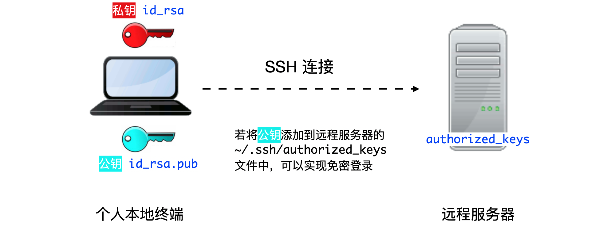

********************
通过 SSH 登录集群
********************

本文主要内容：

-  使用 SSH 登录集群的注意事项；
-  首次登录准备，如信息采集、客户端下载、SSH 登录、SSH 文件传输、无密码登录等；
-  故障排除和反馈。

注意事项:

-  交我算账号仅限于同一课题组的成员使用，请勿将账号借给他人使用。
-  请妥善保管好您的账号密码，不要告知他人。管理员不会要求您提供密码。
-  恶意的 SSH 客户端软件会窃取您的密码，请在官网下载正版授权 SSH 客户端软件。
-  登录集群后，请不要跳转到其他登录节点。任务完成后请关闭 SSH 会话。
-  若无法登录，请检查输入密码或确认 IP 地址是否正确。您可以参考故障排除和反馈，将诊断信息发送给 \ `HPC 邮箱 <mailto:hpc@sjtu.edu.cn>`__\ 。

SSH 登录
-------------------

账号开通后您会收到含有以下内容的邮件，包含账号用户名和密码用于登录集群。登录集群有两种方式：SSH 命令行登录、SSH 客户端登录。

::

   Username: YOUR_USERNAME
   Password: YOUR_PASSWORD

登录方法一：命令行登录
^^^^^^^^^^^^^^^^^^^^^^^^^^^^

* 思源一号

.. code:: bash

   $ ssh username@sylogin.hpc.sjtu.edu.cn

* π 2.0 和 AI 平台

.. code:: bash

   $ ssh username@pilogin.hpc.sjtu.edu.cn

* ARM 平台（限校内 IP，或使用 SJTU VPN）
  
.. code:: bash

   $ ssh username@armlogin.hpc.sjtu.edu.cn

说明：

* 登录节点 IP 地址（或主机名）分别为 sylogin.hpc.sjtu.edu.cn（思源一号）、pilogin.hpc.sjtu.edu.cn（π 2.0 和 AI）、armlogin.hpc.sjtu.edu.cn（ARM）

* 通过上述命令登录，会自动分配到多个登录节点之一

* SSH 端口均为默认值 22

登录方法二：客户端登录
^^^^^^^^^^^^^^^^^^^^^^^^^^^^

Windows 推荐使用 Putty 免费客户端，下载后双击即可运行使用。可至 \ `Putty 官网 <https://www.putty.org>`__\
下载。Linux / Unix / Mac 操作系统拥有自己的 SSH 客户端，包括 ssh, scp, sftp 等。

下面介绍 Windows 用户使用 Putty 客户端登录思源一号。

启动客户端 Putty，填写登录节点地址 sylogin.hpc.sjtu.edu.cn （适用于思源一号），或  pilogin.hpc.sjtu.edu.cn （适用于 π 2.0 和 AI 集群），端口号采用默认值 22，然后点 Open 按钮，如下图所示：

.. image:: ../img/putty1.png

在终端窗口中，输入您的 SSH 用户名和密码进行登录：

.. image:: ../img/putty2.png

*提示：输入密码时，不显示字符，请照常进行操作，然后按回车键登录。*

通过 SSH 传输文件
-----------------

登录节点资源有限，不推荐在登录节点直接进行大批量的数据传输。交我算HPC+AI平台提供了专门用于数据传输的节点，登录该节点后可以通过rsync，scp等方式将个人目录下的数据下载到本地，或者反向上传本地数据到个人目录。详情请参考具体请参考 \ `数据共享与传输 <https://docs.hpc.sjtu.edu.cn/transport/index.html#>`__\ 。

.. _label_no_password_login:

无密码登录
----------

*提示：“无密码登录”仅适用于使用 SSH 命令行工具的 Linux/ UNIX / Mac 用户*

“无密码登录”使您无需输入用户名和密码即可登录，它还可以作为服务器的别名来简化使用。无密码登录需要建立从远程主机（集群的登录节点）到本地主机（您自己的计算机）的SSH信任关系。建立信任关系后，双方将通过 SSH 密钥对进行身份验证。

首先，您需要在本地主机上生成的 SSH 密钥对。为安全起见，集群要求使用密码短语 (passphrase) 来保护密钥对。使用密码短语来保护密钥对，每次双方身份验证时都需要输入密码。

.. code:: bash

   $ ssh-keygen -t rsa

接下来屏幕会显示：

.. code:: bash

   Generating public/private rsa key pair.
   Enter file in which to save the key (/XXX/XXX/.ssh/id_rsa):   # 存储地址，默认回车即可
   Enter passphrase (empty for no passphrase):                   # 请设置密码短语，并记住。输入的时候屏幕无显示
   Enter same passphrase again:                                  # 再输入一遍密码短语

.. tips: 为何要设置含有密码短语的密钥对： 输入ssh-keygen时，会请求您输入一个密码短语，您应该输入一些难以猜到的短语。

在无密码短语的情况下，您的私钥未经加密就存储在您的硬盘上，任何人拿到您的私钥都可以随意的访问对应的SSH服务器。

ssh-keygen 将在 ~/.ssh 中生成一个密钥对，包含两个文件：id_rsa(需保留的私钥)，和id_rsa.pub可作为您的身份发送的公钥）。然后，使用
ssh-copy-id 将本地主机的公钥 id_rsa.pub添加到远程主机的信任列表中。实际上，ssh-copy-id 所做的就是将id_rsa.pub的内容添加到远程主机的文件 ~/.ssh/authorized_keys 中。

.. code:: bash

   （在自己电脑上）$ ssh-copy-id YOUR_USERNAME@TARGET_IP

若手动自行在服务器上添加 authorized_keys 文件，需确保 authorized_keys
文件的权限为 600：

.. code:: bash

   （在集群上）$ chmod 600 ~/.ssh/authorized_keys

我们还可以将连接参数写入 ~/.ssh/config 中，以使其简洁明了。
新建或编辑文件 ~/.ssh/config：

.. code:: bash

   $ EDIT ~/.ssh/config

还需分配以下内容：
主机分配远程主机的别名，主机名是远程主机的真实域名或IP地址，端口分配 SSH 端口，用户分配 SSH 用户名。

::

   Host hpc
   HostName TARGET_IP
   User YOUR_USERNAME

您需要确保此文件的权限正确：

.. code:: bash

   $ chmod 600 ~/.ssh/config

然后，您只需输入以下内容即可登录集群：

.. code:: bash

    $ ssh hpc

*当 SSH 密钥对发生泄漏，请立即清理本地电脑 .ssh
文件夹里的密钥对，并重新在本地生成密钥对（生成时请设置密码短语）。另外请删除集群上的 ~/.ssh/authorized_keys 文件。*

如何重新生成密钥对
----------------------------------------------------

.. code:: bash

   （在集群上）$ rm -f ~/.ssh/authorized_keys             # 清除服务器上原有的 authorized_keys
   （在自己电脑上）$ rm  ~/.ssh/id*                           # 清除本地 .ssh 文件夹中的密钥对
   （在自己电脑上）$ ssh-keygen -t rsa                        # 在本地重新生成密钥对。第二个问题，设置密码短语 (passphrase)，并记住密码短语
   （在自己电脑上）$ ssh-keygen -R sylogin.hpc.sjtu.edu.cn    # 清理本地 known_hosts 里关于集群的条目
   （在自己电脑上）$ ssh-copy-id YOUR_USERNAME@TARGET_IP      # 将本地新的公钥发给服务器，存在服务器的 authorized_keys 文件里

SSH 重置 known_hosts
--------------------

.. image:: ../img/knownhosts.png

若遇到上方图片中的问题，请重置 known_hosts，命令如下：

.. code:: bash

   （在自己电脑上）$ ssh-keygen -R sylogin.hpc.sjtu.edu.cn

调试 SSH 登录问题
-----------------

有多种原因可能会阻止您登录到集群。

1. 连续多次错输密码会被临时封禁 1 小时。集群登录节点设置了 fail2ban 服务，多次输入密码错误后会被临时封禁 1 小时。

2. 若在登录节点运行计算密集的作业，程序会被自动查杀，您的账号会被加入到黑名单，并在 30-120 分钟内无法登录。

若需重置密码，请使用或抄送账号负责人邮箱发送邮件到  \ `HPC 邮箱 <mailto:hpc@sjtu.edu.cn>`__\ ，我们将会在 1 个工作日内响应您的申请。

排查登录问题，还可以使用 ping 命令检查您的电脑和集群连接状态。

.. code:: bash

   $ ping sylogin.hpc.sjtu.edu.cn

登录常掉线的问题
----------------

如果 SSH 客户端长时间静默后，SSH 服务器端会自动断开相关会话。要解决这个，需要调整 SSH 的 keepalive 值，设置一个较长的静默时长阈值。

Mac/Linux用户
^^^^^^^^^^^^^

对于 Mac/Linux 用户，并且使用操作系统原生的终端 (terminal)，需要修改 \ ``$HOME/.ssh/config``\ 。具体的，在文件中添加如下内容：

.. code:: bash

   Host pi-sjtu-login:
       HostName sylogin.hpc.sjtu.edu.cn
       ServerAliveInterval 240

其中 ServerAliveInterval 后的值即为阈值，单位为秒，用户可根据需要自行调整。

或者为了对所有的服务器设置长静默阈值：

.. code:: bash

   Host *
       ServerAliveInterval 240

之后保持 \ ``config``\ 文件为只可读：

.. code:: bash

   chmod 600 ~/.ssh/config

Windows SSH 客户端用户
^^^^^^^^^^^^^^^^^^^^^^^^^^^^^

这里我们以 Putty 为例。市面有不同的 SSH 客户端，您可以根据自身情况自行搜索您使用的 SSH 客户端的设置方法。

在 Putty的 Session 的属性中，\ ``Connection`` ->
``Sending of null packets to keep session active`` ->
``Seconds between keepalives (0 to turn off)``\ 后的文本框中，输入对应的值，如 240。

