***********************
交我算定制版客户端Tabby
***********************

Tabby (前身是 Terminus) 是一个基于TypeScript开发，可高度配置的终端模拟器和SSH或串口客户端，支持 Windows、Mac OS 和 Linux系统, 功能强大，包括：

* 集成 SSH、Telnet 客户端和连接管理器
* 集成串行终端
* 定制主题和配色方案
* 完全可配置的快捷键和多键快捷键
* 拆分窗格
* 记忆标签
* 支持 PowerShell（和 PS Core）、WSL、Git-Bash、Cygwin、MSYS2、Cmder 和 CMD等
* 丰富的插件
* 支持 SFTP 功能

针对用户登录不上集群时难以定位原因的问题，交我算团队为用户开发了定制版Tabby。定制版Tabby有三大特点：

* 预置交我算平台各集群主机名，便捷登录
* 登录自检功能，快速定位登录问题并输出提示，提高登录效率
* SFTP自动读取家目录，方便数据传输

下载和安装
---------------

定制版Tabby支持多平台，包括Windows/Mac O/Linux系统Intel或Arm架构。jBox下载好后安装即可。\ `jBox下载地址 <https://jbox.sjtu.edu.cn/l/k1GShy>`__\

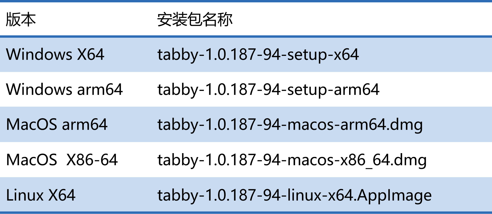

通过Tabby登录集群
----------------------

以Windows X64版本为例（其他版本使用方法基本无差异）
* 首次打开Tabby后，可以自行设定语言，如“中文（简体）”。

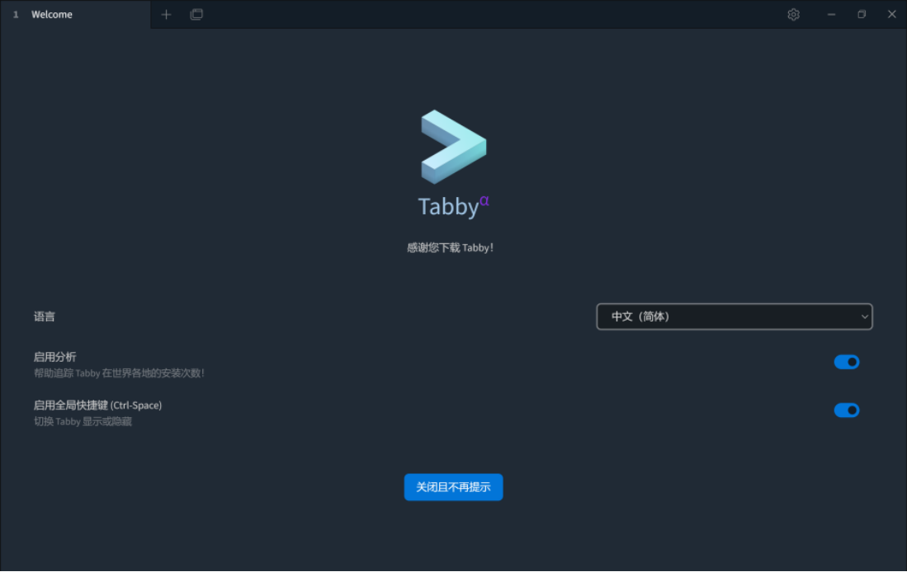

* 进入如下主界面，如需要直接登录集群，则点击“配置和连接”。

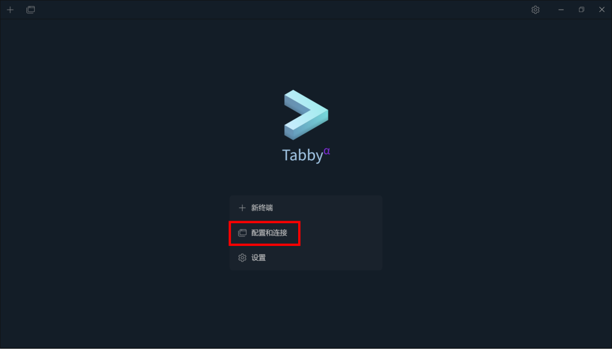

* 可以看到里面预置了五个主机名，包括三大平台的登录节点以及数据传输节点。选择需要登录的集群，以“思源一号”登录节点为例，点击enter。

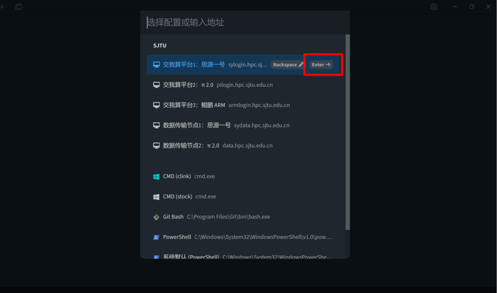

* 首次登录时，根据提示输入用户名和密码，选择“Remember”记住密码则下一次可以自动登录。如跳出“主机密钥校验”，选择“接受并记住密钥”。

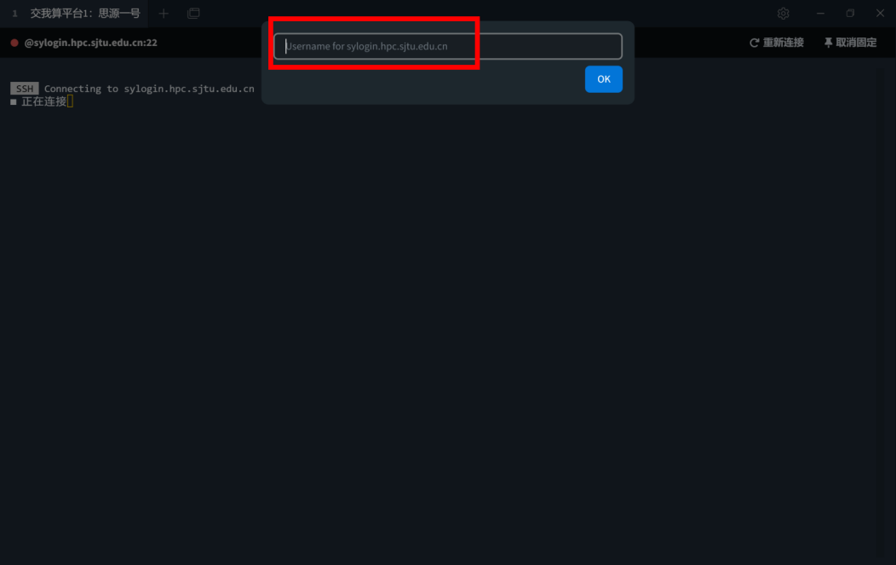

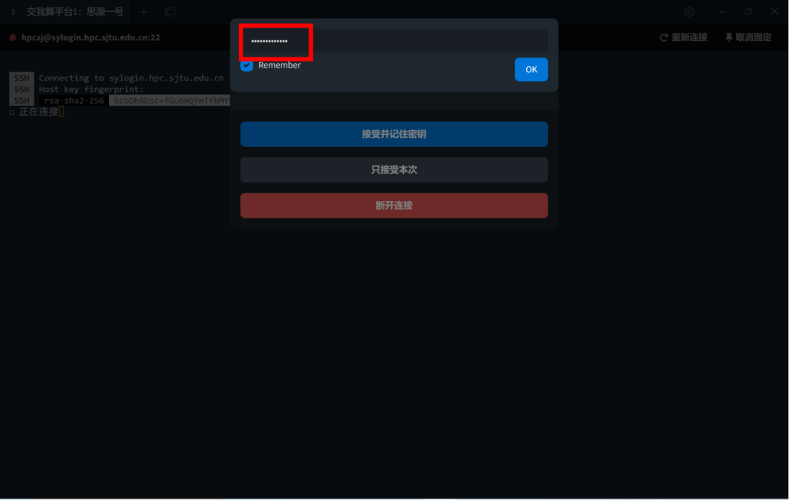

* 登录成功。

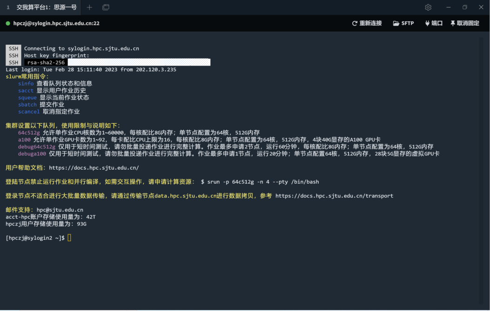

参数设置
---------

* 在主界面或登录界面均可以进入到“设置”页面。

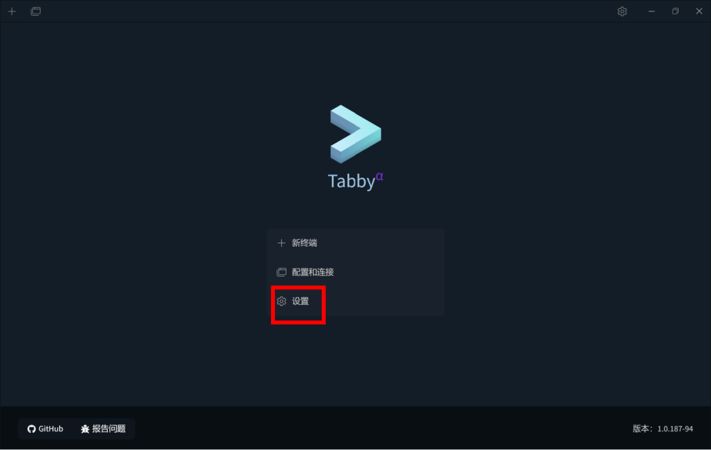

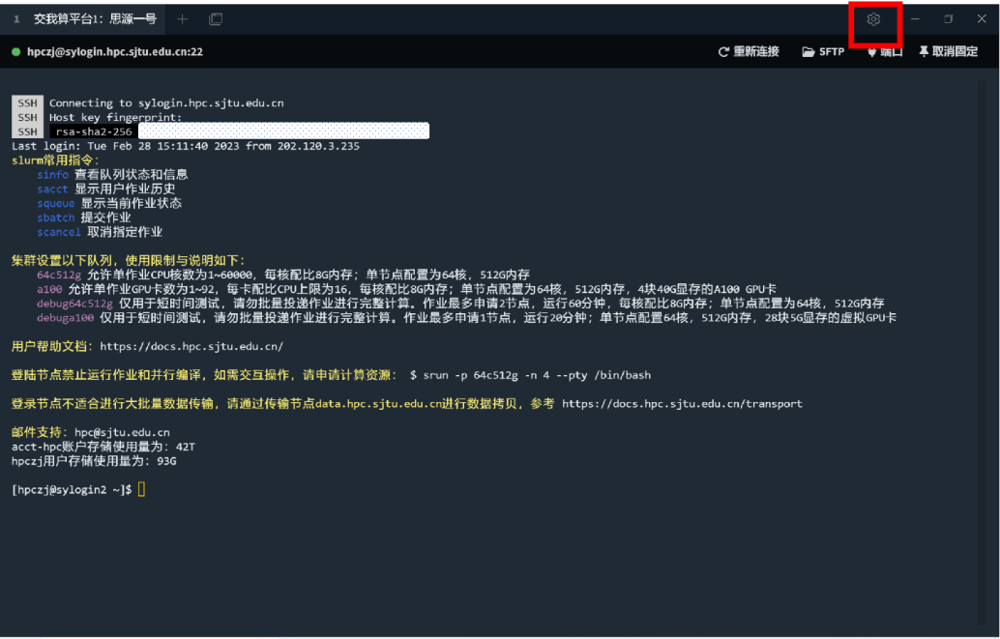

* 在“设置”页面可以进行应用、外观、配色、配置连接等各种设置。

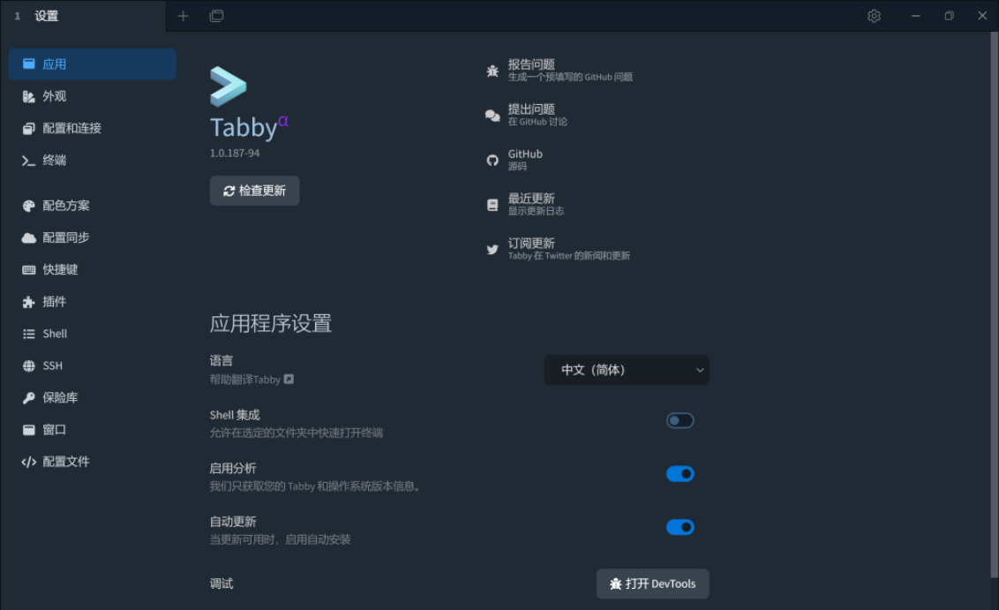

* Tabby自动保存第一次登录成功的用户名和密码，之后打开Tabby将自动登录。如需要更改用户名和身份验证方法，则进入设置-配置和连接-配置，点击对应的SSH，再更改用户名或身份验证方法。

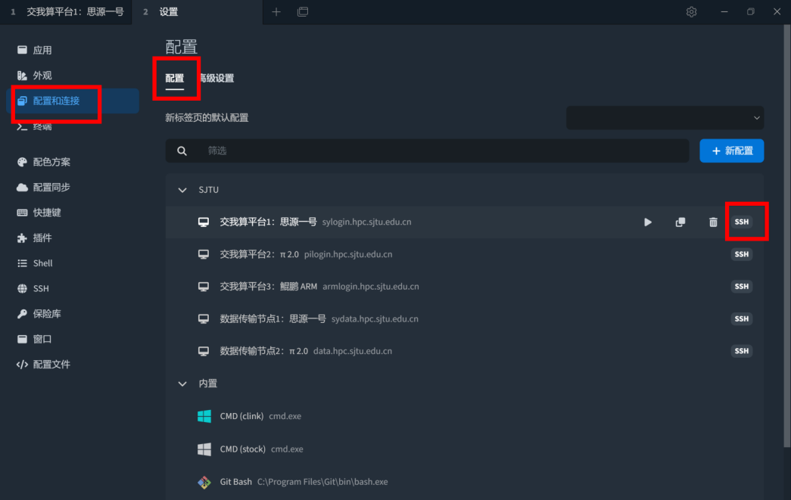

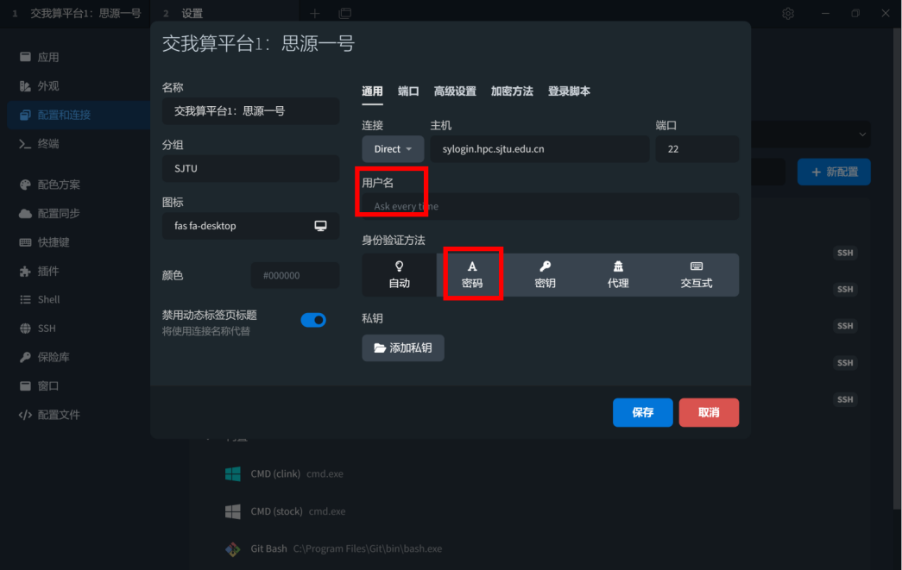

* 如果需要清除之前的配置，可以点击“设置”，选择“配置⽂件”，点击“显⽰配置⽂件”，资源管理器会打开配置⽂件所在的⽬录。返回上⼀级⽬录，将整个tabby⽬录全部删除。

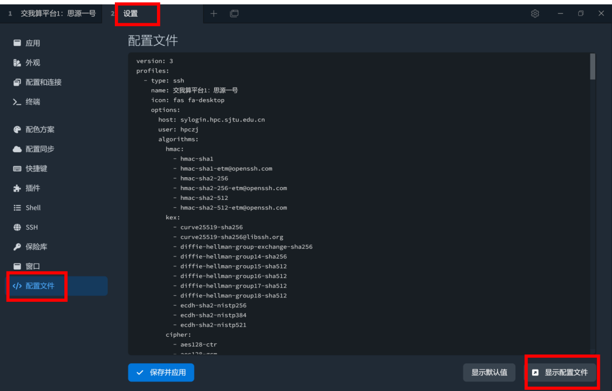

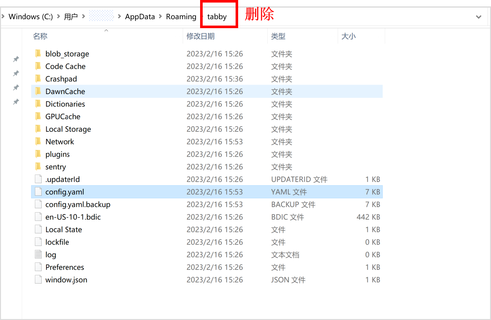

SFTP功能
---------

在登录页面点击”SFTP”,可以进入⽤户家⽬录进行文件夹创建、文件上传，双击文件可以直接下载

.. image:: ../img/tabby_SFTP-1.png

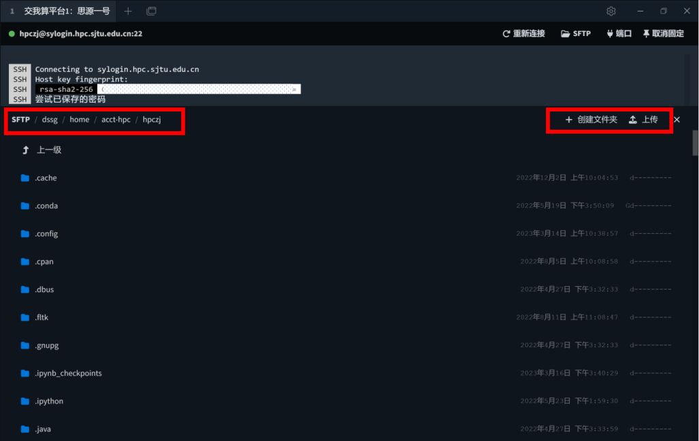

需要注意的是
::

   （1）Tabby的SFTP仅支持上传和下载文件，不支持目录。
   （2）可将目录压缩或打包后，再上传或下载。
   （3）大文件下载请使用数据传输节点。

常见报错
---------

* ⽹络连接问题

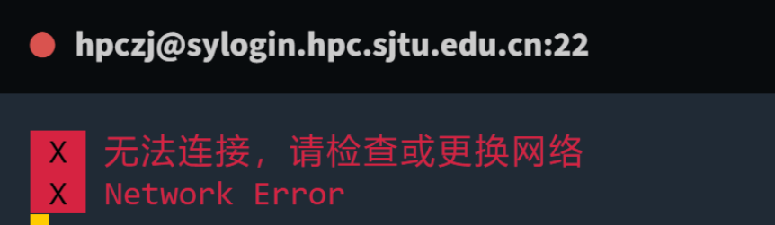

* 密码输⼊错误

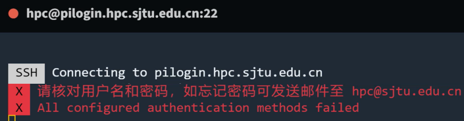

* 密码输入错误次数过多

.. image:: /img/tabby_fail-5.png

* 登录session过多

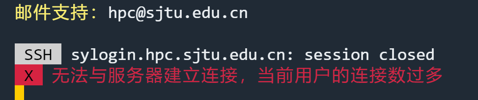

* 账号被冻结

* 集群停机维护

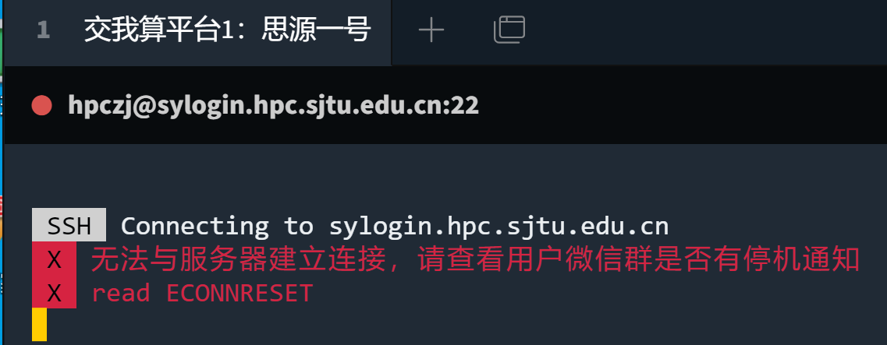

常见问题
---------

Q1: Mac用户安装时可能遇到“已损坏，无法打开，您应该将它移到废纸篓”的提示。

A1: 参考链接 https://zhuanlan.zhihu.com/p/135948430 进行设置。
