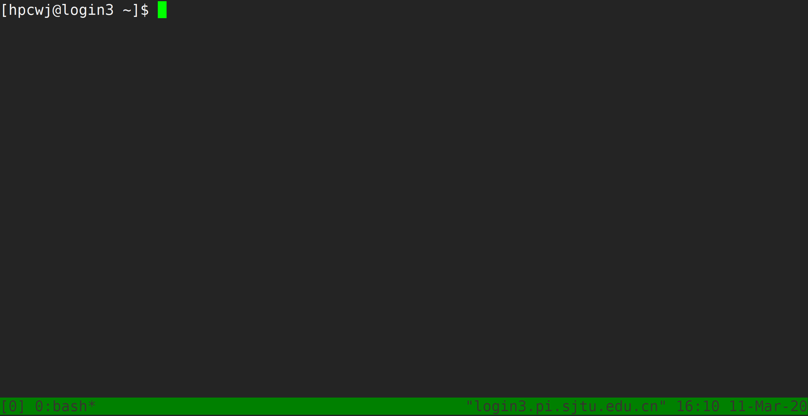
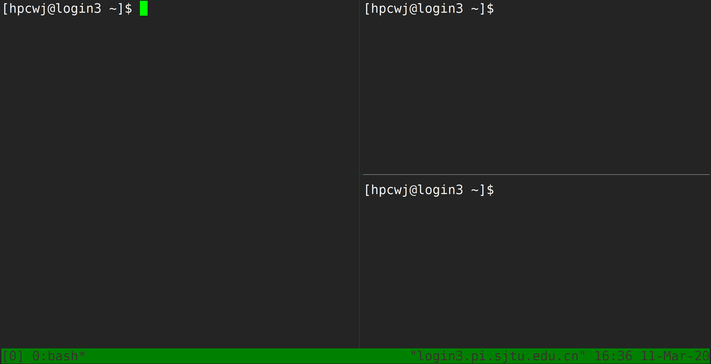

# Tmux

------------

Tmux是一个终端复用器（terminal multiplexer）。如果您有使用screen的经历的话，您可以理解为Tmux是screen的不同实现软件。本教程将讲解Tmux的基础用法。

## 一、Tmux是什么？

### 1.1 会话与进程

命令行的典型用法是打开终端（terminal）后，在里面输入指令。用户的这种与计算机交互的手段，称为**会话**（session）。

在会话中，通过命令行启动的所有进程均与会话进程绑定。当会话进程终止时，该会话启动的所有进程也会随之强行结束。

一点最常见的例子就是通过SSH连接到远程计算机。当SSH连接因为网络等原因断开时，那么SSH会话就被终止，这次会话启动的任务也会被强制结束。

为了解决这个问题，一种手段就是用户终端窗口与会话"解绑"。即关闭用户端窗口，仍然维持该会话，进而保证用户进程不变。

### 1.2 Tmux的作用

Tmux就是这样一款会话与窗口的"解绑"工具。

```
（1）它允许在单个窗口中，同时访问多个会话。这对于同时运行多个命令行程序很有用。

（2）它可以让新窗口"接入"已经存在的会话。

（3）它允许每个会话有多个连接窗口，因此可以多人实时共享会话。

（4）它还支持窗口任意的垂直和水平拆分
```

## 二、基本用法

### 2.1 安装

Pi2.0集群中已经默认安装了Tmux，无须操作。如果您需要在自己的服务器上安装Tmux，请参考以下指令：

```bash
# Ubuntu 或 Debian
$ sudo apt-get install tmux

# CentOS 或 Fedora
$ sudo yum install tmux

# Mac
$ brew install tmux
```

### 2.2 启动与退出

直接在终端中键入`tmux`指令，即可进入Tmux窗口。

```bash
$ tmux
```

上面命令会启动 Tmux 窗口，底部有一个状态栏。状态栏的左侧是窗口信息（编号和名称），右侧是系统信息。



按下`Ctrl+d`或者显式输入`exit`命令，就可以退出 Tmux 窗口。

```bash
$ exit
```

### 2.3 快捷键

Tmux有大量的快捷键。所有的快捷键都要使用`Ctrl+b`作为前缀唤醒。我们将会在后续章节中讲解快捷键的具体使用。

## 三、会话管理

### 3.1 新建会话

第一个启动的会话名为`0`，之后是`1`、`2`一次类推。

但是有时候我们希望为会话起名以方便区分。

```bash
$ tmux new -s SESSION_NAME
```

以上指令启动了一个名为`SESSION_NAME`的会话。

### 3.2 分离会话

如果我们想离开会话，但又不想关闭会话，有两种方式。按下`Ctrl+b d`或者`tmux detach`指令，将会分离会话与窗口

```bash
$ tmux detach
```

后面一种方法要求当前会话无正在运行的进程，即保证终端可操作。我们更推荐使用前者。

### 3.3 查看会话

要查看当前已有会话，使用`tmux ls`指令。

```bash
$ tmux ls
```

### 3.4 接入会话

`tmux attach`命令用于重新接入某个已存在的会话。

```bash
# 使用会话编号
$ tmux attach -t 0

# 使用会话名称
$ tmux attach -t SESSION_NAME
```

### 3.5 杀死会话

`tmux kill-session`命令用于杀死某个会话。

```bash
# 使用会话编号
$ tmux kill-session -t 0

# 使用会话名称
$ tmux kill-session -t SESSION_NAME
```

### 3.6 切换会话

`tmux switch`命令用于切换会话。

```bash
# 使用会话编号
$ tmux switch -t 0

# 使用会话名称
$ tmux switch -t SESSION_NAME
```

`Ctrl+b s`可以快捷地查看并切换会话

### 3.7 重命名会话

`tmux rename-session`命令用于重命名会话。

```bash
# 将0号会话重命名为SESSION_NAME
$ tmux rename-session -t 0 SESSION_NAME
```

对应快捷键为`Ctrl+b $`。

## 四、窗格（window）操作

Tmux可以将窗口分成多个窗格（window），每个窗格运行不同的命令。以下命令都是在Tmux窗口中执行。

### 4.1 划分窗格

`tmux split-window`命令用来划分窗格。

```bash
# 划分上下两个窗格
$ tmux split-window

# 划分左右两个窗格
$ tmux split-window -h
```



对应快捷键为`Ctrl+b "`和`Ctrl+b %`

### 4.2 移动光标

`tmux select-pane`命令用来移动光标位置。

```bash
# 光标切换到上方窗格
$ tmux select-pane -U

# 光标切换到下方窗格
$ tmux select-pane -D

# 光标切换到左边窗格
$ tmux select-pane -L

# 光标切换到右边窗格
$ tmux select-pane -R
```

对应快捷键为`Ctrl+b ↑`、`Ctrl+b ↓`、`Ctrl+b ←`、`Ctrl+b →`。

### 4.3 窗格快捷键

```bash
$ Ctrl+b %：划分左右两个窗格。
$ Ctrl+b "：划分上下两个窗格。
$ Ctrl+b <arrow key>：光标切换到其他窗格。<arrow key>是指向要切换到的窗格的方向键，比如切换到下方窗格，就按方向键↓。
$ Ctrl+b ;：光标切换到上一个窗格。
$ Ctrl+b o：光标切换到下一个窗格。
$ Ctrl+b {：当前窗格左移。
$ Ctrl+b }：当前窗格右移。
$ Ctrl+b Ctrl+o：当前窗格上移。
$ Ctrl+b Alt+o：当前窗格下移。
$ Ctrl+b x：关闭当前窗格。
$ Ctrl+b !：将当前窗格拆分为一个独立窗口。
$ Ctrl+b z：当前窗格全屏显示，再使用一次会变回原来大小。
$ Ctrl+b Ctrl+<arrow key>：按箭头方向调整窗格大小。
$ Ctrl+b q：显示窗格编号。
```

# 参考文献
*  https://www.hamvocke.com/blog/a-quick-and-easy-guide-to-tmux/
*  https://danielmiessler.com/study/tmux/
*  https://linuxize.com/post/getting-started-with-tmux/
*  https://www.ruanyifeng.com/blog/2019/10/tmux.html
