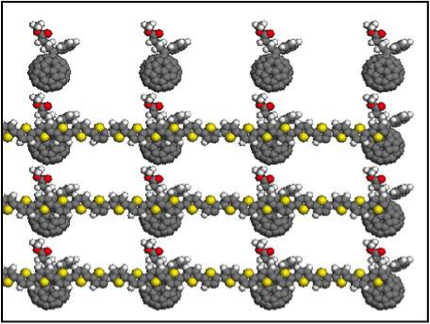
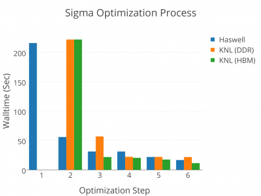
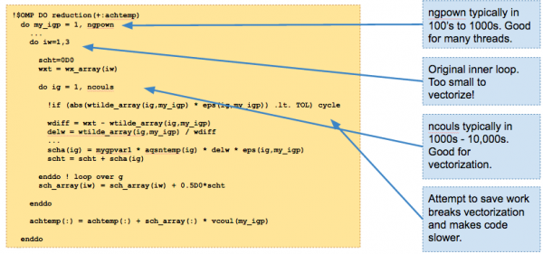
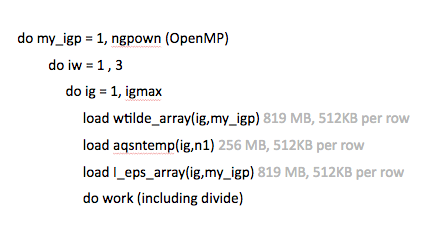
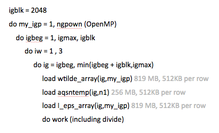
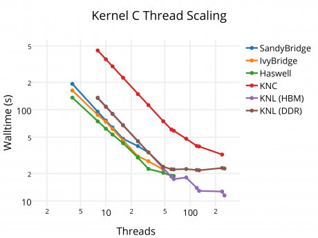

# BerkeleyGW

## Background

BerkeleyGW is a Materials Science application for calculating the excited state 
properties of materials such as band gaps, band structures, absoprtion 
spectroscopy, photoemission spectroscopy and more. It requires as input the 
Kohn-Sham orbitals and energies from a DFT code like Quantum ESPRESSO, PARATEC, 
PARSEC etc. Like such DFT codes, it is heavily depedent on FFTs, Dense Linear 
algebra and tensor contraction type operations similar in nature to those found
in Quantum Chemistry applications. 

Our target science application for the Cori timeframe is to study realistic 
interfaces in organic photo-voltaics (example P3HT system pictured below). 
Such systems require 1000+ atoms and considerable amount of vacuum that 
contributes to the computational complexity. GW calculations general scale as 
the number of atoms to the fourth power (the vacuum space roughly counting as 
having more atoms). This is 2-5 times bigger problem than has been done in the 
past. Therefore, successfully completing these runs on Cori requires not only 
taking advantage of the compute capabilities of the Knights-Landing architecture 
but also improving the scalability of the code in order to reach full-machine 
capability.

## Starting Point

BerkeleyGW started off as an MPI-Only application. This model in non-optimal for
a number reasons. The most pressing is that, like all MPI applications, 
BerkeleyGW duplicates some data structures on each MPI task in order to avoid 
significant amount of communication. For large problem sets on many-core 
systems, this is problematic because the duplicated memory can become 
significant and prevent a pure MPI application from fitting in memory 
(particularly High Bandwidth Memory) when using one MPI task per core. For this 
reason we were motivated to start by adding OpenMP to the application - 
targeting performant scaling up to 100+ threads. BerkeleyGW has multiple 
computational bottlenecks, we discuss below the "Sigma" application which is 
bottleneck for large systems.

## Discovery And Strategy

We started off with the following optimization strategy:

Step 1: Refactor loops to have a 3 level structure - a top level loop for MPI,
a second level loop for OpenMP, a bottom level loop targeting vectorization.
This process is expressed in the following figure where we compare the 
performance of the Sigma kernel on Xeon and Xeon-Phi Knights-Landing processors.

In the above figure, you can see a couple of themes. Firstly, optimizations targeting the Xeon-Phi improve the code performance on the Xeon architecture (Haswell in the above case) as well. Secondly, like many codes, we found that as soon as we added OpenMP parallelism, it didn't immediately perform well on the Xeon Phi. We needed to make sure the loops targeted at vectorization were actually being vectorized by the compiler (Step 3). The following figure shows the code schematic for this change.

In the above figure you can see two changes that affected vectorization. Firstly, we reordered the loops, so that the innermost loop had a long trip count (the original inner loop had a trip-count of 3) the new inner-loop has 1000-10000 iteration trip count. Secondly, we removed spurious logic and cycle statements that cause unnecessary execution forking. The original code was not auto-vectorized by the Intel compiler due to a low predicted vector gain. 

## Working with Cray and Intel

We next took the above code to a dungeon session attended by Cray and Intel engineers. We addressed the issue of why the performance on Xeon-Phi not outperforming Xeon by a larger margin.

We note that the above kernel can be essentially broken down as the following:

We note that on both the Xeon and Xeon-Phi the memory requirements to hold a row of the three arrays is more than the available L2 (256-512 KB). However, the arrays do fit into L3 cache on the Xeon. There is not corresponding L3 on Xeon-Phi; so the data is streamed from the Xeon-Phi RAM. However, if we rewrite the code in the following way (optimization step 4), we can we use data in L2 on the Xeon-Phi at least 3 times:

In this case, the code is near the cross-over point for being bandwidth vs compute bound. By reusing the data 3 times, we are able to make better use of the vector units in the Xeon-Phi processor. The change becomes evident if we look at the optimization path on a roofline performance curve. The curve shows measured performance of the above application revisions and measured arithmetic-intensity (FLOPs per byte transferred from DRAM to the cores on the node). 

The cache-blocking step described is represented by optimization step 4. You can see that our vectorization optimization actually reduced our measured arithmetic intensity on KNL (due to the loss of factor of 3 reuse) and cache blocking restores it. When running out of DDR on the KNL (brown line), you can see the performance is memory bandwidth limited (the performance is pinned to the roofline curve). However when running out of HBM, room exists to improve the performance further.

In order to gain further performance, we utilize hyper-threading (beyond 64 threads on the 7210 KNL part) and improve the performance of the complex divides performed in the loop, which by default generate X87 instructions which serialize the code. The following figure shows the thread scaling of the optimized on code (Kernel C represents the Sigma code discussed above) on various platforms:

You can see that code scales well to 64 threads (and beyond) on KNL when running out of MCDRAM, but fails to scale beyond 40 or so threads when running out of DDR. This is because memory bandwidth ultimately limits the performance when running out of DDR (also evident on the roofline curve). Secondly, you can see that KNL outperforms Haswell by about 60% and significantly outperforms Knights-Corner! 

## Lessons Learned

1. Optimal performance for this code required restructuring to enable optimal thread scaling, vectorization and improved data reuse.

2. Long loops are best for vectorization. In the limit of long loops, effects of loop peeling and remainders can be neglected.

3. There are many coding practices that prevent compiler auto-vectorization of code. The use of profilers and compiler reports can greatly aid in producing vectorizable code.

4. The absence on L3 cache on Xeon-Phi architectures makes data locality ever more important than on traditional Xeon architectures. 

5. Optimization is a continuous process. The limiting factor in code performance may change between IO/communication, memory bandwidth, latency and CPU clockspeed as you continue to optimize.

