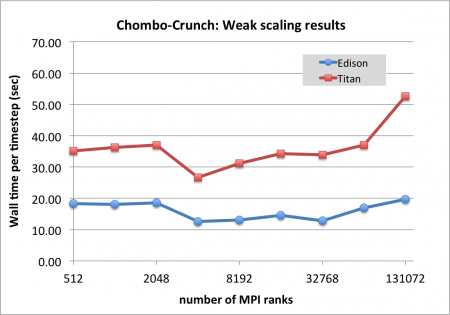
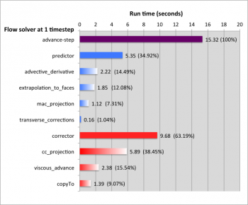
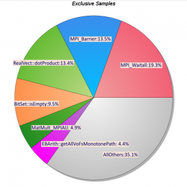
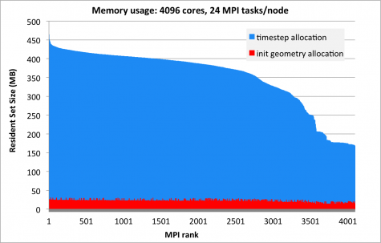
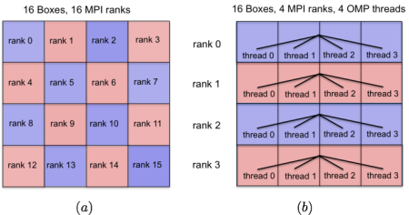

# Chombo-Crunch

## Background

Chombo-Crunch is a high-performance software package which has been developed
jointly by research scientists from Applied Numerical Algorithms Group,
Computational Research Division (PI: David Trebotich) and Earth Sciences
Division at LBNL for large-scale numerical simulations of complex fluid flows
with particular interest in modeling of subsurface flows. One important
application example of subsurface flow is a carbon sequestration - the process
of capturing carbon dioxide before it enters the atmosphere and transferring it
into the earth. It is a promising technique to help control greenhouse gas
emissions and attenuate climate change. From numerical point of view, modeling
of carbon sequestration process is a challenge due to need to solve equations
in very complex fractal geometry and to incorporate all important physical
mechanisms occurring at vast range of scales - from order of 100 kilometers at
reservoir scale to submicron at pore scale. To address these challenges,
Chombo-Crunch has been developed by merging high performance CFD capabilities
of Chombo package with the geochemistry package CrunchFlow to model reactive
transport processes in resolved pore space.

## Starting point

We start with a flat MPI version of Chombo-Crunch code (baseline). It has been
previously optimized for current architectures. Results of weak scaling
analysis on Cray XC30 at NERSC (Edison) and Cray XK7 at ORNL (Titan) are shown
in a figure below.

Next two figures shows the results of profling analysis for baseline version of
Chombo-Crunch. The figure on the left depicts partions of walltime spent by
different flow solver parts: velocity predictor, velocity corrector, etc. (in
the framework of finite-volume projection method for incompressible
Navier-Stokes equations). For instance, one can see that the velocity corrector
takes approximately 63% of the total cost and its main contribution is due to
cell-centered projection operator. The figure on the right shows profiling
results from CrayPat. It clearly seen that there is a significant MPI overhead
due to almost 20% spent in `MPI_Waitall`. It gives us some hints for
optimization of load balance problem: in this test case the geometry is a
porous media and some boxes (part of computational domain after decomposition)
have only covered cells with no computational loads. Processes assigned with
covered boxes are waiting all other process which have to complete the
computation of flow fluxes before exchanging data with neighbor-boxes.

## Optimization strategy

First step is optimization of memory usage. For current architectures at
optimal settings (optimal number of mesh points per box) Chombo-Crunch uses
about 450MB per core. Ideally to have more flexibility in the context of hybrid
memory (High Bandwidth Memory and flat DDR4) on Cori it is required to reduce
this ammount to at least 100 MB/core. Figure below shows the memory allocation
(resident set size) versus MPI rank for test case with realistic flow
configuration in complex porous media geometry.

Second step is an implementation of thread safe OpenMP by introducing threads
into Chombo's data iterators. Instead of using a data iterator over all boxes
assigned to given MPI rank we use a loop over boxes assigned to current MPI
rank and use data iterators for each box. The loop over boxes can be threaded
with OpenMP assuming 1 thread per box.

The schematic below illustrates the idea of code modification from flat MPI to
hybrid MPI+OpenMP: the left figure shows a flat MPI case with 16 MPI ranks and
1 box per rank; the right figure shows MPI+OpenMP implementation with 4 MPI
ranks and 4 OpenMP threads per MPI rank.

##References

- David Trebotich, Daniel T. Graves, "An Adaptive Finite Volume Method for the
Incompressible Navier-Stokes Equations in Complex Geometries", Communications
in Applied Mathematics and Computational Science, 2015

- C. Steefel, S. Molins, D. Trebotich, "Pore scale processes associated with
subsurface CO2 injection and sequestration”, Reviews in Mineralogy and
Geochemistry", Reviews in Mineralogy and Geochemistry, 2013

- M. Adams, P. Colella, D. T. Graves, J.N. Johnson, N.D. Keen, T. J. Ligocki.
D. F. Martin. P.W. McCorquodale, D. Modiano. P.O. Schwartz, T.D. Sternberg and
B. Van Straalen, Chombo Software Package for AMR Applications - Design
Document, Lawrence Berkeley National Laboratory Technical Report LBNL-6616E
