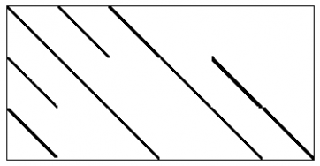
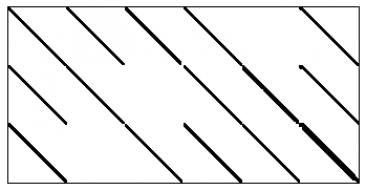
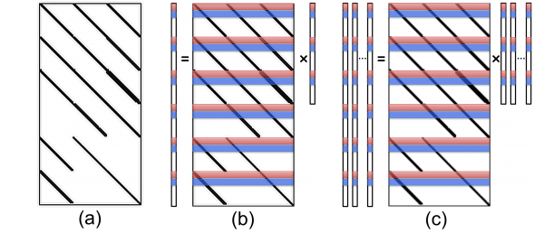
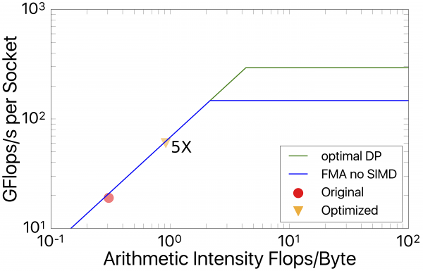
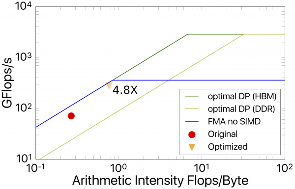
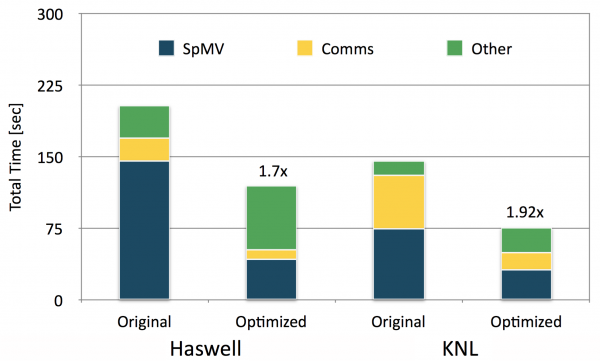

# Background

EMGeo is composed of two geophysical imaging applications: one for
subsurface imaging using electromagnetic data and another using
seismic data. Although the applications model different physics
(Maxwell's equations in one case, the elastic wave equation in
another) they have much in common. We focus on the more involved part
for solving the forward pass of the inverse scattering for the seismic
part.

The code takes advantage of high-level data parallelism to solve many
semi-independent sub-problems concurrently, yielding excellent
scaling. Second, the runtime is dominated by the application of a
linear solver, accounting for > 90% of wallclock time. The solver is
dominated by memory bandwidth intensive operations like sparse
matrix-vector multiply (SpMV), dot products, vector triads, etc. It
uses double complex precision and represents the sparse matrix in
ELLPACK format.

The equation which is solved by EMGeo is

$$
\left[1-\langle \mathbf{b}\rangle \mathbf{D}_\tau \cdot (\langle \mathbf{k}_\mu\rangle \circ \mathbf{D}_v) \right]\mathbf{v}_q=\mathbf{f}_q
$$

Here, $\mathbf{b}$ and $\mathbf{k}_\mu$ are parameters describing the
medium, \mathbf{v} is a velocity vector for frequency q and \mathbf{f}
the source vector in the frequency domain. The matrices $D_\tau$ and
$D_v$ can be decomposed spatially and expressed in sparse format via

$$
\mathbf{D}_\tau = \left(\begin{array}{cccccc}
                      \tilde{D}_x & D_y & D_z & \tilde{D}_x & 0 & \tilde{D}_x\\
                      \tilde{D}_y & D_x & 0   & \tilde{D}_y & D_z & \tilde{D}_y\\
                      \tilde{D}_z & 0 & D_x   & \tilde{D}_z & D_y & \tilde{D}_z\\
                      \end{array}\right)^T
$$

$$
\mathbf{D}_v = \left(\begin{array}{cccccc}
                      D_x & \tilde{D}_y & \tilde{D}_z & 0 & 0 & 0\\
                      0 & \tilde{D}_x & 0   & \tilde{D}_y & \tilde{D}_z & 0\\
                      0 & 0 & \tilde{D}_x   & 0 & \tilde{D}_y & D_z\\
                      \end{array}\right)
$$

The components are derivative operators coupling only nearest
neighbors in the indicated directions. Each single entry is describing
an $N_d\times N_d$ sub matrix, where $d$ is the corresponding
direction. Therefore, these two matrices are large but very
sparse. The sparsity patterns are displayed in <a
href="#fig1">Fig. 1<a>.

*Fig.1. Sparsity patterns of $D_\tau$ and (transposed) $D_v$.*

The main challenging aspect in this effort of optimizing EMGeo for KNL
is to improve the performance of the SpMV product shown above, as it
amounts to two thirds of the time spent in the linear solver. However,
SpMV operation is notoriously memory bandwidth-bound as its naive
arithmetic intensity is low. In the following, we will describe how we
tackle this challenge.

# Approach

## Memory Optimizations

We apply techniques to reduce the memory traffic and increase the
in-cache data reuse in the SpMV product of EMGeo code. We replace the
ELLPack sparse matrix format, which is used in EMGeo code, with Sliced
ELLPack (SELLPack) format to reduce unnecessary FLOPS and memory
transfers. We also apply cache blocking techniques to increase the
SpMV product operation Arithmetic Intensity (AI). Namely, we
experimented with Spatial Blocking (SB) and multiple Right Hand Side
(mRHS) cache blocking.

EMGeo uses ELLPack data format because the maximum number of Non-Zero
(NNZ) elements in each row is 12. ELLPack allocates a rectangular
matrix, setting the width to the largest row width and pads smaller
rows with zeroes. Most of the rows in $D_\tau$ matrix contain 12
NNZ/row, so the padding overhead of the rows is minimal. However, half
of the rows in $D_v$ matrix contain 8 NNZ/row, so we use the SELLPack
format proposed in [<a href="#ref1">1</a>]. SELLPack format allows
defining different number of NNZ/row in different sections of the same
matrix. We reorder $D_v$ matrix, as shown in <a
href="#fig2">Fig. 2</a>, to have 12 NNZ/row in the first half of the
matrix and 8 NNZ/row in the second half of the matrix. This
effectively saves 17% of $D_v$ SpMV product operations.

We apply SB techniques [<a href="#ref2">2</a>,<a href="#ref3">3</a>]
to reduce the main memory data traffic of the multiplied vector. In
the regular update order of the SpMV product, the elements of the
multiplied vector are accessed several times. As the vectors are
larger than the cache memory, the vector elements are brought from
main memory several times. For example, the regular update order of
$D_v$ SpMV product loads the multiplied vector 5 times from main
memory (see below for more analysis details). SB changes the operation
order in the matrix, such that matrix rows touching the same vector
elements are updated together, while the vector elements are in the
cache memory. This idea is illustrated in <a
href="#fig2">Fig. 2</a>b. First the SpMV product of the red rows of
the matrix is performed, while keeping the red part of the vector in
the cache memory. Then the blue part is updated similarly, etc. As
long as the block size ts in the cache memory, each element of the
vector is brought once from the main memory.  We show below that
combining SB and mRHS blocking can be inefficient in KNL due to the
small cache memory size. Therefore, we reorder the loop over the
Matrix components (i.e., row blocks of size N) with the loop over the
rows of one component, which e ectively reduces the SB block size to
one row. As a result, the first row of each matrix component is
evaluated first, then the next row, etc..

EMGeo solves the Equation above for multiple independent sources
(RHS). In the RHS cache blocking approach we perform the SpMV product
over several RHS’s while a block of the matrix is in the cache memory,
similar to [<a href="#ref3">3</a>]. RHS blocking amortizes the cost of
loading the matrix from main memory, which is the dominant contributor
of the main memory data traffic. The RHS blocking update order,
combined with SB, is illustrated in <a
href="#fig2">Fig. 2</a>c. First, each red block of the matrix performs
the SpMV product over all the RHS, while the block is in the cache
memory, then the blue blocks are updated, etc..

*Fig. 2: Illustration of plain matrix $D_v$ (panel a), with spatial
blocking (SB, panel b) and multiple right-hand-side blocking (mRHS,
panel c). The colored bands in the matrix denote elements which are
involved in the matrix multiplication with the vector elements on the
right-hand-side and stored into the corresponding elements of the same
color on the left-hand-side.*

# Performance Results

## $D_v$ Kernel

We use a benchmark code for the $D_v$ SpMV product in the EMGeo
application, as the SpMV products consume significant portion of the
code runtime. <a href="#fig3">Fig. 3</a> shows the performance
improvements and the transferred memory volumes improvements model
prediction and measurement (based on actually transferred memory,
measured with vTunes `-collect memory-access` option), using different
optimization combinations.

*Fig. 3: effect of various cache optimizations on the $D_v$ SpMV
kernel for Haswell (top panel) and KNL (bottom panel).*

We show results for a single socket Haswell and KNL processors, using
a grid of size $110 \times 110 \times 105$. The results in the
rightmost block in <a href="#fig3">Fig. 3</a> use SB and loop
reordering in Haswell and KNL, respectively, in addition to the SELL
and mRHS optimizations. We do not use SB in KNL optimizations because
it results in less performance than the naïve code. In the RHS
blocking optimization, we use 32 and 64 RHS block size in Haswell and
KNL, respectively. The SpMV operation is repeated 100 times, where
every 10 repetitions are timed together. We report the median time of
the experiments.  KNL results are reported in SNC2-flat mode using
MCDRAM only, as the data fits in the MCDRAM in the production code. We
observe similar performance in all KNL modes. Using the MCDRAM memory,
compared to using the DDR4, increases the performance in KNL by a
factor of 3.0x and 4.2x in the naïve and optimized codes,
respectively. KNL is faster than a single socket Haswell processor by
over a factor of 3x, which is mainly attributed to the higher memory
bandwidth.

The roofline analysis [<a href="#ref4">4</a>,<a href="#ref5">5</a>,<a
href="#ref6">6</a>] of the $D_v$ benchmark results is shown in <a
href="#fig4">Fig. 4</a>, where we used the techniques described here
using Intel Software Development Emulator [<a href="#ref7">7</a>] to
prepare these results. The roofline model shows that our RHS blocking
technique significantly improves the AI. The code is still memory
bandwidth-bound, so it cannot benefit from vectorization
optimizations.

*Fig. 4: Roofline analysis comparing out best kernel variants for
$D_v$ on Haswell (top panel) and KNL (bottom panel). The attached
labels 4.8x and 5x denote the speedup over the original code on both
architectures respectively.*

## Full EMGeo Application

We measure the time in the major components of EMGeo code. The time is
mainly dominated by the IDR solve, which is in turn is dominated by
the SpMV. Our experiments consist of single Cori node and single KNL
processor.  We summarize the single node results in <a
href="#fig5">Fig. 5</a>. The experiment evaluates 32 RHS with 500
Krylov solver iterations, using a $100 \times 50 \times 50$ grid size,
which is comparable to the subdomain size in productions
scenarios. The original code does not have shared memory
parallelization, so it uses one MPI rank per core. The optimized code
uses 32 RHS block size and uses single MPI rank per socket in Haswell
experiment. We observe that the SpMV product takes over half of the
runtime in the original IDR solver implementation. Our SpMV product
optimizations result in 3.40x speedup in the application, which is
less than $D_v$ SpMV product improvements in the benchmark. $D_\tau$
SpMV product has less benefit from our optimization because it does
not utilize the SELLPack format. Moreover, the SpMV product kernels in
the application are fused with other kernels to improve the data
locality. The reduction in the MPI ranks by a factor of 16× has
significant impact in speeding up the code, as less ranks are involved
in the reductions and halo exchange operations.

*Fig 5.: Impact of our optimizations on the performance of the full
EMGeo application (forward pass). The various parts of the stacked
bars denote the total time spent in SpMV (blue), communications
(yellow) and linear algebra and other solver-related operations
(green). The labels denote the overall speedup over the unoptimized
kernel.*

We further observe that results for KNL in SNC-2 flat mode is similar
to the performance we obtain in the other modes. The whole application
data fits in the MCDRAM memory, so we run the code using the MCDRAM
only. The best performance in KNL is observed at two threads per
core. We tuned the MPI ranks vs. the OpenMP threads manually in the
optimized code. We observe 1.92× speedup in the code, where the SpMV
and communication operations run about 2.3x and 3.1x faster,
respectively. Using the MCDRAM memory, compared to using the DDR4
only, increases the performance in KNL by a factor of 2.8x and 3.1x in
the naïve and optimized codes, respectively.

# Conclusions

We obtained performance improvements by reducing the data traffic to
the main memory in the SpMV products of the EMGeo code. We used SB,
SELLPack sparse matrix format, and most importantly the RHS cache
blocking technique. We identified relevant optimizations and
understand the optimization quality and issues. RHS blocking provides
signi cant performance improvements and prepares the code to use block
IDR algorithm and overlap computations with communication in the
solver.

# References

1.  Monakov, A., Lokhmotov, A., Avetisyan, A.: High
   Performance Embedded Architectures and Compilers: 5th International
   Conference, HiPEAC 2010, Pisa, Italy, Jan- uary
   25-27, 2010. Proceedings, chap. Automatically Tuning Sparse
   Matrix-Vector Multiplication for GPU Architectures,
   pp. 111–125. Springer Berlin Heidelberg, Berlin, Heidelberg (2010),
   https://dx.doi.org/10.1007/978-3-642-11515-8_10
2.  Datta, K.: Auto-tuning Stencil Codes for
   Cache-Based Multicore Platforms. Ph.D. thesis, EECS Department,
   University of California, Berkeley (Dec 2009), http: //www.eecs.b
   erkeley.edu/Pubs/TechRpts/2009/EECS-2009-177.html
3.  Haase, G., Reitzinger, S.: Cache issues of
   algebraic multigrid methods for linear systems with multiple
   right-hand sides. SIAM Journal on Scientific Computing 27(1), 1–18
   (2005), https://dx.doi.org/10.1137/S1064827502405112
4.  Williams, S.: Auto-tuning Performance on
   Multicore Computers. Ph.D. thesis, EECS Department, University of
   California, Berkeley (December 2008)
5.  Williams, S., Watterman, A., Patterson, D.:
   Roofline: An insightful visual performance model for floating-point
   programs and multicore architectures. Communications of the ACM
   (April 2009)
6.  Williams, S., Stralen, B.V., Ligocki, T.,
   Oliker, L., Cordery, M., Lo, L.: Roofline performance model,
   https://crd.lbl.gov/departments/computerscience/PAR/research/roofline/
7.  Tal, A.: Intel software development emulator,
   https://software.intel.com/en-us/articles/intel-software-development-emulator
