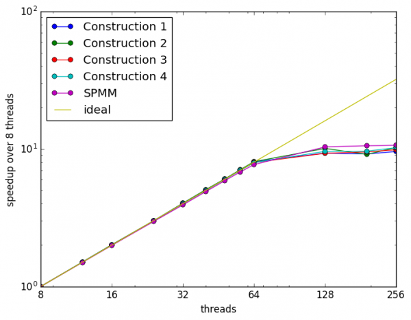
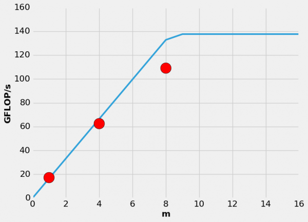
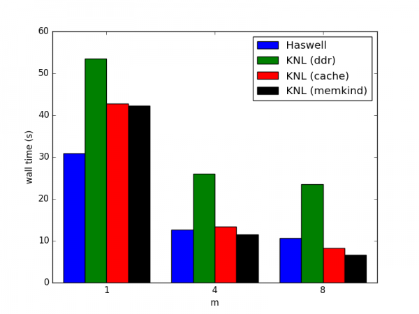

# MFDn Case Study

## Description

Many-Fermion Dynamics---nuclear, or MFDn, is a configuration
interaction (CI) code for nuclear structure calculations. It is a
platform independent Fortran 90 code using a hybrid MPI/ OpenMP
programming model,and is being used on current supercomputers, such as
Cori at NERSC, for ab initio calculations of atomic nuclei using
realistic nucleon-nucleons and three-nucleon forces. A calculation
consists of generating a many-body basis space, constructing the
many-body Hamiltonian matrix in this basis, obtaining the lowest
eigenpairs, and calculating a set of observables from those
eigenpairs. Key computational challenges for MFDn include effectively
using the available aggregate memory, efficient construction of the
matrix, and efficient sparse matrix--vector products used in the
solution of the eigenvalue problem.

In principle an infinite-dimensional basis space is needed for an
exact representation of the many-body wavefuctions. However, in
practice the basis space is truncated and observables are studied as a
function of the truncation parameters. Typical basis space dimensions
for large-scale production runs are of the order of several
billion. The corresponding many-body matrix is extremely sparse, with
tens of trillion nonzero matrix elements, which are stored in
core. This defines one of the key computational challenges for this
code---effectively using the aggregate memory available in a cluster.

To accurately capture this need we developed a test code which uses
representative data for production calculations on 5,000 Knights
Landing (KNL) nodes (approximately half the size of Cori at NERSC)
using over 80~GB of memory per node. In such a production run, half of
the symmetric matrix is distributed in a two-dimensional fashion over
the available MPI ranks. Each MPI rank constructs and stores its own
sparse submatrix. The test code performs nearly all the computational
work a single node would do in the production run but with the
communication removed.

## MFDn OpenMP performance

MFDn has excellent thread scaling, but is not NUMA aware. So typically
the application is best run with 1 MPI process per NUMA domain. This
also minimizes memory overheads from data duplicated across MPI ranks
such as lookup tables for matrix element computation.

## MFDn linear algebra operations

The lowest few eigenvalues and eigenvectors of the very large real
sparse symmetric Hamiltonian matrix are found with iterative solvers
Lanczos or LOBPCG. The key kernels in the iterative eigensolver are
Sparse Matrix--Vector (SpMV) and Sparse transposed Matrix--Vector
(SpMVT) products, as only half of the symmetric matrix is stored in
order to save memory. The sparse matrix is stored in a CSB_Coo format,
which allows for efficient linear algebra operations on very sparse
matrices, improved cache reuse on multicore architectures and thread
scaling even when the same structure is used for both SpMV and SpMVT
(as is the case in this application).

In a production run on 5,000 KNL nodes over 80 GB of memory per node
is required for a calculation. The nonzero matrix elements and
corresponding indices account for 64 GB of the memory and the input/
output vectors account for up to 16 GB depending on the specific
problem and on the eigensolver that is used. To improve data reuse and
allow for vectorization, in LOBPCG we replace SpMV with SpMM
operations on a block of vectors. To fully utilize AVX-512
instructions on KNL up to 16 vectors could be used, however due to
memory requirements and the need to balance traffic on MCDRAM and DDR
controllers we limit to 8 simultaneous vectors. To access more memory
bandwidth we explicitly place the input/ output vectors in MCDRAM
using the memkind library and FASTMEM directives.

To analyze the performance we measure the arithmetic intensity (AI,
the ratio of FLOPs to data movement) of the SpMM operation.  We used
the dynamic instruction tracing capabilities of Intel's Software
Development Emulator (SDE) to count the number of floating point
operations. Due to the size of the matrices and vectors the most
relevant measure for data movement are the main memory counters. To
access the data movement at DDR and MCDRAM controllers we use Intel's
VTune Amplifier XE.

## Results

On KNL we will use data from both DDR and MCDRAM. In this case two
factors, the total data movement and the ratio of data movement on
MCDRAM to DDR, are important. For optimal performance the ratio of
data moved on each controller should match the ratio of available
bandwidth (R = MCDRAM / DDR ~ 4.7) in order to fully utilize each
memory system. For m=1,4,8 the ratio of data moved on each controller
is R=0.6, 2.2, 4.2, respectively. We estimate that if enough MCDRAM
was available the ratio for m=16 would be approximately 8, which would
result in the DDR being under-utilized. Increasing m reduces the
traffic on DDR and reduces the total data moved on both controllers,
resulting in increased total arithmetic intensity. Assuming that it is
possible to simultaneously fully utilize both memory systems the
expected performance is given by min[ B_drr * AI_drr, B_mcdram *
AI_mcdram ]. B_i is the maximum available bandwidth on i. Where the AI
for MCDRAM remains mostly constant due to the cache aware matrix
format and L2 cache sizes and the AI for DDR increases proportionally
since the number of times the full matrix must be streamed from DDR
decreases.

### SpMM on Haswell

| number of vectors | arithmetic intensity | GFLOP/s | DRAM  Bandwidth (GB/s) |
|-------------------|----------------------|---------|---------------------------|
| 1                 | 0.26                 | 23      | 122                       |
| 4                 | 0.62                 | 57      | 125                       |
| 8                 | 0.8.0                | 68      | 125                       |

### SpMM on Xeon Phi
| number of vectors | arithmetic intensity  DDR | arithmetic intensity  MCDRAM | GFLOP/s | DRAM  Bandwidth (GB/s) | MCDRAM  Bandwidth (GB/s) |
|-------------------|------------------------------|---------------------------------|---------|---------------------------|-----------------------------|
| 1                 | 0.20                         | 0.33                            | 83      | 55                        | 17                          |
| 4                 | 0.80                         | 0.36                            | 81      | 180                       | 62                          |
| 8                 | 1.57                         | 0.37                            | 71      | 300                       | 109                         |

### Performance Model

## Summary

Increasing the number of simultaneous vectors helps performance on all
architectures, resulting in speedups of 2-5x. On KNL utilizing cache
mode results in speedups of 1.3-2.8x over running out of DDR only and
using memkind to explicitly place vectors on MCDRAM and the matrix
data on DDR results in speedups of 1.3-3.6x over DDR only.

We found that utilizing the MCDRAM in combination with increasing the
number of vectors was needed to get better performance than on
Haswell. Cache mode is faster than KNL only when operating on blocks
of 8 vectors, but this mode also reduced the total addressable memory
by 16 GB. Explicitly placing the vectors into MCDRAM gave the best
performance and with 8 vectors is 60% faster than a single Haswell
node.

### Xeon Phi speedup over Haswell

| number of vectors | Haswell | KNL (DDR only) | KNL (cache mode) | KNL (memkind) |
|-------------------|---------|----------------|------------------|---------------|
| 1                 | 1.0     | 0.6            | 0.7              | 0.7           |
| 4                 | 1.0     | 0.5            | 0.9              | 1.1           |
| 8                 | 1.0     | 0.5            | 1.3              | 1.6           |
