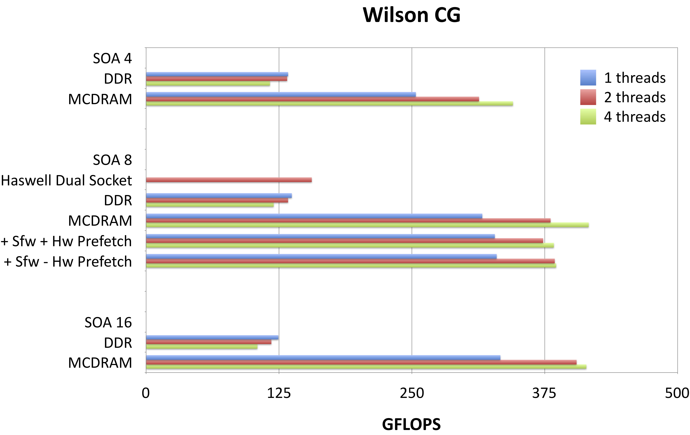
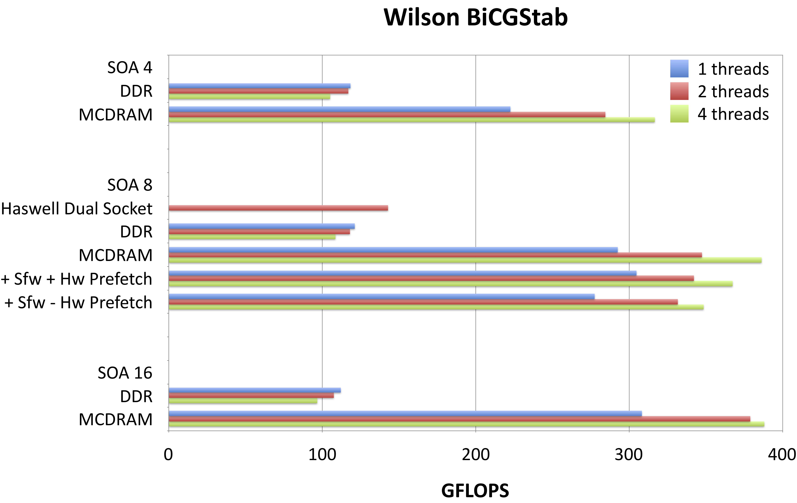
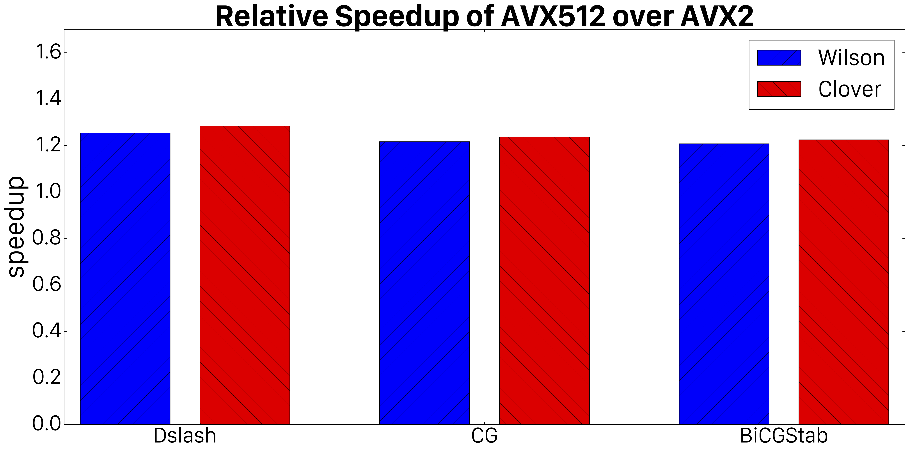

#Background
QPhiX [^1] [^2] is a library optimized for Intel(R) manycore architectures and provides sparse solvers and slash kernels for Lattice QCD calculations.
It supports the Wilson dslash operator with and without clover term as well as Conjugate Gradient [^3] and BiCGStab [^4] solvers.

The main task for QPhiX is to solve the sparse linear system

$\big(A-\not\!\! D\big)\psi = \chi$

where the Dslash kernel is defined by

$\not\!\!{D}(x,y)=\sum\limits_{\mu=0}^3 U_\mu(x)(1-\gamma_\mu)\delta_{y,x+\hat{\mu}}+U^\dagger_\mu(x-\hat{\mu})(1+\gamma_\mu)\delta_{y,x-\hat{\mu}}$

Here, U are complex, special unitary, 3x3 matrices (the so-called gauge links) which depend on lattice site x and direction mu and couple to the color components of the right hand side (rhs) vector. Further, the gammas are sparse 4x4 matrices (so-called Dirac matrices) and couple to the spin degrees of freedom of the result vector. Operator $A$ is given by

$A=(N_d+m)-i\frac{1}{8}c_\mathrm{sw}\sigma_{\mu\nu}F_{\mu\nu}$

where $c_{sw}=0$ for plain Wilson and $c_{sw}>0$ for clover fermions respectively. Sigma is a combination of gamma matrices and F is the field strength tensor composed of traces of products of U matrices starting and ending at x.

The Wilson operator is best implemented as a stencil and has a naive arithmetic intensity, i.e. assuming zero cache reuse, of 0.92 flops/byte.
The clover term is a symmetric 12x12 complex matrix and can be inverted locally, i.e. for every lattice site independently. Both, $A$ and its inverse have to be computed in order to compute the even-odd preconditioned Schur-decomposed operator

$M_{oo}=A_{oo}-D_{oe}A^{-1}_{ee}D_{eo}$

This operator is then inverted using a numeric sparse linear solver.

#Intel(R) Manycore Optimizations in QPhiX
In the following, we are describing the optimizations we applied in order to optimize QPhiX for Intel Manycore architectures, including Knight's Landing.

##Data Layout
We rearrange the degrees of freedom described above to target vectorization. We adopt an array of structures of arrays (AoSoA) layout where we split the lattice site dimension of our arrays into chunks of SOA sites and make this our fastest running dimension. We notionally split the X and Y plane into tiles. These tiles have dimensions SOA in the X direction and ngy in the Y direction. The constraint is that SOA × ngy = V, with V the hardware vector length. The idea is that we fill vector registers with data from SOA sites along the X dimension, drawn from ngy separate values of the coordinate in the Y direction. For Xeon Phi architectures, convenient values of SOA in single precision are 4, 8 and 16. The case of SOA = V = 16 allows straightforward load/stores with aligned packed loads/stores. In the cases of SOA = 4, 8 we use load-unpack and pack store, which is faster on this architecture than general gathers. For Xeon systems with V = 8 good choices for SOA are 4, and 8.
Hence our spinor data is stored as

```C++
float spinor[ nvec ][3][4][2][ SOA ]
```

where nvec is the number of SOA length blocks nvec = (Lx/2) × Ly × Lz × Lt/SOA. For our gauge and clover fields which are read only data to facilitate single stride reading we can pregather the the ngy strips resulting in an array of the shape

```C++
float gauge[ nvec/ ngy ][8][3][3][2][ SOA*ngy ]
```

Finally our nvec vectors are laid out with the X dimension going fastest. If the X dimension can be split into Nxvec SOA length chunks (Nxvec = (Lx/2)/SOA), then indexing notionally runs as vec = xv + Nxvec(y + Ly(z + Lzt)). In practice this may be complicated slightly by padding in the XY and XY Z dimensions, please see [^5] for details.

##Cache Blocking and Load Balancing
QPhiX implements the 3.5D blocking strategy described in [^6]. This involves, vectorizing over the X and Y directions, blocking in the Y and Z dimensions and streaming through the T dimensions. In practice this is done by specifying block sizes By and Bz in the Y and Z dimensions. The lattice is then split into strips of size Lx × Ly × Lz × Lt. These blocks 2 By Bz are assigned to cores and are processed concurrently by the SIMT threads on that core. Further, to cope with multiple NUMA domains, the T direction can be split by the number of NUMA domains.
One needs to arrange that the cores processing a chunk of strips belonging to a particular domain, are actually in that domain physically so that first touch after allocation is effective. This is done by core affinity mechanisms outside of QPhiX, e.g. using the KMP AFFINITY and KMP PLACE THREADS, mechanisms for the Intel Compiler. Generally this process can result in a number of strips in a NUMA domain which may not be divided equally by the number of cores in that domain. To cope with this the T dimension can be split further, to increase the number of strips. An algorithm for doing so while taking advantage of all cores is discussed in detail in [^5]. The initial split factor for NUMA domains is denoted by the parameter minct. In our tests when running on dual socket Haswell systems we used minct = 2 when running a single executable on both sockets. When running one task per socket, and on KNL in quadrant/flat mode or in multi-node runs with 1 process per socket, we used minct = 1.

##Code Generator and Prefetching
The kernels for performing the calculations on a block of SOA × ngy sites, are generated by a small code-generator. This code generator allows us to abstract our vector operations, and can generate intrinsics code for AVX512 (and also SSE, AVX, AVX2-FMA, KNC and QPX architectures). Further it allowed us to insert software prefetching, both for L1 and L2 caches. This was very important for the Knight’s Corner (KNC) architecture. For KNL, preceding work in [^7] suggested that software prefetching may be less effective and actually lead to slight performance loss in the presence of the hardware prefetcher, and work in a microbenchmark suggested that it may be beneficial to turn off hardware prefetching and use software prefetching only.

##BLAS Like Kernel fusion
Linear solvers like Conjugate Gradients (CG) and BiCGStab rely on Level 1 BLAS like vector vector routines. These have a low arithmetic intensity individually, and occasionally it is possible to reuse fields temporally amongst successive kernels, for example when computing residua. The kernels here are: r = b−t where t = Mx, followed immediately by an L2 norm calculation of r. In other words one can reuse r immediately. In QPhiX we fuse such kernels to increase arithmetic intensity due to reduced memory traffic. Our implementation relies on combining a generic parallel loop over spinors with C++ functors (also known as function objects) implementing the BLAS operation over a block of SOA spinors, similar in style to Kokkos kernels [^8]. By implementing BLAS operations this way, we can further stripe-off array padding, applying linear algebra operations to the vectors and re-injecting them into padded arrays on the fly.

#Experimental Setup
##Hardware
Hardware: We performed our tests on a single node of the Endeavor cluster, where every node is equipped with one KNL B0 chip. Intel(R) Xeon Phi Knights Landing (KNL) is the second generation of the Intel(R) Xeon Phi architecture products.
We performed our measurements on B0 hardware (7250 parts) which features 68 cores. The cores are connected in a 2-dimensional mesh of tiles, with each tile containing 2 cores. They are based on the Intel(R) Silvermont architecture running at 1.4 Ghz and augmented by two 512-bit vector units. The cores on a tile share 32Kb L1 and 1Mb L2 data cache. The KNL chip also features up to 16 Gb of on package High Speed memory (known as MCDRAM), with a STREAMS bandwidth of about 450Gb/sec and various CPU and memory configuration modes, i.e. Quad, SNC2, SNC4 as well as flat, cache and hybrid respectively.
Furthermore, each node has 96 Gb of DDR memory with peak bandwidth of 90 Gb/s. We have tested our code in quadrant mode chip configuration and in both, flat and cache mode MCDRAM configurations. Since our code fits entirely into MCDRAM, we can just use numactl to bind the executable to MCDRAM or DDR respectively. Therefore, we can use flat-MCDRAM without code changes.

##Software Environment
For compiling our QPhiX test code, we used the Intel(R) C++ compiler 2016, update 2.6 This compiler supports OpenMP 4.5 and we make heavy use of the OpenMP SIMD directives.

##QPhiX Parameters
We test problems with a local volume of size 324 with a block sizes of By = Bz = 4 on KNL, and applied padding factors of 1 in both the XY plane and the XYZ volume, to reduce associativity misses. We time the application of the Wilson Dslash operator as well as the CG and BiCGStab solvers. To determine floating point operation rates (FLOPS) we counted the number of useful floating point operations executed in our benchmarks, and divided them by measured wallclock time. We did not include any operations resulting from overhead such as recreation of the 3rd row of our gauge fields.

#Results
For all our tests, we employed 64 cores and ran 1,2 or 4 threads on each of these cores. This was achieved by setting

```bash
KMP AFFINITY=compact,granularity=threads
KMP PLACE THREADS=1s,Cc,Nt
```

with C being the number of cores and N = 1, 2 or 4. The number of OMP threads was set during runtime using omp set num threads() based on the number of cores and SMT threads chosen via command line parameters. Since our code is mostly memory bandwidth bound, we aimed at estimating the possible gains by using MCDRAM over DDR. For that purpose, we ran QPhiX solely in DDR and then solely in MCDRAM mode. Assuming an arithmetic complexity of 2.29 (based on optimal cache reuse), we can estimate the effective bandwidth using the roofline model [^9].

<a name="fig1"></a>



*Fig 1. Performance results for Dslash, CG and BiCGStab Kernels in QPhiX on a single KNL node in various configurations.*

Using a measured maximum performance of 191 GFLOPS/s for DDR and 505 GFLOPS/s for MCDRAM, we obtain effective bandwidths of 83 Gb/s and 221 Gb/s for DDR and MCDRAM respectively. We do not see a significant difference when running in cache mode compared to running from MCDRAM in flat mode. This is expected, as our problem fits into the total available MCDRAM. We note that these effective bandwidths suggest that we close to saturating the bandwidth of DDR, but are less effective at exhausting the bandwidth of MCDRAM with Dslash. The reason for this is still under investigation. We observe however, that the streaming-like kernels in our code do better, i.e. the STREAM-like aypx obtains 393 Gb/s, which is about 87% of the total available bandwidth when running from MCDRAM. Nonetheless, we do not yet hit the STREAMS bandwidths in our code. In order to test if this is attributed to hardware prefetching deficiencies, we assisted the compiler by adding prefetch statements to our code. We tested three different modes, i.e. full hardware prefetching, software assisted hardware prefetching (denoted by +Sfw+HW in <a href="#fig1">Fig. 1</a>) and pure software prefetching (denoted by +Sfw-HW in <a href="#fig1">Fig. 1</a>). The chart in <a href="#fig1">Fig. 1</a> shows that there are no consistent and significant differences between these different prefetching modes.
We further observe that there is a significant difference between one, two or four threads per core in terms of total performance. When running from MCDRAM, the performance is always better when running with two or 4 threads, than a single thread, as a single thread cannot saturate the MCDRAM bandwidth. In case of DDR however, single thread performance is highest. This might be attributed to lower DDR latency and the fact that a single thread is able to saturate the DDR bandwidth.
We can also see that for the more memory bound kernels (BiCGStab and also CG, not shown), a dual socket Haswell systems performs better than a KNL run from DDR.
This is mainly because of the memory bandwidth differences: a dual socket Haswell system provides about 130 Gb/s peak, whereas the KNL only provides 90 Gb/s peak from DDR. Comparing SOA lengths, we find that 4 performs consistently worse than 8 and 16, whereas we do not observe a huge performance gain switching from 8 to 16. The pattern an SOA length of half the vector length seems to perform best is in line with earlier findings of [^2] on the KNC architecture. In terms of thread scaling, DDR performance is best for one, whereas MCDRAM performance is best for 2 threads. This might be explained by bandwidth and latency: for MCDRAM, two threads are needed to saturate bandwidth, whereas for runs from DDR, latency might be the most limiting factor and thus one thread does not overwhelm the prefetched.

We further inspected the performance benefit of using AVX512 in favor of AVX2 by compiling QPhiX with either set of intrinsics and SOA 8 and measured the best performance in either case. <a href="#fig2">Fig. 2</a> demonstrates that the performance improvements from AVX512 are consistently around 20%.

<a name="fig2"></a>

*Fig.2. Relative speedup of our various kernels obtained by using AVX512 intrinsics instead of AVX2 intrinsics.*

#Conclusion

We have discussed performance results for the Wilson-Dslash operator, Conjugate Gradients, and BiCGStab solvers on Knight’s Landing and have compared them with the performances seen on Haswell nodes on Cori. We have chosen relatively large problem sizes per node as in this initial exploration we are focused on the capacity/throughput regime of calculations. We achieve sustained performance of about 500 GFLOPS/s for Wilson-Dslash, and slightly lower values of 417 GFLOPS/s and 387 GFLOPS/s for CG and BiCGStab respectively. The latter two kernels are significantly more memory bound and we do not fully utilize the available bandwidth yet. We are investigating restructuring the code to sustain more bandwidth in the future.
Further vTune measurements show that our implementation of the dslash kernel has a rather high L1 eviction rate, so that our effective cycles per instruction (CPI) rate is about two times higher than expected from cache model predictions. We are working on resolving this issue as part of future work.

This case study was presented at IXPUG 2016 and published as a workshop contribution [^10].


[^1]:
  Joo, B.: qphix package web page, https://github.com/JeffersonLab/qphix
[^2]:
  Joo, B., Smelyanskiy, M., Kalamkar, D.D., Vaidyanathan, K.: Chapter 9 - Wilson dslash kernel from lattice qcd optimization. In: Reinders, J., Jeffers, J. (eds.) High Performance Parallelism Pearls Volume Two: Multicore and Manycore Programming Approaches, vol. 2, pp. 139-170. Morgan Kaufmann, Boston, MA, USA (2015), http://www.sciencedirect.com/science/article/pii/B9780128038192000239
[^3]:
  Hestenes, M.R., Stiefel, E.: Methods of Conjugate Gradients for Solving Linear Systems. Journal of Research of the National Bureau of Standards 49(6), 409-436 (1952)
[^4]:
  van der Vorst, H.A.: Bi-CGSTAB: A Fast and Smoothly Converging Variant of Bi-CG for the Solution of Nonsymmetric Linear Systems. SIAM Journal on Scientific and Statistical Computing 13(2), 631 - 644 (1992)
[^5]:
  Joo, B., Kalamkar, D., Vaidyanathan, K., Smelyanskiy, M., Pamnany, K., Lee, V., Dubey, P., Watson, W.: Lattice QCD on Intel(R) XeonPhi(TM) Coprocessors. In: Kunkel, J., Ludwig, T., Meuer, H. (eds.) Supercomputing, Lecture Notes in Computer Science, vol. 7905, pp. 40-54. Springer Berlin Heidelberg (2013), http://dx.doi.org/10.1007/978-3-642-38750-0_4
[^6]:
  Nguyen, A.D., Satish, N., Chhugani, J., Kim, C., Dubey, P.: 3.5-d blocking optimization for stencil computations on modern cpus and gpus. In: SC. pp. 1–13 (2010)
[^7]:
  Kalamkar, D.D., Smelyanskiy, M., Farber, R., Vaidyanathan, K.: Chapter 26 - quantum chromodynamics (qcd). In: Reinders, J., Jeffers, J., Sodani, A. (eds.) Intel Xeon Phi Processor High Performance Programming Knights Landing Edition. Morgan Kaufmann, Boston, MA, USA (2016)
[^8]:
  Edwards, H.C., Sunderland, D.: Kokkos array performance-portable manycore programming model. In: Proceedings of the 2012 International Workshop on Programming Models and Applications for Multicores and Manycores. pp. 1–10. PMAM ’12, ACM, New York, NY, USA (2012), http://doi.acm.org/10.1145/2141702.2141703
[^9]:
  Williams, S., Waterman, A., Patterson, D.: Roofline: An Insightful Visual Performance Model for Floating-Point Programs and Multicore Architectures. Communications of the ACM (2009)
[^10]:
  Joo, B., Kalamkar, D., Kurth, T., Vaidyanathan, K., Walden, A.: Optimizing Wilson-Dirac operator and linear solvers for Intel(R) KNL. IXPUG16 Proceedings, Frankfurt, Germany (2016)
