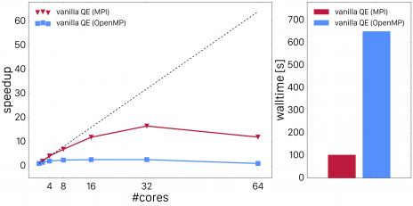
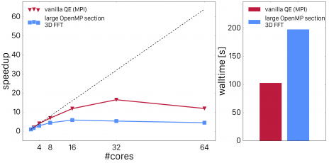
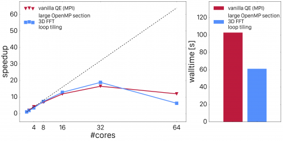
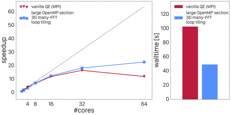
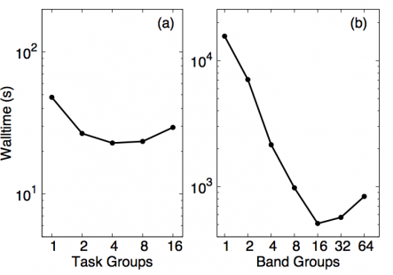
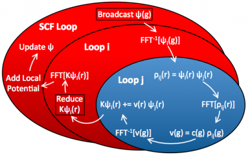
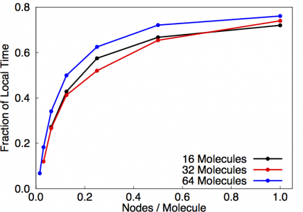
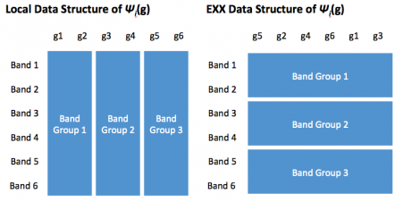
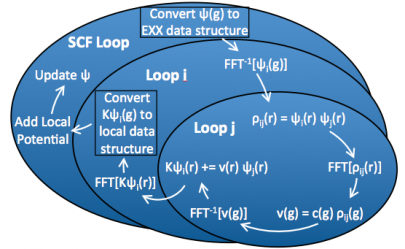
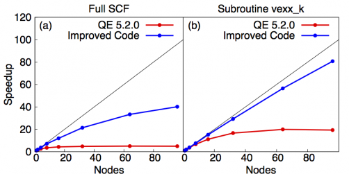

#Background
Quantum ESPRESSO is an OpenSource density functional theory (DFT) code and widely used in Materials Science and Quantum Chemistry to compute states of complex systems. It can be used for numerous purposes, including calculating the adsorption properties of porous materials, computing the thermodynamic and optical properties of existing and new materials, and simulating X-ray absorption spectra.
This article focuses on calculations involving hybrid functionals, which differ from local and semi-local functionals by the inclusion of a fraction of exact exchange.  Hybrid functionals are known to improve the accuracy of calculated band gaps, reaction barriers, and structural properties for many systems, and often avoid certain unphysical behaviors, such as excessive charge delocalization, that are commonly observed when using local and semi-local functionals.  Widespread application of hybrid DFT calculations in the context of plane-wave DFT remains limited, primarily due to the large computational cost of calculating the exact exchange. In this case study, we discuss improvements to the scalability and performance of hybrid DFT calculations in Quantum ESPRESSO.

#Starting Point
The most costly part of an exact exchange calculation is the calculation of the exact exchange functional,

$$
\hat{K}[\psi_i](\mathbf{r})=-\sum\limits_{j=1}^n\psi_j(\mathbf{r})\int\mathrm{d}^3r'\frac{\psi^\ast_j(\mathbf{r}')\psi_i(\mathbf{r}')}{|\mathbf{r}-\mathbf{r}'|}
$$

The original algorithm for calculating these integrals in fortran pseudocode is:

```Fortran
procedure vexx
  ...
  for i in 1:n do
    ...
    c(g)=FFT( 1./abs(r-rp) )
    for j in 1:n do
      rho(i,j,rp) = conjg(psi(j,rp))psi(i,rp)
      rho(i,j,g) = FFT( rho(i,j,rp) )
      v(i,j,g) = c(g) * rho(i,j,g)
      v(i,j,r) = invFFT( v(i,j,g) )
      Kpsi(i,r) += psi(j,r) * v(i,j,r)
```

Quantum ESPRESSO implements hybrid parallelism based on OpenMP and MPI. We have optimized both parts and will split the discussion as the changes we applied to the code are almost completely orthogonal to each other.

##Improving OpenMP Scaling
The inner element-wise products over $\mathbf{r}$ and $\mathbf{g}$ in the algorithm described above are performed in loops over all points of the (dual) grid. In the naive approach, one would spawn OpenMP sections around the loops over those grids and destroy them after the loops are done. However, that produces very bad scaling as shown in the figure below. <a href="fig1">Fig. 1</a> shows thread scaling vs. MPI scaling for the unoptimized code (left panel) as well as the total wall time for the point which showed the best performance (right panel) for a system comprised of 16 water molecules. 

<a name="fig1"></a>


*Fig. 1.: MPI and OpenMP scaling of vexx in vanilla Quantum ESPRESSO. The full-MPI performance is shown in red and the OpenMP performance shown in blue.*

Profiling tools demonstrate that the reason for poor scaling performance is due to the overhead from fork-join operations because the loop trip counts are very small. The best strategy in that case is to enlarge the parallel regions. In a first approach, we merged the loops over j and $\mathbf{r}$ or $\mathbf{g}$ respectively. In order to do so, we dressed all the loops over grid points with loops over j, i.e. we technically contracted the outer loop over j around all the inner loops over $\mathbf{r}$ and $\mathbf{g}$. The loops were then collapsed using appropriate OpenMP 4.X SIMD statements. We furthermore replaced the distributed FFT's by local 3D FFT's. This requires some global data re-arrangement which was made possible by implementing data layout conversions which employs global data transformations to make all grid points involved in the FFT for a set of i and j band indices node-local (for more details about that, please read the next section). This improvement lead to much better scaling as shown in <a href="fig2">Fig. 2</a>.

<a name="fig2"></a>


*Fig. 2.: Scaling of Quantum ESPRESSO vexx with 3D FFT improvements.*

The code now scales nicely up to 8 threads, but shows still inferior performance compared to the all-MPI implementation. The next step we performed was timing the sections of the calculation separately. We expected the FFT's to dominate the timings, but - to our surprise - the element-wise products were as expensive as the FFT's. Digging into this with profiling tools exhibited that the compiler generated vector-gather and vector-scatter instructions for data which was aligned and contiguous. In order to help the compiler to recognize this and replacing the gather-scatter-operations with contiguous loads, we applied cache blocking to the innermost layer of these loops. The following snippet illustrates the new vexx implementation

```Fortran
nblock = 2048
nrt = nr / nblock
!$omp parallel do collapse(2) ...
do ist = 1, nrt
  do j=1, n
    ir_start = (irt - 1) * nblock + 1
    ir_end = min(ir_start+nblock-1,nr)
    do ir = ir_start, it_end
      rho(ir,j) = conjg(psi(ir,j)) * psi(ir,i)
    end do
  end do
end do
!$omp end parallel do
```

<a href="fig3">Fig. 3</a> shows how cache blocking improved scaling performance.

<a name="fig3"></a>


*Fig. 3: Quantum ESPRESSO vexx OpenMP scaling after loop tiling.*

Now, the OpenMP parallelized code outperforms the MPI parallelized code by a large fraction. However, there is another improvement which can be made: by dressing all the loops with loops over band-index j, we can now also accelerate the computation of the FFT's. Instead of calling a 3D FFT for each index j, we can use batch-processing (or pooling) to allow the FFT libraries to perform multiple FFT's at once (common FFT libraries such as FFTW or Intel's DFTI support these functionality). By employing this, we achieve very good scaling and impressive performance compared to the original all-MPI code. This is shown in <a href="fig4">Fig. 4</a>.

<a name="fig4"></a>


*Fig. 4: Quantum ESPRESSO vexx OpenMP scaling with FFT batch processing.*

The scaling is still not optimal but that is mainly attributed to the fact that a system with 16 water molecules is rather small. Scaling studies on larger systems show better scaling and speedups for up to 64 cores. 
This concludes our section of OpenMP improvements for vexx. We will now have a look at multi-rank scaling and how that can be improved as well.

##Improving MPI Scaling
Most of the changes described in this section are orthogonal to the changes applied above, with some minor exceptions such as the enablement of local 3D-FFT's due to data-layout rearrangements. We will first look at out-of-the-box performance of Quantum ESPRESSO's MPI parallelization. <a href="fig5">Fig. 5</a> depicts the strong scaling behavior of that code for different types of parallelizations in QE, denoted as *task-group* and *band-group* parallelization.

<a name="fig5"></a>


*Fig. 5: Strong scaling of task-group (left panel) and band group paralellization (right panel) in the original Quantum ESPRESSO MPI implementation.*

Those implementations are mutually exclusive and the former only benefits the local (plain DFT) part of the code, and the latter only benefits the EXX part of the code. We can see that band-group parallelization is preferred but also that only scales to about 16 ranks. The cartoon in <a href="fig6">Fig. 6</a> shows how espresso 5.2.0 (and also up to version 6.0) implements band-group parallelism in QE.

<a name="fig6"></a>


*Fig. 6: illustrating the parallelization pattern in distributed Quantum ESPRESSO. Only the innermost loop is distributed, all sections in red are replicated on every compute node.*

This diagram depicts the different parts of the calculation, i.e. SCF loop and the EXX loops over band pairs i,j. Regions colored in blue are parallelized while regions colored in red are not. In the original code, the SCF loop is basically duplicated among each rank in the partition. For that reason, this part of the calculation dominates the wall clock time for large partition sizes, i.e. see <a href="fig7">Fig. 7</a>.

<a name="fig7"></a>


*Fig. 7: Fraction of time spent in local part of the vexx calculation for different numbers of molecules in dependence of nodes/molecule.*

In this plot, we employed one bandgroup per node and it can be seen that the fraction of time spent in SCF is independent of the system size. Since we aimed to enable users to run calculations of big systems on many nodes, we targeted improving that situation. The goal here is to move parallelism out as much as possible: instead of parallelizing over inner bands j, we parallelized the application over pairs of bands i,j. That means, that each node gets a chunk of i-indices as was done in naive band-group parallelization, and then every nodes additionally only gets a fraction of the j-indices. This significantly reduces memory footprint as not all components for all bands need to be stored on every node. However, it introduces a little more complexity as now each node has to pass it's j-components around to all other nodes. Furthermore, the number of i,j-pairs involved in the EXX step depends on the previous SCF step (and is usually reduced), so that this number needs to be recomputed in every step in order to avoid duplication of work.

These changes improve scaling for the EXX part of the calculation, but we are still left with improving the local part. In the original code, the local calculation was replicated on every node and thus significantly limiting scaling to many nodes. In the new approach, we parallelize the local part by distributing g-vector components. The layouts used in the different parts of the calculation are shown in <a href="fig8">Fig. 8</a>.

<a name="fig8"></a>


*Fig. 8: data conversion between g-vector (left) and band parallelization (right).*

The panel on the left of <a href="fig8">Fig. 8</a> shows the distribution over g-vectors. Here, all bands reside on one node and thus the diagonalization can be performed in an embarassingly parallel way. For the EXX calculation, we distribute band pairs and keep $\mathbf{g}$-vectors and $\mathbf{r}$-components local to any node, so that we can employ local 3D FFT's and the loop merging described above, thus facilitating OpenMP scaling. The diagram for the optimized code in <a href="fig9">Fig. 9</a> shows that every part of the calculation is parallelized.

<a name="fig9"></a>


*Fig. 9: illustration of the fully paralleized exact exchange calculation.*

Using different layouts for different parts of the calculation requires in-flight data transpositions. However, despite the associated overhead, our changes significantly improve scaling performance as shown in <a href="fig10">Fig. 10</a>.

<a name="fig10"></a>


*Fig. 10: strong scaling of the fully optimized vexx calculation in Quantum ESPRESSO.*

The plots show that the EXX-part of the improved code (right) scales close to ideal. The overall calculation (left) scales much better than the unimproved code and is currently limited by non-optimal scaling of the diagonalization routine. We are currently looking into different methods and libraries for also optimizing this part of the claculation.